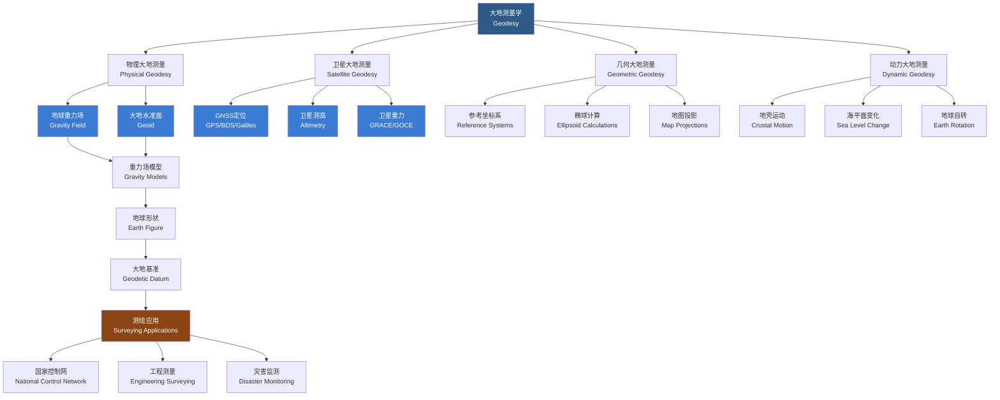

# 大地测量学

## 一、概述

大地测量学（Geodesy）是研究地球形状（Earth's Figure）、大小（Size）、重力场（Gravity Field）及其时空变化（Temporal Variations）的学科。作为测绘科学与技术（Surveying and Mapping Science）的基础分支，大地测量学为地图制图、导航定位、地球动力学（Geodynamics）和地壳形变监测提供精确的空间基准与框架。现代大地测量已从传统的地面三角测量发展为融合全球导航卫星系统（Global Navigation Satellite System, GNSS）、卫星测高（Satellite Altimetry）、合成孔径雷达干涉测量（Interferometric Synthetic Aperture Radar, InSAR）和甚长基线干涉测量（Very Long Baseline Interferometry, VLBI）等空间技术的一体化系统。

## 二、学科体系与工作流程

## 三、核心数学公式

### 3.1 参考椭球（Reference Ellipsoid）

地球扁率（Oblateness）由旋转椭球（Oblate Spheroid）近似：

$$ \frac{x^2}{a^2} + \frac{y^2}{a^2} + \frac{z^2}{b^2} = 1 $$

其中 $a$ 为长半轴（赤道半径），$b$ 为短半轴（极半径）。常用椭球参数（WGS-84）：$a = 6378137$ m，$f = 1/298.257223563$。

**扁率**（Flattening）：

$$ f = \frac{a - b}{a} $$

**第一偏心率**（First Eccentricity）：

$$ e^2 = \frac{a^2 - b^2}{a^2} = 2f - f^2 $$

**第二偏心率**（Second Eccentricity）：

$$ e'^2 = \frac{a^2 - b^2}{b^2} $$

### 3.2 常用椭球参数对比

| 椭球名称 | 年代 | $a$ (m) | $1/f$ | 使用区域 |
|----------|------|---------|-------|----------|
| WGS-84 | 1984 | 6378137 | 298.257223563 | GPS 全球 |
| CGCS2000 | 2000 | 6378137 | 298.257222101 | 中国地心坐标系 |
| IERS 2003 | 2003 | 6378136.6 | 298.25642 | 地球自转服务 |
| GRS 80 | 1980 | 6378137 | 298.257222101 | 国际大地测量 |
| Krasovsky | 1940 | 6378245 | 298.3 | 北京54坐标系 |

### 3.3 高程系统

大地水准面（Geoid）是近似平均海平面的重力等位面。大地高（Ellipsoidal Height）与正高（Orthometric Height）的关系：

$$ H = H_{\text{orthometric}} + N $$

其中 $N$ 为大地水准面高（Geoid Undulation）。GPS/北斗测量直接得到大地高 $H$，但工程应用常需要正高或正常高。

### 3.4 高斯投影（Gauss-Krüger Projection）

高斯-克吕格投影是等角横切椭圆柱投影（Transverse Mercator Projection），在我国地形图测绘中广泛应用。

正算公式（从经纬度 $(B, L)$ 到平面坐标 $(x, y)$）：

$$ x = X + \frac{N}{2}\sin B\cos B \cdot l^2 + \frac{N}{24}\sin B\cos^3 B(5 - t^2 + 9\eta^2)l^4 + \frac{N}{720}\sin B\cos^5 B(61 - 58t^2 + t^4)l^6 $$
$$ y = N\cos B \cdot l + \frac{N}{6}\cos^3 B(1 - t^2 + \eta^2)l^3 + \frac{N}{120}\cos^5 B(5 - 18t^2 + t^4 + 14\eta^2 - 58\eta^2 t^2)l^5 $$

其中 $l = L - L_0$ 为经差（$L_0$ 为中央子午线经度），$t = \tan B$，$\eta^2 = e'^2 \cos^2 B$，$N = a / \sqrt{1 - e^2 \sin^2 B}$ 为卯酉圈曲率半径，$X$ 为子午线弧长。

### 3.5 重力异常与地球重力场

**重力异常**（Gravity Anomaly）：

$$ \Delta g = g_{\text{obs}} - \gamma_0 $$

其中 $g_{\text{obs}}$ 为观测重力值经归算后的值，$\gamma_0$ 为正常重力值。

**地球重力场模型**（Spherical Harmonic Expansion）：

$$ V(r, \phi, \lambda) = \frac{GM}{r} \sum_{n=0}^{\infty} \sum_{m=0}^{n} \left(\frac{a}{r}\right)^n \bar{P}_{nm}(\sin \phi)(\bar{C}_{nm} \cos m\lambda + \bar{S}_{nm} \sin m\lambda) $$

其中 $G$ 为引力常数，$M$ 为地球质量，$a$ 为参考椭球长半轴，$\bar{P}_{nm}$ 为完全规格化缔合勒让德函数（Associated Legendre Function），$\bar{C}_{nm}$ 和 $\bar{S}_{nm}$ 为规格化球谐系数。EGM2008 模型展开至 2159 阶次。

## 四、坐标系统（Coordinate Systems）

### 4.1 坐标系统对比

| 坐标系 | 定义 | 原点 | 坐标表示 | 适用场景 | 特点 |
|--------|------|------|----------|----------|------|
| 大地坐标系 (Geodetic) | $(B, L, H)$ | 椭球中心 | 经度、纬度、大地高 | 导航、GIS | 直观但计算复杂 |
| 空间直角坐标系 (Cartesian) | $(X, Y, Z)$ | 地心 (地固系) | 三维直角坐标 | GNSS 定位 | 计算方便 |
| 高斯平面坐标 (Gauss Plane) | $(x, y)$ | 中央子午线与赤道交点 | 投影平面坐标 | 地形图 | 等角、长度变形 |
| 站心坐标系 (Local) | $(E, N, U)$ | 测站点 | 东、北、天顶 | 工程测量 | 局部使用 |

### 4.2 坐标转换

大地坐标与空间直角坐标的转换关系：

$$X = (N + H) \cos B \cos L$$
$$Y = (N + H) \cos B \sin L$$
$$Z = [N(1 - e^2) + H] \sin B$$

## 五、空间大地测量技术

### 5.1 主要技术对比

| 技术 | 英文全称 | 精度 | 覆盖范围 | 主要用途 |
|------|----------|------|----------|----------|
| GNSS | Global Navigation Satellite System | 毫米-厘米级 | 全球 | 定位、导航、授时 |
| VLBI | Very Long Baseline Interferometry | 毫米级 | 全球 | 地球定向参数、参考架 |
| SLR/LLR | Satellite/Lunar Laser Ranging | 毫米级 | 全球 | 卫星定轨、地心监测 |
| InSAR | Interferometric SAR | 毫米-厘米级 | 区域 | 形变监测、DEM |
| 卫星测高 | Satellite Altimetry | 厘米级 | 海洋 | 海面高度、重力场 |

### 5.2 GNSS 系统

| 系统 | 国家 | 卫星数 | 信号频率 | 特点 |
|------|------|--------|----------|------|
| GPS | 美国 | 31 | L1/L2/L5 | 最成熟、全球覆盖 |
| BDS | 中国 | 59 | B1/B2/B3 | 区域+全球、短报文通信 |
| Galileo | 欧盟 | 28 | E1/E5/E6 | 民用精度高 |
| GLONASS | 俄罗斯 | 26 | G1/G2 | 高纬度覆盖好 |

GNSS 定位的基本观测方程：

$$\rho = \sqrt{(X^s - X_r)^2 + (Y^s - Y_r)^2 + (Z^s - Z_r)^2} + c \cdot d t_r + \epsilon$$

其中 $\rho$ 为伪距观测值，$(X^s, Y^s, Z^s)$ 为卫星坐标，$(X_r, Y_r, Z_r)$ 为接收机坐标，$c$ 为光速，$d t_r$ 为接收机钟差，$\epsilon$ 为观测噪声和多路径误差。

## 六、大地控制网（Geodetic Control Network）

| 等级 | 用途 | 精度要求 | 布设密度 | 观测方法 |
|------|------|----------|----------|----------|
| 一等网 | 国家基本控制 | 最高 (mm 级) | 最稀疏 | GNSS + VLBI |
| 二等网 | 省级控制 | 高 (cm 级) | 较稀疏 | GNSS 静态 |
| 三等网 | 城市/工程控制 | 中等 (1-2 cm) | 中等 | GNSS 静态/快速静态 |
| 四等网 | 工程/测图控制 | 较低 (2-5 cm) | 密集 | GNSS RTK |

## 七、地球动力学应用

### 7.1 地壳形变监测

利用连续运行参考站（Continuously Operating Reference Station, CORS）网络长时间序列观测，通过精密单点定位（Precise Point Positioning, PPP）或基线解算方法获取 mm/年量级的地壳运动速率。

$$v = \frac{ds}{dt} \approx \frac{s_{t+\Delta t} - s_t}{\Delta t}$$

### 7.2 海平面变化

卫星测高（如 Jason-3、Sentinel-6）和验潮站数据联合用于全球平均海平面（Global Mean Sea Level, GMSL）变化的监测。过去三十年 GMSL 上升速率约 3.3 mm/年。

## 八、研究前沿

- **四维大地测量**：时变重力场（GRACE Follow-On）+ 时变位置（GNSS）+ 地心运动耦合分析
- **多源数据融合**：卫星重力、卫星测高、GNSS、InSAR 的联合反演
- **大地测量与气候变化**：冰盖消融、陆地水储量变化、冰川均衡调整（Glacial Isostatic Adjustment, GIA）
- **量子重力梯度仪**：下一代高精度绝对重力测量
- **月球与行星大地测量**：月球 GNSS 概念、火星大地测量基准构建

### 8.1 人工智能与大地测量

机器学习方法（特别是深度学习）在大地测量数据处理中应用日益广泛——神经网络重力逼近、GNSS 信号多路径误差消除、InSAR 相位解缠自动化等方向取得重要进展。

### 8.2 地球参考框架的维持

国际地球参考框架（International Terrestrial Reference Frame, ITRF）由 IERS 维持，每数年更新一次（当前为 ITRF2020）。核心站点需持续观测以维持框架稳定性。

## 九、国际组织与重要计划

| 组织/计划 | 全称 | 职能 | 主要成果 |
|-----------|------|------|----------|
| IAG | International Association of Geodesy | 大地测量国际合作 | 国际重力基准网 |
| IERS | International Earth Rotation and Reference Systems Service | 地球定向参数与参考架 | ITRF、EOP 系列 |
| GGOS | Global Geodetic Observing System | 全球大地测量综合观测 | 大地测量基础设施 |
| IGFS | International Gravity Field Service | 全球重力场数据与服务 | EGM 系列模型 |

## 十、大地测量常用软件与工具

| 软件 | 开发方 | 功能 | 特色 |
|------|--------|------|------|
| GAMIT/GLOBK | MIT | GNSS 高精度数据处理 | 科研标准软件 |
| Bernese GNSS Software | AIUB | GNSS 精密定位 | 支持多系统 |
| GIPSY | NASA JPL | PPP 精密单点定位 | 无需地面基准站 |
| PANDA | 武汉大学 | 多星座 GNSS 处理 | 国产自主软件 |

## 相关条目

- [[04_EngineeringAndTechnology/SurveyingAndMappingScience/INDEX|测绘科学与技术]]
- [[02_NaturalSciences/Physics/Geophysics/INDEX|地球物理学]]
- [[GNSS]]
- [[02_NaturalSciences/EarthSciences/Cartography|地图学]]
