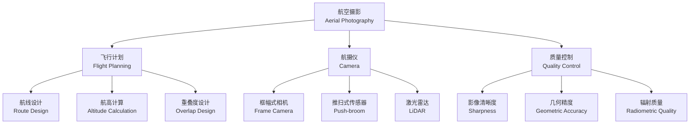
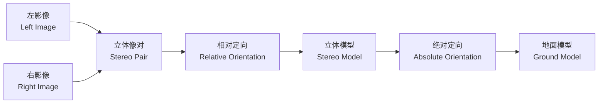
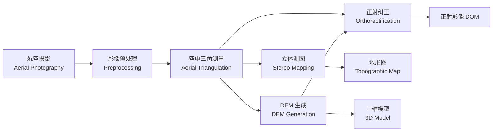

# 航空摄影测量 (Aerial Photogrammetry)

## 概述 (Overview)

航空摄影测量（Aerial Photogrammetry）是利用航空器（飞机、无人机等）搭载摄影机获取地面影像，通过影像处理进行地形测量和信息提取的技术。航空摄影测量是大比例尺地形图测绘的主要方法，也是数字高程模型（DEM）、正射影像（DOM）和三维地形模型的核心生产手段。

现代航空摄影测量已从模拟摄影测量发展到解析摄影测量和数字摄影测量阶段，自动化程度和精度大幅提升。

## 航空摄影 (Aerial Photography)

### 飞行参数设计

航空摄影的飞行参数直接影响成果质量和经济效益：

| 参数 | 定义 | 常用值 | 影响因素 |

|------|------|--------|----------|

| 航高 (Altitude) | 摄影机至基准面高 | 根据比例尺确定 | 比例尺、精度 |

| 航向重叠 (Forward Overlap) | 相邻航线影像重叠 | 60%–65% | 立体观测 |

| 旁向重叠 (Side Overlap) | 相邻航线间重叠 | 30%–35% | 航线连接 |

| 基线 (Baseline) | 相邻摄影站距离 | $B = (1-p) \cdot L$ | 重叠度 |

### 摄影比例尺

摄影比例尺（Photographic Scale）定义：

$$\text{比例尺} = \frac{f}{H}$$

其中 $f$ 为摄影机主距（焦距），$H$ 为相对航高。

### 摄影质量要求

| 质量指标 | 要求 | 检查方法 |

|----------|------|----------|

| 影像清晰度 | 地物边缘清晰 | 目视检查 |

| 灰度范围 | 充分利用动态范围 | 直方图分析 |

| 几何精度 | 满足规范要求 | 控制点检核 |

| 旋偏角 | <6° | 像片测量 |

| 航线弯曲 | <3% | 航线图检查 |

## 像点位移 (Image Displacement)

### 投影差

地面点因高差引起的像点位移称为投影差（Relief Displacement）：

$$\delta h = \frac{h \cdot r}{H}$$

其中：
- $h$ 为地面点相对于基准面的高差
- $r$ 为像点至像底点的距离
- $H$ 为航高

### 倾斜位移

因像片倾斜引起的像点位移：

$$\delta_t = \frac{y^2 \cdot \sin\theta}{f + y \cdot \sin\theta}$$

其中 $\theta$ 为像片倾角，$y$ 为像点沿主纵线坐标。

## 立体观测 (Stereoscopy)

### 视差原理

立体观测利用双眼视差（Parallax）产生三维视觉：

| 视差类型 | 公式 | 意义 |

|----------|------|------|

| 左右视差 (x-parallax) | $p = x_L - x_R$ | 计算高程 |

| 上下视差 (y-parallax) | $q = y_L - y_R$ | 相对定向检核 |

像点高程与左右视差的关系：

$$h = H - \frac{B \cdot f}{p}$$

### 立体模型建立

- **相对定向（Relative Orientation）**：恢复两张影像的相对位置和姿态，建立立体模型
- **绝对定向（Absolute Orientation）**：将相对定向后的模型纳入地面坐标系

## 空中三角测量 (Aerial Triangulation)

### 解析空中三角测量

解析空中三角测量（Analytical Aerial Triangulation）通过平差计算加密控制点：

| 方法 | 特点 | 精度 |

|------|------|------|

| 航带法 | 按航带逐条平差 | 中等 |

| 独立模型法 | 独立模型联合平差 | 较高 |

| 光束法 | 最严密解法 | 最高 |

### 区域网平差

光束法区域网平差（Bundle Block Adjustment）是最严密的解法：

$$\min \sum_{i=1}^{n} \sum_{j=1}^{m} v_{ij}^T P_{ij} v_{ij}$$

其中 $v_{ij}$ 为观测值残差，$P_{ij}$ 为权矩阵。

### 精度评估

空三加密精度估算：

$$m_{XY} = \pm 0.5 \cdot \frac{H}{f \cdot B} \cdot m_p$$

$$m_Z = \pm \frac{H}{B} \cdot m_p$$

## 数字摄影测量 (Digital Photogrammetry)

### 数字影像匹配

数字影像匹配（Digital Image Matching）是自动提取三维信息的关键：

| 匹配方法 | 原理 | 适用场景 |

|----------|------|----------|

| 相关匹配 (Correlation) | 灰度相关 | 纹理丰富区 |

| 最小二乘匹配 (LSM) | 灰度差最小 | 高精度要求 |

| 特征匹配 (Feature) | SIFT/SURF | 尺度变化大 |

| 半全局匹配 (SGM) | 能量最小化 | 密集匹配 |

### 数字高程模型 (DEM)

数字高程模型（Digital Elevation Model, DEM）是地形的三维数字表达：

| DEM 类型 | 数据结构 | 特点 |

|----------|----------|------|

| 规则格网 DEM (Grid) | 矩阵 | 存储简单、计算方便 |

| 不规则三角网 TIN | 三角形网 | 精度高、数据量大 |

| 等高线 (Contour) | 矢量线 | 直观、传统 |

DEM 精度要求（1:10000 比例尺）：

$$m_h \leq 1.0\,\text{m} \quad (\text{平地})$$

$$m_h \leq 2.5\,\text{m} \quad (\text{山地})$$

### 正射影像 (DOM)

数字正射影像（Digital Orthophoto Map, DOM）是对航空影像进行几何纠正后的产品：

$$x_{DOM} = x_0 + \frac{(X - X_0) \cdot f}{Z - Z_0}$$

纠正方法：

| 方法 | 原理 | 精度 |

|------|------|------|

| 直接法 | 从原始像到纠正像 | 简单、有缝隙 |

| 间接法 | 从纠正像到原始像 | 常用、无缝隙 |

## 应用流程

## 应用领域 (Applications)

### 地形图测绘

- 大比例尺地形图生产（1:500–1:10000）
- 国家基本比例尺地形图更新

### 资源调查

- 土地利用调查与监测
- 农林资源调查
- 水资源调查

### 工程应用

- 城市规划与建设
- 交通工程勘测
- 水利工程测量

### 灾害评估

- 地震灾害评估
- 洪涝灾害监测
- 滑坡体测量

## 经典教材与规范

- 张祖勋《数字摄影测量学》
- 王之卓《摄影测量原理》
- 《1:500 1:1000 1:2000 地形图航空摄影测量规范》(GB/T 7930)
- 《数字摄影测量规范》(CH/T 9008)

## 相关条目

- [[Photogrammetry|摄影测量学 (Photogrammetry)]]
- [[CloseRangePhotogrammetry|近景摄影测量 (Close-Range Photogrammetry)]]
- [[DigitalElevationModel|数字高程模型 (DEM)]]
- [[Orthophoto|正射影像 (Orthophoto)]]
- [[AerialTriangulation|空中三角测量 (Aerial Triangulation)]]
- [[INDEX|Photogrammetry 索引]]
