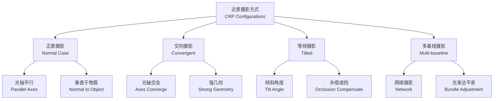
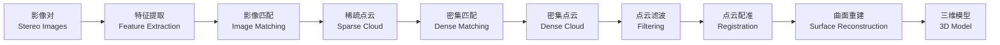

# 近景摄影测量 (Close-Range Photogrammetry)

## 概述 (Overview)

近景摄影测量（Close-Range Photogrammetry, CRP）是利用摄影机在近距离（一般 $<100\,\text{m}$）对物体进行摄影，通过影像处理获取物体表面高精度三维信息的技术。与传统大地测量方法相比，近景摄影测量具有非接触、高效率、信息丰富等显著优势。

近景摄影测量广泛应用于工业测量、文物保护、生物医学和建筑监测等领域，是现代三维数字化技术的核心手段之一。

## 近景摄影方式 (Imaging Configurations)

### 摄影方式分类

| 摄影方式 | 光轴方向 | 适用场景 | 精度特点 |

|----------|----------|----------|----------|

| 正直摄影 (Normal Case) | 光轴水平且垂直于物面 | 平面物体、壁画 | 精度均匀 |

| 交向摄影 (Convergent) | 光轴交会于物体 | 立体物体、雕塑 | 深度精度高 |

| 等倾摄影 (Tilted) | 光轴倾斜一定角度 | 复杂表面 | 需额外定向 |

| 多基线摄影 (Multi-baseline) | 多个摄影站 | 精密测量 | 冗余度最高 |

### 摄影基线选择

基线长度 $B$ 与摄影距离 $D$ 的比值影响立体观测效果：

$$\text{基高比} = \frac{B}{D}$$

推荐基高比范围为 $1/20$ 到 $1/5$，过小导致交会角不足，过大引起影像差异过大。

## 控制点布置 (Control Points)

### 控制点要求

控制点（Control Points）是近景摄影测量中将模型纳入物方坐标系的关键：

- **分布均匀**：覆盖整个测量区域
- **数量充足**：至少 3 个非共线控制点，推荐 6–10 个
- **精度满足**：控制点精度应高于测量精度 3–5 倍
- **标志清晰**：使用人工标志或自然特征点

### 控制点测量方法

| 测量设备 | 精度等级 | 适用场景 |

|----------|----------|----------|

| 三坐标测量机 (CMM) | $\mu\text{m}$ 级 | 工业精密测量 |

| 激光跟踪仪 (Laser Tracker) | $10\,\mu\text{m} + 5\,\mu\text{m/m}$ | 大型工件 |

| 全站仪 (Total Station) | $1\,\text{mm} + 2\,\text{ppm}$ | 建筑与工程 |

| 结构光扫描仪 | $0.05\,\text{mm}$ | 中小物体 |

## 数据处理 (Data Processing)

### 直接线性变换 (Direct Linear Transformation, DLT)

DLT 是近景摄影测量中常用的解析方法，无需已知内方位元素：

$$x = \frac{L_1 X + L_2 Y + L_3 Z + L_4}{L_9 X + L_{10} Y + L_{11} Z + 1}$$

$$y = \frac{L_5 X + L_6 Y + L_7 Z + L_8}{L_9 X + L_{10} Y + L_{11} Z + 1}$$

其中 $(x, y)$ 为像点坐标，$(X, Y, Z)$ 为物方坐标，$L_1$ 至 $L_{11}$ 为 DLT 参数。

### 光束法平差 (Bundle Adjustment)

光束法平差是近景摄影测量中最严密的解法，同时解算内外方位元素和物方点坐标：

$$\min \sum_{i=1}^{n} \sum_{j=1}^{m} \| x_{ij} - x(X_i, Y_i, Z_i, X_j, Y_j, Z_j) \|^2$$

其中 $x_{ij}$ 为观测值，$x(\cdot)$ 为共线方程计算值。

## 三维重建 (3D Reconstruction)

### 密集匹配 (Dense Matching)

密集匹配是获取高精度点云的关键步骤：

| 匹配方法 | 原理 | 特点 |

|----------|------|------|

| SIFT/SURF | 尺度不变特征变换 | 特征稳定、匹配鲁棒 |

| 半全局匹配 (SGM) | 像素级能量最小化 | 精度高、计算量大 |

| 深度学习方法 | 卷积神经网络 | 纹理缺失区域效果好 |

### 点云处理流程

### 点云滤波与配准

- **点云滤波**：去除噪声点、离群点
- **点云配准**：ICP（Iterative Closest Point）算法
- **曲面重建**：泊松重建、Delaunay 三角化

## 精度分析 (Accuracy Analysis)

### 误差来源

| 误差来源 | 影响 | 控制方法 |

|----------|------|----------|

| 影像分辨率 | 定位精度 | 选用高分辨率相机 |

| 摄影几何 | 深度精度 | 增大交会角 |

| 控制点精度 | 绝对精度 | 精密测量控制点 |

| 匹配误差 | 点云质量 | 多视匹配、滤波 |

### 精度估算

近景摄影测量的理论精度：

$$m_X = \frac{H}{f \cdot B} \cdot m_p \cdot D$$

其中 $H$ 为摄影距离，$f$ 为焦距，$B$ 为基线长度，$m_p$ 为像点量测精度。

## 相机标定 (Camera Calibration)

相机标定是确定摄影机内方位元素和畸变参数的关键步骤：

| 标定参数 | 符号 | 说明 |

|----------|------|------|

| 主距 | $f$ | 像主点到投影中心的距离 |

| 主点坐标 | $(x_0, y_0)$ | 像主点在像平面上的位置 |

| 径向畸变 | $k_1, k_2, k_3$ | 镜头径向畸变系数 |

| 切向畸变 | $p_1, p_2$ | 镜头切向畸变系数 |

标定方法：

- **棋盘格标定法**：使用高精度棋盘格靶标
- **自标定法**：利用场景几何约束
- **光束法自标定**：与三维重建同步进行

### 畸变纠正模型

$$x_u = x_d(1 + k_1 r^2 + k_2 r^4 + k_3 r^6) + 2p_1 x_d y_d + p_2(r^2 + 2x_d^2)$$

$$y_u = y_d(1 + k_1 r^2 + k_2 r^4 + k_3 r^6) + p_1(r^2 + 2y_d^2) + 2p_2 x_d y_d$$

其中 $r^2 = x_d^2 + y_d^2$。

## 应用领域 (Applications)

### 工业测量 (Industrial Measurement)

- 产品质量检测与尺寸测量
- 逆向工程（Reverse Engineering）
- 变形监测与形貌分析

### 文物保护 (Cultural Heritage)

- 文物三维建模与数字化存档
- 修复方案设计与效果评估
- 虚拟展示与数字博物馆

### 生物医学 (Biomedical)

- 人体测量学与体态分析
- 口腔正畸与种植规划
- 运动生物力学分析

### 建筑工程 (Construction)

- 建筑立面测量
- 结构变形监测
- 竣工测量与BIM对比

## 经典教材与规范

- 张祖勋《近景摄影测量》
- 《近景摄影测量规范》(CH/T 3006-2011)
- Luhmann《Close-Range Photogrammetry and 3D Imaging》
- 《三维摄影测量技术与应用》

## 相关条目

- [[AerialPhotogrammetry|航空摄影测量 (Aerial Photogrammetry)]]
- [[Photogrammetry|摄影测量学 (Photogrammetry)]]
- [[3DReconstruction|三维重建 (3D Reconstruction)]]
- [[PointCloudProcessing|点云处理 (Point Cloud Processing)]]
- [[BundleAdjustment|光束法平差 (Bundle Adjustment)]]
- [[INDEX|Photogrammetry 索引]]
