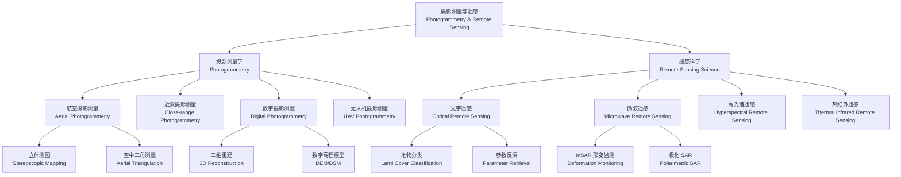

---
aliases: [摄影测量与遥感, PhotogrammetryAndRemoteSensing]
tags: ['SurveyingAndMappingScience', 'Photogrammetry', 'RemoteSensing', 'ImageProcessing']
---

# 摄影测量与遥感 (Photogrammetry and Remote Sensing)

## 学科概述

摄影测量与遥感（Photogrammetry and Remote Sensing）是研究利用电磁波传感器获取目标物体的空间位置、几何形状、物理属性及其时空变化信息的科学与技术。摄影测量侧重于从二维影像中恢复三维几何信息，遥感侧重于通过分析地物的光谱特征进行识别与分类。两者在数据获取方式、处理方法和应用场景上深度互补，共同构成地球空间信息科学（Geospatial Information Science）的核心技术支柱。该学科广泛应用于国家基础测绘、城市规划、环境监测、精准农业、国防安全和数字孪生等领域。

## 学科体系

## 核心概念对比

| 概念 | 摄影测量 | 遥感 |
|:----|:---------|:-----|
| 主要信息源 | 可见光/近红外影像 | 多波段电磁波 |
| 核心目标 | 几何定位与三维重建 | 地物识别与参数反演 |
| 数据特点 | 高重叠度、高空间分辨率 | 多光谱、多时相、多尺度 |
| 典型平台 | 无人机、航摄飞机、地面相机 | 卫星、飞机、无人机、地面光谱仪 |
| 核心算法 | 共线方程、光束法平差、影像匹配 | 分类算法、反演模型、数据融合 |
| 关键输出 | DSM、DEM、正射影像、三维模型 | 土地利用图、植被指数图、温度图 |
| 发展前沿 | 倾斜摄影、实时三维重建 | AI 解译、深度学习分类、多源融合 |

## 摄影测量核心原理

### 共线方程 (Collinearity Equations)

共线方程是摄影测量的解析基础，描述了物点（Object Point）、像点（Image Point）和摄影中心（Perspective Center）三点共线的严格几何关系：

$$ x - x_0 = -f\frac{a_1(X - X_S) + b_1(Y - Y_S) + c_1(Z - Z_S)}{a_3(X - X_S) + b_3(Y - Y_S) + c_3(Z - Z_S)} $$

$$ y - y_0 = -f\frac{a_2(X - X_S) + b_2(Y - Y_S) + c_2(Z - Z_S)}{a_3(X - X_S) + b_3(Y - Y_S) + c_3(Z - Z_S)} $$

其中 $(x, y)$ 为像点坐标，$(x_0, y_0)$ 为像主点坐标，$f$ 为主距（焦距），$(X, Y, Z)$ 为物方点坐标，$(X_S, Y_S, Z_S)$ 为摄影中心坐标，$a_i, b_i, c_i$ 为旋转矩阵 $R = R(\varphi, \omega, \kappa)$ 的九个方向余弦元素。

### 像片方位元素 (Orientation Elements)

**内方位元素 (Interior Orientation)**：恢复摄影光束形状的参数，包括像主点坐标 $(x_0, y_0)$ 和主距 $f$。由相机检校（Camera Calibration）确定。

**外方位元素 (Exterior Orientation)**：恢复摄影光束在物方空间中的位置和姿态，包括三个线元素 $(X_S, Y_S, Z_S)$ 和三个角元素 $(\varphi, \omega, \kappa)$。

### 相对定向与绝对定向

**相对定向（Relative Orientation）**：通过至少 5 对同名点确定两张影像之间的相对位置关系，包含 5 个相对定向元素。共面条件方程为：

$$ \mathbf{B} \cdot (\mathbf{r}_1 \times \mathbf{r}_2) = 0 $$

其中 $\mathbf{B}$ 为摄影基线向量，$\mathbf{r}_1$、$\mathbf{r}_2$ 为同名像点的像空间向量。

**绝对定向（Absolute Orientation）**：将模型点的摄影测量坐标转换到物方大地坐标系，包含 7 个绝对定向参数（3 个平移、3 个旋转、1 个缩放因子）：

$$ \begin{bmatrix} X \\ Y \\ Z \end{bmatrix} = \lambda \mathbf{R} \begin{bmatrix} X' \\ Y' \\ Z' \end{bmatrix} + \begin{bmatrix} X_0 \\ Y_0 \\ Z_0 \end{bmatrix} $$

### 光束法平差 (Bundle Adjustment)

光束法平差同时优化所有相机的外方位参数和所有物点的三维坐标，是严格最密的空中三角测量方法。其数学模型为最小化重投影误差（Reprojection Error）：

$$ \min_{C_j, X_i} \sum_{i=1}^{n} \sum_{j=1}^{m} \| x_{ij} - P(C_j, X_i) \|^2 $$

其中 $x_{ij}$ 为第 $i$ 个物点在第 $j$ 张影像上的观测像点坐标，$P$ 为投影函数（由共线方程定义），$C_j$ 为第 $j$ 张影像的相机参数，$X_i$ 为第 $i$ 个物点的三维坐标。

### 影像匹配 (Image Matching)

影像匹配是自动识别立体像对上同名像点的关键技术：

| 匹配方法 | 原理 | 优点 | 缺点 |
|:---------|:-----|:-----|:-----|
| 灰度匹配 | 基于窗口灰度相关性 | 算法简单、稳健 | 对几何变形敏感 |
| 特征匹配 | 提取 SIFT/SURF/ORB 特征点 | 抗几何变换 | 特征点分布不均匀 |
| 半全局匹配 (SGM) | 全局能量函数优化 | 视差图连续性好 | 计算量大 |
| 深度学习匹配 | CNN/LoFTR 端到端学习 | 鲁棒性最强 | 需要训练数据 |

### 数字高程模型 (Digital Elevation Model)

从立体像对生成 DEM 的流程：影像匹配 → 视差图 → 三维点云 → 滤波分类 → 格网插值。DEM 精度评定指标包括均方根误差（RMSE）和中误差：

$$ RMSE = \sqrt{\frac{1}{n} \sum_{i=1}^{n} (Z_{\text{DEM},i} - Z_{\text{ref},i})^2} $$

## 遥感核心原理

### 电磁波辐射基础

遥感的基础是电磁波与地物的相互作用。普朗克定律（Planck's Law）描述黑体辐射光谱分布：

$$ M_\lambda = \frac{2\pi h c^2}{\lambda^5} \cdot \frac{1}{e^{hc / \lambda kT} - 1} $$

其中 $h = 6.626 \times 10^{-34}$ J·s 为普朗克常数，$c = 2.998 \times 10^8$ m/s 为光速，$k = 1.381 \times 10^{-23}$ J/K 为玻尔兹曼常数。

**斯特藩-玻尔兹曼定律（Stefan-Boltzmann Law）**：$M = \sigma T^4$

**维恩位移定律（Wien's Displacement Law）**：$\lambda_{\text{max}} = \frac{b}{T}$，其中 $b = 2.898 \times 10^{-3}$ m·K

### 地物光谱特征

| 地物类型 | 可见光特征 | 近红外特征 | 短波红外特征 | 热红外特征 |
|:---------|:-----------|:-----------|:-------------|:-----------|
| 健康植被 | 绿波段反射峰 | 高反射（红边） | 水吸收谷 | 蒸腾降温 |
| 水体 | 蓝绿波段透过 | 强烈吸收 | 强烈吸收 | 高比热容 |
| 裸土 | 随成分变化 | 随水分降低 | 吸收较弱 | 日变化大 |
| 人造建筑 | 高反射 | 较高反射 | 与材料相关 | 热容量大 |

### 植被指数

**归一化植被指数（Normalized Difference Vegetation Index, NDVI）**，最广泛使用的植被指数：

$$ \text{NDVI} = \frac{NIR - Red}{NIR + Red} $$

NDVI 取值范围 $[-1, 1]$，健康郁闭植被通常在 0.6 以上，水体为负值。

**增强植被指数（Enhanced Vegetation Index, EVI）**：校正大气和土壤背景影响：
$$ \text{EVI} = G \cdot \frac{NIR - Red}{NIR + C_1 \cdot Red - C_2 \cdot Blue + L} $$

**归一化水体指数（Normalized Difference Water Index, NDWI）**：
$$ \text{NDWI} = \frac{Green - NIR}{Green + NIR} $$

**归一化建筑指数（Normalized Difference Built-up Index, NDBI）**：
$$ \text{NDBI} = \frac{SWIR - NIR}{SWIR + NIR} $$

### 遥感图像分类方法

| 分类方法 | 理论基础 | 典型算法 | 精度 | 适用场景 |
|:--------|:---------|:---------|:-----|:---------|
| 最大似然法 | 贝叶斯统计决策 | MLC | 中高 | 地物光谱可分性好 |
| 支持向量机 | 结构风险最小化 | SVM | 高 | 小样本、高维数据 |
| 随机森林 | Bagging 集成学习 | Random Forest | 高 | 多源特征融合 |
| 深度卷积网络 | 多层特征提取 | CNN, ResNet | 很高 | 高分辨率影像 |
| 语义分割网络 | 像素级端到端 | U-Net, DeepLab | 很高 | 精细地物提取 |
| 面向对象分类 | 分割 + 分类 | OBIA | 高 | 纹理特征丰富 |

## 雷达遥感 (Radar Remote Sensing)

### SAR 成像原理

合成孔径雷达（Synthetic Aperture Radar, SAR）利用雷达平台的向前运动合成虚拟大孔径天线，实现方位向高分辨率。雷达方程（Radar Equation）：

$$ P_r = \frac{P_t G^2 \lambda^2 \sigma}{(4\pi)^3 R^4} $$

其中 $P_r$ 为接收功率，$P_t$ 为发射功率，$G$ 为天线增益，$\lambda$ 为电磁波波长，$\sigma$ 为雷达散射截面（Radar Cross Section, RCS），$R$ 为斜距。

### InSAR 干涉测量

干涉合成孔径雷达（Interferometric SAR）利用两景或多景 SAR 影像的相位差测量地表形变和地形：

$$ \Delta\phi = \frac{4\pi}{\lambda} \Delta R + \phi_{\text{atm}} + \phi_{\text{topo}} + \phi_{\text{noise}} $$

**D-InSAR**（差分干涉测量）去除地形相位后获取形变信息，精度可达 cm 甚至 mm 级。**PS-InSAR**（永久散射体干涉测量）利用稳定散射体克服时空去相干，适用于缓慢形变监测。

### 极化 SAR (PolSAR)

全极化 SAR 测量地物在四个极化通道（HH、HV、VH、VV）的后向散射系数，通过极化分解（如 Pauli 分解、Freeman-Durden 分解）提取地物散射机制信息。

## 影像传感器与平台

| 影像类型 | 波段数 | 光谱范围 | 空间分辨率 | 时间分辨率 | 代表传感器 |
|:--------|:------|:---------|:-----------|:-----------|:-----------|
| 全色影像 | 1 | 450~900 nm | 0.3~2 m | 1~3 天 | WorldView-3, 高分2号 |
| 多光谱影像 | 4~10 | 可见光~SWIR | 0.5~30 m | 1~16 天 | Landsat 8/9 OLI, Sentinel-2 |
| 高光谱影像 | 100~300 | 400~2500 nm | 5~30 m | 16~30 天 | Hyperion, PRISMA, 珠海1号 |
| SAR 影像 | 1 (多极化) | C/X/L 波段 | 1~30 m | 6~12 天 | Sentinel-1, Radarsat-2 |
| 热红外影像 | 1~5 | 8~14 μm | 60~120 m | 1~16 天 | Landsat TIRS, MODIS, ECOSTRESS |
| LiDAR 点云 | 多回波 | 近红外/绿光 | 0.1~2 m | — | 机载 LiDAR, 地面 TLS |

## 摄影测量与遥感发展历程

| 时期 | 摄影测量 | 遥感 |
|:----|:---------|:-----|
| 1850~1900 | 地面摄影测量、交会法测图 | 摄影技术诞生 |
| 1900~1940 | 模拟摄影测量、光学机械测图仪 | 航空摄影起步 |
| 1940~1960 | 解析摄影测量、电算加密 | 彩色红外摄影、军事遥感 |
| 1960~1980 | 解析测图仪普及 | Landsat 1 发射，多光谱遥感 |
| 1980~2000 | 数字摄影测量工作站 | SPOT, ERS, 高光谱传感器出现 |
| 2000~2010 | 无人机摄影测量兴起，SfM 算法 | IKONOS, QuickBird, MODIS |
| 2010~2020 | 倾斜摄影、实景三维中国建设 | Sentinel, 高分卫星星座, AI 解译 |
| 2020 至今 | 实时三维、数字孪生驱动 | 深度学习大模型, 星载 LiDAR, InSAR 星座 |

## 主要应用领域

- 国家基础地形图测绘与更新，1:10000 和 1:50000 比例尺地形图生产
- 城市三维建模，用于数字城市、智慧城市、CIM（城市信息模型）平台
- 土地利用/覆盖变化监测，支撑全球变化研究和国土资源管理
- 大气环境遥感监测，包括气溶胶光学厚度、PM2.5 反演、臭氧监测
- 水环境遥感监测，包括叶绿素浓度、悬浮物浓度、透明度、富营养化评价
- 灾害应急响应，包括地震形变场、洪水淹没范围、滑坡识别、森林火灾监测
- 精准农业，作物种植结构识别、长势监测、病虫害预警、产量预测
- 文物数字化保护，石窟寺三维扫描、古建筑精细建模、考古遗址遥感探测
- 自动驾驶高精地图，道路要素提取、车道级导航地图制作

## 经典教材与参考书

- 张祖勋《数字摄影测量学》（武汉大学出版社）
- 王之卓《摄影测量原理》（测绘出版社）
- 孙家炳《遥感原理与应用》（武汉大学出版社）
- 李德仁《遥感导论》（科学出版社）
- 龚健雅《地理信息系统基础》（科学出版社）
- Lillesand, Kiefer & Chipman《Remote Sensing and Image Interpretation》（Wiley）
- Kraus《Photogrammetry: Geometry from Images and Laser Scans》（De Gruyter）
- Richards《Remote Sensing Digital Image Analysis》（Springer）

## 相关条目

- [[04_EngineeringAndTechnology/SurveyingAndMappingScience/SurveyingAndMappingScience|SurveyingAndMappingScience]]
- [[GeographicInformationSystem]]
- [[DigitalImageProcessing]]
- [[05_ComputerScience/ArtificialIntelligence/ComputerVision/ComputerVision|ComputerVision]]
- [[GlobalNavigationSatelliteSystem]]
- [[02_NaturalSciences/EarthSciences/Cartography/Cartography|Cartography]]
- [[05_ComputerScience/ARVRXR/DigitalTwin|DigitalTwin]]

