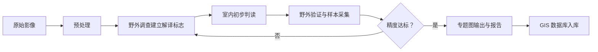

# 遥感图像判读（Remote Sensing Image Interpretation）

## 定义

遥感图像判读（Image Interpretation），亦称遥感图像解译或遥感影像判释，是从遥感影像中识别地物目标、提取专题信息并转化为可用地理空间知识的过程。按判读方式可分为目视判读（Visual Interpretation）和计算机辅助分类（Computer-Aided Classification）两大技术路线。目视判读依赖解译员的经验和认知能力，计算机分类则利用统计和机器学习算法自动处理。两条路线在实践中相互补充——自动分类结果需人工验证，目视判读经验也为分类器的训练样本选取提供指导。

## 研究历史

遥感图像判读的历史可追溯至 19 世纪中叶的气球摄影，但现代遥感判读体系的建立与航空摄影在两次世界大战中的军事应用密切相关。1950–60 年代美国军方发展了系统的目视判读方法学（解译要素体系），这一体系至今仍是遥感教学的基础。1972 年 Landsat-1 发射后多光谱卫星影像普及推动了计算机分类技术的发展。21 世纪高分辨率卫星（IKONOS、WorldView）、高光谱传感器（Hyperion）和合成孔径雷达（SAR）使判读任务从"识别地类"拓展为"定量化参数反演"。

## 目视判读（Visual Interpretation）

### 解译要素（Interpretation Elements）

| 要素 | 英文 | 定义 | 判读示例 |
|------|------|------|----------|
| 色调/色彩 | Tone/Color | 地物的灰度或色彩 | 水体在近红外呈深色 |
| 形状 | Shape | 地物轮廓几何形态 | 足球场矩形、跑道长条形 |
| 大小 | Size | 绝对和相对尺寸 | 商业建筑 vs 住宅 |
| 纹理 | Texture | 色调变化的频率 | 林地粗糙 vs 草地均匀 |
| 图案 | Pattern | 空间排列规律 | 住宅区棋盘格排列 |
| 阴影 | Shadow | 地物遮挡暗区 | 通过阴影估建筑高度 |
| 位置 | Site | 地理环境 | 港口靠海岸线 |
| 关联 | Association | 地物共生关系 | 加油站常伴高速公路出口 |

### 目视判读方法

- **直接判读法（Direct Recognition）**：依据解译要素直接识别地物
- **对比分析法（Comparative Analysis）**：对比不同时相影像检测变化
- **逻辑推理法（Logical Inference）**：通过地物间因果关系推理未知目标
- **直尺量测法（Measurement）**：利用影像比例尺或已知尺寸推估

### 目视判读工作流程

## 图像预处理（Preprocessing）

### 辐射校正（Radiometric Correction）

**辐射定标（Radiometric Calibration）**：将 DN 值转换为辐亮度或地表反射率：

$$L_\lambda = Gain \times DN + Offset$$

**大气校正（Atmospheric Correction）**：消除大气散射和吸收。常用方法包括 6S 模型、FLAASH、暗目标法（DOS）。

### 几何校正（Geometric Correction）

- 几何粗校正：利用卫星星历参数
- 几何精校正：通过地面控制点（GCP）结合多项式模型
- 正射校正（Orthorectification）：结合 DEM 消除地形变形

### 图像增强（Image Enhancement）

- 对比度拉伸：线性拉伸和直方图均衡化
- 空间滤波：低通滤波去噪、高通滤波锐化
- 波段组合：假彩色合成增强特定信息
- 主成分分析（PCA）：降维去相关

## 计算机分类（Digital Classification）

### 监督分类（Supervised Classification）

| 算法 | 原理 | 优点 | 限制 |
|------|------|------|------|
| 最大似然法（MLC） | 基于贝叶斯决策 | 理论基础坚实 | 需正态分布假设 |
| 支持向量机（SVM） | 最优超平面 | 小样本高维表现优 | 参数调节敏感 |
| 随机森林（RF） | 集成决策树 | 抗过拟合、特征重要性 | 解释性较弱 |
| 卷积神经网络（CNN） | 自动学习空间-光谱特征 | 端到端、精度最高 | 需大量数据和算力 |

### 非监督分类（Unsupervised Classification）

- **K-means**：指定 $K$ 后迭代聚类
- **ISODATA**：自动合并与分裂簇

### 面向对象图像分析（OBIA）

将影像分割为同质对象，基于对象的形状、纹理、上下文关系进行分类。适用于高分辨率影像的精细分类。

### 分类精度评价

| 指标 | 公式 | 含义 |
|------|------|------|
| 总体精度（OA） | $\frac{TP+TN}{Total}$ | 正确分类比例 |
| Kappa 系数 | $\frac{p_o-p_e}{1-p_e}$ | 去除随机一致性 |
| 生产者精度（PA） | $\frac{TP}{TP+FN}$ | 遗漏误差 |
| 用户精度（UA） | $\frac{TP}{TP+FP}$ | 误判误差 |
| F1 分数 | $2\times\frac{PA\times UA}{PA+UA}$ | 调和均值 |

## 专题信息提取

### 植被指数

**NDVI（归一化植被指数）**：
$$NDVI = \frac{NIR - Red}{NIR + Red}$$，范围 $[-1, 1]$，植被 $0.2$–$0.9$。

**EVI（增强型植被指数）**：
$$EVI = G \times \frac{NIR - Red}{NIR + C_1 \times Red - C_2 \times Blue + L}$$

### 水体指数

**NDWI**：$$NDWI = \frac{Green - NIR}{Green + NIR}$$

**MNDWI**（以 SWIR 替代 NIR）：$$MNDWI = \frac{Green - SWIR}{Green + SWIR}$$

### 城市信息

- 不透水面提取：夜间灯光数据或光谱混合分析
- 建筑物指数：IBI、BI
- 变化检测：多时相差异分析

## 主要应用领域

- 土地利用与土地覆盖分类（LULC）
- 农作物类型识别与长势监测
- 城市扩张与变化检测
- 灾害损失评估（地震、洪水、滑坡）
- 生态环境监测（植被退化、湿地变化）
- 地质构造解译与矿产勘查
- 海岸线动态监测

## 经典教材

- 《遥感图像解译》（赵英时等）
- Lillesand *Remote Sensing and Image Interpretation*（第 7 版）
- 《遥感数字图像处理》（贾永红）
- Richards *Remote Sensing Digital Image Analysis*（第 5 版）
