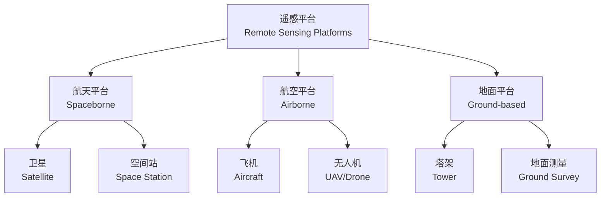
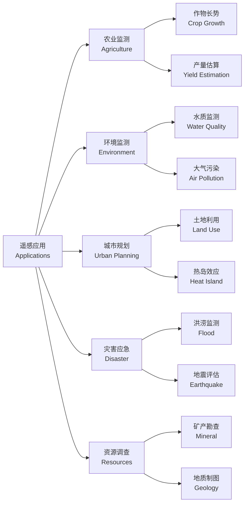

---
aliases: [RemoteSensingPrinciples]
tags: ['SurveyingAndMappingScience', 'RemoteSensing', 'RemoteSensingPrinciples']
created: 2026-05-17
updated: 2026-05-17
---

# 遥感原理 (Remote Sensing Principles)

## 定义 (Definition)

遥感原理是研究电磁波与地物相互作用规律以及遥感信息获取与处理的理论基础。它涵盖了从辐射源（太阳/地球）发出的电磁波，经过大气传输，与地表目标相互作用后，再经大气返回传感器，最终被处理成可用信息的全过程。

遥感（Remote Sensing）的本质是“不与目标直接接触而获取其信息”，其核心物理基础是电磁波理论。

## 核心内容 (Core Concepts)

### 电磁辐射 (Electromagnetic Radiation)

**电磁波谱 (Electromagnetic Spectrum)**：

| 波段名称 | 波长范围 | 主要应用 |
|----------|----------|----------|
| 紫外线 (UV) | 0.01~0.4 μm | 臭氧监测、水质分析 |
| 可见光 (Visible) | 0.4~0.7 μm | 真彩色成像、植被识别 |
| 近红外 (NIR) | 0.7~1.3 μm | 植被健康监测 |
| 短波红外 (SWIR) | 1.3~3 μm | 土壤水分、矿物识别 |
| 热红外 (TIR) | 3~14 μm | 地表温度、热异常 |
| 微波 (Microwave) | 1 mm~1 m | SAR 成像、全天候观测 |

**普朗克定律 (Planck's Law)**：

$$B_\lambda(T) = \frac{2hc^2}{\lambda^5}\frac{1}{e^{hc/\lambda kT}-1}$$

其中，$B_\lambda(T)$ 为光谱辐射亮度，$h$ 为普朗克常数，$c$ 为光速，$k$ 为玻尔兹曼常数，$T$ 为绝对温度。

**维恩位移定律 (Wien's Displacement Law)**：

$$\lambda_{max} = \frac{b}{T}$$

其中，$b = 2898 \mu m \cdot K$，表示黑体辐射峰值波长与温度成反比。

**斯特藩-玻尔兹曼定律 (Stefan-Boltzmann Law)**：

$$M = \sigma T^4$$

总辐射出射度与温度的四次方成正比。

### 地物波谱特性 (Spectral Characteristics of Ground Objects)

**反射光谱 (Reflectance Spectra)**：

- **植被 (Vegetation)**：绿光反射峰（0.55 μm）、红边效应（Red Edge，0.68~0.75 μm）、近红外高反射平台
- **水体 (Water)**：可见光弱反射、近红外强吸收、镜面反射
- **土壤 (Soil)**：反射率随波长增加而单调上升、受水分和有机质影响
- **岩石/矿物 (Rock/Mineral)**：具有诊断性吸收特征

**热辐射特性 (Thermal Radiation)**：

- **发射率 (Emissivity)**：$\varepsilon = \frac{M}{M_{blackbody}}$
- **黑体 (Blackbody)**：$\varepsilon = 1$
- **灰体 (Gray Body)**：$\varepsilon = const < 1$
- **选择性辐射体**：$\varepsilon$ 随波长变化

### 大气影响 (Atmospheric Effects)

**大气散射 (Atmospheric Scattering)**：

| 散射类型 | 粒子尺度 | 波长依赖性 | 典型现象 |
|----------|----------|------------|----------|
| 瑞利散射 (Rayleigh) | $<< \lambda$ | $\lambda^{-4}$ | 蓝天、偏振光 |
| 米氏散射 (Mie) | $\approx \lambda$ | $\lambda^{-2}$ | 霾、云雾 |
| 几何散射 (Non-selective) | $>> \lambda$ | 无依赖 | 浓雾、沙尘 |

**大气吸收 (Atmospheric Absorption)**：

- 水汽 ($H_2O$)：吸收带 0.94, 1.14, 1.38, 1.87, 2.7, 6.3 μm
- 二氧化碳 ($CO_2$)：吸收带 1.4, 2.0, 2.7, 4.3, 15 μm
- 臭氧 ($O_3$)：吸收带 0.25, 0.6, 9.6 μm

**大气窗口 (Atmospheric Windows)**：

| 窗口名称 | 波长范围 | 应用 |
|----------|----------|------|
| 可见光窗口 | 0.3~1.3 μm | 摄影、多光谱 |
| 近红外窗口 | 1.5~1.8 μm, 2.0~2.5 μm | 高光谱矿物识别 |
| 热红外窗口 | 3~5 μm, 8~14 μm | 温度反演 |
| 微波窗口 | 1 mm~1 m | 雷达、微波辐射计 |

## 遥感平台与传感器 (Platforms and Sensors)

### 遥感平台 (Remote Sensing Platforms)

**卫星轨道类型**：

- **太阳同步轨道 (Sun-synchronous Orbit)**：轨道倾角约98°，保证地方时一致，适合资源监测
- **地球静止轨道 (Geostationary Orbit)**：位于赤道上空35786 km，轨道周期24小时，适合气象观测
- **近极地轨道 (Near-polar Orbit)**：覆盖全球，适合大尺度观测

### 传感器类型 (Sensor Types)

**光学传感器 (Optical Sensors)**：

- **多光谱传感器 (Multispectral)**：波段数少（<20）、波段宽（>50 nm），如 Landsat TM/ETM+/OLI
- **高光谱传感器 (Hyperspectral)**：波段数多（>100）、波段窄（<10 nm），如 AVIRIS、Hyperion
- **全色传感器 (Panchromatic)**：单宽波段，空间分辨率高

**微波传感器 (Microwave Sensors)**：

- **合成孔径雷达 (SAR, Synthetic Aperture Radar)**：主动成像，全天时全天候
- **真实孔径雷达 (RAR, Real Aperture Radar)**：分辨率较低
- **微波辐射计 (Radiometer)**：被动接收微波辐射

**激光雷达 (LiDAR, Light Detection and Ranging)**：

- 主动发射激光脉冲
- 获取高精度三维点云
- 用于地形测绘、森林结构、城市建模

### 遥感分辨率 (Remote Sensing Resolutions)

| 分辨率类型 | 英文 | 定义 | 示例 |
|------------|------|------|------|
| 空间分辨率 | Spatial | 像元代表的地面尺寸 | Landsat: 30 m; WorldView: 0.3 m |
| 光谱分辨率 | Spectral | 波段数量和宽度 | 多光谱 vs 高光谱 |
| 时间分辨率 | Temporal | 重访周期 | MODIS: 1天; Landsat: 16天 |
| 辐射分辨率 | Radiometric | 灰度级数（量化位数） | 8-bit, 11-bit, 12-bit |

## 图像解译与处理 (Image Interpretation and Processing)

### 图像预处理 (Preprocessing)

**辐射校正 (Radiometric Correction)**：

- 传感器校正
- 大气校正（如 FLAASH、6S 模型）
- 地形校正

**几何校正 (Geometric Correction)**：

- 系统几何校正
- 地面控制点（GCP）精校正
- 正射校正（Ortho-rectification）

### 图像增强 (Image Enhancement)

- **对比度拉伸 (Contrast Stretching)**
- **空间滤波 (Spatial Filtering)**：均值滤波、中值滤波、边缘增强
- **多光谱变换**：主成分分析（PCA）、缨帽变换（Tasseled Cap）
- **彩色合成 (Color Composite)**：真彩色、假彩色、标准假彩色（如 4-3-2 合成突出植被）

### 信息提取 (Information Extraction)

**监督分类 (Supervised Classification)**：

- 最大似然分类 (Maximum Likelihood)
- 支持向量机 (SVM)
- 随机森林 (Random Forest)
- 深度学习分类 (CNN)

**非监督分类 (Unsupervised Classification)**：

- K-均值聚类 (K-means)
- ISODATA

**变化检测 (Change Detection)**：

- 图像差值法
- 图像比值法
- 分类后比较法

## 典型应用 (Typical Applications)

- **土地利用/覆盖分类 (Land Use/Cover Classification)**：基于光谱特征的自动化分类
- **植被监测 (Vegetation Monitoring)**：NDVI、EVI 等植被指数时序分析
- **水环境监测 (Water Environment)**：叶绿素、悬浮泥沙、水温反演
- **城市热岛效应 (Urban Heat Island)**：热红外波段地表温度反演
- **大气环境监测 (Atmospheric Monitoring)**：气溶胶光学厚度、PM2.5 估算
- **矿产资源勘查 (Mineral Exploration)**：高光谱矿物填图
- **自然灾害应急 (Disaster Emergency)**：洪涝、地震、滑坡快速评估

## 常用植被指数 (Common Vegetation Indices)

| 指数名称 | 英文 | 公式 | 应用 |
|----------|------|------|------|
| 归一化植被指数 | NDVI | $\frac{NIR - RED}{NIR + RED}$ | 植被覆盖度 |
| 增强型植被指数 | EVI | $\frac{2.5(NIR - RED)}{NIR + 6RED - 7.5BLUE + 1}$ | 高生物量区 |
| 归一化水体指数 | NDWI | $\frac{GREEN - NIR}{GREEN + NIR}$ | 水体提取 |
| 土壤调节植被指数 | SAVI | $\frac{(1+L)(NIR-RED)}{NIR+RED+L}$ | 低覆盖度区 |

## 经典教材与参考 (Classic Textbooks)

- 孙家炳《遥感原理与应用》
- 李德仁《遥感导论》
- Schowengerdt R. A. *Remote Sensing: Models and Methods for Image Processing*
- Lillesand T., Kiefer R. W., Chipman J. *Remote Sensing and Image Interpretation*
- 梅安新《遥感导论》
- Jensen J. R. *Introductory Digital Image Processing*

## 相关条目 (Related Entries)

- [[GeographicInformationScience]]
- [[Photogrammetry]]
- [[GlobalPositioningSystem]]
- [[DigitalImageProcessing]]
- [[GeographicInformationSystem]]
- [[INDEX|EngineeringAndTechnology 索引]]

