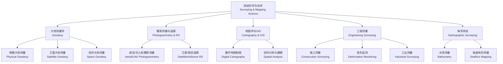

# 测绘科学与技术 (Surveying and Mapping Science / Geomatics)

## 学科概述

测绘科学与技术（Surveying and Mapping Science, also referred to as Geomatics）是研究地球空间信息（Geospatial Information）获取、处理、分析、表达、管理和应用的综合性学科。该学科以大地测量学（Geodesy）为基础，融合摄影测量与遥感（Photogrammetry and Remote Sensing）、地图学与地理信息系统（Cartography and GIS）、工程测量（Engineering Surveying）以及海洋测绘（Hydrographic Surveying）等子领域。现代测绘技术已从光学经纬仪和水准仪发展为融合 GNSS、LiDAR、InSAR、无人机和人工智能的智能空间信息服务系统。

## 学科体系

## 核心概念对比

| 概念 | 定义 | 精度等级 | 主要技术手段 | 典型应用 |
|:----|:-----|:---------|:-------------|:---------|
| 大地测量 | 测定地球形状、大小、重力场及其变化 | mm~cm | GNSS, VLBI, SLR, 重力仪 | 地球参考框架、板块运动 |
| 摄影测量 | 从二维影像恢复三维几何 | cm~m | 航摄相机、倾斜摄影、SfM | 地形图测绘、三维城市 |
| 遥感 | 利用电磁波识别地物属性 | m~km | 多光谱、高光谱、SAR | 土地利用、环境监测 |
| 地图学 | 地图设计、编制与可视化 | 视比例尺 | GIS 软件、制图综合 | 纸质/电子地图、导航 |
| 工程测量 | 工程建设放样与监测 | mm | 全站仪、水准仪、激光扫描 | 施工放样、变形监测 |
| 海洋测绘 | 海底地形和水深测量 | cm~m | 多波束声纳、侧扫声纳 | 航道测量、海图制作 |

## 大地测量学 (Geodesy)

### 地球形状与参考椭球

大地测量学研究地球的几何形状和外部重力场。地球形状近似为旋转椭球。1979 年国际大地测量与地球物理联合会（IUGG）推荐的 GRS80 椭球参数：长半轴 $a = 6378137$ m，扁率 $f = 1/298.257222101$。

$$ f = \frac{a - b}{a} $$

中国采用的 CGCS2000（China Geodetic Coordinate System 2000）椭球参数与 GRS80 一致。WGS84 椭球是 GPS 系统使用的全球参考椭球。

### 坐标系统

| 坐标系统 | 表示 | 特点 | 适用场景 |
|:---------|:-----|:-----|:---------|
| 大地坐标系 (Geodetic) | $(B, L, H)$ | 纬度、经度、大地高 | 全球定位与导航 |
| 空间直角坐标系 (Geocentric) | $(X, Y, Z)$ | 地心原点，三维直角 | 卫星定位计算 |
| 高斯-克吕格平面坐标系 | $(x, y)$ | 等角横切椭圆柱投影 | 国家基本地形图 |
| 站心坐标系 | $(N, E, U)$ | 以测站为原点 | 工程放样与监测 |
| 独立坐标系 | $(x, y, h)$ | 局部自定义 | 城市与工程控制网 |

### GNSS 定位原理

全球导航卫星系统（Global Navigation Satellite System, GNSS）包括 GPS（美国）、BDS/北斗（中国）、GLONASS（俄罗斯）和 Galileo（欧盟）。

**伪距单点定位方程**：

$$ \rho_i = \sqrt{(x_i - x)^2 + (y_i - y)^2 + (z_i - z)^2} + c \cdot \delta t + \varepsilon_i $$

其中 $\rho_i$ 为第 $i$ 颗卫星的伪距观测值，$(x_i, y_i, z_i)$ 为卫星坐标，$(x, y, z)$ 为接收机坐标，$\delta t$ 为接收机钟差，$c$ 为光速。

**差分 GNSS（DGNSS）**：基准站通过已知坐标计算差分改正数，可消除卫星钟差、轨道误差和大气延迟。

**RTK（Real-Time Kinematic）**：利用载波相位观测值和基站差分改正，实现实时 cm 级定位精度。

**精密单点定位（PPP, Precise Point Positioning）**：使用精密卫星轨道和钟差产品，单台接收机即可实现 dm~cm 级绝对定位。

### 高程系统

我国常用高程系统：
- 正常高（Normal Height）：基于似大地水准面（Quasi-geoid）
- 大地高（Ellipsoidal Height）：基于参考椭球面，GNSS 直接输出
- 高程异常（Height Anomaly）：$\zeta = H_{\text{ellipsoid}} - H_{\text{normal}}$

水准测量（Leveling）高差公式：
$$ h = a - b $$

三角高程测量：$h_{AB} = D \tan\alpha + i - v + c \cdot D^2$

## 工程测量 (Engineering Surveying)

### 距离测量

**视距测量（Tacheometry）**：
$$ D = K \cdot l \cdot \cos^2\theta $$

其中 $K$ 为视距乘常数（通常 $K=100$），$l$ 为标尺视距间隔，$\theta$ 为竖直角。电子全站仪采用红外/激光电子测距（EDM），精度可达 $\pm(2\text{mm} + 2\text{ppm})$。

### 导线测量 (Traverse Surveying)

导线测量是最常用的平面控制测量方法：
$$ \Delta x = D \cdot \cos\alpha, \quad \Delta y = D \cdot \sin\alpha $$

其中 $\alpha$ 为坐标方位角。导线类型包括闭合导线、附合导线和支导线。角度闭合差 $f_\beta$ 和坐标闭合差 $f_x, f_y$ 按导线长度或边数比例分配。

### 前方交会 (Forward Intersection)

已知 $A(x_A, y_A)$ 和 $B(x_B, y_B)$ 两点坐标，在两个点上分别观测 P 点的角度 $\alpha$ 和 $\beta$：

$$ x_P = \frac{x_A \cot\beta + x_B \cot\alpha - y_A + y_B}{\cot\alpha + \cot\beta}, \quad y_P = \frac{y_A \cot\beta + y_B \cot\alpha + x_A - x_B}{\cot\alpha + \cot\beta} $$

### 变形监测 (Deformation Monitoring)

变形监测技术包括：
- 全站仪极坐标法：单点监测，精度 1~2 mm
- 水准测量：垂直位移，精度 0.1~0.3 mm
- GNSS 连续监测：水平/垂直位移，精度 3~10 mm
- 激光扫描（TLS）：面状变形，精度 2~10 mm
- InSAR：区域性面状变形，精度 mm~cm
- 光纤传感器（FBG）：内部应变监测，精度 1 με

$$ \text{变形量} \Delta = \text{当期值} - \text{初始值} - \text{环境修正} $$

## 误差理论与数据处理

### 误差分类与特征

| 误差类型 | 来源 | 概率分布 | 处理方法 |
|:---------|:-----|:---------|:---------|
| 偶然误差 | 随机因素 | 正态分布 $N(0, \sigma^2)$ | 平差处理，增加测回数 |
| 系统误差 | 仪器/环境偏差 | 确定性规律 | 校正模型，改正观测值 |
| 粗差 | 操作/记录错误 | 无统计规律 | 统计检验（3σ 准则、数据探测法）剔除 |

### 误差传播定律

对于一般函数 $z = f(x_1, x_2, \dots, x_n)$，观测值 $x_i$ 间独立时：

$$ \sigma_z^2 = \sum_{i=1}^n \left(\frac{\partial f}{\partial x_i}\right)^2 \sigma_{x_i}^2 $$

对于线性函数 $z = a_1 x_1 + a_2 x_2 + \cdots + a_n x_n$：
$$ \sigma_z^2 = a_1^2 \sigma_{x_1}^2 + a_2^2 \sigma_{x_2}^2 + \cdots + a_n^2 \sigma_{x_n}^2 $$

### 最小二乘平差 (Least Squares Adjustment)

参数平差模型 $\mathbf{L} = \mathbf{A}\mathbf{X} + \mathbf{\Delta}$ 的最小二乘解：

$$ \hat{\mathbf{X}} = (\mathbf{A}^T \mathbf{P} \mathbf{A})^{-1} \mathbf{A}^T \mathbf{P} \mathbf{L} $$

其中 $\mathbf{P}$ 为观测值权矩阵（与方差成反比）。单位权方差估值：
$$ \hat{\sigma}_0^2 = \frac{\mathbf{V}^T \mathbf{P} \mathbf{V}}{n - t} $$

观测值中误差：$\hat{\sigma}_i = \hat{\sigma}_0 / \sqrt{p_i}$

## 测量方法综合比较

| 方法 | 精度 | 适用范围 | 作业效率 | 成本 | 技术特点 |
|:----|:-----|:---------|:---------|:-----|:---------|
| 全站仪 | mm 级 | 工程控制网、施工放样 | 中 | 中 | 精度高，受通视和天气限制 |
| GNSS 静态 | mm~cm | 大地控制网 | 低 | 中 | 精度高，需后处理 |
| GNSS RTK | cm | 实时定位、地籍测量 | 高 | 中高 | 实时 cm 级，需数据链 |
| 水准测量 | mm 级 | 高程控制 | 低 | 低 | 精度最高，速度慢 |
| 航空摄影测量 | cm~m | 大面积地形测图 | 高 | 高 | 效率高，受天气影响 |
| 无人机摄影测量 | cm~dm | 局部区域三维重建 | 高 | 中 | 灵活快速 |
| 地面激光扫描 | mm~cm | 复杂对象三维建模 | 高 | 高 | 点云密集，数据量大 |
| 多波束测深 | cm~m | 海底地形测量 | 高 | 高 | 宽覆盖，水深受限 |

## 现代测绘技术前沿

- 车载移动测绘系统（MMS）：LiDAR + 全景相机 + GNSS/INS 组合导航，用于街景地图和道路资产调查
- 无人机（UAV）倾斜摄影：5 镜头倾斜相机 + SfM 算法，实现实景三维自动化建模
- 地面激光扫描（TLS）+ BIM：施工质量检测、竣工测量和历史建筑保护
- 多传感器融合变形监测：全站仪 + GNSS + 加速仪 + 气象传感器 + 物联网平台
- 高精地图（HD Map）：自动驾驶核心数据，包含车道模型、交通标识和定位特征
- 数字孪生（Digital Twin）城市：GIS + BIM + IoT 实时融合，城市全生命周期管理
- AI 遥感解译：深度学习语义分割，自动识别建筑物、道路、水体、植被

## 经典教材与参考书

- 宁津生《测绘学概论》（武汉大学出版社）
- 孔祥元《大地测量学基础》（武汉大学出版社）
- 张祖勋《数字摄影测量学》（武汉大学出版社）
- 李德仁《遥感导论》（科学出版社）
- 王家耀《地图学原理与方法》（科学出版社）
- 龚健雅《地理信息系统基础》（科学出版社）
- 高井祥《工程测量学》（中国矿业大学出版社）
- Hofmann-Wellenhof《GNSS — Global Navigation Satellite Systems》（Springer）

## 主要应用领域

- 国家基础测绘：全国 1:10000、1:50000 比例尺地形图更新
- 自然资源调查：第三次全国国土调查、自然资源确权登记
- 智慧城市建设：CIM 城市信息模型、数字城管
- 生态环境监测：湖泊湿地变化、荒漠化监测、碳汇估算
- 灾害应急：地震形变场、洪水淹没范围、滑坡监测
- 自动驾驶与导航：高精地图、车道级定位
- 文物保护：龙门石窟数字化、长城测量、古建筑三维建模
- 能源工程建设：核电选址、管道选线、水电枢纽控制测量

## 学习路径

1. 基础阶段：测量学基础、高等数学、线性代数、概率统计、计算机程序设计
2. 专业基础：大地测量学、摄影测量学、遥感原理、误差理论与数据处理
3. 专业核心：GIS 原理与应用、数字测图、GNSS 定位原理、遥感数字图像处理
4. 专业拓展：InSAR 技术、LiDAR 数据处理、无人机测绘、空间数据挖掘、AI+GIS

## 相关条目

- [[Cartography]]
- [[GeographicInformationSystem]]
- [[04_EngineeringAndTechnology/CivilEngineering/INDEX|CivilEngineering]]
- [[01_K12/JuniorHigh/Geography/INDEX|Geography]]
- [[GlobalNavigationSatelliteSystem]]
- [[DigitalImageProcessing]]
- [[RemoteSensing]]
- [[DigitalTwin]]
