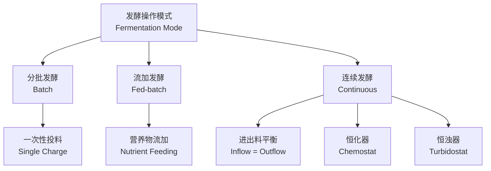
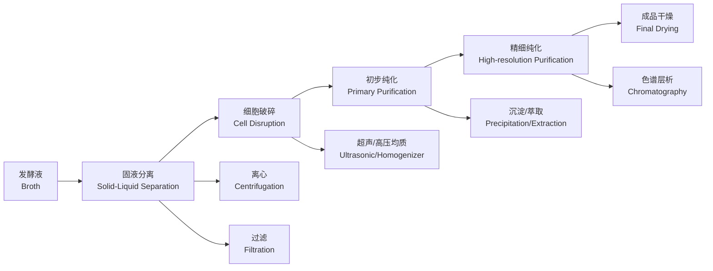

---
aliases:
  - Fermentation Engineering and Bioreactors
  - 发酵工程与生物反应器
tags:
  - biotechnology
  - fermentation
  - bioreactor
  - bioprocess
  - engineering
---

# 发酵工程与生物反应器 (Fermentation Engineering and Bioreactors)

## 一、概述 (Overview)

发酵工程 (Fermentation Engineering) 是利用微生物的代谢活动，通过工业规模培养来生产有用产物的工程技术。生物反应器 (Bioreactor) 是发酵工程的核心设备，为微生物或细胞提供适宜的生长环境。应用涵盖食品、制药、化工和能源领域。

## 二、发酵类型 (Fermentation Types)

### 2.1 按代谢产物分类

| 类型 | 产物 | 代表微生物 |
|------|------|------------|
| 酒精发酵 (Alcoholic) | 乙醇、CO₂ | 酿酒酵母 (S. cerevisiae) |
| 乳酸发酵 (Lactic Acid) | 乳酸 | 乳酸菌 (Lactobacillus) |
| 醋酸发酵 (Acetic Acid) | 醋酸 | 醋酸菌 (Acetobacter) |
| 柠檬酸发酵 (Citric Acid) | 柠檬酸 | 黑曲霉 (A. niger) |
| 抗生素发酵 (Antibiotic) | 青霉素等 | 青霉菌 (Penicillium) |

### 2.2 按操作模式分类

## 三、生物反应器设计 (Bioreactor Design)

### 3.1 主要类型 (Major Types)

| 反应器类型 | 特点 | 应用 |
|------------|------|------|
| 搅拌釜式 (Stirred Tank) | 机械搅拌、通用性强 | 最常见，适用范围广 |
| 气升式 (Air-lift) | 无机械搅拌，低剪切力 | 动物细胞培养 |
| 固定床 (Fixed Bed) | 填充固定化酶/细胞 | 生物催化、废水处理 |
| 流化床 (Fluidized Bed) | 固体颗粒悬浮 | 高密度培养 |
| 膜反应器 (Membrane) | 产物原位分离 | 连续发酵 |

### 3.2 关键设计参数 (Key Design Parameters)

$$
\begin{aligned}
\text{体积溶氧系数 (k}_L a\text{)} &: \text{氧气传质效率} \\
\text{雷诺数 (Re)} &: \frac{\rho N D_i^2}{\mu} \\
\text{功率准数 (N}_p\text{)} &: \frac{P}{\rho N^3 D_i^5} \\
\text{混合时间 (t}_m\text{)} &: \text{均匀混合所需时间}
\end{aligned}
$$

## 四、发酵动力学 (Fermentation Kinetics)

**Monod 方程 (Monod Equation)**：
$$
\mu = \mu_{\text{max}} \frac{S}{K_S + S}
$$
其中 $\mu$ 为比生长速率 (Specific Growth Rate)，$S$ 为底物浓度 (Substrate Concentration)，$K_S$ 为半饱和常数 (Half-saturation Constant)。

**产物生成动力学 (Product Formation Kinetics)**：

- 生长偶联型 (Growth-associated)：$q_p = Y_{p/x} \mu$
- 非生长偶联型 (Non-growth-associated)：$q_p = \beta$
- 混合型 (Mixed)：$q_p = \alpha \mu + \beta$

## 五、灭菌与无菌操作 (Sterilization and Aseptic Operation)

| 灭菌方法 | 原理 | 适用对象 |
|----------|------|----------|
| 湿热灭菌 (Autoclaving) | 高压饱和蒸汽 (121°C) | 培养基、设备 |
| 干热灭菌 (Dry Heat) | 热空气 (160-180°C) | 玻璃器皿 |
| 过滤灭菌 (Filtration) | 0.22 μm 膜过滤 | 热敏性液体 |
| 辐射灭菌 (Radiation) | γ 射线、紫外线 | 表面、一次性耗材 |

## 六、下游处理 (Downstream Processing)

## 七、工业应用 (Industrial Applications)

| 领域 | 产品 | 典型工艺 |
|------|------|----------|
| 制药 (Pharmaceutical) | 胰岛素、疫苗、抗生素 | 基因工程菌高密度发酵 |
| 食品 (Food) | 味精、酸奶、啤酒 | 乳酸发酵、酒精发酵 |
| 化工 (Chemical) | 乳酸、琥珀酸、丁醇 | 有机酸发酵 |
| 能源 (Energy) | 生物乙醇、生物柴油 | 纤维素糖化发酵 |
| 环境 (Environment) | 废水处理、生物修复 | 活性污泥法 |

## 八、过程控制与优化 (Process Control and Optimization)

**关键控制参数 (Key Control Parameters)**：
- 温度 (Temperature)
- pH 值 (pH)
- 溶氧 (DO — Dissolved Oxygen)
- 搅拌转速 (Agitation Speed)
- 通气量 (Aeration Rate)

**优化策略 (Optimization Strategies)**：
- 响应面法 (Response Surface Methodology, RSM)
- 人工神经网络 (Artificial Neural Network, ANN)
- 代谢工程 (Metabolic Engineering)
- 高通量筛选 (High-throughput Screening)
