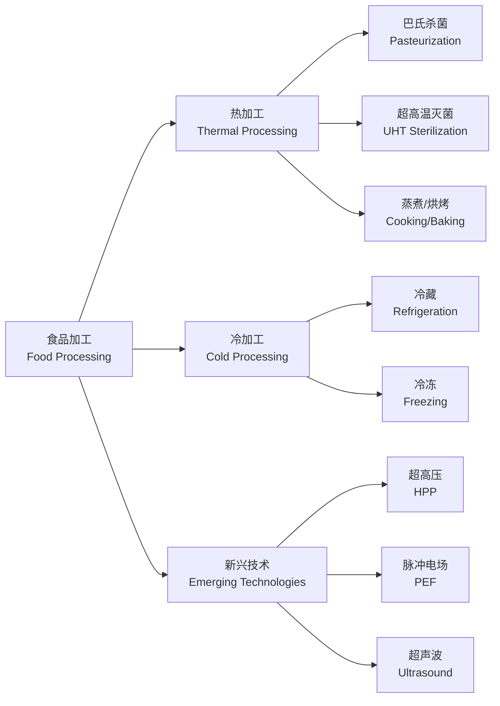

---
aliases: [FoodProcessing, 食品加工, 食品工艺学]
tags: ['TextileAndFoodEngineering', 'FoodScience', 'FoodProcessing', 'FoodTechnology']
created: 2026-05-17
updated: 2026-05-17
---

# 食品加工 (Food Processing)

## 概述

食品加工（Food Processing）是将原料（Raw Material）通过物理、化学或生物方法转化为食品或食品原料的技术过程。其核心目标包括延长保质期（Shelf Life）、改善感官品质（Sensory Quality）、提高营养价值（Nutritional Value）和确保食品安全（Food Safety）。

## 加工方法分类

## 核心概念表

| 概念 | 英文 | 定义 | 公式 |
|------|------|------|------|
| D 值 | Decimal Reduction Time | 微生物减少90%所需时间 | $D = t/(\log N_0 - \log N_t)$ |
| Z 值 | Thermal Resistance Constant | D 值变化10倍的温度变化 | $Z = (T_2-T_1)/(\log D_1-\log D_2)$ |
| F 值 | Sterilization Value | 等效杀菌时间 | $F = \int 10^{(T-T_{ref})/Z} dt$ |
| 水分活度 | Water Activity | 自由水可用程度 | $a_w = p/p_0$ |
| 冻结点 | Freezing Point | 冰晶开始形成温度 | $T_f$ |
| 干燥速率 | Drying Rate | 水分去除速度 | $N = -(m_s/A)(dX/dt)$ |

## 热加工

### 杀菌动力学

食品热加工的理论基础是微生物热致死动力学（Thermal Death Kinetics），通常用一阶动力学模型描述：

$$\frac{dN}{dt} = -kN$$

其中 $N$ 为活菌数，$k$ 为致死速率常数。积分得：

$$\log \frac{N_t}{N_0} = -\frac{t}{D}$$

D 值（Decimal Reduction Time）定义为使微生物数量减少一个对数周期（90%）所需的时间。

### 主要杀菌方法

**巴氏杀菌（Pasteurization）**：采用温和热处理杀灭致病菌，适用于液态乳、啤酒和果汁等产品。典型条件为72°C/15秒（HTST 法）或63°C/30分钟（LTLT 法）。

**超高温瞬时灭菌（UHT Sterilization）**：在135~150°C 下处理2~4秒，实现商业无菌（Commercial Sterility）。产品可在常温下保存数月而不需冷藏。

**商业灭菌（Commercial Sterilization）**：用于罐头食品，在110~125°C 下处理，杀灭肉毒杆菌（Clostridium botulinum）孢子。

### 热加工对食品品质的影响

- 营养素损失：维生素 C 热降解符合一级动力学 $C = C_0 e^{-kt}$
- 美拉德反应（Maillard Reaction）：还原糖与氨基酸反应产生风味和褐变
- 蛋白质变性（Protein Denaturation）：$T_d$ 为变性温度
- 质构变化：淀粉糊化（Gelatinization）、细胞壁软化

### 热穿透与 F 值计算

$$F = \int_0^t 10^{(T(t)-T_{ref})/Z} dt$$

其中 $T_{ref}$ 通常取121.1°C（罐头杀菌参考温度），$Z$ 值取10°C（肉毒杆菌）。$F_0 \geq 3$ 分钟为最低商业无菌要求。

## 冷加工

### 冷藏

冷藏（Refrigeration）在0~10°C 下抑制微生物生长和酶活性。冷藏过程的传热符合牛顿冷却定律：

$$Q = hA(T_p - T_c)$$

其中 $h$ 为表面传热系数，$A$ 为换热面积。

### 冷冻

冷冻（Freezing）将产品温度降至冰点以下，使大部分自由水冻结。速冻（Quick Freezing）要求快速通过最大冰晶生成带（Maximum Ice Crystal Formation Zone, -1~-5°C）。

**Plank 冻结时间方程**：

$$t_f = \frac{\rho L_f}{\Delta T} \left(\frac{Pd}{h} + \frac{Rd^2}{k}\right)$$

其中 $\rho$ 为产品密度，$L_f$ 为冻结潜热，$d$ 为特征厚度，$h$ 为表面传热系数，$k$ 为导热系数，$P$ 和 $R$ 为形状系数。

### 冻融对品质的影响

反复冻融（Freeze-Thaw Cycles）会导致：
- 冰晶损伤细胞结构，解冻后汁液流失（Drip Loss）
- 蛋白质变性，质构劣化
- 脂肪氧化（Lipid Oxidation），产生异味

## 食品保藏方法对比表

| 方法 | 原理 | 温度范围（°C） | 保质期 | 营养保留 | 典型产品 |
|------|------|--------------|--------|---------|---------|
| 冷藏 | 低温抑菌 | 0–10 | 数天–数周 | 优 | 鲜奶、果蔬 |
| 冷冻 | 冻结抑菌 | ≤-18 | 数月–年 | 良 | 冻肉、速冻食品 |
| 巴氏杀菌 | 热力杀致病菌 | 72–90 | 数周 | 良 | 液态乳、啤酒 |
| UHT | 超高温灭菌 | 135–150 | 数月 | 良 | 常温奶 |
| 罐头 | 商业灭菌 | 110–125 | 1–5年 | 中 | 肉罐头、水果罐头 |
| 干燥 | 降低水分活度 | 40–100 | 数月–年 | 中 | 奶粉、脱水蔬菜 |
| 超高压 | 压力杀菌 | 常温 | 数周 | 优 | 果汁、即食肉品 |

## 新兴加工技术

### 超高压处理（High Pressure Processing, HPP）

在100~600MPa 压力下处理，能够杀灭微生物而保持食品的原有风味和营养。HPP 对共价键影响小，因此维生素和风味物质得以保留：

$$\Delta V = -RT \left(\frac{\partial \ln k}{\partial P}\right)_T$$

### 脉冲电场（Pulsed Electric Field, PEF）

施加高强度脉冲电场（10~50kV/cm）破坏细胞膜，实现非热杀菌。适用于液态食品的连续处理。

### 超声波加工

利用超声波（Ultrasound, 20~100kHz）的空化效应（Cavitation Effect）辅助提取、乳化和杀菌。

## 单元操作

### 粉碎与均质

粉碎（Grinding）和均质（Homogenization）通过机械力减小颗粒尺寸。高压均质机在20~50MPa 下使液滴破碎，提高乳状液稳定性。

### 浓缩与干燥

**真空浓缩（Vacuum Concentration）**：在减压条件下蒸发水分，降低沸点以减少热损伤。

**喷雾干燥（Spray Drying）**：将料液雾化后与热空气接触，瞬间干燥成粉末。水分蒸发量计算：

$$\dot{m}_w = \dot{m}_f \left(1 - \frac{x_f}{x_p}\right)$$

其中 $x_f$ 和 $x_p$ 分别为进料和产品的固形物含量。

**冷冻干燥（Freeze Drying / Lyophilization）**：先将物料冻结，然后在真空下使冰直接升华。产品质量最高但成本也最高。

**干燥速率方程**：

$$N = -\frac{m_s}{A}\frac{dX}{dt}$$

其中 $X$ 为干基含水率，$m_s$ 为绝干物料质量，$A$ 为蒸发面积。

### 膜分离技术

- 微滤（Microfiltration, MF）：0.1~10μm，除菌
- 超滤（Ultrafiltration, UF）：1~100nm，分离蛋白质
- 纳滤（Nanofiltration, NF）：去除小分子
- 反渗透（Reverse Osmosis, RO）：浓缩

## 典型产品加工流程

### 乳制品加工

液态乳加工：原料乳验收 → 净乳 → 标准化 → 均质 → 杀菌 → 灌装 → 冷藏

酸奶发酵：原料乳 → 均质 → 杀菌 → 冷却 → 接种发酵剂 → 发酵(42°C, 4~6h) → 冷却 → 冷藏后熟

### 肉制品加工

灌肠类加工：原料肉 → 腌制 → 斩拌 → 灌制 → 蒸煮 → 冷却 → 包装

腌腊制品：原料肉 → 腌制(盐+亚硝酸盐) → 风干/烟熏 → 成熟

### 饮料加工

碳酸饮料：水处理 → 糖浆调配 → 碳化(充 CO₂) → 灌装 → 压盖

果汁饮料：原料 → 榨汁 → 澄清 → 调配 → 脱气 → 杀菌 → 灌装

## 食品质量与安全控制

### HACCP 体系

危害分析与关键控制点（Hazard Analysis and Critical Control Points, HACCP）是国际通行的食品安全管理体系，包含七个原则：

1. **危害分析**：识别原料、加工、储存全流程中的生物、化学和物理危害
2. **确定关键控制点**（Critical Control Points, CCP）：能够控制危害的工序步骤
3. **设定关键限值**：每个 CCP 的可接受范围，如温度≥72°C、时间≥15s
4. **建立监控程序**：对 CCP 进行连续或定期监测
5. **建立纠偏措施**：当监控显示偏离关键限值时采取的行动
6. **建立验证程序**：确认 HACCP 体系有效运行
7. **建立记录保持系统**：所有 HACCP 文件和记录的保存

### 食品质量管理工具

**统计过程控制（Statistical Process Control, SPC）** 在食品工业中的应用：

$$ \text{控制上限 UCL} = \bar{x} + 3\sigma, \quad \text{控制下限 LCL} = \bar{x} - 3\sigma $$

- 控制图（Control Chart）：监控关键质量指标，如灌装量、pH 值、水分活度
- 抽样检验（Acceptance Sampling）：按 AQL（Acceptable Quality Level）标准进行批次验收

### 食品标签与法规

食品标签（Food Labeling）应符合国家强制性标准，包括：产品名称、配料表（Ingredient List）、净含量、生产日期、保质期、储存条件、营养成分表（Nutrition Facts Table）。

营养成分表中的能量计算：

$$ E = 4 \times P + 4 \times C + 9 \times F $$

其中 $P$ 为蛋白质(g)，$C$ 为碳水化合物(g)，$F$ 为脂肪(g)，能量单位为 kcal。

## 经典教材

1. 夏文水. *食品工艺学*. 中国轻工业出版社.
2. 赵晋府. *食品工艺学*. 中国轻工业出版社, 2版.
3. Fellows, P. J. *Food Processing Technology: Principles and Practice*. Woodhead, 4th ed.
4. Singh, R. P. & Heldman, D. R. *Introduction to Food Engineering*. Academic Press, 5th ed.

## 主要应用领域

- 乳品加工（Dairy Processing）
- 肉禽加工（Meat & Poultry Processing）
- 果蔬加工（Fruit & Vegetable Processing）
- 粮油加工（Grain & Oil Processing）
- 饮料生产（Beverage Production）
- 烘焙食品（Bakery Products）
- 水产品加工（Seafood Processing）

## 相关条目

- [[08_AgriculturalSciences/FoodScience/INDEX|FoodScience]]
- [[04_EngineeringAndTechnology/ChemicalAndPharmaceuticalEngineering/ChemicalEngineering/INDEX|ChemicalEngineering]]
- [[04_EngineeringAndTechnology/TextileAndFoodEngineering/Biotechnology/Biotechnology|Biotechnology]]
- [[04_EngineeringAndTechnology/ControlAndSystemsEngineering/ControlTheory/ProcessControl|ProcessControl]]

