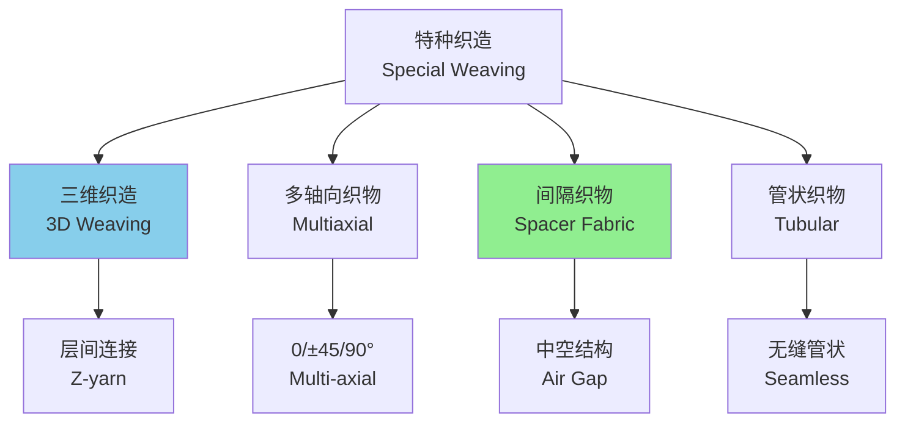
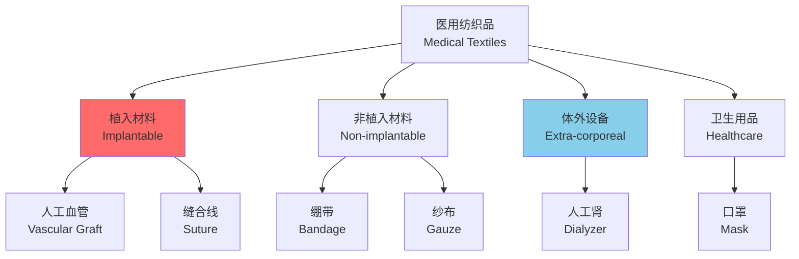

---
aliases:
  - Fabric Technology
  - Textile Engineering
  - Weaving
  - Knitting
  - Smart Textiles
tags:
  - engineering
  - textile
  - materials
  - manufacturing
  - smart-materials
  - technical-textiles
---

# 织物技术 (Fabric Technology)

## 概述 (Overview)

织物技术（Fabric Technology）是研究纤维、纱线、织物结构及其加工方法的工程学科。现代织物技术已从传统的服装应用扩展到航空航天、医疗健康、建筑工程、环境保护等高技术领域，形成了功能纺织品（Functional Textiles）和产业用纺织品（Technical Textiles）等新兴方向。

## 纺织原料 (Textile Raw Materials)

### 纤维分类 (Fiber Classification)

| 类别 | 来源 | 代表纤维 | 特性 |
|------|------|----------|------|
| 天然纤维 | 植物 | 棉、麻 | 吸湿透气 |
| 天然纤维 | 动物 | 羊毛、蚕丝 | 保暖亲肤 |
| 天然纤维 | 矿物 | 石棉 | 耐高温（已禁用） |
| 化学纤维 | 再生 | 黏胶、天丝 | 仿天然 |
| 化学纤维 | 合成 | 涤纶、尼龙 | 强度高 |
| 高性能纤维 | 合成 | 芳纶、碳纤维 | 高强高模 |

### 纤维性能指标 (Fiber Properties)

线密度：

$$Tt = \frac{m}{L} \quad [\text{tex}]$$

断裂强度：

$$\sigma = \frac{F_{max}}{A} \quad [\text{N/tex或cN/dtex}]$$

典型高性能纤维性能：

| 纤维 | 强度 (GPa) | 模量 (GPa) | 断裂伸长 (%) | 密度 (g/cm³) |
|------|------------|------------|--------------|--------------|
| 芳纶1414 | 2.8 | 62 | 3.6 | 1.44 |
| 碳纤维T700 | 4.9 | 230 | 2.1 | 1.80 |
| 高强PE | 3.0 | 100 | 3.5 | 0.97 |
| 玻璃纤维E | 3.5 | 72 | 4.8 | 2.58 |
| PBO | 5.8 | 280 | 2.5 | 1.56 |

## 织造技术 (Weaving Technology)

### 机织物结构 (Woven Fabric Structure)

机织物由经纱（Warp）和纬纱（Weft）交织而成。基本组织包括：

| 组织 | 交织规律 | 特点 | 应用 |
|------|----------|------|------|
| 平纹（Plain） | 一上一下 | 紧密、平整 | 衬衫、里布 |
| 斜纹（Twill） | 二上一下 | 柔软、光泽 | 牛仔、工装 |
| 缎纹（Satin） | 浮长线 | 光滑、华丽 | 礼服、装饰 |

织物紧度：

$$E = E_1 + E_2 - \frac{E_1 \cdot E_2}{100}$$

经纬向紧度：

$$E_1 = d_1 \cdot P_1, \quad E_2 = d_2 \cdot P_2$$

$d$ 为纱线直径，$P$ 为纱线密度（根/10cm）。

### 织造力学 (Weaving Mechanics)

打纬力：

$$F_{beat} = m_s \cdot \frac{d^2s}{dt^2} + F_{friction} + F_{tension}$$

$m_s$ 为筘座质量，$s$ 为位移。

开口运动学：

$$y = \pm \frac{1}{2} h \left(1 - \cos\frac{\pi \theta}{\alpha}\right)$$

$h$ 为梭口高度，$\alpha$ 为开口角，$\theta$ 为曲轴转角。

### 特种织造 (Special Weaving)

## 针织技术 (Knitting Technology)

### 纬编 (Weft Knitting)

纬编由一根或几根纱线沿横向形成线圈纵行。

线圈结构参数：

| 参数 | 符号 | 影响 |
|------|------|------|
| 圈距 | $A$ | 横向密度 |
| 圈高 | $B$ | 纵向密度 |
| 线圈长度 | $l$ | 单位面积重量 |
| 纱线直径 | $d$ | 覆盖系数 |

线圈长度计算：

$$l = 2A + 5B + \pi d$$

### 经编 (Warp Knitting)

经编由平行排列的经纱同时形成线圈。

经编组织：

- **单梳栉**：链式、经平
- **双梳栉**：双经平、经绒
- **多梳栉**：花型复杂

衬纬经编：

在经编地组织中衬入不形成线圈的纬向纱线，增强尺寸稳定性。

## 非织造技术 (Nonwoven Technology)

### 成网方法 (Web Formation)

| 方法 | 原理 | 特点 | 产量 |
|------|------|------|------|
| 干法成网 | 机械/气流 | 纤维长度不限 | 中等 |
| 湿法成网 | 类似造纸 | 短纤维 | 高 |
| 纺丝成网 | 熔喷纺丝 | 连续长丝 | 很高 |
| 熔喷法 | 高速热气流 | 超细纤维 | 高 |

### 加固方法 (Bonding Methods)

机械加固：

$$n = \frac{N}{A}$$

针刺密度 $n$（刺/cm²），$N$ 为针刺次数，$A$ 为面积。

热粘合：

粘合条件：

$$T_{bonding} > T_m (\text{低熔点组分})$$

化学粘合：

粘合剂固含量：

$$C = \frac{m_{binder}}{m_{total}} \times 100\%$$

典型范围：10-30%。

## 织物整理 (Fabric Finishing)

### 功能性整理 (Functional Finishing)

| 功能 | 方法 | 化学品/技术 | 效果 |
|------|------|-------------|------|
| 防水 | 涂层、氟碳 | C6/C8氟化物 | 耐水压 >10000mm |
| 透湿 | 微孔膜 | PTFE、ePTFE | 透湿量 >10000g/m²·24h |
| 阻燃 | 后整理 | 磷系、氮系 | LOI >28% |
| 抗菌 | 浸渍 | 银离子、壳聚糖 | 抑菌率 >99% |
| 抗紫外 | 吸收/反射 | TiO₂、ZnO | UPF >50 |

### 涂层与层压 (Coating and Lamination)

涂层厚度：

$$h = \frac{m}{\rho \cdot A}$$

典型涂层量：10-100 g/m²。

层压结构：

## 智能纺织品 (Smart Textiles)

### 传感织物 (Sensing Textiles)

电阻式应变传感器：

$$\frac{\Delta R}{R_0} = GF \cdot \varepsilon$$

$GF$ 为应变系数（Gauge Factor），导电纱线的 $GF$ 可达 2-50。

电容式压力传感器：

$$C = \frac{\varepsilon_0 \varepsilon_r A}{d}$$

压力引起介电层厚度 $d$ 变化，从而改变电容。

### 相变调温 (Phase Change Materials)

相变材料（PCM）微胶囊化后嵌入纤维：

$$Q = m \cdot \Delta H_f$$

$\Delta H_f$ 为相变潜热，石蜡类 PCM 的 $\Delta H_f \approx 150-250$ J/g。

调温范围：

| PCM类型 | 相变温度 (°C) | 应用 |
|---------|---------------|------|
| 正十八烷 | 28 | 服装 |
| 正二十烷 | 37 | 医疗 |
| 正二十二烷 | 44 | 建筑 |

### 形状记忆纺织品 (Shape Memory Textiles)

形状记忆聚合物（SMP）纤维：

$$\varepsilon_{recovery} = f(T, \sigma, t)$$

回复条件：$T > T_{trans}$（转变温度）。

形状记忆合金（SMA）在纺织品中的应用：

- 温控开口服装
- 医用压迫绷带
- 可展开空间结构

## 产业用纺织品 (Technical Textiles)

### 土工合成材料 (Geotextiles)

功能与要求：

| 功能 | 性能指标 | 测试方法 |
|------|----------|----------|
| 隔离 | 等效孔径 O95 | 干筛法 |
| 过滤 | 透水率 | 垂直渗透 |
| 排水 | 平面导水率 | 水平渗透 |
| 加筋 | 拉伸强度 | 宽条拉伸 |
| 防渗 | 渗透系数 | 耐水压 |

### 复合材料增强 (Composite Reinforcement)

纤维体积分数：

$$V_f = \frac{n \cdot Tt}{\rho_f \cdot t \times 10^4}$$

$n$ 为层数，$t$ 为单层厚度（mm）。

典型复合材料性能：

| 增强体 | 基体 | 强度 (MPa) | 模量 (GPa) |
|--------|------|------------|------------|
| 玻璃纤维 | 环氧 | 500-600 | 25-30 |
| 碳纤维 | 环氧 | 1200-1800 | 120-180 |
| 芳纶 | 环氧 | 800-1200 | 60-80 |

### 医用纺织品 (Medical Textiles)

## 纺织品测试 (Textile Testing)

### 力学性能 (Mechanical Properties)

拉伸性能（ASTM D5035）：

$$F_{max}, \quad \varepsilon_{break}, \quad E_{initial}$$

撕裂强度（Elmendorf法）：

$$T_{tear} = \frac{E_{pendulum}}{2 \cdot t}$$

顶破强度（Ball Burst）：

$$P_{burst} = \frac{F_{max}}{A_{ball}}$$

### 舒适性测试 (Comfort Testing)

透气率：

$$Q_v = \frac{\Delta V}{A \cdot \Delta t} \quad [\text{mm/s或cm³/cm²·s}]$$

透湿率（蒸发法）：

$$WVP = \frac{\Delta m \cdot d}{A \cdot \Delta t \cdot \Delta p} \quad [\text{g·m/m²·day·Pa}]$$

热阻（保温性）：

$$R_{ct} = \frac{A(T_{skin} - T_{ambient})}{H - H_{dry}} \quad [\text{m²·K/W}]$$

## 参考文献 (References)

1. Horrocks, A. R., & Anand, S. C. (Eds.). (2016). *Handbook of Technical Textiles* (2nd ed.). Woodhead Publishing.
2. Gong, R. H., & Wright, R. M. (2019). *Fancy Yarns: Their Manufacture and Application*. Woodhead Publishing.
3. Adanur, S. (2020). *Wellington Sears Handbook of Industrial Textiles*. Technomic Publishing.
4. Tao, X. (Ed.). (2019). *Handbook of Smart Textiles*. Springer.

---

**相关概念**: [[Materials Science|材料科学]] | [[Composite Materials|复合材料]] | [[Nanomaterials|纳米材料]] | [[Manufacturing Engineering|制造工程]]
