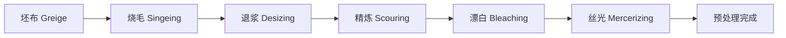

# 纺织化学

## 一、概述
纺织化学（Textile Chemistry）是研究纺织品在染整加工全过程中涉及的化学反应、工艺原理和化学助剂应用的学科。它涵盖从预处理（Pretreatment）到染色（Dyeing）、印花（Printing）、整理（Finishing）的全流程化学加工。

## 二、纺织纤维化学基础
### 2.1 纤维化学组成
不同纤维的化学结构决定了它们的染色性能和加工方法：

| 纤维类型 | 化学组成 | 主要官能团 | 结晶度 |
|---------|---------|-----------|-------|
| 棉（Cotton）| 纤维素（C$_6$H$_{10}$O$_5$)$_n$ | -OH（羟基） | ~70% |
| 羊毛（Wool）| 角蛋白（Keratin） | -COOH, -NH$_2$, -S-S- | ~30% |
| 丝绸（Silk）| 丝素蛋白（Fibroin） | -COOH, -NH$_2$ | ~50% |
| 涤纶（PET）| 聚对苯二甲酸乙二酯 | -COO-（酯基） | ~60% |
| 锦纶（Nylon 6/66）| 聚酰胺 | -CONH-（酰胺基） | ~50% |
| 腈纶（Acrylic）| 聚丙烯腈 | -CN（氰基） | ~40% |
| 粘胶（Viscose）| 再生纤维素 | -OH | ~35% |

### 2.2 纤维化学反应
纤维素纤维的化学反应以羟基为中心：
- **酯化**：$\text{Cell-OH} + \text{R-COOH} \rightarrow \text{Cell-O-CO-R} + \text{H}_2\text{O}$
- **醚化**：$\text{Cell-OH} + \text{NaOH} + \text{ClCH}_2\text{COONa} \rightarrow \text{Cell-O-CH}_2\text{COONa} + \text{NaCl} + \text{H}_2\text{O}$
- **氧化**：$3\text{Cell-OH} + 2\text{NaClO} \rightarrow \text{氧化纤维素} + \text{产物}$

## 三、预处理（Pretreatment）
### 3.1 预处理目的
去除纤维上的天然杂质和人为施加的浆料，改善织物的润湿性和白度，为后续染色印花做准备。



### 3.2 退浆（Desizing）
经纱在织造前需要上浆（Sizing），织造后需要退除。

| 退浆方法 | 原理 | 化学品 | 浆料去除率 |
|---------|------|--------|-----------|
| 酶退浆 | 淀粉酶水解淀粉浆 | $\alpha$-淀粉酶 | > 95% |
| 氧化退浆 | 氧化剂降解 PVA 浆 | H$_2$O$_2$, 过硫酸盐 | > 90% |
| 热水退浆 | 热水溶胀洗脱 | 热水 | 70-80% |

### 3.3 精炼（Scouring）
去除棉纤维上的蜡质、果胶、蛋白质和灰分等天然杂质。
碱性精炼：在 NaOH 溶液中煮练（95-100°C，pH 11-13）：

$$
\text{果胶} + \text{NaOH} \rightarrow \text{果胶酸钠} + \text{H}_2\text{O}
$$

$$
\text{蜡质} + \text{表面活性剂} \rightarrow \text{乳化去除}
$$

### 3.4 漂白（Bleaching）
去除天然色素，提高织物白度，同时不损伤纤维。

| 漂白剂 | 有效成分 | 最佳 pH | 温度 | 适用纤维 |
|--------|---------|--------|------|---------|
| 过氧化氢 | H$_2$O$_2$ | 10.5-11 | 95-100°C | 棉、化纤 |
| 次氯酸钠 | NaClO | 9-11 | 室温-40°C | 棉 |
| 亚氯酸钠 | NaClO$_2$ | 3.5-4 | 80-90°C | 涤棉混纺 |

H$_2$O$_2$ 漂白机理：

$$
\text{H}_2\text{O}_2 + \text{OH}^- \rightarrow \text{HOO}^- + \text{H}_2\text{O}
$$

过氧离子 HOO$^-$ 与色素分子中的共轭双键反应破坏发色团。

### 3.5 丝光（Mercerizing）
用浓 NaOH（18-25%）在张力下处理棉织物，使纤维素纤维发生不可逆溶胀，改善：
- **光泽**：纤维截面由扁椭圆变为圆形，反射光增强
- **强度**：增加约 20%
- **吸附性**：染料吸收率增加约 30-50%
- **尺寸稳定性**：缩水率降低

## 四、染色（Dyeing）
### 4.1 染料分类
**按化学结构分类**：偶氮染料、蒽醌染料、靛族染料、酞菁染料、三芳甲烷染料等。
**按应用分类**：

| 染料类别 | 适用纤维 | 结合方式 | 耐洗牢度 | 耐光牢度 |
|---------|---------|---------|---------|---------|
| 活性染料 | 棉、麻、粘胶 | 共价键（与 -OH 反应）| 优良 | 良好 |
| 还原染料 | 棉 | 物理吸附 + 氧化显色 | 优良 | 优良 |
| 直接染料 | 棉、粘胶 | 氢键 + 范德华力 | 差-中 | 中 |
| 分散染料 | 涤纶、锦纶 | 固溶体扩散 | 良好 | 优良 |
| 酸性染料 | 羊毛、丝绸、锦纶 | 离子键（与 -NH$_2$ 结合）| 中 | 中-好 |
| 阳离子染料 | 腈纶 | 离子键 | 优良 | 良好 |
| 硫化染料 | 棉 | 还原氧化显色 | 优良 | 中 |

### 4.2 染色热力学与动力学
**上染率（Exhaustion）**：$E = \frac{C_0 - C_t}{C_0} \times 100\%$
**吸附等温线**：
- Nernst 型：线性分配（分散染料-涤纶）
- Freundlich 型：幂函数（直接染料-纤维素）
- Langmuir 型：饱和吸附（酸性染料-羊毛）
**染色速率**：

$$
-\frac{dC}{dt} = k (C_\infty - C)^n
$$

**扩散系数**（Fick 第二定律）：

$$
\frac{\partial C}{\partial t} = D \frac{\partial^2 C}{\partial x^2}
$$

Arrhenius 关系：

$$
D = D_0 \exp\left(-\frac{E_d}{RT}\right)
$$

### 4.3 染色工艺
**浸染（Exhaust Dyeing）**：绳状或平幅浸渍，染料逐步上染。
**轧染（Pad Dyeing / Continuous）**：织物浸轧染液 → 烘干 → 固色 → 水洗。
**高温高压染色**（涤纶分散染料）：温度 130°C，压力 2-3 bar。
**冷轧堆染色**（活性染料）：室温浸轧 → 打卷堆置 12-24 h → 水洗。

### 4.4 染色助剂

| 助剂 | 作用 |
|------|------|
| 匀染剂（Leveling Agent）| 减缓上染速率，防止色花 |
| 缓染剂（Retarder）| 降低初期上染速度 |
| 固色剂（Fixing Agent）| 提高处理后的色牢度 |
| 分散剂（Dispersant）| 防止染料聚集 |
| 渗透剂（Penetrant）| 降低纤维表面张力 |
| 螯合剂（Chelating Agent）| 络合水中的 Ca$^{2+}$、Mg$^{2+}$ |
| pH 调节剂 | 控制染液酸碱度 |
| 载体（Carrier）| 促进分散染料对涤纶的扩散 |

## 五、印花（Printing）
### 5.1 印花方法

| 印花方法 | 原理 | 精度 | 适用 |
|---------|------|------|------|
| 圆网印花（Rotary Screen）| 旋转圆网刮浆 | 中 | 大批量 |
| 平网印花（Flat Screen）| 平板筛网刮浆 | 高 | 小批量 |
| 转移印花（Transfer Printing）| 热升华转印 | 极高 | 涤纶面料 |
| 数码印花（Digital Printing）| 喷墨打印 | 极高 | 个性化 |
| 拔染印花（Discharge Printing）| 破坏底色显色 | 中 | 深地浅花 |

### 5.2 印花色浆
原糊（Thickener / Binder）的功能：赋予浆料适当的粘度和流变性，防止渗化。
常用原糊：海藻酸钠（活性染料用）、CMC 羧甲基纤维素、淀粉、合成增稠剂。

## 六、整理（Finishing）
### 6.1 机械整理

| 工序 | 目的 | 设备 |
|------|------|------|
| 拉幅（Stentering）| 定宽、去皱 | 拉幅机 |
| 预缩（Sanforizing / Compaction）| 防缩（缩水率 < 1%）| 预缩机 |
| 轧光（Calendering）| 增加光泽和手感 | 轧光机 |
| 起毛（Raising）| 表面起绒 | 起毛机 |
| 剪毛（Shearing）| 剪平表面绒毛 | 剪毛机 |

### 6.2 化学整理
**防皱整理（Anti-Wrinkle / DP Finish）**：
甲醛系防皱：N-羟甲基酰胺类（DMDHEU / 2D 树脂）与纤维素交联：

$$
\text{Cell-OH} + \text{HOCH}_2\text{-R-CH}_2\text{OH} + \text{OH-Cell} \rightarrow \text{Cell-O-CH}_2\text{-R-CH}_2\text{-O-Cell} + \text{H}_2\text{O}
$$

Low-Formaldehyde / Non-Formaldehyde 替代方案：多元羧酸（BTCA、柠檬酸）。
**防水整理（Water Repellent）**：
- 石蜡-铝盐乳液（低档）
- 有机硅（Silicone）
- 氟碳树脂（Fluorocarbon, C6/C8 PFC）
**阻燃整理（Flame Retardant）**：
- 磷系（Pyrovatex CP）：纤维素交联阻燃
- 卤系（溴化物）：气相阻燃（已逐步受限）
- 无机物（ATH, Mg(OH)$_2$）：吸热分解
**抗菌整理（Antimicrobial）**：
- 银离子（Ag$^+$）：破坏细菌膜
- 季铵盐（QAC）：阳离子杀菌
- 三氯生（Triclosan）：酶抑制剂
- 壳聚糖（Chitosan）：天然抗菌
**抗紫外线整理（UV Protection）**：
UPF（Ultraviolet Protection Factor）：

$$
UPF = \frac{\sum_{\lambda=280}^{400} E_\lambda S_\lambda \Delta\lambda}{\sum_{\lambda=280}^{400} E_\lambda S_\lambda T_\lambda \Delta\lambda}
$$

## 七、染整废水处理
染整废水成分复杂，含残留染料、助剂、重金属等。常用处理工艺：

```
废水 → 格栅 → 调节池 → 混凝沉淀 → 生化处理（A/O, SBR）→ 深度处理（臭氧/膜）→ 回用或排放
```

特征污染物：色度、COD（500-2000 mg/L）、BOD、重金属（Cr、Cu）、苯胺类有机物。

## 八、染整设备
### 8.1 预处理设备

| 工序 | 主要设备 | 形式 |
|------|---------|------|
| 烧毛 | 烧毛机（气体/铜板/圆筒）| 平幅 |
| 退浆 | 退浆机（浸渍/汽蒸）| 平幅/绳状 |
| 精炼 | 煮练锅（高压）、精炼机（常压）| 绳状/平幅 |
| 漂白 | 履带式漂白机 / 乳蒸机 | 平幅 |
| 丝光 | 丝光机（布铁/直辊）| 平幅带张力 |

### 8.2 染色设备

| 设备类型 | 适用 | 浴比 | 特点 |
|---------|------|------|------|
| 溢流染色机 | 针织物 | 1:8-1:15 | 绳状、低张力 |
| 气流染色机 | 敏感织物 | 1:3-1:6 | 低浴比、节能 |
| 卷染机 | 平幅织物 | 1:2-1:4 | 单/双头卷染 |
| 冷轧堆 | 活性染料 | 1:0.3-0.5 | 室温堆置固色 |
| 热溶染色机 | 涤棉混纺 | - | 分散/活性一浴法 |

### 8.3 节能减排
染整行业是纺织工业中能耗和水耗最大的环节（~60% 总能耗，~80% 总用水量）。
- 低浴比染色：气流染色机浴比可降至 1:3-1:5（传统溢流 1:10-1:15）
- 冷轧堆染色：室温固色、节水 50%、节能 60%
- 废水余热回收：热交换器回收 80°C 废水热量
- 数字喷墨印花：无废水排放，适合小批量定制
- 天然染料：靛蓝、茜草、苏木等植物染料替代部分合成染料

## 九、纺织化学品管理

| 法规/标准 | 内容 | 主要限制物质 |
|---------|------|-------------|
| REACH（EU）| 化学品注册、评估、授权 | SVHC 候选清单 |
| OEKO-TEX Standard 100 | 纺织品有害物质检测 | 禁用偶氮染料、甲醛、重金属 |
| bluesign | 全产业链化学品管理 | 限制物质清单（RSL）|
| ZDHC（Zero Discharge of Hazardous Chemicals）| 有害化学品零排放 | MRSL（制造受限物质清单）|
| GB 18401 国家纺织品基本安全技术规范 | 中国强制标准 | 甲醛、pH、禁用染料、异味 |

禁用偶氮染料：22 种致癌芳香胺（如联苯胺、3,3'-二甲氧基联苯胺等）在欧盟和中国均被严格限制。

## 十、功能性整理技术
### 10.1 功能整理分类

| 功能 | 整理剂/方法 | 作用原理 | 测试标准 |
|------|-----------|---------|---------|
| 抗菌 | 银离子、季铵盐 | 破坏细菌膜 | AATCC 100, ISO 20743 |
| 防紫外线 | UV 吸收剂（苯并三唑类）| 吸收 UV-A/B | AS/NZS 4399 |
| 阻燃 | 磷系（Pyrovatex CP）| 促进成炭 | ISO 15025 |
| 防水 | 氟碳树脂（C6/C8）| 低表面能 | AATCC 22（喷淋法）|
| 抗静电 | 聚噻吩 PEDOT:PSS | 导电通路 | AATCC 76 |
| 防蚊 | 拟除虫菊酯 | 昆虫神经系统抑制 | JIS L 1920 |
| 除臭 | 环糊精、金属氧化物 | 吸附/分解异味 | ISO 17299 |
| 相变调温 | 微胶囊化石蜡（PCM）| 潜热储放 | 差示扫描量热 DSC |

### 10.2 纳米功能整理
- TiO$_2$ 纳米颗粒光催化自清洁
- SiO$_2$ 气凝胶超隔绝涂层
- Ag 纳米颗粒抗菌整理
- 碳纳米管导电整理

## 十一、染整工业 4.0
- **智能染色车间**：自动化染料称量、管道输送、中央控制
- **在线质量检测**：机器视觉检测色差、布面疵点
- **染色配方管理**：计算机配色（Color Matching）数据库
- **ERP/MES 系统**：全程追踪、智能排产
- **能源管理**：蒸汽、电力、水耗实时监控优化

## 相关条目
- [[04_EngineeringAndTechnology/TextileAndFoodEngineering/TextileScience/INDEX|当前目录索引]]
- [[FabricTechnology]]
- [[YarnTechnology]]
