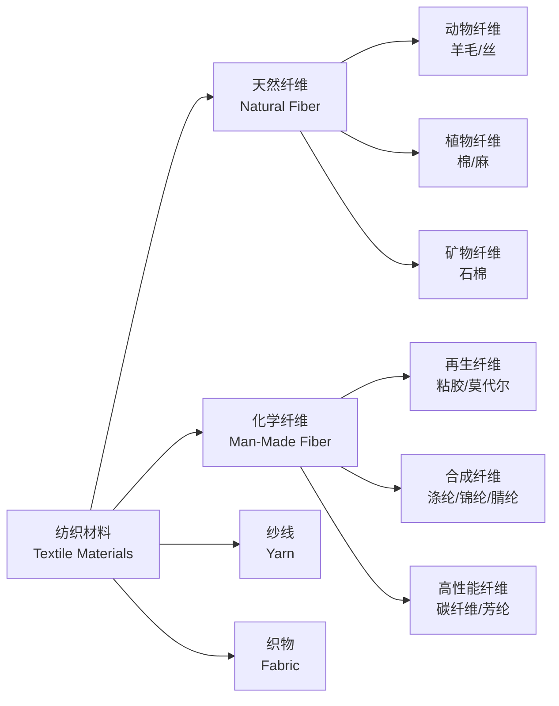

---
aliases: [TextileMaterials, 纺织材料]
tags: ['TextileEngineering', 'TextileScience', 'MaterialsScience', 'FiberTechnology']
created: 2026-05-17
updated: 2026-05-17
---

# 纺织材料

## 概述

纺织材料（Textile Materials）是用于纺织加工的纤维（Fiber）及其制品的统称。
涵盖天然纤维（Natural Fiber）、化学纤维（Man-Made Fiber）、纱线（Yarn）、织物（Fabric）及非织造布（Nonwoven）。
纺织材料学是研究纤维结构、性能、加工工艺及其相互关系的一门工程技术学科。
纺织材料的性能决定了最终产品的质量、功能与应用领域。
从传统服装面料到高技术产业用纺织品，纺织材料已渗透到航空航天、医疗健康、环境保护等众多领域。
功能性纤维和智能纺织品（Smart Textiles）的发展为行业注入了新的活力。

## 纺织材料分类体系

## 关键概念对比

| 分类维度 | 天然纤维 | 化学纤维 | 混纺纱 |
|---------|---------|---------|-------|
| 来源 | 自然界直接获取 | 化学合成或再生 | 两种以上纤维混合 |
| 代表品种 | 棉、麻、毛、丝 | 涤纶、锦纶、腈纶、氨纶 | 涤棉混纺、毛涤混纺 |
| 吸湿性 | 普遍较好 | 合成纤维差，再生纤维好 | 介于两者之间 |
| 强度范围 | 较低至中等 | 中等到极高 | 可设计优化 |
| 价格波动 | 受自然因素影响大 | 相对稳定 | 中档为主 |
| 环保性 | 可生物降解 | 大部分不可降解 | 取决于成分 |

## 天然纤维详解

### 植物纤维

**棉纤维（Cotton）**：主要成分为纤维素（Cellulose），含量超过90%。
截面呈腰圆形，中腔明显。细绒棉长度25~35mm，长绒棉可达65mm。
标准回潮率8.5%。湿态强度比干态高约10~20%。

**麻纤维（Bast Fiber）**：包括亚麻（Flax）和苎麻（Ramie）。
强度高、模量大，导热性好，穿着凉爽透气。弹性差易起皱。

### 动物纤维

**羊毛（Wool）**：蛋白质纤维，表面有鳞片结构，赋予缩绒性（Felting）。
卷曲度高，弹性回复率可达99%。保暖性好。按细度分为细羊毛（<25μm）、半细毛（25~35μm）和粗毛（>35μm）。
山羊绒（Cashmere）更细更柔软。马海毛（Mohair）光泽好。

**桑蚕丝（Mulberry Silk）**：由蚕丝蛋白（Fibroin）和丝胶（Sericin）组成。
丝素截面呈三角形，赋予光泽和手感。强度约3~4cN/dtex，伸长率15~25%，回潮率11%。

### 纤维形态结构

纤维微观结构对性能有决定性影响。棉纤维有天然转曲（Convolution）利于纺纱。
羊毛鳞片结构导致定向摩擦效应（DFE）。化学纤维截面形状可通过喷丝孔设计调控。

### 鉴别方法

燃烧法、显微镜法、化学溶解法、红外光谱法、热分析法（DSC / TGA）。

## 化学纤维详解

### 再生纤维

**粘胶纤维（Viscose Rayon）**：吸湿性优于棉（回潮率13%），但湿强度差。
**莫代尔（Modal）**：高湿模量，湿强度显著提高。
**莱赛尔（Lyocell）**：NMMO 溶剂纺丝，溶剂回收率>99%。
**天竹纤维（Bamboo Fiber）**：天然抗菌。**醋酸纤维（Acetate）**：半合成，真丝般光泽。

### 合成纤维

**涤纶（Polyester, PET）**：产量最大，强度高、抗皱，回潮率仅0.4%。
**锦纶（Polyamide, PA）**：耐磨性最好，有 PA6和 PA66两种。
**腈纶（Acrylic, PAN）**：蓬松柔软，仿毛效果好。
**氨纶（Spandex, PU）**：弹性最好，断裂伸长率400~800%。
**丙纶（Polypropylene, PP）**：密度最小0.91g/cm³，可浮于水。
**维纶（PVA）**：吸湿性在合纤中最好。**氯纶（PVC）**：难燃。

### 高性能纤维

**碳纤维（Carbon Fiber）**：含碳量90%+，拉伸强度3~7GPa，模量200~900GPa。
PAN 基和沥青基两种前驱体。**芳纶（Aramid）**：Kevlar 防弹，Nomex 耐热。
**UHMWPE**：比强度钢的15倍。**PBO 纤维**：强度超过碳纤维。

### 常见纤维性能对比

| 纤维 | 密度（g/cm³） | 断裂强度（cN/dtex） | 断裂伸长率（%） | 回潮率（%） |
|------|:------------:|:------------------:|:---------------:|:----------:|
| 棉 | 1.54 | 2–4 | 6–10 | 8.5 |
| 羊毛 | 1.32 | 1–2 | 25–40 | 16 |
| 蚕丝 | 1.33 | 3–4 | 15–25 | 11 |
| 涤纶 | 1.38 | 4–6 | 15–30 | 0.4 |
| 锦纶6 | 1.14 | 4–6 | 25–40 | 4.5 |
| 腈纶 | 1.17 | 2–4 | 20–30 | 1.5 |
| 碳纤维 | 1.78 | 15–20 | 1–2 | 0 |

## 纱线及其性能指标

### 纱线分类

**短纤维纱（Spun Yarn）**：纤维加捻而成，表面有毛羽。
**长丝（Filament Yarn）**：连续纤维束，表面光滑。
**混纺纱（Blended Yarn）**：混合两种以上纤维取长补短。
按加工方法分环锭纱、自由端纱、变形纱等。

### 细度指标

线密度以特克斯（tex）表示：1000米纱线的克数。英制支数 $N_e$ 定义：

$$N_e = \frac{\text{长度(码)}}{840 \times \text{重量(磅)}}$$

公制支数 $N_m$：一克纱线的米数。三者可相互转换：

$$tex \times N_m = 1000 \qquad tex \times N_e = 590.5$$

### 加捻指标

捻系数 $\alpha = T \times \sqrt{tex}$，其中 $T$ 为捻度（捻/10cm）。
捻向分 Z 捻和 S 捻。强捻纱产生绉效应。

### 力学性能

断裂强度：$\sigma_b = \frac{F_b}{T_t}$（cN/tex）。断裂长度（Breaking Length）：

$$L_R = \frac{\sigma_b \times 1000}{g} \text{ (km)}$$

棉纤维断裂长度约25~30km，涤纶约35~45km。

## 织物组织结构

### 机织物

**三原组织（Fundamental Weaves）**：
平纹（Plain Weave）交织最频繁，结构最紧密。
斜纹（Twill Weave）有连续斜向纹路，手感柔软。
缎纹（Satin Weave）浮长线长，表面光滑有光泽。五枚缎、八枚缎常见。

### 针织物

**纬编（Weft Knitting）**：平针（Jersey）、罗纹（Rib）、双反面（Purl）。
**经编（Warp Knitting）**：编链（Chain）、经平（Tricot）、经缎（Satin）。
延伸性好、透气佳，尺寸稳定性不如机织物。

### 非织造布

机械、化学或热粘合固结纤维网。工艺包括水刺（Spunlace）、热轧（Thermal Bonding）、熔喷（Meltblown）、纺粘（Spunbond）、针刺（Needle Punching）。
广泛应用于医用防护、过滤材料、卫生用品。

## 性能测试

**力学性能**：拉伸强度（GB/T 3923）、撕破强度（舌形法/梯形法）、顶破强度。
**舒适性能**：透气性（mm/s）、透湿性、保暖性（克罗值 Clo，1 Clo = 0.155 m²·K/W）。
**吸湿回潮**：

$$R = \frac{W - W_0}{W_0} \times 100\%$$

## 经典教材

- 姚穆《纺织材料学》
- 于伟东《纺织材料学》
- 王府梅《纺织材料结构性能与测试》
- Morton & Hearle《Physical Properties of Textile Fibres》

### 织物几何结构参数

织物密度（经密×纬密）、组织循环数和覆盖系数（Cover Factor）是机织物的三大参数。
Peirce 几何模型描述了纱线在织物中的截面形态和弯曲状态。
织物厚度和面密度直接影响保暖性、手感和悬垂性。

## 纺织材料的发展趋势

智能纺织品（Smart Textiles）将传感、响应和自适应功能集成到织物中。
相变材料（PCM）用于温度调节服装。导电纤维用于可穿戴电子设备。
纳米技术赋予纺织品防水、抗菌、自清洁等性能。
可持续纺织材料——再生纤维、生物基纤维、可降解材料——是行业绿色转型的方向。

## 主要应用领域

- 服装面料（梭织/针织/牛仔）
- 家纺产品（床上用品、窗帘、地毯）
- 产业用纺织品（土工布、过滤材料、汽车内饰）
- 医用纺织品（手术服、绷带、人造血管）
- 防护服（阻燃、防化、防弹）

## 相关条目

- [[TextileChemistry]]
- [[GarmentManufacturing]]
- [[NonwovenTechnology]]
- [[FiberReinforcedComposites]]
- [[FabricStructure]]

