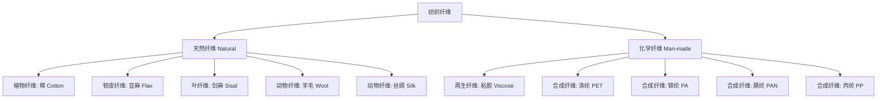

# 纱线技术
## 一、概述
纱线技术（Yarn Technology / Spinning Technology）是将纺织纤维加工成连续线状纱线（Yarn）的工艺科学。纱线是由一束纤维经过加捻（Twisting）结合而成的连续体，是织造（Weaving）和针织（Knitting）的基础原材料。

## 二、纺纱原料
### 2.1 纤维分类

### 2.2 纤维长度与细度
纤维长度是选择纺纱方法的关键参数：

| 纤维类型 | 平均长度 | 纺纱方法 |
|---------|---------|---------|
| 棉（长绒棉） | 33-40 mm | 精梳纱 |
| 棉（细绒棉） | 25-31 mm | 普梳纱 |
| 羊毛 | 60-150 mm | 毛纺系统 |
| 亚麻 | 20-100 mm | 麻纺系统 |
| 化学纤维短纤 | 32-114 mm（可裁剪） | 棉纺/毛纺系统 |

纤维细度用线密度表示：Tex（g/1000m）、Denier（g/9000m）、英制支数 $Ne$（840 yard/lb）。
纤维细度与纺纱支数的关系：- 纤维越细，可纺支数越高；- 纤维越细，纱线均匀度越好。

## 三、传统环锭纺纱（Ring Spinning）
### 3.1 纺纱工艺流程

### 3.2 开清棉（Blowroom）
目的：开松（Opening）、除杂（Cleaning）、混合（Blending）、均匀喂给。
主要设备：自动抓包机 → 混棉机 → 开棉机 → 清棉机 → 成卷机或化纤喂棉箱。

### 3.3 梳棉（Carding）
梳棉是将纤维束分离为单根纤维状态并初步平行排列的工序。
梳棉机的核心：锡林（Cylinder）和盖板（Flat）之间的针布（Card Clothing）对纤维进行分解。
梳棉质量指标：- 棉结（Neps）：< 80 粒/g；- 短绒率（Short Fiber Content）；- 生条条干 CV%。

### 3.4 精梳（Combing）
精梳工序去除短纤维和杂质，提高纤维平均长度和整齐度——用于高档纱线。
精梳落棉率（Noil Percentage）：10-25%，落棉中包含大量短纤维（< 16 mm）。

### 3.5 并条（Drawing）
多根条子合并牵伸，改善均匀度，使纤维进一步平行伸直。
牵伸（Draft）：$D = \frac{T_{\text{喂入}}}{T_{\text{输出}}}$。并合（Doubling）：$n$ 根条子并合 → 条干 CV% 改善因子 $\sqrt{n}$。

### 3.6 粗纱（Roving）
对熟条施加较小的捻度（假捻/搓捻），形成粗纱（Roving），为细纱做准备。
捻系数（Twist Factor）：$\alpha_e = T \cdot \sqrt{Ne}$（英制）。

### 3.7 细纱（Ring Spinning）
环锭细纱机是应用最广泛（但市场份额下降中）的纺纱方法。
**牵伸系统**：三罗拉双皮圈牵伸，牵伸倍数 10-60 倍。
**加捻原理**：锭子旋转 → 钢丝圈沿钢领运行 → 纱线获得捻度。
加捻角与纱线结构的关系：

$$
\beta = \arctan(\pi d T)
$$

其中 $d$ 为纱线直径，$T$ 为捻度（捻/m）。
**纺纱三角区（Spinning Triangle）**：前罗拉钳口到加捻点的区域，是断头的主要区域。
**环锭纺断头率**：通常 10-100 根/千锭·小时。
捻度计算公式（英制）：

$$
T = \alpha \cdot \sqrt{Ne} \quad (\text{捻/英寸})
$$

其中 $\alpha$ 为捻系数，取决于纱线用途（经纱捻系数高，纬纱低）。

## 四、新型纺纱技术
### 4.1 技术对比

| 纺纱方法 | 速度 (m/min) | 纱线结构 | 条干 | 毛羽 | 强度 | 适用范围 |
|---------|-------------|---------|------|------|------|---------|
| 环锭纺（Ring）| 15-25 | 真捻，纤维转移好 | 好 | 多 | 高 | 所有范围 |
| 紧密纺（Compact）| 15-25 | 纤维高度平行 | 极好 | 极少 | 极高 | 高档面料 |
| 气流纺（Rotor）| 100-200 | 真捻，内外层差异 | 中 | 少 | 中高 | 中低支纱 |
| 涡流纺（Vortex）| 200-500 | 包缠结构 | 好 | 极少 | 中 | 化纤/混纺 |
| 摩擦纺（DREF）| 100-300 | 包缠结构 | 中 | 多 | 中 | 粗支/产业用 |
| 赛络纺（Sirospun）| 15-25 | 双股合捻 | 好 | 少 | 高 | 毛纺/轻薄面料 |

### 4.2 紧密纺（Compact Spinning）
在环锭纺基础上增加凝聚区（负压吸风 + 多孔皮圈），使纤维在加捻前得到充分凝聚，消除纺纱三角区。
优点：毛羽减少 60-80%，强度提高 10-15%，条干改善。

### 4.3 气流纺（Rotor Spinning / Open-End）
纤维流由高速气流输送到纺杯（Rotor），在杯内凝聚成环，由引纱钩引出加捻。
纺杯转速：30,000-150,000 rpm。最佳支数范围：Ne 6-40。

### 4.4 涡流纺（Vortex Spinning / Murata）
利用高速旋转气流（涡流）使纤维束外层纤维包缠到芯纤维上。
速度可达 500 m/min（相当于环锭纺的 20-30 倍）。毛羽极少（适合针织用纱），但纱线强度略低于环锭纺。

## 五、纱线结构与性能
### 5.1 纱线结构参数

| 参数 | 定义 | 单位 | 测试方法 |
|------|------|------|---------|
| 线密度（Yarn Count）| 单位长度质量 | Tex, Ne, Nm | 称重法 |
| 捻度（Twist）| 单位长度捻回数 | T/m, TPI | 退捻加捻法 |
| 捻系数（Twist Factor）| $\alpha = T \cdot \sqrt{Ne}$ | - | 计算 |
| 强度（Strength）| 断裂负荷 | cN/tex | 单纱/缕纱强力 |
| 断裂伸长（Elongation）| 断裂时相对伸长 | % | 强力仪 |
| 条干均匀度（Evenness）| 线密度变异系数 | CV% | 乌斯特条干仪 |
| 毛羽（Hairiness）| 伸出纱体的纤维端 | H 值 | 毛羽仪 |
| 棉结（Neps）| 纤维扭结粒 | 粒/g | AFIS / 黑板 |

### 5.2 纱线强度理论
纱线的断裂机理：在拉伸过程中，纤维逐根断裂或滑脱。
纱线强度与纤维强度的关系：

$$
\text{纱线强度} < \sum \text{纤维强度} \quad (\text{效率因子} \approx 0.5-0.8)
$$

影响纱线强度的因素：纤维长度和细度、捻系数、纤维取向度、纤维混合均匀度。

### 5.3 捻度-强度关系
捻度增加 → 纱线强度先增加后下降（存在最佳捻度）：

最佳捻系数 $\alpha_{\text{opt}}$：

$$
\alpha_{\text{opt}} \propto \frac{1}{\sqrt{\text{纤维摩擦系数} \times \text{纤维长度}}}
$$

## 六、新型纱线产品

| 纱线类型 | 结构 | 特点 | 应用 |
|---------|------|------|------|
| 包芯纱（Core-Spun）| 芯丝（氨纶/长丝）+ 外包短纤 | 弹性 + 外观 | 牛仔布、弹力面料 |
| 竹节纱（Slub Yarn）| 粗细节交替 | 自然仿麻效果 | 休闲面料 |
| 花式纱（Fancy Yarn）| 芯纱+饰纱+固纱 | 丰富多彩 | 装饰/毛衣 |
| 赛络菲尔纱（Sirofil）| 短纤维 + 长丝 | 轻薄高强 | 西装面料 |
| 色纺纱（Melange Yarn）| 染色纤维混纺 | 麻灰色调 | 针织/机织 |
| 双组分纱（Bicomponent）| T400 / 弹性复合 | 自身弹性 | 工装/运动装 |

## 七、纱线质量控制与检测
乌斯特公报（Uster Statistics）是全球纺纱质量评价的标准数据库，涵盖 CV%、棉结、细节、粗节等指标。

| 等级 | 百分位 | 水平 |
|------|--------|------|
| 5% | 世界先进 | 顶级 |
| 25% | 优良 | 竞争力强 |
| 50% | 平均 | 一般水平 |
| 75% | 较差 | 需改进 |
| 95% | 差 | 重大缺陷 |

## 八、纱线染色
### 8.1 染色形式

| 形式 | 适用 | 设备 | 特点 |
|------|------|------|------|
| 筒子纱染色 | 针织/梭织用纱 | 高温高压染色机 | 透染性好、效率高 |
| 绞纱染色 | 毛纱/高档色纱 | 绞纱染色机 | 手感柔软 |
| 经轴染色 | 经编织物 | 经轴染色机 | 整经-染色一步 |
| 色纺 | 原液着色/混纺 | - | 色牢度最好 |

### 8.2 色纱应用
色纺纱（Melange Yarn）：将染色纤维与原色纤维按比例混纺，形成麻灰色调，广泛用于针织 T 恤和内衣。

## 九、纱线市场与贸易
### 9.1 全球主要纱线生产国

| 国家/地区 | 主要产品 | 年产量占比 |
|-----------|---------|-----------|
| 中国 | 棉纱、化纤纱 | ~50% |
| 印度 | 棉纱 | ~25% |
| 巴基斯坦 | 棉纱 | ~8% |
| 越南 | 棉纱、化纤 | ~5% |
| 美国 | 棉纱（气流纺） | ~3% |

### 9.2 纱线价格影响因素
- 原料价格（棉花、涤纶短纤）
- 汇率波动
- 环保政策（限制落后产能）
- 下游需求（服装消费景气度）
- 贸易壁垒（反倾销、配额）

## 十、纱线质量指标与测试标准
### 10.1 主要测试标准

| 测试项目 | 国际标准 | 中国标准 | 主要仪器 |
|---------|---------|---------|---------|
| 条干均匀度 | ISO 16549 | GB/T 3292 | 乌斯特条干仪 Uster Tester |
| 纱线强力 | ISO 2062 | GB/T 3916 | 单纱强力仪 |
| 捻度 | ISO 17202 | GB/T 2543 | 退捻加捻捻度仪 |
| 毛羽 | ISO 92 | FZ/T 01086 | 毛羽测试仪 |
| 棉结杂质 | ISO 98 | GB/T 398 | AFIS PRO |
| 纱疵分级 | ISO 16548 | GB/T 17660 | 纱疵分级仪（Uster Classimat）|

### 10.2 乌斯特统计
乌斯特公报（Uster Statistics）每 3-5 年发布一次全球纺纱统计水平，涵盖棉、化纤、混纺各类纱线。指标包括：
- CV%：条干变异系数，反映纱线均匀度
- Thin places (-50%)：细节数量/km
- Thick places (+50%)：粗节数量/km
- Neps (+200%)：棉结数量/km

## 十一、纱线新产品开发
### 11.1 差异化纱线

| 新品类型 | 技术路线 | 市场定位 |
|---------|---------|---------|
| 超高支棉纱 | 长绒棉 + 精梳 + 紧密纺（Ne 200+）| 高档衬衫 |
| 吸湿排汗纱 | 异形截面涤纶（Coolmax 技术）| 运动服装 |
| 抗菌纱 | 银纤维/铜离子混纺 | 内衣、毛巾 |
| 阻燃纱 | 芳纶/阻燃粘胶混纺 | 防护服装 |
| 导电纱 | 不锈钢/碳纤维复合 | 防静电工装 |
| 变色纱 | 光致/热致变色纤维 | 时尚服装 |

### 11.2 智能纱线
集成传感功能的纱线：导电纱编织可穿戴应变/温度传感器，用于智能服装和医疗监测。
压阻效应：

$$
\frac{\Delta R}{R_0} = k \cdot \varepsilon
$$

其中 $k$ 为应变因子，导电纱线通常为 10-100。

## 相关条目
- [[04_EngineeringAndTechnology/TextileAndFoodEngineering/TextileScience/INDEX|当前目录索引]]
- [[FabricTechnology]]
- [[TextileChemistry]]
