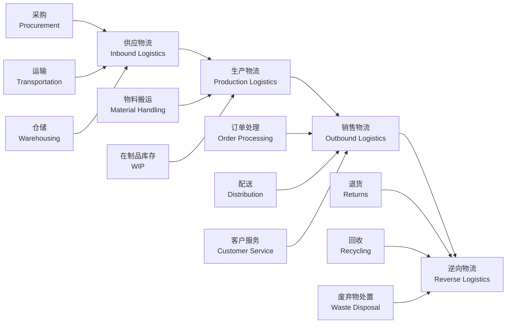
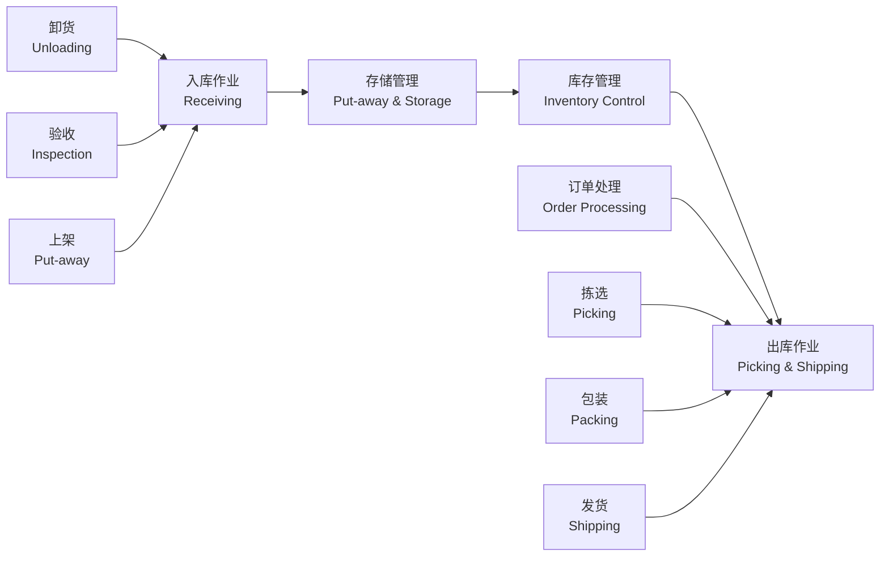

---
aliases: [LogisticsManagement]
tags: ['TransportationEngineering', 'Logistics', 'LogisticsManagement']
created: 2026-05-17
updated: 2026-05-17
---

# 物流管理 (Logistics Management)

## 概述

物流管理 (Logistics Management) 是对物流活动进行计划、组织、指挥、协调、控制和监督的管理过程，其核心目标是使各项物流活动实现最佳协调与配合，以最低的物流成本达到用户满意的服务水平。物流管理是供应链管理 (Supply Chain Management) 的重要组成部分，涵盖运输、仓储、库存、配送、包装、装卸搬运和信息处理等基本功能。

现代物流管理强调系统优化和一体化运作，追求"7R"原则：在正确的时间 (Right Time)、正确的地点 (Right Place)、以正确的条件 (Right Condition)、将正确的产品 (Right Product)、以正确的成本 (Right Cost)、交给正确的客户 (Right Customer)、实现正确的数量 (Right Quantity)。

## 物流系统构成

## 运输管理 (Transportation Management)

### 运输方式选择

| 运输方式 | 英文 | 优势 | 劣势 | 适用场景 |
|---------|------|------|------|---------|
| 公路运输 | Road Transport | 灵活性强、门到门 | 运量小、能耗高 | 中短距离、小批量 |
| 铁路运输 | Rail Transport | 运量大、成本低 | 灵活性差、速度慢 | 大宗货物、长距离 |
| 水路运输 | Water Transport | 成本最低、运量最大 | 速度慢、受自然条件限制 | 国际运输、大宗散货 |
| 航空运输 | Air Transport | 速度最快 | 成本最高、运量小 | 高价值、紧急货物 |
| 管道运输 | Pipeline Transport | 连续性好、损耗低 | 初始投资大、品种单一 | 油气、浆体 |
| 多式联运 | Intermodal Transport | 综合优势 | 协调复杂 | 国际物流、长距离 |

### 运输成本分析

运输总成本模型：

$$C_{total} = C_f + C_v \times d + C_h \times t$$

其中：
- $C_f$ 为固定成本（车辆折旧、保险、人员工资）
- $C_v$ 为单位距离变动成本（燃油、轮胎磨损）
- $d$ 为运输距离
- $C_h$ 为单位时间货物持有成本
- $t$ 为运输时间

### 运输路线优化

**车辆路径问题 (Vehicle Routing Problem, VRP)** 是运输优化的核心数学模型：

$$\min Z = \sum_{i=0}^{n}\sum_{j=0}^{n} c_{ij}x_{ij}$$

约束条件：
- 每辆车从配送中心出发并返回
- 每个客户被恰好访问一次
- 车辆载重限制：$\sum_{i \in R_k} q_i \leq Q_k$

常用求解算法：节约算法 (Clarke-Wright)、扫描算法 (Sweep)、遗传算法、禁忌搜索。

## 仓储管理 (Warehousing Management)

### 仓库类型

| 分类维度 | 类型 | 特点 |
|---------|------|------|
| 所有权 | 自有仓库 / 公共仓库 / 合同仓库 | 控制权与成本权衡 |
| 功能 | 存储型 / 流通型 / 保税仓库 | 侧重保管或周转 |
| 温度 | 常温库 / 冷藏库 / 冷冻库 | 满足不同货物温湿度要求 |
| 自动化程度 | 传统仓库 / 自动化立体库 (AS/RS) | 存储密度与效率差异 |

### 仓库作业流程

### 货位管理

- **固定货位 (Fixed Location)**：每种货物分配固定位置，便于管理
- **随机货位 (Random Location)**：有空位即存，提高空间利用率
- **分类固定货位 (Class-based Location)**：按货物类别分区，区内随机存放

### 库存控制 (Inventory Control)

**ABC 分类法**：

| 类别 | 占比 (品种) | 占比 (价值) | 管理策略 |
|------|------------|------------|---------|
| A 类 | 10~20% | 70~80% | 精细管理、高频盘点 |
| B 类 | 20~30% | 15~20% | 常规管理 |
| C 类 | 50~70% | 5~10% | 简化管理、批量订货 |

**订货策略**：
- **定量订货法 (Q, R)**：当库存降至再订货点 R 时，订购固定批量 Q
- **定期订货法 (T, S)**：每隔周期 T 检查库存，订购至目标库存 S
- **JIT (Just-In-Time)**：准时制生产/供货，追求零库存

**经济订货批量 (EOQ)**：

$$Q^* = \sqrt{\frac{2DS}{H}}$$

其中 $D$ 为年需求量，$S$ 为每次订货成本，$H$ 为单位年持有成本。

## 配送管理 (Distribution Management)

### 配送模式

| 模式 | 英文 | 特点 | 适用 |
|------|------|------|------|
| 直接配送 | Direct Delivery | 工厂直送客户 | 大客户、B2B |
| 中转配送 | Hub-and-Spoke | 通过配送中心分拨 | 多品种、多客户 |
| 共同配送 | Joint Distribution | 多家企业共享配送资源 | 城市配送、末端 |
| 即时配送 | On-demand Delivery | 响应时间短，1~2 小时达 | 外卖、生鲜 |
| 众包配送 | Crowdsourcing | 利用社会运力 | 快递末端、高峰时段 |

### 配送中心规划

配送中心选址需综合考虑：
- 运输成本：$TC = \sum_{i} w_i d_i$
- 服务半径：城市配送中心通常服务半径 50~100 km
- 土地成本与劳动力可得性
- 交通可达性与基础设施条件

## 物流信息系统 (Logistics Information System)

### 核心信息系统

| 系统 | 英文 | 功能 |
|------|------|------|
| 仓库管理系统 | WMS | 入库、存储、拣选、出库、盘点 |
| 运输管理系统 | TMS | 运力调度、路线优化、在途跟踪 |
| 订单管理系统 | OMS | 订单接收、处理、分配、跟踪 |
| 企业资源计划 | ERP | 财务、采购、生产、销售一体化 |
| 供应链计划 | SCP | 需求预测、库存计划、补货计划 |

### 物流技术

- **条码技术 (Barcode)**：一维码/二维码，成本低、应用广
- **射频识别 (RFID)**：非接触式识别，批量读取，适用于托盘级管理
- **GPS/北斗定位**：车辆实时定位与轨迹追踪
- **物流机器人 (AGV/AMR)**：自动导引车、自主移动机器人，用于仓储搬运与拣选
- **无人配送**：无人机、无人车末端配送

## 物流成本管理 (Logistics Cost Management)

### 物流成本构成

| 成本项目 | 英文 | 占比 (参考) |
|---------|------|------------|
| 运输成本 | Transportation Cost | 50~60% |
| 仓储成本 | Warehousing Cost | 15~25% |
| 库存持有成本 | Inventory Carrying Cost | 10~15% |
| 包装成本 | Packaging Cost | 5~10% |
| 管理成本 | Administrative Cost | 5% |

### 总成本分析法

物流优化需考虑总成本 (Total Cost)，避免局部优化导致整体成本上升。例如：
- 降低运输成本可能增加库存成本
- 减少仓库数量可降低仓储成本，但增加运输距离和库存集中风险

## 现代物流发展趋势

### 电商物流 (E-commerce Logistics)

电商物流特点：
- 订单碎片化：小批量、多批次
- 时效要求高：当日达、次日达
- 逆向物流量大：退货率 15~30%

**仓配一体化**：前置仓模式，将库存前置至消费地附近，缩短配送距离。

### 冷链物流 (Cold Chain Logistics)

冷链物流是在全过程中保持规定低温环境的供应链系统。

| 温区 | 温度范围 | 适用产品 |
|------|---------|---------|
| 冷藏 | 0~10°C | 水果、蔬菜、药品 |
| 冷冻 | -18°C 以下 | 肉类、水产品、速冻食品 |
| 深冷 | -50°C 以下 | 疫苗、生物制品 |

### 绿色物流 (Green Logistics)

- **新能源车辆**：电动货车、氢燃料电池车
- **包装减量化**：可循环包装、降解材料
- **路径优化**：减少空驶率和碳排放
- **共同配送**：提高车辆装载率

### 智慧物流 (Smart Logistics)

- **大数据与 AI**：需求预测、动态定价、智能调度
- **物联网 (IoT)**：全链路可视化、智能温控
- **区块链**：供应链溯源、电子运单存证
- **数字孪生**：仓储与配送网络仿真优化

## 经典教材

- 何明珂《物流系统论》
- 鲍尔索克斯《供应链物流管理》
- Ballou《Business Logistics/Supply Chain Management》
- Bowersox《Supply Chain Logistics Management》
- 《物流管理国家标准》GB/T

## 相关条目

- [[SupplyChain]]
- [[04_EngineeringAndTechnology/TransportationEngineering/TransportationEngineering|TransportationEngineering]]
- [[Logistics]]
- [[InventoryManagement]]
- [[INDEX|TransportationEngineering 索引]]

