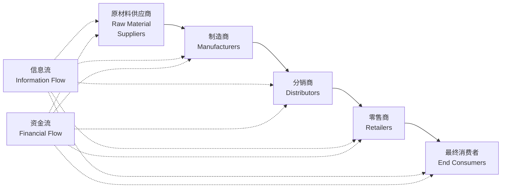

# 供应链管理 (Supply Chain Management)

## 概述

供应链管理 (Supply Chain Management, SCM) 是对从原材料供应 (Raw Material Supply) 到最终产品交付给消费者的整个过程进行计划、组织、协调和控制的管理活动。其目标是在满足客户需求的前提下，实现整个供应链系统成本最小化、效率最大化和价值最优化。

供应链不仅包括物流 (Logistics)，还涵盖信息流 (Information Flow) 和资金流 (Financial Flow) 的协调管理。现代供应链管理强调跨企业协作、风险共担和利益共享，是企业核心竞争力的重要来源。

## 供应链结构与流程

### 供应链网络结构

### 供应链流程框架 (SCOR 模型)

| 流程 | 英文 | 内容 |
|------|------|------|
| 计划 | Plan | 需求/供应计划、库存计划、采购计划 |
| 采购 | Source | 供应商选择、采购执行、收货检验 |
| 生产 | Make | 制造、装配、测试、包装 |
| 交付 | Deliver | 订单管理、仓储、运输、配送 |
| 退货 | Return | 退货授权、接收、检验、处置 |
| 使能 | Enable | 绩效评估、风险管理、合规 |

## 供应链战略与设计 (Strategy & Design)

### 供应链战略类型

| 战略类型 | 英文 | 核心目标 | 适用产品 |
|---------|------|---------|---------|
| 效率型供应链 | Efficient Supply Chain | 成本最小化 | 功能型产品、需求稳定 |
| 响应型供应链 | Responsive Supply Chain | 快速响应市场变化 | 创新型产品、需求不确定 |
| 敏捷型供应链 | Agile Supply Chain | 兼具效率与响应 | 需求波动大的产品 |
| 精益型供应链 | Lean Supply Chain | 消除浪费 | 标准化大批量产品 |

### 供应链网络设计

**设施选址决策**：
- 工厂选址：靠近原材料产地或消费市场
- 配送中心选址：综合考虑运输成本、服务水平和库存成本
- 仓库数量与位置：权衡库存集中化与运输成本

## 需求预测与计划 (Demand Forecasting & Planning)

### 需求预测方法

| 方法类别 | 具体方法 | 适用场景 |
|---------|---------|---------|
| 定性方法 | 德尔菲法、市场调研、专家判断 | 新产品、缺乏历史数据 |
| 时间序列 | 移动平均、指数平滑、ARIMA | 需求稳定、有历史数据 |
| 因果模型 | 回归分析、计量经济模型 | 需求与外部因素相关 |
| 机器学习 | 神经网络、随机森林、XGBoost | 大数据、多变量复杂关系 |

**指数平滑法**：

$$F_{t+1} = \alpha D_t + (1-\alpha)F_t$$

其中 $F_{t+1}$ 为下期预测值，$D_t$ 为当期实际需求，$F_t$ 为当期预测值，$\alpha$ 为平滑系数 ($0 < \alpha < 1$)。

### 销售与运营计划 (S&OP)

S&OP 是平衡需求与供应的跨职能协调流程，通常每月运行一次，涵盖数据收集、需求计划、供应计划、供需平衡会议和高层审批五个步骤。

## 库存管理 (Inventory Management)

### 库存类型

| 库存类型 | 英文 | 说明 |
|---------|------|------|
| 周转库存 | Cycle Stock | 满足两次订货期间的正常需求 |
| 安全库存 | Safety Stock | 应对需求不确定和供应延迟 |
| 在途库存 | Pipeline Inventory | 运输途中或等待加工的库存 |
| 投机库存 | Speculative Stock | 预防价格上涨或供应中断 |
| 季节性库存 | Seasonal Inventory | 应对季节性需求波动 |

### 经典库存模型

**经济订货批量 (EOQ)**：

$$Q^* = \sqrt{\frac{2DS}{H}}$$

其中 $D$ 为年需求量，$S$ 为每次订货成本，$H$ 为单位年持有成本。

**再订货点 (Reorder Point, ROP)**：

$$ROP = d \times L + SS$$

其中 $d$ 为平均日需求，$L$ 为提前期，$SS$ 为安全库存。

**安全库存计算**：

$$SS = z \times \sigma_L = z \times \sqrt{L \times \sigma_d^2 + d^2 \times \sigma_L^2}$$

其中 $z$ 为服务水平对应的标准正态分位数，$\sigma_L$ 为提前期内需求标准差。

| 服务水平 | z 值 |
|---------|------|
| 90% | 1.28 |
| 95% | 1.65 |
| 99% | 2.33 |
| 99.9% | 3.09 |

### 库存管理策略

| 策略 | 英文 | 特点 | 适用 |
|------|------|------|------|
| 供应商管理库存 | VMI | 供应商负责库存补货决策 | 战略合作伙伴 |
| 联合管理库存 | JMI | 供需双方共同决策 | 紧密合作关系 |
| 协同规划预测补货 | CPFR | 端到端协同计划 | 零售与快消行业 |
| 准时制 | JIT | 零库存理念 | 丰田生产方式 |

## 采购与供应商管理 (Procurement & SRM)

### 采购策略

| 策略 | 英文 | 特点 | 适用物料 |
|------|------|------|---------|
| 战略采购 | Strategic Sourcing | 长期合作、共同开发 | 关键物料 |
| 竞争性采购 | Competitive Bidding | 招标比价 | 标准物料 |
| 电子商务采购 | E-Procurement | 在线平台、流程自动化 | 间接物料 |
| 全球采购 | Global Sourcing | 国际寻源、成本优化 | 大宗商品 |

### 供应商关系管理 (Supplier Relationship Management, SRM)

**供应商分类矩阵**：

|  | 低供应风险 | 高供应风险 |
|--|-----------|-----------|
| **高利润影响** | 杠杆型 Leverage | 战略型 Strategic |
| **低利润影响** | 常规型 Routine | 瓶颈型 Bottleneck |

**供应商评估指标**：
- 质量：合格率、退货率、PPM (百万件缺陷数)
- 交付：准时交付率 (OTD)、提前期
- 成本：价格竞争力、总拥有成本 (TCO)
- 服务：响应速度、技术支持、灵活性
- 可持续性：环境合规、社会责任

## 生产计划体系 (Production Planning)

### 计划层级

| 计划层级 | 英文 | 时间跨度 | 内容 |
|---------|------|---------|------|
| 综合生产计划 | Aggregate Planning | 6~18 个月 | 产能、劳动力、库存总量 |
| 主生产计划 | MPS | 数周~数月 | 最终产品生产数量与时间表 |
| 物料需求计划 | MRP | 周~月 | 零部件与原材料需求计算 |
| 车间作业计划 | Shop Floor Scheduling | 日~周 | 设备排程、工序安排 |

## 供应链协调与优化 (Coordination & Optimization)

### 牛鞭效应 (Bullwhip Effect)

牛鞭效应是指需求端的微小波动沿供应链向上游逐级放大的现象。

**产生原因**：
- 需求预测修正：各节点基于下游订单而非终端需求预测
- 订货批量：经济订货批量导致订单波动大于需求波动
- 价格波动：促销和折扣引发提前购买
- 短缺博弈：供不应求时的夸大订货

**缓解策略**：
- 信息共享 (Information Sharing)：POS 数据实时共享
- 供应商管理库存 (VMI)：由供应商直接管理下游库存
- 缩短提前期：减少订货提前期可降低安全库存需求
- 每日低价 (EDLP)：减少价格波动
- 协同规划预测补货 (CPFR)

### 供应链契约 (Supply Chain Contracts)

| 契约类型 | 英文 | 机制 | 效果 |
|---------|------|------|------|
| 回购契约 | Buy-back Contract | 供应商回购未售出产品 | 激励零售商增加订货 |
| 收益共享契约 | Revenue Sharing | 零售商与供应商分享销售收入 | 协调定价与库存 |
| 数量折扣契约 | Quantity Discount | 大批量采购价格优惠 | 降低订货频率 |
| 销售回扣契约 | Sales Rebate | 超过销售目标给予奖励 | 激励销售努力 |

## 供应链风险管理 (Risk Management)

### 风险类型

| 风险类别 | 典型风险 | 应对策略 |
|---------|---------|---------|
| 供应风险 | 供应商破产、自然灾害、地缘政治 | 多源采购、安全库存、备选供应商 |
| 需求风险 | 需求暴跌/激增、产品过时 | 柔性产能、延迟差异化 |
| 运营风险 | 设备故障、质量问题、劳工纠纷 | 质量管理体系、应急预案 |
| 物流风险 | 运输中断、港口拥堵、油价波动 | 多式联运、物流网络冗余 |
| 财务风险 | 汇率波动、客户信用风险 | 金融对冲、信用保险 |
| 合规风险 | 贸易壁垒、环保法规、制裁 | 合规审计、供应链透明化 |

### 供应链韧性 (Supply Chain Resilience)

供应链韧性是指供应链应对中断事件并快速恢复的能力：
- **冗余策略**：备用产能、安全库存、多源供应
- **柔性策略**：快速切换供应商、模块化设计、延迟制造
- **协同策略**：与关键供应商建立战略合作、信息共享

## 供应链绩效评价 (Performance Measurement)

### 关键绩效指标 (KPI)

| 维度 | 指标 | 英文 | 目标 |
|------|------|------|------|
| 可靠性 | 准时交付率 | OTD (On-Time Delivery) | >95% |
| 响应性 | 订单履行周期 | Order Fulfillment Cycle Time | 缩短 |
| 敏捷性 | 需求变化响应时间 | Response Time | 缩短 |
| 成本 | 供应链总成本 | Total Supply Chain Cost | 降低 |
| 资产效率 | 库存周转率 | Inventory Turnover | 提高 |
| 现金效率 | 现金周转周期 | Cash-to-Cash Cycle Time | 缩短 |

## 经典教材

- Chopra & Meindl《Supply Chain Management: Strategy, Planning, and Operation》
- Simchi-Levi《Designing and Managing the Supply Chain》
- 鲍尔索克斯《供应链物流管理》
- 马士华《供应链管理》
- 《供应链管理国家标准》GB/T

## 相关条目

- [[LogisticsManagement]]
- [[InventoryManagement]]
- [[OperationsResearch]]
- [[RiskManagement]]
- [[INDEX|TransportationEngineering 索引]]
