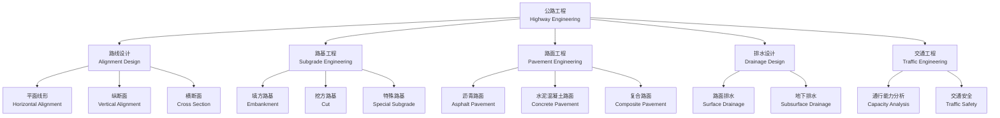

# 公路工程（Highway Engineering）

## 概述

公路工程（Highway Engineering）是交通运输工程的重要分支，研究公路的规划、设计、施工和养护全生命周期技术。公路不仅是车辆通行的载体，更是区域经济和交通网络的核心骨架。现代公路工程涉及路线几何设计（Geometric Design）、路基工程（Subgrade Engineering）、路面工程（Pavement Engineering）、桥涵工程、交通工程和养护管理等多学科领域。设计需在安全、经济、环保和舒适之间取得平衡——提高安全性的措施（如降低纵坡、增大半径）往往意味着更高的工程造价，因此需要在全寿命周期成本与服务水平之间进行优化决策。

## 公路工程知识体系

## 路线设计（Alignment Design）

### 平面线形（Horizontal Alignment）

公路平面线形由直线、圆曲线（Circular Curve）和缓和曲线（Transition Curve）三要素组成。直线的最大长度受驾驶疲劳和安全因素限制：
$$ L_{\text{max}} = 20v $$

其中 $v$ 为设计速度（km/h）。圆曲线最小半径由车辆在曲线上行驶时的横向稳定性控制：
$$ R_{\text{min}} = \frac{v^2}{127(f + e)} $$

其中 $f$ 为横向力系数，$e$ 为路面超高横坡。缓和曲线采用回旋线（Clothoid），其参数方程为：
$$ A^2 = R \cdot L $$

其中 $A$ 为回旋线参数，$R$ 为圆曲线半径，$L$ 为缓和曲线长度。回旋线的曲率从 0 线性过渡到 $1/R$，保证了离心力的渐变，提高行车舒适性。

### 停车视距（Stopping Sight Distance, SSD）

停车视距是驾驶员从发现障碍物到安全停车的必要距离：
$$ S_{\text{ST}} = \frac{v}{3.6} t + \frac{v^2}{254(\mu \pm i)} $$

其中 $t$ 为反应时间（取 2.5 s），$\mu$ 为路面与轮胎之间的附着系数，$i$ 为纵坡（上坡为正、下坡为负）。$v/(3.6) \cdot t$ 项为反应距离，$v^2/(254(\mu \pm i))$ 项为制动距离。

### 超高超宽设计

圆曲线段需设置超高（Superelevation）以平衡离心力：
$$ i_h = \frac{v^2}{127R} - f $$

其中 $i_h$ 为超高横坡，最大不超过 8%（冰雪地区不宜超过 6%）。

曲线段需对车道加宽以满足车辆转弯轨迹的偏移需求：
$$ e = \frac{L^2}{2R} $$

其中 $L$ 为车辆轴距加前悬长度，$R$ 为圆曲线半径。

### 各级公路设计标准

| 公路等级 | 设计速度 (km/h) | 车道数 | 车道宽 (m) | 极限最小半径 (m) | 最大纵坡 (%) |
|---------|---------------|-------|-----------|----------------|------------|
| 高速公路 | 120/100/80 | $\geq 4$ | 3.75 | 650/400/250 | 3/4/5 |
| 一级公路 | 100/80/60 | $\geq 4$ | 3.75 | 400/250/125 | 4/5/6 |
| 二级公路 | 80/60 | 2 | 3.5 | 250/125 | 5/6 |
| 三级公路 | 40/30 | 2 | 3.25 | 60/30 | 7/8 |
| 四级公路 | 30/20 | 2/1 | 3.25/3.0 | 30/15 | 8/9 |

### 纵断面与横断面设计

纵断面设计（Vertical Alignment）控制最大纵坡 $i_{\text{max}}$（与设计速度负相关）、最小坡长 $L_{\text{min}}$ 和竖曲线最小半径 $R_{\text{min}}$。竖曲线采用二次抛物线形式，其设计需满足视距要求（凸形竖曲线）和行车舒适（凹形竖曲线离心加速度 $\leq 0.5$ m/s²）。

横断面设计（Cross Section Design）确定车道宽度、路肩（Shoulder）宽度（高速公路右侧硬路肩 2.5–3.0 m）、中间带宽度（高速公路 2.0–4.5 m）和边坡坡度（填方 1:1.5–1:2.0，挖方 1:0.5–1:1.0）。

## 路基工程（Subgrade Engineering）

### 路基类型与压实

填方路基（Embankment）的压实度（Degree of Compaction）是控制工后沉降的关键：上路床（0–80 cm）压实度 $\geq 96\%$，下路床（80–150 cm）$\geq 94\%$，上路堤（150–500 cm）$\geq 93\%$。挖方路基（Cut）需评估边坡稳定性，采用极限平衡法计算安全系数 $F_s \geq 1.25$。

特殊路基包括软土路基（采用排水固结、水泥搅拌桩处理）、湿陷性黄土（采用强夯、换填处理）和膨胀土路基（采用换填、防水封闭处理）。

### 排水设计

排水系统分为路面排水（表面水由横坡和纵坡汇集至边沟排出）、地下排水（通过渗沟、盲沟降低地下水位）和结构排水（通过泄水孔减少挡土墙后的水压力）。无排水不公路——水损坏是沥青路面早期破坏的首要原因。

## 路面工程（Pavement Engineering）

### 沥青路面（Asphalt Pavement）

沥青路面是柔性路面（Flexible Pavement），其结构层从下至上为：土基→垫层→底基层→基层→面层（Surface Course）。设计采用弹性层状体系理论（Elastic Layered System Theory），计算层底拉应力和路表弯沉。

设计弯沉值控制方程：
$$ \frac{1000 \cdot p \cdot \delta}{l_d} \cdot k_1 k_2 k_3 \leq \frac{E_1}{E_0} $$

其中 $p$ 为轮压（通常 0.7 MPa），$\delta$ 为当量圆半径，$l_d$ 为设计弯沉，$k_1, k_2, k_3$ 分别为轴载换算系数、面层类型系数和基层类型系数。

### 水泥混凝土路面（Concrete Pavement）

水泥混凝土路面是刚性路面（Rigid Pavement），在接缝处设传力杆（Dowel Bar）和拉杆（Tie Bar）。设计采用弹性地基板理论（Westergaard 公式），控制指标为板底弯拉应力：

$$ \sigma_p = \frac{0.077 r^{0.6}}{h^2} P^{0.94} $$

其中 $r$ 为相对刚度半径，$h$ 为板厚（cm），$P$ 为轮载（kN）。相对刚度半径定义为：
$$ r = \sqrt[4]{\frac{E h^3}{12(1-\mu^2)k}} $$

其中 $E$ 为混凝土弹性模量，$\mu$ 为泊松比，$k$ 为地基反应模量。

### 路面对比

| 特性 | 沥青路面 | 水泥混凝土路面 |
|------|---------|---------------|
| 受力方式 | 弹性层状体系 | 弹性地基板 |
| 设计指标 | 弯沉、层底拉应力 | 弯拉应力 $\sigma_r \leq f_r$ |
| 接缝 | 无（连续铺筑） | 需设缩缝/胀缝/施工缝 |
| 行车舒适性 | 高（无接缝） | 较低（接缝跳车感） |
| 养护时间 | 冷却即可开放（数小时） | 需养护 7–14 天 |
| 使用寿命 | 10–15 年 | 20–30 年 |
| 典型厚度 | 10–20 cm | 20–30 cm |

## 交通工程与交通容量

交通工程（Traffic Engineering）研究公路交通流的运行特性
和管控方法。交通流三参数——流量（Volume）、密度（Density）
和速度（Speed）——之间存在基本关系：

$$ q = k \cdot v $$

其中 $q$ 为交通流量（veh/h），$k$ 为交通密度（veh/km），
$v$ 为平均速度（km/h）。威布尔分布常用于描述车头时距分布。
服务水平（Level of Service, LOS）将交通运行质量从 A 到 F
分为六级，A 级为自由流，F 级为拥堵状态。互通式立交的选型
包括苜蓿叶形、定向式、环形和组合式等多种类型，设计需综合
考虑交通流向、用地条件和工程造价。

### 基本通行能力

基本通行能力（Basic Capacity）是理想条件下单位时间内一条
车道可通过的最大车辆数：
$$ C_b = \frac{1000v}{d} $$

其中 $d$ 为车头间距（m），是车速 $v$ 的函数：
$$ d = l_0 + \frac{v}{3.6} t + \frac{v^2}{254(\mu + i)} $$

其中 $l_0$ 为车辆长度（取 5 m），$t$ 为驾驶员反应时间。

设计通行能力（Design Capacity）需考虑各项修正系数：
$$ C_d = C_b \cdot f_w \cdot f_{HV} \cdot f_p \cdot f_e $$

其中 $f_w$ 为车道宽度和侧向净空修正系数，$f_{HV}$ 为大型车混入修正系数，$f_p$ 为驾驶员特征修正系数，$f_e$ 为环境条件修正系数。

高速公路单车道设计通行能力一般为 1600–2200 pcu/h/in（客车当量单位/小时/车道）。

## 智能公路与未来发展

智能公路（Smart Highway）技术正将道路从被动载体转变为
主动感知和响应的基础设施。路面传感器实时监测交通流量和
路面状态。车路协同（V2I, Vehicle-to-Infrastructure）使
车辆与道路设施之间实现通信，支持自动驾驶和主动安全管理。
光伏路面（Solar Roadway）将太阳能电池板嵌入路面，将道路
转变为分布式能源生成系统。长寿命路面（Perpetual
Pavement）通过全厚度沥青设计实现无结构性大修的设计理念。
路面再生技术（Recycling）包括厂拌热再生、就地冷再生和
全深再生等多种方式，大幅降低养护工程的材料消耗和碳排放。

## 公路工程环境与安全

公路建设对环境的影响包括生态割裂、碳排放和噪声污染等。
绿色公路理念要求在规划阶段就融入生态廊道设计、低影响开发
（LID, Low Impact Development）和路面材料循环利用等策略。
海绵城市理念在公路排水设计中引入透水路面、生物滞留带和
雨水花园等设施。交通安全方面，路侧安全设计（Roadside
Safety）包括护栏设置、净区（Clear Zone）管理和解体消能
（Breakaway）设施。减速标线、振动带和环形交叉口等交通
静化（Traffic Calming）措施在降低事故率方面效果显著。
道路安全审计（Road Safety Audit）作为系统性安全评估方法
已在多个国家推广应用。公路隧道安全包括通风系统、消防
系统和应急逃生通道的协调设计。

## 主要参考文献

1. 徐家钰. 道路勘测设计. 人民交通出版社, 2015.
2. 邓学钧. 路基路面工程. 人民交通出版社, 2008.
3. 公路沥青路面设计规范 (JTG D50).
4. 公路水泥混凝土路面设计规范 (JTG D40).
5. TRB. Highway Capacity Manual. 2016.
6. Yoder, E. J. & Witczak, M. W. Principles of Pavement
    Design. Wiley, 1991.

## 公路养护管理

公路养护（Highway Maintenance）是公路工程全寿命周期中
持续时间最长的阶段。预防性养护策略包括裂缝密封、稀浆封层、
微表处和薄层罩面等。矫正性养护针对出现的结构性损坏进行
维修。路面管理系统（Pavement Management System, PMS）
通过路面性能评价指标——如路面状况指数（PCI）和国际平整度
指数（IRI）——科学规划养护时序和资金分配。桥梁管理系统
（BMS）对桥梁的技术状况进行评估分级。冬季养护包括除雪
作业和融雪剂使用控制。全寿命周期成本分析（LCCA）表明
在路面状况良好的早期实施预防性养护是最经济的养护策略。
养护信息化和自动化技术的应用显著提高了养护效率。

## 相关条目
