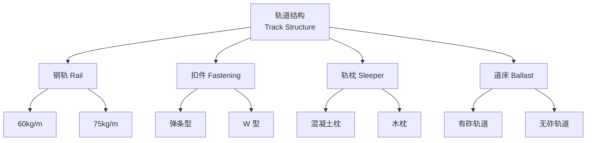
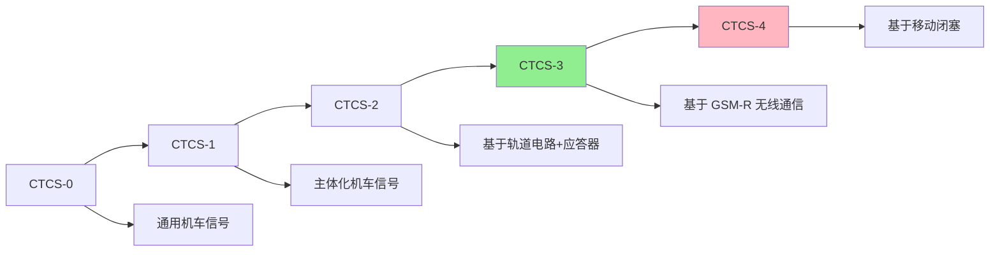

---
aliases: [RailwayEngineering, 铁道工程, Railway, TrackEngineering]
tags: ['TransportationEngineering', 'RoadAndRailway', 'RailwayEngineering', 'Track', 'HighSpeedRail']
created: 2026-05-17
updated: 2026-05-17
---

# 铁道工程 (Railway Engineering)

## 概述 (Overview)

铁道工程（Railway Engineering）是研究铁路线路、轨道、路基、桥梁隧道设计施工的工程技术学科。铁路作为大运量、高效率的陆地运输方式，在国民经济和综合交通体系中占有重要地位。现代铁道工程涵盖普速铁路、高速铁路、城市轨道交通和重载铁路等多种类型。

## 铁路轨道 (Railway Track)

### 轨道结构组成

铁路轨道是铁路运输的基础设施，由以下部件组成：

| 部件 | 类型 | 功能 |

|------|------|------|

| 钢轨 (Rail) | 60 kg/m、75 kg/m | 承载车轮荷载、导向 |

| 扣件 (Fastening) | 弹条扣件、螺旋道钉 | 固定钢轨、提供弹性 |

| 轨枕 (Sleeper/Tie) | 混凝土枕、木枕、合成枕 | 传力、保持轨距 |

| 道床 (Ballast) | 碎石道床、无砟轨道 | 承载、排水、减震 |

| 道岔 (Turnout) | 单开、对称、交分 | 线路连接与转线 |

### 轨道几何参数

| 参数 | 标准值 | 容许误差 |

|------|--------|----------|

| 轨距 (Gauge) | 1435 mm | ±2 mm |

| 水平 (Cross-level) | 0 mm | ±4 mm |

| 高低 (Longitudinal Level) | 0 mm | ±4 mm |

| 轨向 (Alignment) | 直线 | ±4 mm/10m |

| 轨底坡 (Cant) | 1:40 | — |

## 无缝线路 (Continuous Welded Rail, CWR)

### 无缝线路原理

无缝线路将标准长度钢轨焊接成连续长轨条，消除钢轨接头，提高行车平稳性和轨道寿命。

温度力计算公式：

$$P = \alpha \cdot E \cdot A \cdot \Delta T$$

其中：
- $\alpha = 1.18 \times 10^{-5} \, /°\text{C}$（钢轨线膨胀系数）
- $E = 2.1 \times 10^5 \, \text{MPa}$（弹性模量）
- $A$ 为钢轨截面积
- $\Delta T$ 为温度变化幅度

### 稳定性问题

| 问题 | 原因 | 防治措施 |

|------|------|----------|

| 胀轨跑道 (Buckling) | 高温时温度压力过大 | 锁定轨温设计、加强道床阻力 |

| 断轨 (Rail Break) | 低温时拉应力过大 | 设计锁定轨温、定期探伤 |

## 高速铁路 (High-Speed Railway)

### 技术特点

高速铁路（High-Speed Railway）设计速度一般为 $250$–$350\,\text{km/h}$，对轨道平顺性要求极高：

| 指标 | 高速铁路要求 | 普速铁路要求 |

|------|-------------|-------------|

| 设计速度 | 250–350 km/h | ≤200 km/h |

| 轨道不平顺 | 极小 | 较小 |

| 轨下基础 | 无砟轨道为主 | 有砟轨道为主 |

| 道岔号码 | ≥18号 | 9–12号 |

| 测量精度 | 高精度 CPIII | 一般精度 |

### 关键技术

- **轨道平顺性控制**：高平顺性是无砟轨道的核心要求
- **桥梁梁端转角控制**：梁端转角影响轨道平顺性
- **路基工后沉降控制**：严格限制沉降量

## 铁路路基 (Railway Subgrade)

### 路基结构设计

| 层次 | 材料 | 厚度 | 功能 |

|------|------|------|------|

| 基床表层 (Top Layer) | 级配碎石 | 0.6 m | 承载、排水 |

| 基床底层 (Bottom Layer) | A、B 组填料 | 1.9 m | 传力、防冻 |

| 路堤本体 (Embankment) | 合格填料 | — | 填筑体 |

### 工后沉降标准

| 路段类型 | 允许工后沉降 | 沉降速率 |

|----------|-------------|----------|

| 一般路段 | ≤15 mm | — |

| 桥台台尾 | ≤30 mm | ≤2 mm/月 |

| 涵洞 | ≤20 mm | — |

| 无砟轨道 | ≤15 mm | ≤2 mm/月 |

## 铁路信号与通信 (Signaling and Communication)

### 信号系统

| 系统类型 | 速度等级 | 技术特点 |

|----------|----------|----------|

| 固定闭塞 (Fixed Block) | ≤120 km/h | 轨道电路分区 |

| 准移动闭塞 (Quasi-Moving) | ≤160 km/h | 目标-距离控制 |

| 移动闭塞 (Moving Block) | ≥250 km/h | 基于通信的列车控制 |

### 列车运行控制 (CTCS)

中国列车运行控制系统（CTCS）分级：

## 铁路车站 (Railway Stations)

### 车站分类

| 类型 | 功能 | 示例 |

|------|------|------|

| 越行站 | 列车会让、越行 | 中间站 |

| 中间站 | 客货运业务 | 一般车站 |

| 区段站 | 机车换挂、列检 | 区段分界 |

| 编组站 | 车辆编组、解体 | 大型枢纽 |

| 客运站 | 旅客集散 | 高铁站 |

### 站台设计

- **站台高度**：低站台（300/500 mm）、高站台（1250 mm）
- **站台长度**：按编组辆数确定，一般 450–550 m
- **安全距离**：站台边缘至轨道中心 1750 mm

## 铁路养护维修 (Maintenance)

### 维修类型

| 维修类型 | 周期 | 内容 |

|----------|------|------|

| 日常巡检 | 每日 | 线路巡查、异常处理 |

| 经常保养 | 定期 | 轨道几何调整 |

| 综合维修 | 1–2 年 | 全面检查、更换部件 |

| 大修 | 10–15 年 | 轨道全面更换 |

### 检测技术

- **轨检车**：动态检测轨道几何状态
- **钢轨探伤车**：超声波检测钢轨内部伤损
- **综合检测列车**：集成多系统检测

## 经典教材与规范

- 陈岳民《铁路轨道》
- 高亮《高速铁路工程》
- 《铁路轨道设计规范》(TB 10082-2017)
- 《高速铁路设计规范》(TB 10621-2014)

## 相关条目

- [[HighSpeedRail|高速铁路 (High-Speed Rail)]]
- [[TrackGeometry|轨道几何 (Track Geometry)]]
- [[RailwaySignaling|铁路信号 (Railway Signaling)]]
- [[SubgradeEngineering|路基工程 (Subgrade Engineering)]]
- [[04_EngineeringAndTechnology/TransportationEngineering/TransportationEngineering|交通工程 (Transportation Engineering)]]
- [[INDEX|RoadAndRailway 索引]]

