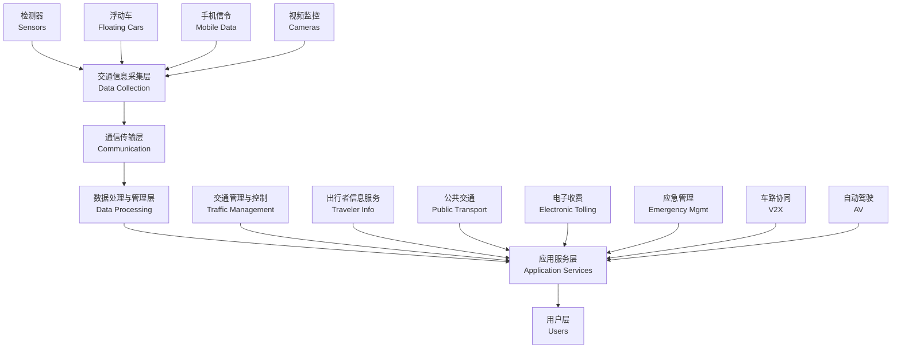

# 智能交通 (Intelligent Transportation)

## 概述

智能交通系统 (Intelligent Transportation Systems, ITS) 是将先进的信息技术 (Information Technology)、通信技术 (Communication Technology)、控制技术 (Control Technology) 和传感器技术 (Sensor Technology) 综合运用于交通运输管理体系的系统工程。ITS 的目标是提高交通系统的安全性、效率、舒适性和环境友好性，实现人、车、路、环境的协同。

ITS 的发展经历了从单一交通信号控制到综合交通信息平台，再到车路协同与自动驾驶的演进过程。当前，以 5G、人工智能 (AI)、大数据和车联网为代表的新一代信息技术正在深刻重塑智能交通的技术架构和应用模式。

## 系统架构 (System Architecture)

### 中国 ITS 体系框架

### 关键技术层

| 层级 | 技术内容 | 功能 |
|------|---------|------|
| 感知层 | 地磁、雷达、视频、北斗/GPS | 交通流参数检测 |
| 网络层 | 光纤、4G/5G、DSRC、C-V2X | 数据传输 |
| 平台层 | 云计算、边缘计算、数字孪生 | 数据处理与决策支持 |
| 应用层 | 信号控制、路径诱导、自动驾驶 | 面向用户的服务 |

## 车路协同与 V2X 通信 (V2X Communication)

### V2X 技术体系

V2X (Vehicle-to-Everything) 是实现车路协同的核心通信技术，包括：

| 通信模式 | 英文 | 交互内容 | 应用场景 |
|---------|------|---------|---------|
| V2V | Vehicle-to-Vehicle | 车速、位置、意图 | 前向碰撞预警、编队行驶 |
| V2I | Vehicle-to-Infrastructure | 信号灯状态、限速、路况 | 绿波车速引导、信号优先 |
| V2P | Vehicle-to-Pedestrian | 行人/非机动车位置 | 路口行人预警 |
| V2N | Vehicle-to-Network | 地图更新、远程诊断 | 远程监控、OTA 升级 |

### 通信技术标准

| 标准 | 技术特点 | 优势 | 挑战 |
|------|---------|------|------|
| DSRC (IEEE 802.11p) | 专用短程通信，低延迟 | 技术成熟、时延 <50ms | 覆盖范围有限、需专用频谱 |
| C-V2X (3GPP) | 基于蜂窝通信，PC5 + Uu 接口 | 广覆盖、可复用 5G 网络 | 建设成本高、标准演进中 |

### 车路协同应用场景

- **前向碰撞预警 (FCW)**：前车急刹时向后车发送预警
- **交叉口碰撞预警 (ICW)**：识别冲突轨迹，预警潜在碰撞
- **绿波车速引导 (GLOSA)**：根据信号灯配时推荐最优车速
- **紧急车辆优先 (EVP)**：救护车、消防车信号优先通行
- **弱势交通参与者保护 (VRU)**：行人、自行车检测与预警

## 自动驾驶 (Autonomous Driving)

### SAE 自动驾驶分级标准

| 级别 | 英文 | 定义 | 系统能力 | 人类角色 |
|------|------|------|---------|---------|
| L0 | No Automation | 无自动化 | 预警与瞬时干预 | 全程驾驶 |
| L1 | Driver Assistance | 驾驶辅助 | 横向或纵向控制之一 | 全程监控 |
| L2 | Partial Automation | 部分自动化 | 横向 + 纵向控制 | 全程监控 |
| L3 | Conditional Automation | 有条件自动化 | 特定场景下完全控制 | 请求时接管 |
| L4 | High Automation | 高度自动化 | 限定区域内完全控制 | 无需驾驶 |
| L5 | Full Automation | 完全自动化 | 全场景完全控制 | 无驾驶任务 |

### 自动驾驶关键技术

**环境感知 (Perception)**：
- **激光雷达 (LiDAR)**：高精度三维点云，距离测量精度 cm 级
- **摄像头 (Camera)**：目标识别与分类，成本低
- **毫米波雷达 (Radar)**：全天候工作，速度测量精度高
- **超声波传感器 (Ultrasonic)**：近距离探测，泊车辅助
- **多传感器融合 (Sensor Fusion)**：互补各传感器优势，提高感知可靠性

**定位导航 (Localization)**：
- **GNSS/INS 组合导航**：卫星定位 + 惯性导航，精度 m 级
- **高精度地图 (HD Map)**：厘米级精度，包含车道线、交通标志等语义信息
- **SLAM (同步定位与建图)**：实时构建环境地图并定位

**决策规划 (Planning)**：
- **全局路径规划 (Route Planning)**：基于地图搜索最优行驶路线
- **行为决策 (Behavioral Decision)**：换道、超车、跟车等决策
- **运动规划 (Motion Planning)**：轨迹生成与优化

**控制执行 (Control)**：
- **横向控制**：转向角控制，跟踪规划轨迹
- **纵向控制**：加减速控制，保持安全车距

## 交通大数据 (Traffic Big Data)

### 数据来源

| 数据类型 | 英文 | 特点 | 应用 |
|---------|------|------|------|
| 浮动车数据 | Floating Car Data (FCD) | GPS 轨迹，覆盖广 | 行程时间估计、拥堵识别 |
| 手机信令数据 | Mobile Signaling Data | 样本量大，全出行链 | OD 分析、出行需求预测 |
| 视频检测数据 | Video Detection | 直观、信息丰富 | 交通流参数、事件检测 |
| 地磁/线圈数据 | Loop/Inductive Data | 精度高、实时性好 | 信号控制、流量统计 |
| 社交媒体数据 | Social Media Data | 非结构化、主观 | 事件验证、舆情分析 |

### 大数据应用

**交通状态估计与预测**：
- 基于卡尔曼滤波 (Kalman Filter) 或深度学习模型融合多源数据
- 短时交通流预测：5~15 分钟预测，精度达 85% 以上

**信号优化**：
- 自适应信号控制：根据实时流量调整配时
- 区域协调控制：绿波带协调，减少停车次数

**拥堵分析与管理**：
- 拥堵瓶颈识别
- 动态路径诱导
- 需求管理策略（拥堵收费、错峰出行）

## 智能交通管理 (Intelligent Traffic Management)

### 交通管理平台

| 系统 | 英文 | 功能 |
|------|------|------|
| 交通信号控制系统 | ATSC | 自适应配时、区域协调 |
| 交通事件检测系统 | AID | 自动检测事故、停车、逆行等 |
| 交通信息发布系统 | VMS | 可变信息板、APP、广播 |
| 电子警察系统 | E-Police | 违章抓拍、车牌识别 |
| 应急指挥系统 | Emergency Response | 事件处置、资源调度 |

### 公共交通智能化

- **公交优先信号 (TSP)**：公交车辆到达时延长绿灯或缩短红灯
- **实时公交调度**：基于 GPS 和客流数据的动态发车间隔调整
- **乘客信息系统 (PIS)**：实时到站信息、拥挤度提示
- **智能调度中心**：集中监控、应急指挥、数据分析

## 电子收费系统 (Electronic Tolling)

### ETC 系统

电子不停车收费 (Electronic Toll Collection, ETC) 利用专用短程通信 (DSRC) 或 C-V2X 实现不停车缴费。

**ETC 优势**：
- 通行效率提升 5 倍以上
- 减少收费站拥堵
- 降低车辆怠速排放

### 自由流收费 (Free-Flow Tolling)

多车道自由流收费取消物理收费站，通过门架系统实现无感收费，是未来高速公路收费的发展方向。

## 智能停车 (Smart Parking)

### 停车诱导系统 (Parking Guidance System)

- **车位检测**：地磁、视频、超声波检测车位占用状态
- **信息发布**：入口信息板、手机 APP 显示空余车位
- **导航引导**：室内定位导航至目标车位

### 共享停车与预约停车

利用移动互联网平台整合社会停车资源，实现错时共享、预约停车，提高停车位利用率。

## 数字孪生与智慧公路 (Digital Twin & Smart Highway)

### 数字孪生交通系统

数字孪生 (Digital Twin) 通过构建与物理世界实时同步的虚拟交通系统，实现：
- 交通态势可视化
- 方案仿真评估
- 预测性维护
- 应急演练

### 智慧公路特征

| 特征 | 说明 |
|------|------|
| 全要素感知 | 气象、交通流、基础设施状态全面感知 |
| 全天候通行 | 低能见度辅助、车路协同自动驾驶 |
| 全过程管控 | 建管养运全生命周期数字化管理 |
| 全方位服务 | 出行前、中、后全链条信息服务 |

## 经典教材与标准

- 杨晓光《智能交通系统》
- 储浩《智能交通系统概论》
- Papageorgiou《Traffic Flow Modeling and Control》
- 《智能交通系统体系框架》GB/T 29108
- 《车路协同系统架构》

## 相关条目

- [[TransportationEngineering]]
- [[TrafficInformation]]
- [[AutonomousVehicles]]
- [[LogisticsManagement]]
- [[INDEX|TransportationEngineering 索引]]
