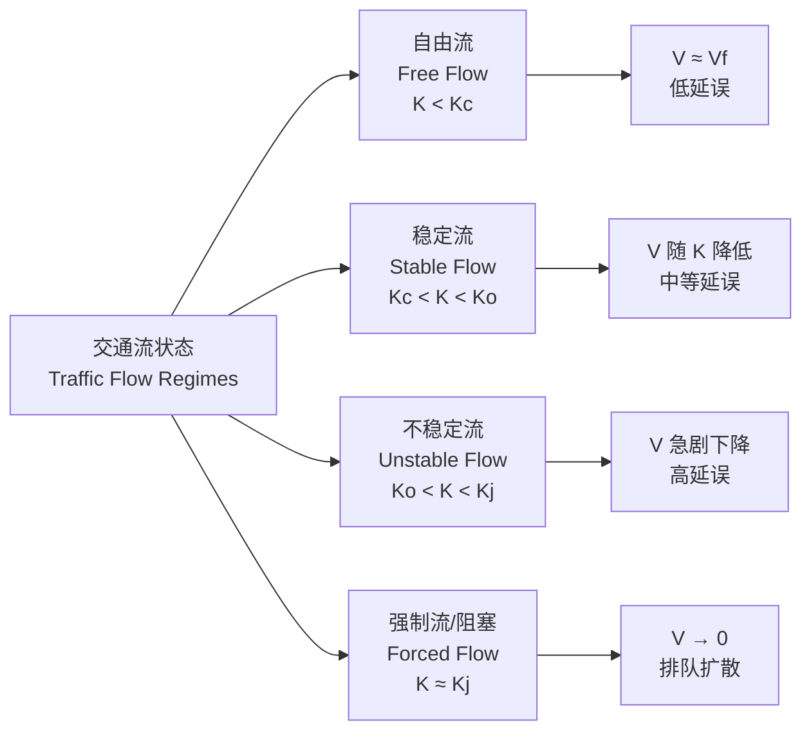
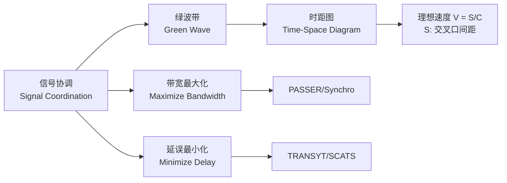
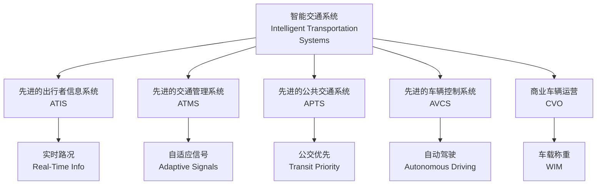

# 交通工程 (Traffic Engineering)

## 概述 (Overview)

交通工程（Traffic Engineering）是研究**人-车-路-环境 (Human-Vehicle-Road-Environment)** 系统中交通流运行规律，通过规划、设计、管理与控制实现**安全 (Safety)**、**高效 (Efficiency)**、**舒适 (Comfort)**、**环保 (Environmentally Friendly)** 交通运行的工程学科。

## 交通流理论 (Traffic Flow Theory)

### 基本参数 (Basic Parameters)

| 参数 (Parameter) | 符号 (Symbol) | 单位 (Unit) | 定义 (Definition) |
|-----------------|---------------|-------------|-------------------|
| 交通量 (Volume) | $Q$ | veh/h | 单位时间通过断面的车辆数 |
| 密度 (Density) | $K$ | veh/km | 单位长度路段上的车辆数 |
| 速度 (Speed) | $V$ | km/h | 车辆瞬时或区间速度 |
| 车头时距 (Headway) | $h$ | s | 连续两车通过同一断面的时间差 |
| 车头间距 (Spacing) | $s$ | m | 连续两车同一部位的距离 |

### 基本关系 (Fundamental Relationship)

$$
Q = K \cdot V
$$

Greenberg 对数模型：

$$
V = V_m \ln\left(\frac{K_j}{K}\right)
$$

其中 $V_m$ 为最大流速对应的速度，$K_j$ 为阻塞密度。

Greenshields 线性模型：

$$
V = V_f \left(1 - \frac{K}{K_j}\right)
$$

其中 $V_f$ 为自由流速度。

结合基本关系得到流量-密度抛物线：

$$
Q = V_f K \left(1 - \frac{K}{K_j}\right)
$$

最大流量（通行能力，Capacity）：

$$
Q_{max} = \frac{V_f K_j}{4}
$$

### 交通流状态 (Traffic Flow Regimes)

## 道路通行能力 (Highway Capacity)

### 服务水平 (Level of Service, LOS)

| 服务水平 (LOS) | 描述 (Description) | 高速公路密度 (pc/km/ln) | 信号交叉口延误 (s/veh) |
|---------------|-------------------|------------------------|----------------------|
| A | 自由流 | ≤ 7 | ≤ 10 |
| B | 合理自由流 | ≤ 11 | ≤ 20 |
| C | 稳定流 | ≤ 16 | ≤ 35 |
| D | 接近不稳定 | ≤ 22 | ≤ 55 |
| E | 不稳定流 | ≤ 28 | ≤ 80 |
| F | 强制流/失效 | > 28 | > 80 |

### 通行能力计算 (Capacity Calculation)

基本通行能力（Basic Capacity）$C_B$ 经多因素修正：

$$
C = C_B \times f_w \times f_{HV} \times f_p \times f_{sf}
$$

其中：
- $f_w$：车道宽度修正系数
- $f_{HV}$：重型车修正系数
- $f_p$：驾驶员群体修正系数
- $f_{sf}$：侧向净空修正系数

重型车修正：

$$
f_{HV} = \frac{1}{1 + P_T(E_T - 1) + P_R(E_R - 1)}
$$

其中 $P_T$、$P_R$ 为卡车、RV 比例，$E_T$、$E_R$ 为小客车当量（Passenger Car Equivalent, PCE）。

## 交通信号控制 (Traffic Signal Control)

### 信号配时基本参数 (Signal Timing Parameters)

| 参数 (Parameter) | 符号 (Symbol) | 说明 (Description) |
|-----------------|---------------|-------------------|
| 周期时长 (Cycle Length) | $C$ | 信号灯完成一个完整色序的时间 |
| 绿灯时间 (Green Time) | $G$ | 相位绿灯时长 |
| 黄灯时间 (Yellow Time) | $Y$ | 清尾时间 |
| 全红时间 (All-Red Time) | $AR$ | 交叉口清空时间 |
| 有效绿灯 (Effective Green) | $g$ | $g = G + Y - l$，$l$ 为启动损失 |
| 绿信比 (Green Ratio) | $\lambda$ | $\lambda = g/C$ |

### Webster 最佳周期公式

$$
C_0 = \frac{1.5L + 5}{1 - Y}
$$

其中 $L$ 为总损失时间，$Y = \sum y_i$ 为各临界流率比之和。

### 信号协调控制 (Signal Coordination)

时距图（Time-Space Diagram）中绿波带速度：

$$
V = \frac{S}{C} \cdot n
$$

其中 $S$ 为相邻交叉口间距，$n$ 为整数倍周期关系。

## 交通安全 (Traffic Safety)

### 事故分析模型 (Crash Prediction Models)

安全系数（Safety Performance Function, SPF）：

$$
E[N] = \alpha \cdot (AADT)^{\beta_1} \cdot L^{\beta_2} \cdot e^{\sum \gamma_i X_i}
$$

其中 AADT 为年平均日交通量，$L$ 为路段长度，$X_i$ 为风险因素。

### 冲突点分析 (Conflict Point Analysis)

| 交叉口类型 (Intersection Type) | 冲突点总数 (Total Conflicts) | 分离冲突 (Crossing) | 合流冲突 (Merging) | 分流冲突 (Diverging) |
|------------------------------|---------------------------|-------------------|------------------|-------------------|
| 十字信号控制 | 32 | 16 | 8 | 8 |
| 十字无信号 | 32 | 16 | 8 | 8 |
| 环形交叉口 | 8 | 0 | 4 | 4 |
| 全互通立交 | 0 | 0 | 0 | 0 |

### 安全评价指标 (Safety Performance Indicators)

| 指标 (Indicator) | 公式 (Formula) | 说明 (Description) |
|-----------------|---------------|-------------------|
| 事故率 (Crash Rate) | $R = \frac{N \times 10^8}{AADT \times 365 \times L}$ | 每亿车公里事故数 |
| 死亡 rate | $FAR = \frac{\text{死亡人数}}{\text{亿车公里}}$ | 致命风险 |
| 冲突率 (Conflict Rate) | $CR = \frac{\text{冲突数}}{\text{交通量}}$ |  surrogate safety |

## 智能交通系统 (Intelligent Transportation Systems, ITS)

### ITS 体系架构 (ITS Architecture)

### 交通检测技术 (Traffic Detection Technologies)

| 技术 (Technology) | 测量参数 (Measures) | 精度 (Accuracy) | 优缺点 (Pros/Cons) |
|------------------|--------------------|----------------|-------------------|
| 感应线圈 (Inductive Loop) | 流量、占有率、速度 | 高 | 可靠但需破路 |
| 微波雷达 (Microwave Radar) | 流量、速度、车型 | 中高 | 侧装/顶装，全天候 |
| 视频检测 (Video) | 流量、排队、事件 | 中 | 直观，受天气影响 |
| 激光雷达 (LiDAR) | 三维轨迹、密度 | 高 | 成本高，点云丰富 |
| 浮动车 (Probe Vehicle) | 行程时间、速度 | 中 | 覆盖广，采样率低 |

### 交通状态估计 (Traffic State Estimation)

基于卡尔曼滤波（Kalman Filter）的交通状态估计：

$$
\hat{x}_{k|k} = \hat{x}_{k|k-1} + K_k (z_k - H \hat{x}_{k|k-1})
$$

其中 $K_k$ 为卡尔曼增益，$z_k$ 为检测器观测值。

## 交通规划 (Transportation Planning)

### 四阶段模型 (Four-Step Model)

| 阶段 (Step) | 模型 (Model) | 输出 (Output) |
|------------|-------------|--------------|
| 出行生成 (Trip Generation) | 回归分析、交叉分类 | 各小区出行产生/吸引量 |
| 出行分布 (Trip Distribution) | 重力模型、增长因子 | OD 矩阵 |
| 方式划分 (Mode Split) | Logit 模型、Probit 模型 | 各方式分担率 |
| 交通分配 (Traffic Assignment) | UE、SO、SUE | 路段流量、路径选择 |

重力模型（Gravity Model）：

$$
T_{ij} = O_i \cdot \frac{A_j \cdot f(c_{ij})}{\sum_k A_k \cdot f(c_{ik})}
$$

其中 $O_i$ 为 $i$ 区出行产生量，$A_j$ 为 $j$ 区出行吸引量，$f(c_{ij})$ 为阻抗函数。

用户均衡（User Equilibrium, UE）条件：

$$
c_p^{rs} = \min_{q \in P_{rs}} c_q^{rs} \quad \text{if} \quad f_p^{rs} > 0
$$

所有被使用的路径行驶时间相等且最小。

## 参考文献 (References)

1. Roess, R. P., et al. (2019). *Traffic Engineering* (5th ed.). Pearson.
2. May, A. D. (1990). *Traffic Flow Fundamentals*. Prentice Hall.
3. Mannering, F. L., et al. (2020). *Principles of Highway Engineering and Traffic Analysis* (7th ed.). Wiley.
4. 王炜 等. (2011). 《交通工程学》. 东南大学出版社.
5. 杨晓光 等. (2015). 《交通管理与控制》. 人民交通出版社.
