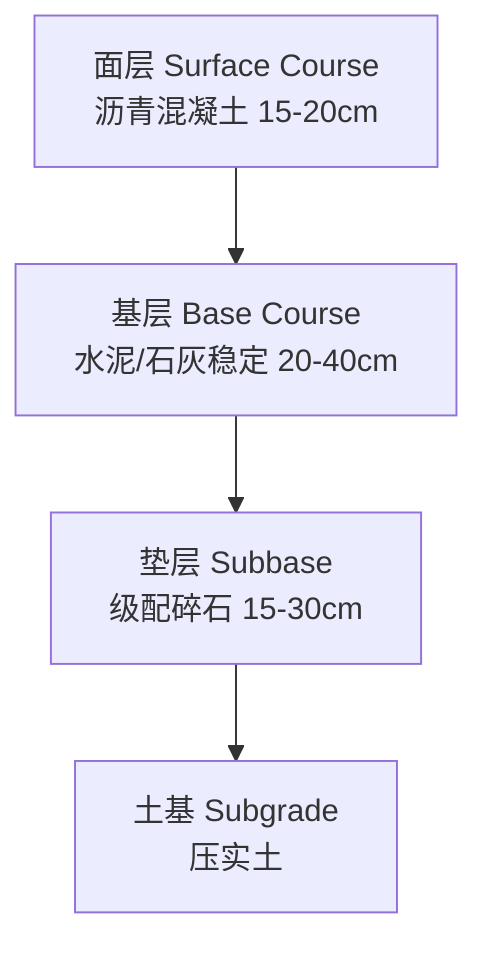
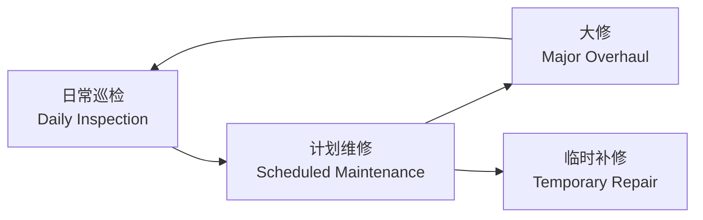

# 道路与铁道工程 (Road and Railway Engineering)

## 学科定义 (Discipline Definition)

道路与铁道工程 (Road and Railway Engineering) 是交通运输工程的核心二级学科，研究道路和铁路路线设计、路基路面工程、轨道结构及维护的学科。涉及土力学、结构力学、工程材料、测量学等多学科交叉。

## 路线设计 (Route Design)

### 平曲线设计 (Horizontal Curve Design)

**圆曲线半径 (Circular Curve Radius)**：

$$ R = \frac{v^2}{127(\mu + i_h)} $$

其中 $v$ 为设计速度 (km/h)，$\mu$ 为横向力系数，$i_h$ 为超高横坡度。

**缓和曲线 (Transition Curve / Clothoid)**：

$$ A^2 = R \cdot L_s $$

其中 $A$ 为回旋线参数，$R$ 为圆曲线半径，$L_s$ 为缓和曲线长度。

### 竖曲线设计 (Vertical Curve Design)

**竖曲线长度 (Vertical Curve Length)**：

$$ L = R \cdot \omega $$

其中 $R$ 为竖曲线半径，$\omega = |i_1 - i_2|$ 为坡度代数差。

### 路线设计标准对比

| 道路等级 (Road Class) | 设计速度 (km/h) | 最小圆曲线半径 (m) | 最大纵坡 (%) |
|--------------------|:--------------:|:-----------------:|:-----------:|
| 高速公路 (Expressway) | 120 | 1000 | 3 |
| 一级公路 (Class I) | 100 | 700 | 4 |
| 二级公路 (Class II) | 80 | 400 | 5 |
| 三级公路 (Class III) | 60 | 200 | 6 |
| 四级公路 (Class IV) | 40 | 100 | 7 |

## 路基工程 (Subgrade Engineering)

### 路堤稳定性 (Embankment Stability)

$$ F_s = \frac{\text{抗滑力 (Resisting Force)}}{\text{下滑力 (Driving Force)}} $$

路基边坡稳定性分析方法：
- **圆弧滑动法 (Swedish Slip Circle)**：适用于均质黏性土
- **Bishop 法**：考虑条间力的简化方法
- **Janbu 法**：适用于非圆弧滑动面

### 路基排水 (Subgrade Drainage)

| 排水设施 (Facility) | 功能 (Function) | 设置位置 (Location) |
|-------------------|---------------|-------------------|
| 边沟 (Side Ditch) | 排除路面积水 | 路基两侧 |
| 截水沟 (Catch Ditch) | 拦截坡面来水 | 路堑坡顶 |
| 排水沟 (Drainage Ditch) | 引水至自然水系 | 路基坡脚 |
| 渗沟 (Subdrain) | 降低地下水位 | 路基内部 |

## 路面工程 (Pavement Engineering)

### 路面结构类型比较

| 类型 (Type) | 面层材料 (Surface Material) | 厚度 (cm) | 使用寿命 (年) | 造价 (Cost) | 养护 (Maintenance) |
|------------|--------------------------|:---------:|:-----------:|:----------:|:----------------:|
| 沥青混凝土 | 沥青混合料 | 15~20 | 15 | 高 | 易 |
| 水泥混凝土 | 水泥混凝土 | 20~30 | 30 | 中高 | 难 |
| 复合式路面 | 沥青+水泥 | 25~35 | 25 | 高 | 中 |
| 碎石路面 | 碎石 | 20~40 | 5~10 | 低 | 易 |

### 路面弯沉计算 (Pavement Deflection)

$$ l = \frac{p \cdot d}{E_0} \cdot (1 - \mu^2) \cdot \alpha $$

其中 $p$ 为轮压，$d$ 为荷载圆直径，$E_0$ 为土基回弹模量，$\mu$ 为泊松比，$\alpha$ 为弯沉系数。

### 沥青路面结构层

## 铁道工程 (Railway Engineering)

### 轨道结构 (Track Structure)

| 组成 (Component) | 材料 (Material) | 功能 (Function) |
|-----------------|---------------|----------------|
| 钢轨 (Rail) | 高碳钢 | 承受车轮荷载，导向 |
| 扣件 (Fastening) | 弹簧钢 | 连接钢轨和轨枕 |
| 轨枕 (Sleeper) | 混凝土/木材 | 传递荷载至道床 |
| 道床 (Ballast) | 碎石 | 分散荷载，排水 |
| 路基 (Subgrade) | 土石 | 承载整体结构 |

### 轨道刚度 (Track Stiffness)

$$ k = \frac{P}{y} $$

其中 $P$ 为轮载，$y$ 为钢轨下沉量。

### 高速铁路关键技术

- **无砟轨道 (Ballastless Track)**：CRTS I/II/III 型板式轨道
- **高速道岔 (High-speed Turnout)**：可动心轨辙叉
- **无缝线路 (Continuous Welded Rail)**：消除钢轨接头
- **接触网 (Catenary)**：受电弓-接触网动态耦合

## 线路维护 (Track Maintenance)

### 检测技术 (Inspection Technology)

| 技术 (Technology) | 检测对象 (Object) | 精度 (Precision) |
|-----------------|-----------------|:---------------:|
| 轨道几何检测车 | 轨距、水平、高低 | ±1mm |
| 钢轨探伤车 | 钢轨内部裂纹 | 可检出 5mm 以上缺陷 |
| 地面激光扫描 | 线路限界 | ±2mm |
| 无人机巡检 | 边坡、排水设施 | ±5cm |

### 养护维修体系

## 学习路径 (Learning Path)

1. **基础阶段**：力学 (Mechanics)、材料学 (Materials)、工程测量 (Surveying)
2. **专业基础**：道路工程 (Road Engineering)、铁道工程 (Railway Engineering)、岩土力学 (Geomechanics)
3. **专业核心**：路线设计 (Route Design)、路基路面 (Subgrade & Pavement)、轨道结构 (Track Structure)
4. **专业拓展**：高速铁路 (High-speed Railway)、BIM 应用、智能运维 (Smart Maintenance)

## 经典教材 (Textbooks)

- 李杰《道路勘测设计》
- 邓学钧《路基路面工程》
- 沈志云《铁道工程》
- 练松良《轨道工程》

## 相关条目 (Related Entries)

[[HighwayEngineering]], [[RailwayTrack]], [[GeotechnicalEngineering]], [[StructuralEngineering]], [[TransportationPlanning]]
