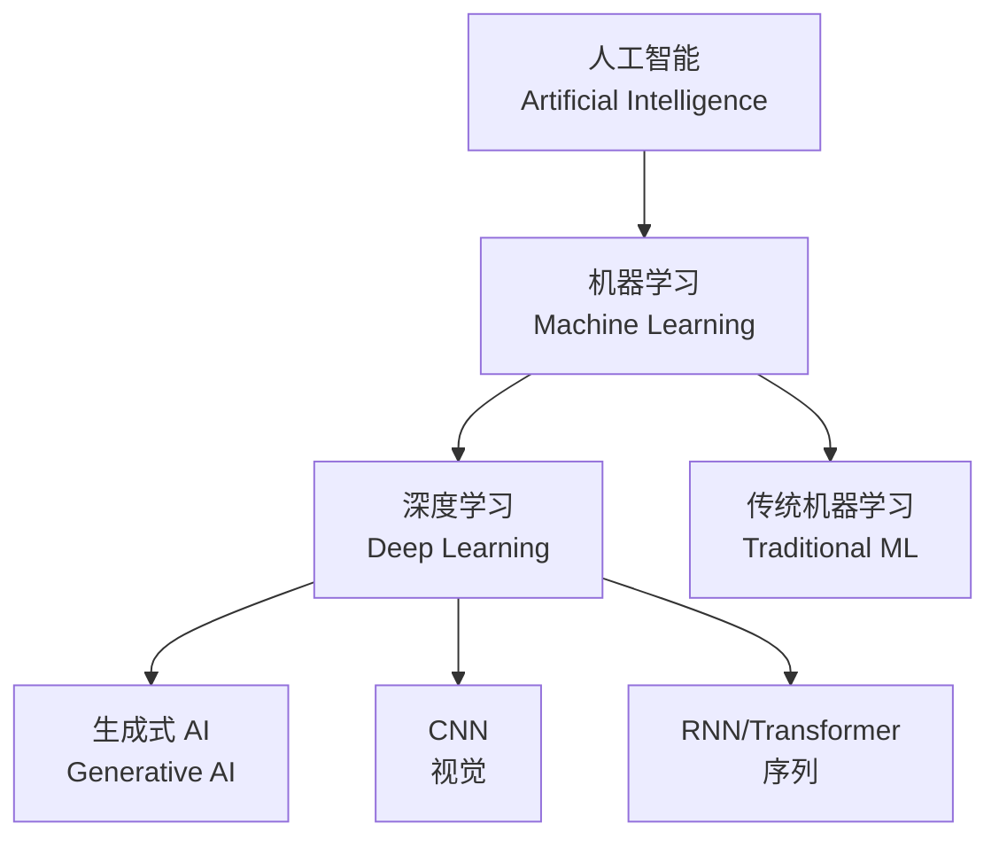
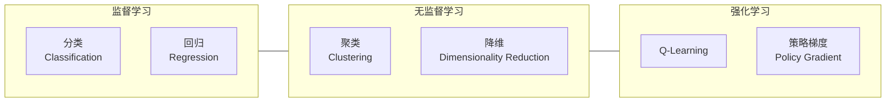
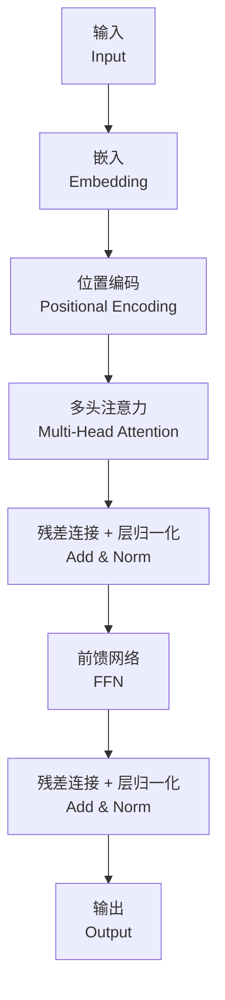

---
aliases:
  - 人工智能
  - AI
  - 机器学习
  - Machine Learning
  - 深度学习
tags:
created: 2026-05-17
updated: 2026-05-17
  - ai
  - machine-learning
  - deep-learning
  - nlp
  - computer-vision
  - robotics
---

# 人工智能概述 (AI Overview)

## 什么是人工智能 (What Is Artificial Intelligence)

人工智能 (AI) 是计算机科学的一个分支，致力于创建能够模拟人类智能的系统。AI 涵盖从简单的规则系统到复杂的深度学习网络。



## AI 发展简史 (AI Timeline)

| 时期 (Period) | 里程碑 (Milestones) | 代表人物/事件 |
|---|---|---|
| 1950s | 图灵测试、达特茅斯会议 | Alan Turing, John McCarthy |
| 1960-70s | AI 第一次冬天 | 算力限制、期望过高 |
| 1980s | 专家系统崛起 | MYCIN, XCON |
| 1987-93 | AI 第二次冬天 | 专家系统无法维护 |
| 2006 | 深度学习复兴 | Hinton, Bengio, LeCun |
| 2012 | AlexNet 图像分类突破 | ImageNet 竞赛 |
| 2017 | Transformer 架构 | Vaswani et al. |
| 2022+ | 大语言模型爆发 | ChatGPT, GPT-4, Claude |

## 机器学习 (Machine Learning)

### 学习范式 (Learning Paradigms)



### 常见算法 (Common Algorithms)

| 算法 (Algorithm) | 类型 (Type) | 特点 (Characteristics) |
|---|---|---|
| 线性回归 | 监督/回归 | 简单快速，可解释性强 |
| 逻辑回归 | 监督/分类 | 二分类基线 |
| 决策树 | 监督/分类回归 | 可解释、易过拟合 |
| 随机森林 | 监督/集成 | Bagging，抗过拟合 |
| SVM | 监督/分类 | 核技巧处理非线性 |
| K-Means | 无监督/聚类 | 简单高效的聚类 |
| PCA | 无监督/降维 | 线性降维 |
| t-SNE | 无监督/降维 | 可视化高维数据 |
| XGBoost | 监督/集成 | Gradient Boosting |
| KNN | 监督/分类回归 | 基于实例的学习 |

### 训练流程 (Training Pipeline)

```
数据收集 → 数据清洗 → 特征工程 → 模型选择 → 训练 → 评估 → 调参 → 部署
                                                    ↑
                                              反复迭代
```

## 深度学习 (Deep Learning)

### 神经网络基础 (Neural Network Basics)

一个神经层的前向传播：

$$
z = W \cdot x + b
$$

$$
a = \sigma(z)
$$

其中 $\sigma$ 是激活函数。

### 常见激活函数

| 函数 (Function) | 公式 (Formula) | 范围 (Range) | 特点 |
|---|---|---|---|
| Sigmoid | $\frac{1}{1 + e^{-x}}$ | (0, 1) | 二分类输出层 |
| Tanh | $\frac{e^x - e^{-x}}{e^x + e^{-x}}$ | (-1, 1) | 中心化输出 |
| ReLU | $\max(0, x)$ | [0, $\infty$) | 缓解梯度消失 |
| Leaky ReLU | $\max(0.01x, x)$ | ($-\infty$, $\infty$) | 改进 ReLU |
| Softmax | $\frac{e^{x_i}}{\sum e^{x_j}}$ | (0, 1) | 多分类概率 |

### 损失函数 (Loss Functions)

**交叉熵损失 (Cross-Entropy Loss)** — 分类任务：

$$
L = -\frac{1}{N}\sum_{i=1}^{N}\sum_{c=1}^{C} y_{i,c} \log(\hat{y}_{i,c})
$$

**均方误差 (MSE)** — 回归任务：

$$
L = \frac{1}{N}\sum_{i=1}^{N}(y_i - \hat{y}_i)^2
$$

## 自然语言处理 (NLP)

### 核心任务 (Core Tasks)

- 文本分类 (Text Classification)
- 命名实体识别 (NER)
- 关系抽取 (Relation Extraction)
- 机器翻译 (Machine Translation)
- 文本摘要 (Text Summarization)
- 问答系统 (Question Answering)
- 情感分析 (Sentiment Analysis)

### Transformer 架构

Transformer 的核心是**自注意力机制 (Self-Attention)**：

$$
\text{Attention}(Q, K, V) = \text{softmax}\left(\frac{QK^T}{\sqrt{d_k}}\right)V
```



### 大语言模型 (Large Language Models)

| 模型 (Model) | 参数规模 | 架构 | 训练数据 | 公司 |
|---|---|---|---|---|
| GPT-4 | ~1.8T (估计) | Transformer Decoder | 多模态 | OpenAI |
| Claude 3 | 未公开 | Transformer | 大规模文本 | Anthropic |
| Llama 3 | 8B/70B | Transformer Decoder | 公开数据 | Meta |
| Gemini | 未公开 | MoE | 多模态 | Google |
| DeepSeek | 67B/236B | MoE | 多语言 | DeepSeek |

## 计算机视觉 (Computer Vision)

### 核心任务 (Core Tasks)

- 图像分类 (Image Classification)
- 目标检测 (Object Detection) — YOLO, DETR
- 语义分割 (Semantic Segmentation)
- 实例分割 (Instance Segmentation)
- 姿态估计 (Pose Estimation)
- 图像生成 (Image Generation) — GANs, Diffusion

### CNN 基础架构

$$
\text{Conv2D} \rightarrow \text{BatchNorm} \rightarrow \text{ReLU} \rightarrow \text{Pooling} \rightarrow \text{FC}
$$

## 强化学习 (Reinforcement Learning)

### 核心概念 (Core Concepts)

- **状态 (State) $s$** — 环境的描述
- **动作 (Action) $a$** — 智能体的决策
- **奖励 (Reward) $r$** — 行为的反馈
- **策略 (Policy) $\pi$** — 从状态到动作的映射
- **价值函数 (Value Function) $V(s)$** — 状态的价值估计

### Q-Learning 更新公式

$$
Q(s, a) \leftarrow Q(s, a) + \alpha\left[r + \gamma \max_{a'} Q(s', a') - Q(s, a)\right]
$$

## AI 伦理与社会影响 (AI Ethics & Societal Impact)

### 关键议题 (Key Issues)

- **偏见与公平 (Bias & Fairness)** — 训练数据中的社会偏见
- **可解释性 (Explainability)** — 黑箱模型的决策理解
- **隐私 (Privacy)** — 数据收集与使用边界
- **安全 (Safety)** — AI 系统的鲁棒性与对齐
- **就业影响 (Employment)** — 自动化对劳动力的冲击
- **AI 对齐 (AI Alignment)** — 确保 AI 目标符合人类价值

### 监管框架 (Regulatory Frameworks)

| 法规 (Regulation) | 地区 (Region) | 核心要点 |
|---|---|---|
| EU AI Act | 欧盟 | 风险分级管理 |
| 生成式 AI 管理办法 | 中国 | 内容合规与标识 |
| Executive Order 14110 | 美国 | AI 安全与公平 |

## 参考资源 (References)

- "Deep Learning" - Ian Goodfellow, Yoshua Bengio, Aaron Courville
- "Pattern Recognition and Machine Learning" - Christopher Bishop
- CS229 / CS231n / CS224n (Stanford)
- Hugging Face 文档
- Papers with Code (paperswithcode.com)

---

> AI 不是要取代人类，而是增强人类的能力，让我们能够解决更复杂的挑战。
