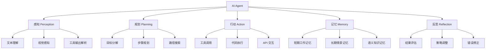

# AI Agent（人工智能代理）

## 一、概述

AI Agent 是能够自主感知环境、做出决策并执行行动以完成目标的智能系统。2025-2026年，AI 从被动的工具型系统（问答、生成）转向主动的代理型系统（规划、执行、迭代），标志着 **Agentic AI 时代**的到来。

### 1.1 Agent 与传统 AI 的区别

| 维度 | 传统 AI | AI Agent |
|------|---------|----------|
| 交互模式 | 被动响应 | 主动规划 |
| 工具使用 | 无/有限 | 多工具编排 |
| 记忆能力 | 会话级 | 长期记忆 |
| 错误处理 | 静默失败 | 自我修正 |
| 目标复杂度 | 单步任务 | 多步目标分解 |

### 1.2 Agent 能力框架

## 二、核心架构模式

### 2.1 ReAct 框架

Reasoning + Acting 交替执行：

$$
\text{Agent Loop: } \text{Thought}_t \rightarrow \text{Action}_t \rightarrow \text{Observation}_t \rightarrow \text{Thought}_{t+1} \rightarrow ...
$$

### 2.2 规划-执行-反思循环

$$
\text{Plan}(G) = \{s_1, s_2, ..., s_n\} \xrightarrow{\text{Execute}} \{r_1, r_2, ..., r_n\} \xrightarrow{\text{Reflect}} \text{Plan}'(G)
$$

其中 $G$ 为目标，$s_i$ 为步骤，$r_i$ 为结果。

### 2.3 多 Agent 协作

| 模式 | 描述 | 适用场景 |
|------|------|---------|
| 主从模式 | 一个 Orchestrator + 多个 Worker | 任务分发 |
| 对等模式 | Agent 之间平等协作 | 复杂问题讨论 |
| 辩论模式 | 多 Agent 辩论达成共识 | 决策优化 |
| 流水线模式 | Agent 按序处理 | 流程自动化 |

## 三、2026年主要 Agent 系统

### 3.1 Anthropic Claude Agent 系列（2026年6月）

Anthropic 在 2026 年推出 Mythos-class 模型，代表当前最强 Agent 能力：

| 模型 | 类型 | 上下文窗口 | 最大输出 | 定价（输入/输出 per 1M tokens） | 特点 |
|------|------|-----------|---------|-------------------------------|------|
| **Claude Fable 5** | Mythos-class，GA | 1M tokens | 128k tokens | $10 / $50 | 安全分类器保护，回退至 Opus 4.8 |
| **Claude Mythos 5** | Mythos-class，受限 | 1M tokens | 128k tokens | $10 / $50 | 网络安全限制解除，Project Glasswing |
| **Claude Opus 4.8** | Opus-class，GA | — | — | — | 常规安全级别 |

**Claude Fable 5 核心能力**：
- **软件工程**：Stripe 在 5000 万行 Ruby 代码库中完成代码迁移，从 2 个月缩短至 1 天
- **知识工作**：Hebbia Finance Benchmark 最高分，擅长文档推理、图表解读
- **视觉能力**：从截图重建 Web 应用源代码，视觉-only 通关 Pokémon FireRed
- **长上下文记忆**：百万 token 持续聚焦，Slay the Spire 中记忆效果提升 3x

**Claude Mythos 5 核心能力**：
- **网络安全**：当前最强网络安全能力的模型
- **科学研究**：蛋白质设计加速 10x，首次持续产生新颖科学假设
- **基因组学**：自主运行一周，训练出超越 Science 发表模型的定制模型（小 100 倍）

**安全机制**：
- Fable 5 配备分类器，检测滥用和越狱，触发时回退至 Opus 4.8
- 分类器覆盖网络安全、生物化学、蒸馏三个领域
- 触发率 <5%，>95% 的会话无回退
- 外部赏金计划 1000+ 小时未发现通用越狱

### 3.2 企业级 Agent 平台

| 系统 | 开发商 | 特点 | 应用场景 |
|------|--------|------|---------|
| **Anthropic Slack Agents** | Anthropic | 深度集成 Slack 工作流 | 企业内部协作自动化 |
| **Sakana Fugu** | Sakana AI | 多模型编排，智能任务路由 | 根据任务复杂度选择最优模型 |
| **Perplexity Brain** | Perplexity | 自改进记忆系统 | 知识工作者的长期助手 |
| **Nous Research Hermes Agent** | Nous Research | 技能系统 + /learn 命令 | 可扩展的个人 Agent |

### 3.3 空间与具身 Agent

| 系统 | 特点 | 技术路线 |
|------|------|---------|
| **SpatialClaw** | 无需训练的空间推理 Agent | 利用预训练视觉-语言模型的空间理解 |
| **Qwen RobotManip** | 机器人操控模型 | 模仿学习 + 强化学习 |
| **Qwen RobotWorld** | 世界模型 | 预测环境动力学 |
| **Qwen RobotNav** | 导航模型 | 视觉-语言-动作映射 |

### 3.4 编码 Agent

| 系统 | 性能 | 特点 |
|------|------|------|
| **Ornith-1.0** (DeepReinforce) | SWE-Bench 82.4% | 开源，MIT 许可证 |
| **Claude Code** (Anthropic) | SWE-Bench 93.9% (Mythos) | 全栈开发、调试、代码审查 |
| **Claude Fable 5** | Cognition FrontierCode 最高分 | 大规模代码迁移、token 效率最优 |
| **GitHub Copilot** | 多语言支持 | IDE 深度集成 |

## 四、Agent 技术栈

### 4.1 工具使用 (Tool Use)

Agent 通过函数调用与外部工具交互：

$$
\text{Action} = \text{ToolCall}(\text{name}, \text{args}) \rightarrow \text{Observation} = \text{Tool}(\text{args})
$$

常见工具类型：
- **搜索引擎**：信息检索
- **代码解释器**：Python/Shell 执行
- **API 调用**：外部服务集成
- **文件操作**：读写文档

### 4.2 记忆系统

| 记忆类型 | 存储内容 | 实现方式 |
|---------|---------|---------|
| 工作记忆 | 当前对话上下文 | 上下文窗口 |
| 情景记忆 | 过往交互经历 | 向量数据库 |
| 语义记忆 | 通用知识 | 知识图谱/参数 |
| 程序记忆 | 技能和流程 | 代码/提示模板 |

### 4.3 规划算法

| 算法 | 特点 | 适用场景 |
|------|------|---------|
| 任务分解 (Task Decomposition) | 将复杂目标拆分为子任务 | 通用 |
| 树搜索 (Tree Search) | 探索多条执行路径 | 决策问题 |
| 反思规划 (Reflexion) | 从失败中学习 | 迭代改进 |
| 图规划 (Graph Plan) | 建模任务依赖关系 | 并行任务 |

## 五、Agent 评估

### 5.1 评估基准

| 基准 | 评估维度 | 2026 SOTA |
|------|---------|-----------|
| **Terminal-Bench 2.0** | 终端操作能力 | GPT-5.5 (82.7%) |
| **OSWorld** | 操作系统交互 | GPT-5.5 (78.7%) |
| **SWE-Bench** | 软件工程能力 | Claude Mythos (93.9%) |
| **WebArena** | 网页交互 | 持续提升中 |
| **AgentBench** | 综合 Agent 能力 | 多维度评估 |
| **Cognition FrontierCode** | 难度编码任务 | Claude Fable 5 最高分 |

### 5.2 安全考量

Agent 系统面临独特的安全挑战：
- **权限管理**：Agent 执行操作的权限边界
- **沙箱隔离**：代码执行的安全隔离
- **审批机制**：高风险操作的人类确认
- **审计日志**：Agent 行为的可追溯性
- **分类器保护**：如 Fable 5 的网络安全/生物化学/蒸馏分类器

## 六、企业级 Agent 部署

### 6.1 部署架构

| 架构 | 描述 | 代表案例 |
|------|------|---------|
| 云原生 Agent | 基于云平台的 Agent 服务 | SAP + Google Cloud |
| 私有化部署 | 企业内部部署 Agent | Samsung ChatGPT Enterprise |
| 混合模式 | 敏感数据本地 + 通用能力云端 | 大型金融机构 |
| 受限访问 | 特殊能力仅限授权用户 | Claude Mythos 5 (Project Glasswing) |

### 6.2 行业应用

| 行业 | Agent 应用 | 价值 |
|------|-----------|------|
| 金融 | 风险分析 Agent、合规检查 Agent | 降低人工审核成本 |
| 零售 | 购物助手 Agent、供应链优化 | 个性化推荐+自动采购 |
| 制造 | 质检 Agent、维护预测 Agent | 减少停机时间 |
| 医疗 | 诊断辅助 Agent、药物发现 Agent | 加速研究进程 |
| 软件工程 | 代码迁移 Agent、代码审查 Agent | 大规模重构自动化 |

## 七、挑战与展望

### 7.1 当前挑战

1. **可靠性**：Agent 在复杂场景下的错误累积
2. **可控性**：确保 Agent 行为符合预期
3. **效率**：多步推理的延迟和成本
4. **评估**：缺乏统一的 Agent 评估标准
5. **安全**：如 Fable 5 的分类器误触发（<5%）与漏检的平衡

### 7.2 未来方向

1. **自主学习 Agent**：能够从经验中持续改进
2. **多模态 Agent**：统一视觉、语言、动作的 Agent
3. **Agent 社会**：大规模 Agent 协作的涌现行为
4. **人机协作**：人类与 Agent 的高效协作模式
5. **分层安全 Agent**：如 Fable 5/Mythos 5 的分类器+回退机制

## 相关条目

- [[AIGC]]
- [[AIGC模型架构与应用]]
- [[AIEthics]]
- [[ReinforcementLearning]]
- [[NaturalLanguageProcessing]]
- [[ModelArchitectures2026]]
- [[IndustryAIApplications]]

## 参考资源

1. Yao, S. et al. "ReAct: Synergizing Reasoning and Acting in Language Models." ICLR, 2023.
2. Shinn, N. et al. "Reflexion: Language Agents with Verbal Reinforcement Learning." NeurIPS, 2023.
3. Wang, L. et al. "A Survey on Large Language Model based Autonomous Agents." arXiv:2308.11432, 2023.
4. Anthropic. "Claude Fable 5 and Claude Mythos 5." 2026.
5. Sakana AI. "Fugu: Multi-Model Orchestration for Task Routing." 2026.
6. Perplexity. "Brain: Self-Improving Memory System for Agents." 2026.
7. DeepReinforce. "Ornith-1.0: Open-Source Coding Model." 2026.
