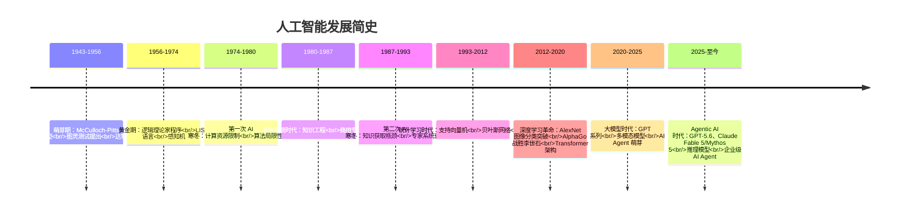
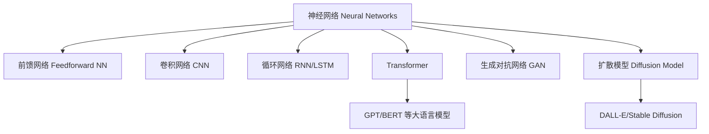

---
aliases: [ArtificialIntelligence, AI, 人工智能]
tags: ['05_ComputerScience', 'ArtificialIntelligence', 'MachineLearning', 'DeepLearning']
created: 2026-05-17
updated: 2026-06-27
---

# 人工智能概论 AI Overview

## 1. 什么是人工智能？(What is AI?)

人工智能（Artificial Intelligence, AI）是计算机科学的一个分支，致力于创建能够模拟人类智能的系统。AI 系统能够从数据中学习、识别模式、做出决策和解决复杂问题。自 1956 年达特茅斯会议（Dartmouth Conference）以来，AI 经历了多次浪潮和发展周期的演变，从符号主义（Symbolism）到连接主义（Connectionism），再到当代的深度学习（Deep Learning）浪潮。

AI 的核心目标包括推理（Reasoning）、知识表示（Knowledge Representation）、规划（Planning）、学习（Learning）、自然语言处理（Natural Language Processing）、感知（Perception）和运动控制（Motion Control）。这些能力的组合使 AI 系统能够在从棋盘游戏到自动驾驶等广泛领域中展现智能行为。

## 2. 发展历史 (Historical Timeline)

## 3. 核心子领域 (Core Subfields)

### 3.1 机器学习 (Machine Learning)

机器学习（Machine Learning, ML）使系统能够从经验中自动改进。根据学习范式可分为：

| 学习范式 | 描述 | 典型算法 | 应用场景 |
|:--------|:-----|:---------|:---------|
| 监督学习 (Supervised) | 使用标注数据训练 | CNN, RNN, Transformer, SVM | 分类、回归任务 |
| 无监督学习 (Unsupervised) | 发现数据内在结构 | K-means, DBSCAN, PCA, t-SNE | 聚类、降维 |
| 半监督学习 (Semi-supervised) | 少量标注+大量未标注 | Self-training, Graph-based | 标注成本高的场景 |
| 强化学习 (Reinforcement) | 通过与环境交互学习 | Q-learning, DQN, PPO, SAC | 游戏、机器人控制 |

深度学习（Deep Learning）作为机器学习的子集，利用多层神经网络实现了在图像识别、语音识别和自然语言处理等领域的突破性进展。神经网络的核心计算公式可表示为：

$$
\mathbf{h}^{(l+1)} = \sigma(\mathbf{W}^{(l)}\mathbf{h}^{(l)} + \mathbf{b}^{(l)})
$$

其中 $\mathbf{W}^{(l)}$ 和 $\mathbf{b}^{(l)}$ 分别表示第 $l$ 层的权重矩阵和偏置向量，$\sigma$ 为激活函数（如 ReLU、Sigmoid 或 Tanh）。

### 3.2 自然语言处理 (Natural Language Processing)

自然语言处理（NLP）让计算机理解和生成人类语言。现代 NLP 的核心技术包括：

- **词嵌入**（Word Embeddings）：将词语映射到稠密向量空间
- **Transformer 架构**：基于自注意力机制（Self-Attention）的序列建模
- **预训练语言模型**（PLMs）：BERT、GPT、T5 等大规模预训练模型
- **检索增强生成**（RAG）：结合外部知识库的文本生成

Transformer 的自注意力机制可表示为：

$$
\text{Attention}(Q,K,V) = \text{softmax}\left(\frac{QK^T}{\sqrt{d_k}}\right)V
$$

其中 $Q$、$K$、$V$ 分别为查询矩阵、键矩阵和值矩阵，$d_k$ 为键向量的维度。

### 3.3 计算机视觉 (Computer Vision)

计算机视觉赋予机器从图像和视频中提取信息的能力。核心任务包括：

| 任务 | 描述 | 代表性方法 |
|:-----|:-----|:-----------|
| 图像分类 (Classification) | 将图像分入预定义类别 | ResNet, EfficientNet, ViT |
| 目标检测 (Detection) | 定位并识别图像中的物体 | YOLO, Faster R-CNN, DETR |
| 语义分割 (Segmentation) | 对每个像素进行分类 | U-Net, DeepLab, Mask R-CNN |
| 目标跟踪 (Tracking) | 连续帧中跟踪目标 | SORT, DeepSORT, TransT |
| 三维视觉 (3D Vision) | 从二维图像重建三维结构 | NeRF, 3D Gaussian Splatting |

### 3.4 机器人学 (Robotics)

机器人学将 AI 应用于物理世界中的自主系统。关键组成部分包括感知（Perception）、定位与建图（SLAM）、运动规划（Motion Planning）和控制（Control）。现代机器人系统正从传统工业机器人向具有自主学习和适应能力的新一代智能机器人演进。

### 3.5 其他重要子领域

- **知识表示与推理**（Knowledge Representation & Reasoning）
- **多智能体系统**（Multi-Agent Systems, MAS）
- **可解释人工智能**（Explainable AI, XAI）
- **联邦学习**（Federated Learning）
- **生成式人工智能**（Generative AI）

## 4. 现代 AI 的关键技术 (Key Techniques)

### 4.1 深度神经网络架构

#### 4.1.1 2026年关键架构创新

| 技术 | 突破 | 影响 |
|------|------|------|
| DFlash 推测解码 (Speculative Decoding) | NVIDIA Blackwell 上 15x 吞吐量提升 | 推理成本大幅降低 |
| MiniMax 稀疏注意力 (MSA) | 1M 上下文下 28.4x 注意力计算缩减 | 超长上下文可行化 |
| HIP Attention Kernel | AMD MI300X 上超越 AITER v3 | GPU 供应商多元化 |
| KV Cache 压缩 (TurboQuant, OSCAR, EpiCache) | 内存占用减少 50-70% | 长上下文部署成本降低 |
| Multi-Token Prediction (MTP) | 单次前向预测多个 token | 3x 推理速度提升 |

### 4.2 训练方法论

- **反向传播**（Backpropagation）：计算损失函数对各层参数的梯度
- **随机梯度下降**（SGD）及其变体：Adam、AdamW、RMSprop 等优化器
- **正则化技术**：L1/L2 正则化、Dropout、BatchNorm、数据增强
- **迁移学习**（Transfer Learning）：在预训练模型基础上进行微调（Fine-tuning）
- **提示工程**（Prompt Engineering）：通过精心设计的提示词引导大模型输出

> **详细训练流程**：参见 [[AITrainingWorkflows|AI 训练工作流]]，涵盖数据采集、清洗、标注、GPU 加速、分布式训练和 MLOps 等完整流程。

## 5. 主要应用领域 (Applications)

### 5.1 医疗健康 (Healthcare)

- 医学影像诊断（X 光、CT、MRI 的自动分析）
- 药物发现与分子设计
- 电子健康记录（EHR）分析与预测
- 手术机器人与辅助系统

### 5.2 自动驾驶 (Autonomous Driving)

自动驾驶系统通常分为感知（Perception）、预测（Prediction）、规划（Planning）和控制（Control）四个模块。SAE J3016 标准将自动驾驶分为 L0-L5 六个等级，当前商用系统主要处于 L2-L3 级别。

### 5.3 金融科技 (FinTech)

- 算法交易与量化投资
- 信用评分与风险控制
- 欺诈检测与反洗钱
- 智能投顾（Robo-Advisor）

### 5.4 其他应用

| 领域 | 典型应用 |
|:-----|:---------|
| 教育 (Education) | 自适应学习系统、智能批改 |
| 娱乐 (Entertainment) | 游戏 AI、内容推荐、AIGC |
| 制造业 (Manufacturing) | 质量检测、预测性维护 |
| 农业 (Agriculture) | 作物监测、精准喷洒 |
| 能源 (Energy) | 智能电网、需求预测 |

### 5.5 企业级 AI Agent 部署 (Enterprise AI Agents, 2026)

| 企业合作 | 应用场景 | 技术方案 |
|---------|---------|---------|
| SAP + Google Cloud | 代理式商务架构 (Agentic Commerce) | 多 Agent 协作 |
| Samsung ChatGPT Enterprise | 企业内部 AI 部署 | 私有化部署 |
| HSBC + Google Cloud | AI 银行服务 | 金融合规 AI |
| L'Oréal + ChatGPT | 虚拟试妆集成 | 多模态生成 |
| Visa + ChatGPT | AI Agent 零售购买 | 自主交易 Agent |
| Anthropic Slack Agents | 企业协作自动化 | Slack 深度集成 |

## 6. 伦理与安全 (Ethics & Safety)

### 6.1 关键挑战

- **偏见与公平性**（Bias & Fairness）：训练数据中的偏见可能导致 AI 系统做出歧视性决策
- **隐私保护**（Privacy）：AI 系统大量收集和处理个人数据的隐私风险
- **可解释性**（Explainability）：深度学习模型的黑箱特性使其决策过程难以理解
- **安全性**（Safety）：对抗攻击（Adversarial Attacks）、模型注入等安全威胁
- **责任归属**（Accountability）：AI 系统出错时的责任界定

### 6.2 对齐问题 (Alignment Problem)

AI 对齐（AI Alignment）研究如何确保 AI 系统的目标和行为与人类的价值观和意图保持一致。这是当前 AI 安全研究的核心问题之一。

### 6.3 治理框架

- **欧盟 AI 法案**（EU AI Act）：基于风险分级的监管框架
- **ISO/IEC 42001**：AI 管理体系标准
- **国家政策**：各国相继出台 AI 治理指导原则

### 6.4 2026年安全与治理新进展

- **OpenAI 部署模拟 (Deployment Simulation)**：模型发布前的风险评估框架
- **LeanGuard**：无需推理的快速内容审核系统
- **LifeSciBench**：750 任务的生命科学 AI 基准测试
- **Claude Fable 5 分类器机制**：网络安全/生物化学/蒸馏领域的安全分类器，触发时回退至 Opus 4.8
- **Project Glasswing**：Anthropic 的受限访问计划，用于安全研究

## 7. 未来趋势 (Future Directions)

1. **通用人工智能**（AGI）：追求具有通用认知能力的 AI 系统
2. **具身智能**（Embodied AI）：AI 与物理世界深度融合
3. **神经符号系统**（Neural-Symbolic）：结合数据驱动与符号推理
4. **AI for Science**：AI 加速科学发现（AlphaFold、气象预报等）
5. **绿色 AI**（Green AI）：降低大模型训练的能源消耗
6. **Agentic AI**：从工具型 AI 到自主代理型 AI 的范式转变
7. **推理优化**：推测解码、稀疏注意力等技术使大模型推理更高效
8. **开源模型崛起**：Ornith-1.0、VibeThinker-3B 等开源模型接近闭源水平

### 7.6 价值对齐与超级对齐

价值对齐（Value Alignment）研究如何确保高级 AI 系统的目标与人类价值观一致。超级对齐（Superalignment）关注超人类智能系统的控制问题。OpenAI、DeepMind 和 Anthropic 等机构均设立了专门的安全研究团队。

## 8. 学习资源 (Learning Resources)

### 8.1 经典教材

| 教材 | 作者 | 侧重方向 |
|:-----|:------|:---------|
| Artificial Intelligence: A Modern Approach | Russell & Norvig | 全面 AI 导论 |
| Deep Learning | Goodfellow, Bengio & Courville | 深度学习理论 |
| Pattern Recognition and Machine Learning | Bishop | 统计机器学习 |
| Reinforcement Learning: An Introduction | Sutton & Barto | 强化学习经典 |

### 8.2 在线课程

- **CS229 / CS230 / CS231n** (Stanford)：机器学习 / 深度学习 / 计算机视觉
- **6.S191** (MIT)：深度学习导论
- **Fast.ai**：实践导向的深度学习课程
- **DeepLearning.AI** (Coursera Andrew Ng)：AI 入门系列

## 9. 关键人物 (Key Figures)

| 人物 | 主要贡献 |
|:-----|:---------|
| Alan Turing | 图灵测试、计算理论奠基 |
| John McCarthy | LISP 语言、达特茅斯会议组织者 |
| Geoffrey Hinton | 反向传播、深度学习复兴 |
| Yann LeCun | 卷积神经网络（CNN） |
| Yoshua Bengio | 深度学习理论、生成模型 |
| Demis Hassabis | AlphaGo、DeepMind 创始人 |

## 10. 产业生态 (Industry Landscape)

现代 AI 产业生态包括：
- **云服务提供商**：AWS SageMaker、Google Cloud AI、Azure AI
- **大模型平台**：OpenAI（GPT-5.6）、Anthropic（Claude Fable 5/Mythos 5/Opus 4.8）、Google（Gemini）、Meta（Llama）、DeepReinforce（Ornith）、智谱（GLM-5.2）、阿里（Qwen）
- **AI 芯片**：NVIDIA（Blackwell + DFlash）、AMD（MI300X + HIP）、Google（TPU）、Cerebras
- **开源生态**：Hugging Face、PyTorch、TensorFlow、JAX

## 相关条目

- [[05_ComputerScience/ArtificialIntelligence/MachineLearning/MachineLearning|MachineLearning]]
- [[05_ComputerScience/ArtificialIntelligence/NaturalLanguageProcessing/NaturalLanguageProcessing|NaturalLanguageProcessing]]
- [[05_ComputerScience/ArtificialIntelligence/ComputerVision/ComputerVision|ComputerVision]]
- [[05_ComputerScience/HardwareAndEmbeddedSystems/Robotics/Robotics|Robotics]]
- [[07_InterdisciplinarySciences/DataScience/DataMining|DataMining]]
- [[05_ComputerScience/ArtificialIntelligence/MachineLearning/NeuralNetworksAndDeepLearning/NeuralNetworks|NeuralNetworks]]
- [[05_ComputerScience/ArtificialIntelligence/MachineLearning/NeuralNetworksAndDeepLearning/DeepLearning|DeepLearning]]
- [[05_ComputerScience/ArtificialIntelligence/AIAgents/AIAgents|AIAgents]]
- [[05_ComputerScience/ArtificialIntelligence/ModelArchitectures/ModelArchitectures2026|ModelArchitectures2026]]
- [[05_ComputerScience/ArtificialIntelligence/IndustryApplications/IndustryAIApplications|IndustryAIApplications]]
- [[05_ComputerScience/ArtificialIntelligence/AIGC/AIGC|AIGC]]

