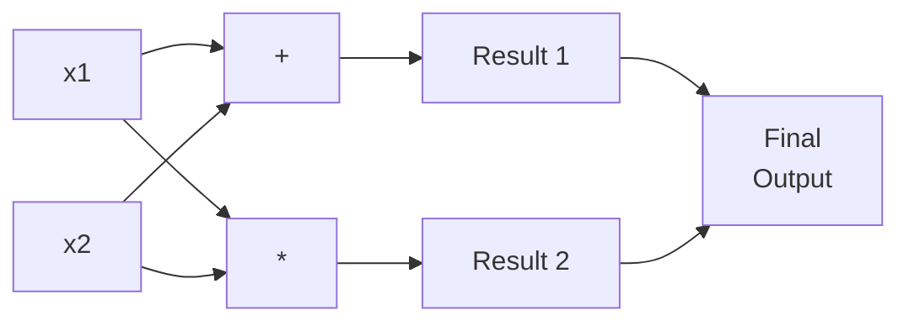
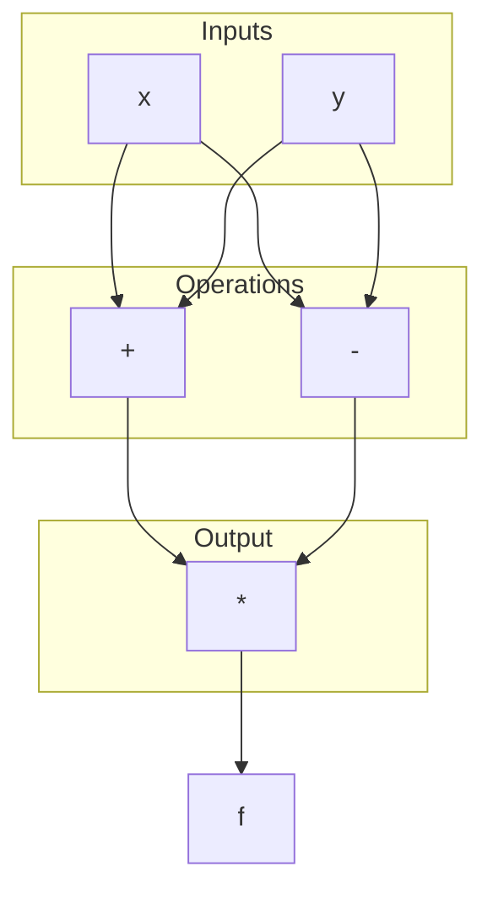
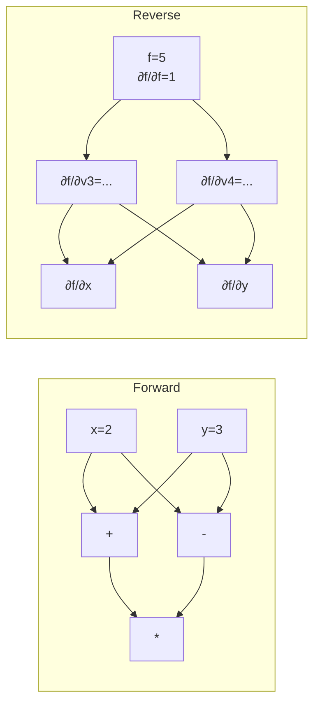
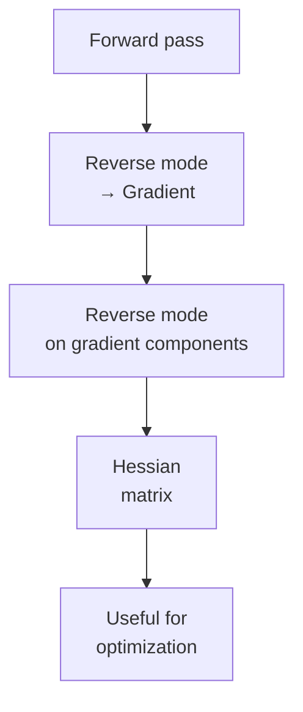

# Automatic Differentiation（自动微分）

## 一、概述

**Automatic Differentiation（自动微分，AD）** 是一种通过**计算图（Computation Graph）** 精确计算导数的技术，介于**符号微分（Symbolic Differentiation）** 与**数值微分（Numerical Differentiation）** 之间。

### 1.1 为什么需要 AD

现代深度学习训练的核心是**反向传播（Backpropagation）**，本质就是自动微分在神经网络上的应用。

| 方法 | 精度 | 速度 | 表达式膨胀 |
|------|------|------|-----------|
| 数值微分 | $O(\varepsilon)$ 误差 | 快 | 无 |
| 符号微分 | 精确 | 慢 | 严重 |
| 自动微分 | 精确 | 快 | 可控 |

### 1.2 基本思想

AD 基于一个简单事实：任何函数都可以分解为一系列**基本操作（Elementary Operations）** 的组合（加减乘除、三角函数、指数等）。通过链式法则（Chain Rule）组合这些操作的导数。

$$
\frac{\partial f}{\partial x} = \frac{\partial f}{\partial u_n} \cdot \frac{\partial u_n}{\partial u_{n-1}} \cdots \frac{\partial u_1}{\partial x}
$$



## 二、计算图

### 2.1 结构

计算图（Computation Graph）是一个有向无环图（DAG，Directed Acyclic Graph），其中：
- **节点（Nodes）**：变量或操作
- **边（Edges）**：数据流依赖关系

$$
f(x, y) = (x + y) \cdot (y - x)
$$



### 2.2 前向传播（Forward Pass）

从输入到输出逐节点计算，同时记录每个节点的值：

| 节点 | 值 | 中间结果 |
|------|-----|---------|
| $v_1 = x$ | 2 | 输入 |
| $v_2 = y$ | 3 | 输入 |
| $v_3 = v_1 + v_2$ | 5 | 加法 |
| $v_4 = v_2 - v_1$ | 1 | 减法 |
| $v_5 = v_3 \cdot v_4$ | 5 | 乘法输出 |

## 三、前向模式 AD

### 3.1 原理

**Forward Mode（前向模式）** 同时计算函数值和导数，从输入向输出传播。

在每个节点同时维护：
- 值（Value）：$v_i$
- 导数（Tangent）：$\dot{v}_i = \frac{\partial v_i}{\partial x}$

$$
\dot{v}_i = \sum_{j \in \text{parents}(i)} \frac{\partial v_i}{\partial v_j} \cdot \dot{v}_j
$$

### 3.2 计算示例

对 $f(x, y) = (x + y)(y - x)$ 计算 $\frac{\partial f}{\partial x}$（设 $x=2, y=3$）：

| 节点 | 值 | $\dot{v} = \partial/\partial x$ |
|------|-----|-------------------------------|
| $v_1 = x$ | 2 | $\dot{v}_1 = 1$ |
| $v_2 = y$ | 3 | $\dot{v}_2 = 0$ |
| $v_3 = v_1 + v_2$ | 5 | $\dot{v}_3 = 1+0 = 1$ |
| $v_4 = v_2 - v_1$ | 1 | $\dot{v}_4 = 0-1 = -1$ |
| $v_5 = v_3 \cdot v_4$ | 5 | $\dot{v}_5 = 1\cdot 1 + 5\cdot(-1) = -4$ |

### 3.3 复杂度

$$
\text{Time} = O(n \cdot m)
$$

其中 $n$ 为输入变量数，$m$ 为总操作数。每次前向传播计算一个偏导。

## 四、反向模式 AD

### 4.1 原理

**Reverse Mode（反向模式）** 是深度学习中使用的核心方法，也是反向传播（Backpropagation）的本质。

1. **前向计算**：计算所有节点的值
2. **反向传播**：从输出向输入传播**伴随值（Adjoint）**

伴随定义为：

$$
\bar{v}_i = \frac{\partial f}{\partial v_i}
$$

反向传播的核心公式：

$$
\bar{v}_i = \sum_{j \in \text{children}(i)} \bar{v}_j \cdot \frac{\partial v_j}{\partial v_i}
$$

### 4.2 计算示例

对 $f(x, y) = (x + y)(y - x)$ 计算 $\nabla f$：



反向传播计算：

| 节点 | 伴随 $\bar{v}$ |
|------|---------------|
| $\bar{v}_5 = \frac{\partial f}{\partial v_5}$ | 1 |
| $\bar{v}_4 = \bar{v}_5 \cdot \frac{\partial v_5}{\partial v_4} = 1 \cdot v_3$ | $v_3 = 5$ |
| $\bar{v}_3 = \bar{v}_5 \cdot \frac{\partial v_5}{\partial v_3} = 1 \cdot v_4$ | $v_4 = 1$ |
| $\bar{v}_1 = \bar{v}_3 \cdot 1 + \bar{v}_4 \cdot (-1)$ | $1 - 5 = -4$ |
| $\bar{v}_2 = \bar{v}_3 \cdot 1 + \bar{v}_4 \cdot 1$ | $1 + 5 = 6$ |

结果：$\nabla f = (-4, 6)$

### 4.3 复杂度

$$
\text{Forward: } O(m), \quad \text{Backward: } O(m)
$$

反向模式的优势：对于 $f: \mathbb{R}^n \to \mathbb{R}$，一次前向 + 一次反向即可计算**所有** $n$ 个偏导，复杂度为 $O(n + m)$。

## 五、两种模式对比

| 特性 | 前向模式 | 反向模式 |
|------|---------|---------|
| 适用场景 | $f: \mathbb{R} \to \mathbb{R}^m$ | $f: \mathbb{R}^n \to \mathbb{R}$ |
| 计算偏导 | 一次一个输入 | 一次所有输入 |
| 内存 | $O(m)$ | $O(m)$（需缓存中间值） |
| 代表应用 | 自动微分测试 | 深度学习训练 |

## 六、Jacobi 矩阵

### 6.1 定义

对于向量函数 $f: \mathbb{R}^n \to \mathbb{R}^m$，Jacobi 矩阵（Jacobian Matrix）定义为：

$$
J = \begin{pmatrix}
\frac{\partial f_1}{\partial x_1} & \cdots & \frac{\partial f_1}{\partial x_n} \\
\vdots & \ddots & \vdots \\
\frac{\partial f_m}{\partial x_1} & \cdots & \frac{\partial f_m}{\partial x_n}
\end{pmatrix}
$$

### 6.2 AD 与 Jacobi

- **前向模式**：计算 **Jacobian-vector Product** $J \cdot v$
- **反向模式**：计算 **Vector-Jacobian Product** $v^T \cdot J$

```mermaid
flowchart TD
    subgraph Forward Mode<br/>J · v
        A1[Seed vector v] --> B1[Each input<br/>dimension]
        B1 --> C1[Propagate<br/>tangents]
        C1 --> D1[J · v result]
    end
    subgraph Reverse Mode<br/>v^T · J
        A2[Seed vector v] --> B2[Each output<br/>dimension]
        B2 --> C2[Propagate<br/>adjoints]
        C2 --> D2[v^T · J result]
    end
```

## 七、实现技术

### 7.1 追踪模式（Tracing-Based）

- **运行时构建计算图**（如 PyTorch 的动态图、TensorFlow Eager）
- 每次前向传播记录操作序列
- 灵活但有一定运行时开销

### 7.2 源代码变换（Source Code Transformation）

- **编译时分析代码并生成导数函数**（如 TensorFlow Graph Mode, JAX）
- 高效但对递归等动态结构支持有限

### 7.3 数据结构

| 结构 | 存储 | 访问 | 适用框架 |
|------|------|------|---------|
| Tape（磁带） | 线性数组 | 顺序 | PyTorch |
| Wengert List | 操作列表 | 顺序 | 早期 AD |
| Expression Tree | 树状 | 递归 | Symbolic |
| DAG | 图结构 | 拓扑序 | JAX, TF |

## 八、高阶导数

### 8.1 Hessian 矩阵

Hessian 是二阶导数的矩阵：

$$
H_{ij} = \frac{\partial^2 f}{\partial x_i \partial x_j}
$$

AD 通过**嵌套自动微分**实现：



### 8.2 计算 Hessian-vector Product

$$
H \cdot v = \nabla (\nabla f \cdot v)
$$

只需两次反向传播，比计算完整 Hessian 高效得多。

## 九、现代框架中的 AD

| 框架 | 模式 | 图类型 | 特性 |
|------|------|--------|------|
| PyTorch | 反向 | 动态图 | 灵活、调试友好 |
| TensorFlow | 反向 | 静态+动态 | 生产部署 |
| JAX | 前向+反向 | 函数式 | JIT 编译、vmap |
| Flux.jl | 反向 | 可选 | Julia 生态 |
| Enzyme | 前向+反向 | LLVM | 语言无关 |

## 十、局限性与前沿

1. **内存瓶颈**：反向模式需要存储所有中间激活值
   - 解决：Gradient Checkpointing（梯度检查点）
2. **二阶优化**：Hessian 计算成本高
   - 解决：Kronecker-Factored Approximate Curvature (K-FAC)
3. **复数导数**：非欧几何中的 AD
4. **不可微算子**：ReLU 的次梯度、Straight-Through Estimator

## 十一、关键公式总结

### 链式法则

$$
\frac{\partial f(g(x))}{\partial x} = f'(g(x)) \cdot g'(x)
$$

### 反向模式核心

$$
\bar{x} = \sum_{y \in \text{children}(x)} \bar{y} \cdot \frac{\partial y}{\partial x}
$$

### 前向模式核心

$$
\dot{y} = \sum_{x \in \text{parents}(y)} \frac{\partial y}{\partial x} \cdot \dot{x}
$$

---

[[05_ComputerScience/ArtificialIntelligence/INDEX|当前目录索引]]
