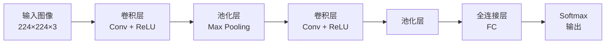

# 计算机视觉 (Computer Vision)

## 一、图像形成与表示

数字图像在计算机中以矩阵形式表示。对于灰度图像，每个像素的强度值 $I(x,y)$ 构成二维矩阵；对于彩色图像，通常采用 RGB 三通道表示：

$$
I(x,y) = [R(x,y), G(x,y), B(x,y)]^T
$$

图像分辨率表示为 $H \times W \times C$，其中 $H$ 为高度，$W$ 为宽度，$C$ 为通道数。

### 图像采样与量化

| 概念 | 说明 | 典型值 |
|------|------|--------|
| 空间采样 (Spatial Sampling) | 决定图像分辨率 | 1920×1080 |
| 灰度量化 (Gray Quantization) | 决定灰度级数 | 8-bit (256级) |
| 色彩深度 (Color Depth) | 每像素比特数 | 24-bit (真彩色) |

### 颜色空间

| 颜色空间 | 表示 | 用途 |
|----------|------|------|
| RGB | 红绿蓝加色模型 | 显示器、相机 |
| HSV | 色调/饱和度/明度 | 图像分割 |
| Lab | 感知均匀色彩空间 | 颜色度量 |
| YCbCr | 亮度+色度 | 视频压缩 |

## 二、图像处理基础

### 2.1 图像滤波 (Image Filtering)

滤波操作通过卷积核 (Kernel/Filter) 在图像上滑动：

$$g(x,y) = \sum_{i=-k}^{k} \sum_{j=-k}^{k} f(x+i, y+j) \cdot w(i,j)$$

| 滤波器 | 核 | 效果 |
|--------|-----|------|
| 均值滤波 | $\frac{1}{9}\begin{bmatrix}1&1&1\\1&1&1\\1&1&1\end{bmatrix}$ | 平滑/去噪 |
| 高斯滤波 | 高斯函数离散近似 | 保留边缘的平滑 |
| 中值滤波 | 取邻域中值 | 去除椒盐噪声 |
| Sobel | $\begin{bmatrix}-1&0&1\\-2&0&2\\-1&0&1\end{bmatrix}$ | 边缘检测 |

### 2.2 边缘检测 (Edge Detection)

#### Canny 边缘检测


梯度计算：
$$G = \sqrt{G_x^2 + G_y^2}, \quad \theta = \arctan(G_y / G_x)$$

## 三、特征提取 (Feature Extraction)

### 3.1 局部特征

| 特征 | 描述 | 不变性 |
|------|------|--------|
| SIFT | 尺度不变特征变换 | 尺度、旋转、光照 |
| SURF | 加速鲁棒特征 | 尺度、旋转 |
| ORB | 定向 FAST + BRIEF | 旋转（计算快）|
| HOG | 方向梯度直方图 | 光照、局部形状 |

### 3.2 特征匹配 (Feature Matching)

$$\text{最近邻距离比: } \frac{d_1}{d_2} < \text{threshold}$$

匹配策略：
1. **暴力匹配** (Brute Force)：计算所有特征对距离
2. **FLANN**：近似最近邻搜索，快速匹配大规模特征
3. **RANSAC**：随机采样一致性，去除错误匹配并估计变换

### 3.3 图像变换

$$H = \begin{bmatrix} h_{11} & h_{12} & h_{13} \\ h_{21} & h_{22} & h_{23} \\ h_{31} & h_{32} & h_{33} \end{bmatrix}$$

| 变换 | 自由度 | 性质 |
|------|--------|------|
| 平移 (Translation) | 2 | 保持方向 |
| 旋转 (Rotation) | 1 | 保持角度 |
| 相似 (Similarity) | 4 | 保持形状 |
| 仿射 (Affine) | 6 | 保持平行线 |
| 射影 (Projective) | 8 | 保持共线性 |

## 四、卷积神经网络 (CNN)

### 4.1 基本结构



### 4.2 卷积操作

卷积输出尺寸计算：
$$O = \frac{W - F + 2P}{S} + 1$$

其中 $W$ 为输入尺寸，$F$ 为卷积核尺寸，$P$ 为填充 (Padding)，$S$ 为步长 (Stride)。

### 4.3 经典 CNN 架构

| 架构 | 年份 | 特点 |
|------|------|------|
| LeNet-5 | 1998 | 手写数字识别 |
| AlexNet | 2012 | ReLU + Dropout + GPU |
| VGGNet | 2014 | 小卷积核堆叠 |
| GoogLeNet (Inception) | 2014 | Inception 模块 |
| ResNet | 2015 | 残差连接 (Skip Connection) |
| DenseNet | 2017 | 密集连接 |
| MobileNet | 2017 | 深度可分离卷积 |

### 4.4 残差连接 (Residual Connection)

$$y = F(x) + x$$

其中 $F(x)$ 是残差映射，$x$ 是恒等映射。解决深层网络的退化问题。

## 五、目标检测 (Object Detection)

### 5.1 两阶段检测器

```
R-CNN 家族:
1. 选择性搜索生成候选区域
2. 对每个区域进行 CNN 特征提取
3. 分类 + 边框回归
```

| 模型 | mAP | FPS | 特点 |
|------|-----|-----|------|
| R-CNN | ~58% | 慢 | 候选框+CNN+SVM |
| Fast R-CNN | ~70% | 快 | RoI Pooling |
| Faster R-CNN | ~76% | 更快 | RPN 网络 |

### 5.2 单阶段检测器

```
YOLO / SSD:
1. 直接回归边界框和类别
2. 一次前向传播完成检测
3. 速度远快于两阶段
```

YOLO 的核心思想：
- 将图像划分为 $S \times S$ 网格
- 每个网格预测 $B$ 个边界框和 $C$ 个类别概率
- 损失函数：位置损失 + 置信度损失 + 分类损失

## 六、图像分割 (Image Segmentation)

### 6.1 语义分割 (Semantic Segmentation)

为每个像素分配类别标签：


| 模型 | 年份 | 特点 |
|------|------|------|
| FCN | 2015 | 全卷积网络 |
| U-Net | 2015 | 跳跃连接 (Skip Connection) |
| DeepLab | 2016 | 空洞卷积 (Atrous Conv) |
| Mask R-CNN | 2017 | 实例分割 |

### 6.2 实例分割 (Instance Segmentation)

实例分割区分同一类别的不同个体：
- **Mask R-CNN**：Faster R-CNN + FCN 分支
- 输出：每个实例的边界框 + 分割掩码
- 评价指标：mAP (Mask AP)

## 七、生成模型

### 7.1 生成对抗网络 (GAN)

$$\min_G \max_D V(D, G) = \mathbb{E}_{x \sim p_{data}}[\log D(x)] + \mathbb{E}_{z \sim p_z}[\log(1 - D(G(z)))]$$

应用：
- 图像超分辨率 (SRGAN)
- 图像翻译 (Pix2Pix, CycleGAN)
- 图像生成 (StyleGAN)

### 7.2 扩散模型 (Diffusion Models)

前向加噪 + 反向去噪：
$$x_t = \sqrt{1 - \beta_t} \cdot x_{t-1} + \sqrt{\beta_t} \cdot \epsilon$$

## 八、计算机视觉应用

| 应用领域 | 任务 | 技术 |
|----------|------|------|
| 自动驾驶 | 车道检测、行人检测 | YOLO, DeepLab |
| 医学影像 | 病灶分割、CT重建 | U-Net, ResNet |
| 人脸识别 | 检测、对齐、识别 | FaceNet, ArcFace |
| 增强现实 | SLAM、3D重建 | ORB-SLAM, NeRF |
| 工业质检 | 缺陷检测 | 分类+分割模型 |

## 九、评估指标

| 指标 | 公式 | 用途 |
|------|------|------|
| 准确率 (Accuracy) | (TP+TN)/(P+N) | 分类 |
| 精确率 (Precision) | TP/(TP+FP) | 检测 |
| 召回率 (Recall) | TP/(TP+FN) | 检测 |
| mAP | AP 的均值 | 检测/分割 |
| IoU | 交集/并集 | 分割 |
| F1-Score | 2PR/(P+R) | 综合评估 |

### 混淆矩阵

| 真实\预测 | 正类 | 负类 |
|----------|------|------|
| 正类 | TP | FN |
| 负类 | FP | TN |

## 十、最新进展

1. **Vision Transformer (ViT)**：将 Transformer 应用于图像分类
2. **Swin Transformer**：层级式 Transformer 架构
3. **MAE (Masked Autoencoder)**：自监督视觉预训练
4. **多模态视觉语言模型**：CLIP, BLIP, SAM
5. **NeRF (Neural Radiance Fields)**：神经渲染与3D重建
6. **Foundation Models in CV**：SAM, DINOv2 等通用视觉模型
