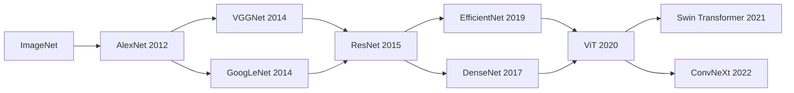

# 计算机视觉概述 (Computer Vision Overview)

## 一、引言

计算机视觉 (Computer Vision, CV) 是人工智能的重要分支，致力于让计算机从图像和视频中获取高层语义理解，模拟人类视觉系统。核心任务涵盖图像分类、目标检测、语义分割、实例分割、图像生成等。

## 二、图像处理基础 (Image Processing)

### 2.1 像素表示

数字图像表示为 $H \times W \times C$ 的张量，其中 $H$ 为高度，$W$ 为宽度，$C$ 为通道数 (灰度图 $C=1$，RGB 图 $C=3$)。

### 2.2 基本操作

| 操作 | 说明 | 公式/方法 |
|------|------|----------|
| 卷积滤波 | 空间域滤波 | $G(i,j) = \sum_m \sum_n F(m,n) I(i+m, j+n)$ |
| 高斯模糊 | 去噪 | $G(x,y) = \frac{1}{2\pi\sigma^2} e^{-(x^2+y^2)/(2\sigma^2)}$ |
| 边缘检测 | 梯度提取 | Sobel、Canny、Laplacian 算子 |
| 直方图均衡 | 增强对比度 | 映射像素分布到均匀分布 |
| 形态学操作 | 膨胀、腐蚀 | 结构元素滑动，二值图像处理 |

## 三、特征提取 (Feature Extraction)

### 3.1 传统特征

| 特征 | 描述 | 不变性 |
|------|------|--------|
| SIFT | 尺度不变特征变换 | 尺度、旋转、光照 |
| SURF | SIFT 加速版 | 尺度、旋转 |
| HOG | 方向梯度直方图 | 光照、局部形状 |
| ORB | 二进制描述子，FAST + BRIEF | 旋转 (无尺度) |

### 3.2 深度学习特征

现代 CV 使用 CNN 或 Vision Transformer (ViT) 自动学习层次化特征，低层学习边缘/纹理，高层学习语义概念。

## 四、图像分类 (Image Classification)

### 4.1 经典架构

| 模型 | 创新 | ImageNet Top-1 错误率 |
|------|------|----------------------|
| AlexNet | ReLU + Dropout + GPU 训练 | 15.3% (Top-5) |
| VGG-16 | 小卷积核 (3×3) 堆叠 | 7.3% (Top-5) |
| ResNet-152 | 残差学习，152 层 | 3.57% (Top-5) |
| EfficientNet-B7 | NAS 联合搜索深度/宽度/分辨率 | 2.9% (Top-5) |
| ViT-L/16 | 纯 Transformer，无 CNN 归纳偏置 | 对比 CNN 相当 |

## 五、目标检测 (Object Detection)

### 5.1 两阶段检测器 (Two-Stage)

首先生成候选区域 (Region Proposals)，再对每个区域分类和回归边界框：

| 模型 | 年份 | 特点 |
|------|------|------|
| R-CNN | 2014 | Selective Search + CNN + SVM |
| Fast R-CNN | 2015 | RoI Pooling，共享卷积计算 |
| Faster R-CNN | 2015 | RPN (Region Proposal Network)，端到端 |
| Mask R-CNN | 2017 | 增加分割分支，实例分割 |

### 5.2 单阶段检测器 (One-Stage)

直接在特征图上预测类别和边界框：

| 模型 | 年份 | 核心思路 |
|------|------|---------|
| YOLO (You Only Look Once) | 2016 | 网格划分 + 回归 |
| SSD (Single Shot Detector) | 2016 | 多尺度特征图预测 |
| RetinaNet | 2017 | Focal Loss 解决类别不平衡 |
| YOLOv8 | 2023 | Anchor-Free + 多尺度融合 |

## 六、图像分割 (Image Segmentation)

### 6.1 语义分割 (Semantic Segmentation)

每个像素赋予类别标签：

| 模型 | 核心思想 |
|------|---------|
| FCN (Fully Convolutional Network) | 全卷积，反卷积上采样 |
| U-Net | 编码器-解码器 + 跳跃连接 |
| DeepLab | 空洞卷积 + ASPP 多尺度 |
| SegFormer | Transformer 编码器 + MLP 解码器 |

### 6.2 实例分割 (Instance Segmentation)

区分同类不同个体：Mask R-CNN 在 Faster R-CNN 基础上增加掩码预测分支。

## 七、生成对抗网络 (GANs)

### 7.1 基本思想

生成器 $G$ 和判别器 $D$ 相互博弈：

$$
\min_G \max_D V(D, G) = \mathbb{E}_{x \sim p_{\text{data}}}[\log D(x)] + \mathbb{E}_{z \sim p_z}[\log(1 - D(G(z)))]
$$

### 7.2 经典 GAN 变体

| 模型 | 改进 |
|------|------|
| DCGAN | CNN 架构，卷积替代全连接 |
| Conditional GAN (cGAN) | 条件生成，控制输出类别 |
| Pix2Pix | 图像到图像翻译，成对数据 |
| CycleGAN | 无配对数据，循环一致性损失 |
| StyleGAN | 风格控制，解耦特征 |
| Stable Diffusion | 潜在扩散模型，文本到图像 |

## 八、评估指标

| 任务 | 指标 | 说明 |
|------|------|------|
| 分类 | Top-1 / Top-5 Accuracy | 预测类别的命中率 |
| 检测 | mAP (Mean Average Precision) | 不同 IoU 阈值下的平均精度 |
| 分割 | mIoU (Mean Intersection over Union) | 预测与真值的区域重叠度 |
| 生成 | FID (Fréchet Inception Distance) | 生成图像分布的真实性 |
| 生成 | IS (Inception Score) | 生成图像的多样性和质量 |

## 九、代表性数据集

| 数据集 | 任务 | 规模 |
|--------|------|------|
| ImageNet | 分类、检测 | 1400 万+ 图像，1000 类 |
| COCO | 检测、分割、关键点 | 33 万图像，80 类 |
| Cityscapes | 街景语义分割 | 5000 精细标注，2 万粗略 |
| CIFAR-10/100 | 小尺寸分类 | 6 万 32×32 图像 |
| MNIST | 手写数字识别 | 7 万 28×28 图像 |

## 十、应用领域

- **自动驾驶**：车道检测、行人识别、交通标志识别、障碍物避让
- **医学影像**：病灶分割、X 光/CT/MRI 辅助诊断、细胞检测
- **安防监控**：人脸识别、行为分析、异常检测、人群计数
- **工业质检**：表面缺陷检测、尺寸测量、装配验证
- **AR/VR**：姿态估计、场景重建、3D 渲染

## 相关条目

- [[深度学习基础|深度学习 (Deep Learning)]]
- [[卷积与循环神经网络|卷积神经网络 (CNN)]]
- [[MachineLearning]]
- [[GANs]]
- [[AIGC]]
