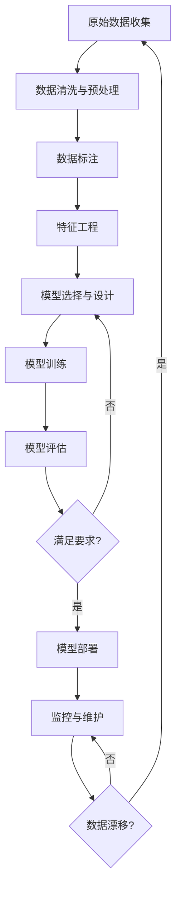
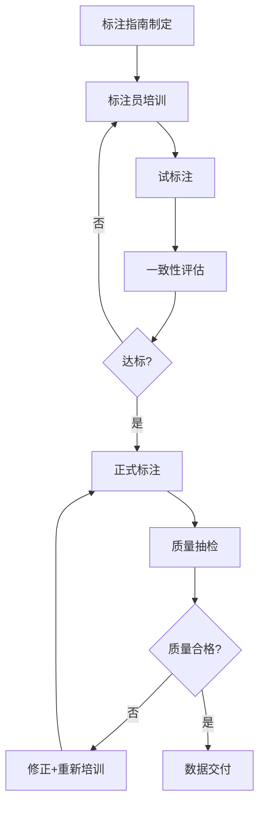
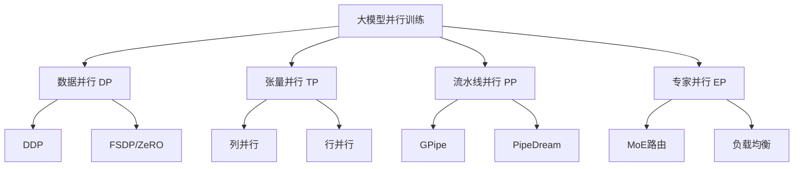

# AI 训练工作流 (AI Training Workflows)

## 一、概述

AI 模型训练是一个系统性工程，涵盖从原始数据收集到模型部署的完整流水线。本文档详细描述现代 AI 训练的端到端流程，包括数据采集、清洗、标注、特征工程、模型训练、GPU 加速、分布式训练和 MLOps 等关键环节。

### 1.1 端到端训练流程



### 1.2 训练流水线各阶段耗时占比

| 阶段 | 耗时占比 | 主要挑战 |
|------|---------|---------|
| 数据收集 | 10-15% | 数据质量、数据量 |
| 数据清洗 | 15-25% | 缺失值、异常值、重复 |
| 数据标注 | 20-30% | 成本、质量、一致性 |
| 特征工程 | 10-15% | 领域知识、自动化 |
| 模型训练 | 15-25% | 算力、超参调优 |
| 评估部署 | 5-10% | 泛化性、延迟 |

---

## 二、数据采集与管理

### 2.1 数据来源

| 数据类型 | 来源 | 示例 |
|---------|------|------|
| **公开数据集** | 学术机构、竞赛平台 | ImageNet, COCO, Common Crawl |
| **爬虫数据** | 网页抓取 | 新闻、社交媒体、论坛 |
| **业务数据** | 企业内部系统 | 用户行为、交易记录 |
| **传感器数据** | IoT设备 | 温度、湿度、图像 |
| **合成数据** | AI生成 | GPT生成文本、扩散模型生成图像 |
| **众包数据** | 标注平台 | Amazon Mechanical Turk, Scale AI |

### 2.2 数据存储格式

| 格式 | 特点 | 适用场景 |
|------|------|---------|
| **CSV/TSV** | 简单、通用 | 结构化表格数据 |
| **JSON/JSONL** | 灵活、嵌套 | 文本、日志数据 |
| **Parquet** | 列式存储、压缩 | 大规模数据分析 |
| **HDF5** | 层次化、高效I/O | 科学计算、多维数组 |
| **TFRecord** | TensorFlow原生 | TensorFlow训练管道 |
| **WebDataset** | tar归档、流式 | 大规模分布式训练 |
| **Arrow** | 内内存列式 | 高性能数据处理 |

### 2.3 数据版本控制

| 工具 | 特点 | 适用场景 |
|------|------|---------|
| **DVC** | Git-like、与Git集成 | ML项目数据版本控制 |
| **LakeFS** | Git-like数据湖 | 大规模数据湖 |
| **Delta Lake** | ACID事务 | Spark生态 |
| **Pachyderm** | 数据管道+版本控制 | 端到端ML管道 |

**DVC 基本操作**：

```bash
# 初始化
dvc init

# 添加数据文件
dvc add data/dataset.csv

# 推送到远程存储
dvc push

# 切换到特定版本
git checkout v1.0
dvc checkout

# 比较不同版本
dvc diff v1.0 v2.0
```

### 2.4 数据管理最佳实践

1. **数据目录**：维护数据字典，记录每个字段的含义、类型、来源
2. **数据血缘**：追踪数据从源到特征的完整变换链路
3. **数据质量监控**：定期检查数据分布、缺失率、异常比例
4. **数据安全**：敏感数据脱敏、访问权限控制、审计日志

---

## 三、数据清洗与预处理

### 3.1 缺失值处理

| 策略 | 方法 | 适用场景 |
|------|------|---------|
| **删除** | 删除含缺失值的行/列 | 缺失比例低（<5%） |
| **均值/中位数/众数填充** | 统计量填充 | 数值型/类别型特征 |
| **插值填充** | 线性插值、时间序列插值 | 时序数据 |
| **模型预测填充** | KNN、随机森林预测 | 缺失模式有规律 |
| **标记缺失** | 添加缺失指示特征 | 缺失本身有信息 |

```python
import pandas as pd
from sklearn.impute import SimpleImputer, KNNImputer

# 均值填充
imputer = SimpleImputer(strategy='mean')
df_filled = pd.DataFrame(imputer.fit_transform(df), columns=df.columns)

# KNN填充
knn_imputer = KNNImputer(n_neighbors=5)
df_knn = pd.DataFrame(knn_imputer.fit_transform(df), columns=df.columns)
```

### 3.2 异常值检测

| 方法 | 原理 | 适用场景 |
|------|------|---------|
| **Z-Score** | 偏离均值的标准差数 | 正态分布数据 |
| **IQR** | 四分位距方法 | 非正态分布数据 |
| **Isolation Forest** | 随机分割隔离 | 高维数据 |
| **DBSCAN** | 密度聚类 | 空间数据 |
| **LOF** | 局部密度偏差 | 非均匀密度数据 |

```python
from sklearn.ensemble import IsolationForest

# Isolation Forest
iso_forest = IsolationForest(contamination=0.05, random_state=42)
outliers = iso_forest.fit_predict(X)
# outliers: 1=正常, -1=异常
```

### 3.3 数据去重

| 去重级别 | 方法 | 工具 |
|---------|------|------|
| **精确去重** | 哈希比对 | MD5, SHA256 |
| **近似去重** | MinHash + LSH | datasketch |
| **语义去重** | 嵌入向量相似度 | FAISS, Annoy |

```python
from datasketch import MinHash, MinHashLSH

# MinHash近似去重
def create_minhash(text, num_perm=128):
    m = MinHash(num_perm=num_perm)
    for word in text.split():
        m.update(word.encode('utf8'))
    return m

# LSH索引
lsh = MinHashLSH(threshold=0.5, num_perm=128)
```

### 3.4 数据质量评估

| 指标 | 计算方法 | 阈值建议 |
|------|---------|---------|
| **完整性** | 非空值数/总值数 | >95% |
| **一致性** | 格式正确值数/总值数 | >99% |
| **准确性** | 正确值数/总值数 | >99% |
| **时效性** | 最新数据时间戳 | 依业务而定 |
| **唯一性** | 非重复记录数/总记录数 | >99% |

---

## 四、数据标注

### 4.1 标注任务类型

| 任务 | 描述 | 应用场景 |
|------|------|---------|
| **图像分类** | 图像级别标签 | 图像识别、场景分类 |
| **目标检测** | 边界框+类别 | 自动驾驶、安防 |
| **语义分割** | 像素级标签 | 医学影像、遥感 |
| **文本分类** | 文本级别标签 | 情感分析、垃圾检测 |
| **命名实体识别** | 实体边界+类型 | 信息抽取 |
| **关系抽取** | 实体对+关系类型 | 知识图谱 |
| **文本生成** | 输入-输出对 | 指令微调数据 |
| **音频转写** | 语音-文本对 | 语音识别 |

### 4.2 标注工具

| 工具 | 类型 | 特点 | 开源 |
|------|------|------|------|
| **Label Studio** | 通用标注 | 多模态、可扩展 | 是 |
| **CVAT** | 计算机视觉 | 视频标注、团队协作 | 是 |
| **Labelbox** | 商业平台 | 企业级、自动化 | 否 |
| **Scale AI** | 众包平台 | 大规模、高质量 | 否 |
| **Prodigy** | NLP标注 | 主动学习集成 | 否 |
| **Doccano** | NLP标注 | 简单易用 | 是 |
| **LabelImg** | 目标检测 | 轻量级 | 是 |

**Label Studio 安装与使用**：

```bash
# 安装
pip install label-studio

# 启动服务
label-studio start

# 创建项目并导入数据
# 支持: 图像、文本、音频、视频、HTML等
```

### 4.3 标注质量保证

#### 标注一致性评估

| 指标 | 公式 | 适用场景 |
|------|------|---------|
| **Cohen's Kappa** | $\kappa = \frac{p_o - p_e}{1 - p_e}$ | 两人标注 |
| **Fleiss' Kappa** | 扩展到多人 | 多人标注 |
| **Krippendorff's Alpha** | 通用一致性 | 多种数据类型 |
| **IoU** | 交并比 | 目标检测、分割 |

#### 标注流程



### 4.4 主动学习 (Active Learning)

主动学习通过智能选择最有价值的样本进行标注，减少标注成本：

| 策略 | 描述 | 公式 |
|------|------|------|
| **不确定性采样** | 选择模型最不确定的样本 | $x^* = \arg\max_x H(y|x)$ |
| **多样性采样** | 选择最具代表性的样本 | $x^* = \arg\max_x d(x, S)$ |
| **委员会查询** | 多模型投票分歧最大的样本 | $x^* = \arg\max_x \text{Vote}(x)$ |

```python
from modAL.models import ActiveLearner
from modAL.uncertainty import uncertainty_sampling

# 主动学习器
learner = ActiveLearner(
    estimator=RandomForestClassifier(),
    query_strategy=uncertainty_sampling,
    X_training=X_initial, y_training=y_initial
)

# 查询最不确定的样本
query_idx, query_inst = learner.query(X_pool)
```

### 4.5 合成数据生成

| 方法 | 描述 | 工具 |
|------|------|------|
| **数据增强** | 图像变换、文本改写 | Albumentations, nlpaug |
| **LLM生成** | 使用大模型生成训练数据 | GPT-4, Claude |
| **扩散模型** | 生成图像数据 | Stable Diffusion |
| **GAN** | 生成对抗网络 | StyleGAN |
| **仿真环境** | 3D渲染生成数据 | NVIDIA Omniverse |

---

## 五、特征工程

### 5.1 数值特征处理

| 方法 | 公式 | 适用场景 |
|------|------|---------|
| **标准化** | $z = \frac{x - \mu}{\sigma}$ | 正态分布数据 |
| **归一化** | $x' = \frac{x - x_{min}}{x_{max} - x_{min}}$ | 有界数据 |
| **对数变换** | $x' = \log(x + 1)$ | 右偏数据 |
| **Box-Cox变换** | $x' = \frac{x^\lambda - 1}{\lambda}$ | 非正态数据 |
| **分箱** | 离散化连续变量 | 非线性关系 |

### 5.2 类别特征编码

| 方法 | 描述 | 适用场景 |
|------|------|---------|
| **One-Hot** | 独立二进制列 | 低基数类别 |
| **Label Encoding** | 整数编码 | 有序类别 |
| **Target Encoding** | 目标变量均值 | 高基数类别 |
| **Embedding** | 神经网络学习 | 深度学习 |
| **Hash Encoding** | 哈希映射 | 超高基数 |

### 5.3 文本特征提取

| 方法 | 描述 | 维度 |
|------|------|------|
| **TF-IDF** | 词频-逆文档频率 | 词表大小 |
| **Word2Vec** | 词嵌入 | 100-300 |
| **BERT Embedding** | 上下文嵌入 | 768-1024 |
| **Sentence-BERT** | 句子嵌入 | 768 |

### 5.4 特征存储 (Feature Store)

| 工具 | 类型 | 特点 |
|------|------|------|
| **Feast** | 开源 | 与模型无关、在线/离线 |
| **Tecton** | 商业 | 实时特征、托管服务 |
| **Hopsworks** | 开源 | 端到端ML平台 |
| **Amazon SageMaker Feature Store** | 云服务 | AWS集成 |

```python
from feast import FeatureStore

# 初始化Feature Store
store = FeatureStore(repo_path=".")

# 获取在线特征
features = store.get_online_features(
    features=["user_features:age", "user_features:purchase_count"],
    entity_rows=[{"user_id": 123}]
).to_dict()
```

---

## 六、模型训练

### 6.1 训练循环

```python
import torch
import torch.nn as nn
import torch.optim as optim
from torch.utils.data import DataLoader

# 定义模型
model = nn.Sequential(
    nn.Linear(784, 256),
    nn.ReLU(),
    nn.Dropout(0.2),
    nn.Linear(256, 10)
)

# 定义损失函数和优化器
criterion = nn.CrossEntropyLoss()
optimizer = optim.AdamW(model.parameters(), lr=1e-3, weight_decay=0.01)
scheduler = optim.lr_scheduler.CosineAnnealingLR(optimizer, T_max=100)

# 训练循环
for epoch in range(num_epochs):
    model.train()
    for batch_idx, (data, target) in enumerate(train_loader):
        optimizer.zero_grad()
        output = model(data)
        loss = criterion(output, target)
        loss.backward()
        torch.nn.utils.clip_grad_norm_(model.parameters(), max_norm=1.0)
        optimizer.step()
        scheduler.step()
```

### 6.2 优化器对比

| 优化器 | 公式 | 特点 | 适用场景 |
|--------|------|------|---------|
| **SGD** | $\theta = \theta - \eta \nabla J$ | 简单、收敛慢 | 凸优化 |
| **SGD+Momentum** | $v = \beta v + \eta \nabla J$ | 加速收敛 | 通用 |
| **Adam** | 自适应学习率 | 快速收敛 | 通用默认 |
| **AdamW** | 解耦权重衰减 | 更好泛化 | 大模型训练 |
| **LAMB** | 层自适应 | 大batch训练 | 大规模分布式 |

### 6.3 学习率调度

| 策略 | 描述 | 适用场景 |
|------|------|---------|
| **StepLR** | 固定步长衰减 | 基础实验 |
| **CosineAnnealing** | 余弦退火 | 通用训练 |
| **OneCycleLR** | 单周期策略 | 快速训练 |
| **Warmup+Decay** | 预热后衰减 | 大模型训练 |
| **ReduceLROnPlateau** | 验证损失 plateau | 自适应调整 |

```python
# Warmup + Cosine Decay
def get_cosine_schedule_with_warmup(optimizer, num_warmup_steps, num_training_steps):
    def lr_lambda(current_step):
        if current_step < num_warmup_steps:
            return float(current_step) / float(max(1, num_warmup_steps))
        progress = float(current_step - num_warmup_steps) / float(max(1, num_training_steps - num_warmup_steps))
        return max(0.0, 0.5 * (1.0 + math.cos(math.pi * progress)))
    return torch.optim.lr_scheduler.LambdaLR(optimizer, lr_lambda)
```

### 6.4 正则化技术

| 技术 | 描述 | 公式/方法 |
|------|------|---------|
| **L1正则化** | 权重绝对值惩罚 | $\lambda \sum |w_i|$ |
| **L2正则化** | 权重平方惩罚 | $\lambda \sum w_i^2$ |
| **Dropout** | 随机丢弃神经元 | $p$ 为丢弃概率 |
| **BatchNorm** | 批次归一化 | $\hat{x} = \frac{x - \mu_B}{\sqrt{\sigma_B^2 + \epsilon}}$ |
| **LayerNorm** | 层归一化 | Transformer标准 |
| **Early Stopping** | 验证损失不再下降时停止 | patience 参数 |
| **Data Augmentation** | 数据增强 | 图像变换、文本改写 |
| **Label Smoothing** | 软化标签 | $y' = (1-\epsilon)y + \epsilon/K$ |
| **Mixup** | 样本混合 | $\tilde{x} = \lambda x_i + (1-\lambda)x_j$ |

### 6.5 实验追踪

| 工具 | 特点 | 适用场景 |
|------|------|---------|
| **MLflow** | 开源、全功能 | 通用ML项目 |
| **Weights & Biases** | 可视化优秀 | 深度学习研究 |
| **TensorBoard** | TensorFlow集成 | TensorFlow/PyTorch |
| **Neptune** | 轻量级 | 研究项目 |
| **ClearML** | 端到端 | 企业ML |

```python
import mlflow

# MLflow实验追踪
mlflow.set_experiment("my_experiment")

with mlflow.start_run():
    # 记录参数
    mlflow.log_params({
        "learning_rate": 1e-3,
        "batch_size": 32,
        "epochs": 100
    })
    
    # 训练循环
    for epoch in range(100):
        train_loss = train_one_epoch()
        val_loss = validate()
        
        # 记录指标
        mlflow.log_metrics({
            "train_loss": train_loss,
            "val_loss": val_loss,
            "learning_rate": scheduler.get_last_lr()[0]
        }, step=epoch)
    
    # 保存模型
    mlflow.pytorch.log_model(model, "model")
```

### 6.6 检查点管理

```python
import torch

# 保存检查点
def save_checkpoint(model, optimizer, epoch, loss, path):
    torch.save({
        'epoch': epoch,
        'model_state_dict': model.state_dict(),
        'optimizer_state_dict': optimizer.state_dict(),
        'loss': loss,
    }, path)

# 加载检查点
def load_checkpoint(model, optimizer, path):
    checkpoint = torch.load(path)
    model.load_state_dict(checkpoint['model_state_dict'])
    optimizer.load_state_dict(checkpoint['optimizer_state_dict'])
    epoch = checkpoint['epoch']
    loss = checkpoint['loss']
    return epoch, loss

# 保存最佳模型
if val_loss < best_loss:
    best_loss = val_loss
    save_checkpoint(model, optimizer, epoch, val_loss, "best_model.pt")
```

---

## 七、GPU 加速与硬件优化

### 7.1 GPU 硬件对比

| GPU | 架构 | 显存 | FP16算力 | 功耗 | 适用场景 |
|-----|------|------|---------|------|---------|
| **H100** | Hopper | 80GB HBM3 | 989 TFLOPS | 700W | 大模型训练 |
| **H200** | Hopper | 141GB HBM3e | 989 TFLOPS | 700W | 大模型推理 |
| **B200** | Blackwell | 192GB HBM3e | 2250 TFLOPS | 1000W | 下一代训练 |
| **A100** | Ampere | 80GB HBM2e | 312 TFLOPS | 400W | 通用训练 |
| **L40S** | Ada | 48GB GDDR6X | 362 TFLOPS | 350W | 推理/轻量训练 |
| **RTX 4090** | Ada | 24GB GDDR6X | 330 TFLOPS | 450W | 研究/小规模训练 |

### 7.2 CUDA 基础

```python
import torch

# 检查CUDA可用性
print(f"CUDA available: {torch.cuda.is_available()}")
print(f"CUDA devices: {torch.cuda.device_count()}")
print(f"Current device: {torch.cuda.current_device()}")
print(f"Device name: {torch.cuda.get_device_name(0)}")

# 将模型移到GPU
model = model.to('cuda')

# 将数据移到GPU
data = data.to('cuda')
target = target.to('cuda')

# 多GPU指定设备
device = torch.device('cuda:0' if torch.cuda.is_available() else 'cpu')
```

### 7.3 显存管理

#### 显存占用计算

$$
\text{模型参数显存} = \text{参数量} \times \text{每个参数字节数}
$$

| 精度 | 字节数 | 1B参数显存 |
|------|--------|-----------|
| FP32 | 4 | 4GB |
| FP16/BF16 | 2 | 2GB |
| INT8 | 1 | 1GB |
| INT4 | 0.5 | 0.5GB |

#### 训练显存组成

$$
\text{总显存} = \text{模型参数} + \text{梯度} + \text{优化器状态} + \text{激活值}
$$

| 组件 | FP32训练 | 混合精度训练 |
|------|---------|-------------|
| 模型参数 | 4N bytes | 2N bytes |
| 梯度 | 4N bytes | 2N bytes |
| 优化器状态(Adam) | 8N bytes | 8N bytes |
| 激活值 | 动态 | 动态 |

**示例**：训练 7B 参数模型（混合精度 + Adam）

$$
\text{显存} = 2 \times 7 + 2 \times 7 + 8 \times 7 + \text{激活值} = 84\text{GB} + \text{激活值}
$$

#### 显存优化技巧

```python
# 1. 梯度累积
optimizer.zero_grad()
for i, (data, target) in enumerate(micro_batches):
    output = model(data)
    loss = criterion(output, target) / accumulation_steps
    loss.backward()
    if (i + 1) % accumulation_steps == 0:
        optimizer.step()
        optimizer.zero_grad()

# 2. 梯度检查点
from torch.utils.checkpoint import checkpoint
output = checkpoint(model.layer, input)

# 3. 原生混合精度训练
from torch.cuda.amp import autocast, GradScaler
scaler = GradScaler()

with autocast():
    output = model(data)
    loss = criterion(output, target)

scaler.scale(loss).backward()
scaler.step(optimizer)
scaler.update()
```

### 7.4 性能分析工具

| 工具 | 功能 | 使用场景 |
|------|------|---------|
| **PyTorch Profiler** | CPU/GPU性能分析 | 瓶颈定位 |
| **NVIDIA Nsight Systems** | 系统级分析 | GPU利用率 |
| **NVIDIA Nsight Compute** | 内核级分析 | CUDA优化 |
| **torch.utils.benchmark** | 微基准测试 | 代码性能对比 |

```python
from torch.profiler import profile, record_function, ProfilerActivity

with profile(
    activities=[ProfilerActivity.CPU, ProfilerActivity.CUDA],
    schedule=torch.profiler.schedule(wait=1, warmup=1, active=3, repeat=2),
    on_trace_ready=torch.profiler.tensorboard_trace_handler('./log'),
    record_shapes=True,
    profile_memory=True,
    with_stack=True
) as prof:
    for step, (data, target) in enumerate(train_loader):
        if step >= 10:
            break
        with record_function("model_inference"):
            output = model(data)
        loss = criterion(output, target)
        loss.backward()
        optimizer.step()
        prof.step()

# 打印统计
print(prof.key_averages().table(sort_by="cuda_time_total", row_limit=10))
```

---

## 八、分布式训练

### 8.1 分布式训练策略

| 策略 | 描述 | 适用场景 |
|------|------|---------|
| **数据并行 (DP)** | 数据分片，模型复制 | 单机多卡 |
| **分布式数据并行 (DDP)** | 每个进程独立，梯度同步 | 多机多卡 |
| **模型并行 (MP)** | 模型分片到不同设备 | 超大模型 |
| **流水线并行 (PP)** | 模型按层分段 | 超大模型 |
| **张量并行 (TP)** | 矩阵运算分片 | 超大模型 |
| **专家并行 (EP)** | MoE专家分片 | MoE模型 |
| **FSDP** | 全分片数据并行 | PyTorch原生 |
| **ZeRO** | 优化器/梯度/参数分片 | DeepSpeed |

### 8.2 DDP (Distributed Data Parallel)

```python
import torch
import torch.distributed as dist
import torch.nn as nn
from torch.nn.parallel import DistributedDataParallel as DDP
from torch.utils.data.distributed import DistributedSampler

# 初始化分布式环境
def setup(rank, world_size):
    dist.init_process_group("nccl", rank=rank, world_size=world_size)
    torch.cuda.set_device(rank)

# 训练函数
def train(rank, world_size):
    setup(rank, world_size)
    
    model = MyModel().to(rank)
    model = DDP(model, device_ids=[rank])
    
    dataset = MyDataset()
    sampler = DistributedSampler(dataset, num_replicas=world_size, rank=rank)
    dataloader = DataLoader(dataset, batch_size=32, sampler=sampler)
    
    optimizer = torch.optim.Adam(model.parameters())
    
    for epoch in range(num_epochs):
        sampler.set_epoch(epoch)
        for data, target in dataloader:
            data, target = data.to(rank), target.to(rank)
            output = model(data)
            loss = criterion(output, target)
            loss.backward()
            optimizer.step()
            optimizer.zero_grad()
    
    dist.destroy_process_group()

# 启动
torch.multiprocessing.spawn(train, args=(world_size,), nprocs=world_size)
```

### 8.3 FSDP (Fully Sharded Data Parallel)

```python
import torch
from torch.distributed.fsdp import FullyShardedDataParallel as FSDP
from torch.distributed.fsdp import MixedPrecision

# 混合精度配置
mixed_precision_policy = MixedPrecision(
    param_dtype=torch.bfloat16,
    reduce_dtype=torch.bfloat16,
    buffer_dtype=torch.bfloat16,
)

# FSDP包装
model = FSDP(
    model,
    mixed_precision=mixed_precision_policy,
    sharding_strategy=ShardingStrategy.FULL_SHARD,
    auto_wrap_policy=transformer_auto_wrap_policy,
    device_id=torch.cuda.current_device(),
)
```

### 8.4 DeepSpeed ZeRO

| 阶段 | 分片内容 | 显存节省 | 通信开销 |
|------|---------|---------|---------|
| **ZeRO-1** | 优化器状态 | 4x | 低 |
| **ZeRO-2** | 优化器状态+梯度 | 8x | 中 |
| **ZeRO-3** | 优化器状态+梯度+参数 | N倍 | 高 |
| **ZeRO-3 + Offload** | 部分卸载到CPU/NVMe | 更高 | 更高 |

```python
import deepspeed

# DeepSpeed配置
ds_config = {
    "train_batch_size": 256,
    "gradient_accumulation_steps": 8,
    "fp16": {"enabled": True},
    "zero_optimization": {
        "stage": 3,
        "offload_param": {"device": "cpu"},
        "offload_optimizer": {"device": "cpu"},
        "overlap_comm": True,
        "contiguous_gradients": True,
        "reduce_bucket_size": 5e8
    }
}

# 初始化
model_engine, optimizer, _, _ = deepspeed.initialize(
    model=model,
    config=ds_config
)

# 训练
for data, target in dataloader:
    output = model_engine(data)
    loss = criterion(output, target)
    model_engine.backward(loss)
    model_engine.step()
```

### 8.5 通信原语

| 原语 | 描述 | 应用场景 |
|------|------|---------|
| **AllReduce** | 所有节点聚合结果 | DDP梯度同步 |
| **AllGather** | 所有节点收集数据 | FSDP参数收集 |
| **ReduceScatter** | 聚合后分发 | FSDP梯度分片 |
| **Broadcast** | 一对多广播 | 参数初始化 |
| **Point-to-Point** | 节点间直接通信 | 流水线并行 |

### 8.6 大模型并行训练



**3D并行示例**：

$$
\text{总GPU数} = \text{DP度} \times \text{TP度} \times \text{PP度}
$$

示例：128 GPUs = 8(DP) × 4(TP) × 4(PP)

---

## 九、大模型训练专项

### 9.1 Scaling Laws

$$
L(N, D) = \left(\frac{N_c}{N}\right)^{\alpha_N} + \left(\frac{D_c}{D}\right)^{\alpha_D} + L_\infty
$$

其中：
- $N$ = 模型参数量
- $D$ = 训练数据量（tokens）
- $\alpha_N \approx 0.076$, $\alpha_D \approx 0.095$
- $N_c \approx 8.8 \times 10^{13}$, $D_c \approx 5.4 \times 13$

**最优资源分配**：

$$
N_{\text{opt}} \propto C^{0.73}, \quad D_{\text{opt}} \propto C^{0.27}
$$

### 9.2 训练稳定性

| 技术 | 描述 | 作用 |
|------|------|------|
| **梯度裁剪** | $\hat{g} = \min(1, \frac{c}{\|g\|})g$ | 防止梯度爆炸 |
| **学习率预热** | 线性增加学习率 | 稳定初始训练 |
| **权重衰减** | $\theta = \theta - \eta(\nabla J + \lambda\theta)$ | 正则化 |
| **Loss Scaling** | 放大loss值 | FP16训练数值稳定 |
| **梯度监控** | 监控梯度范数 | 检测训练异常 |

```python
# 梯度裁剪
torch.nn.utils.clip_grad_norm_(model.parameters(), max_norm=1.0)

# 梯度监控
def log_gradient_norm(model, writer, step):
    total_norm = 0
    for p in model.parameters():
        if p.grad is not None:
            param_norm = p.grad.data.norm(2)
            total_norm += param_norm.item() ** 2
    total_norm = total_norm ** 0.5
    writer.add_scalar('gradients/total_norm', total_norm, step)
```

### 9.3 MoE (Mixture of Experts) 训练

| 挑战 | 描述 | 解决方案 |
|------|------|---------|
| **负载均衡** | 专家激活不均匀 | 辅助损失、Top-K路由 |
| **通信开销** | 专家分布在不同设备 | 专家并行、All-to-All通信 |
| **训练不稳定** | 路由变化大 | 路由正则化、温度退火 |
| **显存占用** | 所有专家参数 | ZeRO、CPU Offload |

---

## 十、MLOps 与流水线

### 10.1 MLOps 生命周期


### 10.2 流水线编排工具

| 工具 | 类型 | 特点 |
|------|------|------|
| **Kubeflow Pipelines** | K8s原生 | 可扩展、分布式 |
| **Apache Airflow** | 通用编排 | 调度灵活 |
| **Prefect** | 现代编排 | Python原生 |
| **Dagster** | 数据编排 | 数据感知 |
| **ZenML** | ML专用 | 简单易用 |
| **Metaflow** | ML专用 | Netflix开源 |

### 10.3 模型注册表

| 工具 | 特点 | 集成 |
|------|------|------|
| **MLflow Model Registry** | 版本管理、阶段转换 | MLflow生态 |
| **Weights & Biases Artifacts** | 数据血缘、模型版本 | W&B生态 |
| **Amazon SageMaker Model Registry** | 云服务 | AWS生态 |
| **Vertex AI Model Registry** | 云服务 | GCP生态 |

### 10.4 模型服务

| 工具 | 特点 | 适用场景 |
|------|------|---------|
| **TorchServe** | PyTorch原生 | PyTorch模型 |
| **Triton Inference Server** | 多框架支持 | 生产环境 |
| **TensorFlow Serving** | TF原生 | TensorFlow模型 |
| **vLLM** | 高效LLM推理 | 大语言模型 |
| **Text Generation Inference** | HuggingFace | LLM推理 |
| **BentoML** | 打包部署 | 通用模型 |

### 10.5 模型监控

| 监控类型 | 指标 | 工具 |
|---------|------|------|
| **数据漂移** | 分布变化（KS检验、PSI） | Evidently, WhyLabs |
| **概念漂移** | 模型性能下降 | NannyML |
| **延迟** | 推理时间 | Prometheus, Grafana |
| **吞吐量** | QPS | 自定义监控 |
| **资源** | GPU/CPU/内存利用率 | NVIDIA DCGM |

---

## 十一、训练成本优化

### 11.1 云GPU成本

| 平台 | GPU | 按需价格 | Spot价格 | 节省比例 |
|------|-----|---------|---------|---------|
| AWS | H100 | $40/h | $15/h | 62% |
| GCP | H100 | $38/h | $12/h | 68% |
| Azure | H100 | $42/h | $16/h | 62% |

### 11.2 成本优化策略

| 策略 | 描述 | 节省比例 |
|------|------|---------|
| **Spot实例** | 使用抢占式实例 | 60-70% |
| **混合精度训练** | FP16/BF16训练 | 30-50%时间 |
| **梯度累积** | 模拟大batch | 减少通信 |
| **梯度检查点** | 用计算换显存 | 显存50-70% |
| **模型剪枝** | 移除冗余参数 | 推理加速 |
| **知识蒸馏** | 小模型学习大模型 | 推理加速 |
| **编译优化** | Torch.compile | 10-30%加速 |

### 11.3 训练时间与成本估算

$$
\text{训练时间} = \frac{6 \times N \times D}{\text{GPU数} \times \text{单GPU算力} \times \text{利用率}}
$$

$$
\text{训练成本} = \text{训练时间} \times \text{GPU数} \times \text{每GPU小时价格}
$$

**示例**：训练 7B 模型，1T tokens，128×H100

$$
\text{FLOPs} = 6 \times 7 \times 10^9 \times 10^{12} = 4.2 \times 10^{22}
$$

$$
\text{时间} = \frac{4.2 \times 10^{22}}{128 \times 989 \times 10^{12} \times 0.5} \approx 660 \text{小时} \approx 27.5 \text{天}
$$

$$
\text{成本} = 660 \times 128 \times \$40 \approx \$3,380,000
$$

---

## 相关条目

- [[MachineLearning]]
- [[DeepLearning]]
- [[NeuralNetworksAndDeepLearning]]
- [[MLOverview]]
- [[ModelArchitectures2026]]
- [[AIGC模型架构与应用]]

## 参考资源

1. Patterson, D. et al. "Carbon Emissions and Large Neural Network Training." arXiv:2104.10350, 2021.
2. Kaplan, J. et al. "Scaling Laws for Neural Language Models." arXiv:2001.08361, 2020.
3. Rajbhandari, S. et al. "ZeRO: Memory Optimizations Toward Training Trillion Parameter Models." SC, 2020.
4. Shoeybi, M. et al. "Megatron-LM: Training Multi-Billion Parameter Language Models Using Model Parallelism." arXiv:1909.08053, 2019.
5. NVIDIA. "Megatron-LM GitHub." 2023.
6. DeepSpeed. "DeepSpeed Documentation." 2024.
7. PyTorch. "Distributed Training Overview." 2024.
8. MLOps Community. "MLOps Landscape." 2024.
