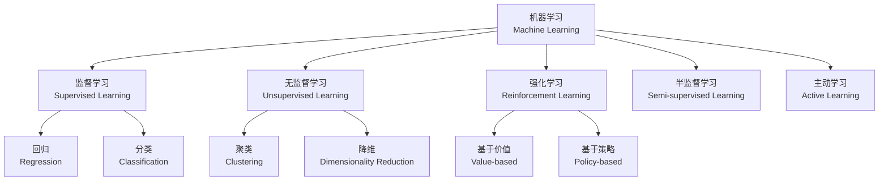

# 机器学习概述 (Machine Learning Overview)

## 概述 (Overview)

机器学习（Machine Learning）是人工智能的子领域，使计算机系统能够从数据中自动学习和改进，而无需进行明确的编程。机器学习的核心是开发能够识别数据模式并做出预测或决策的算法。

## 学习范式分类

## 监督学习 (Supervised Learning)

监督学习使用标记数据训练模型：

$$
\hat{y} = f(x; \theta)
$$

其中 $x$ 为输入特征，$\theta$ 为模型参数，$\hat{y}$ 为预测输出。

### 常见算法

| 算法 | 类型 | 特点 |
|------|------|------|
| 线性回归 (Linear Regression) | 回归 | 简单可解释，线性假设 |
| 逻辑回归 (Logistic Regression) | 分类 | 概率输出，二分类基础 |
| 支持向量机 (SVM) | 分类/回归 | 核技巧处理非线性 |
| 决策树 (Decision Tree) | 分类/回归 | 可解释，易过拟合 |
| 随机森林 (Random Forest) | 分类/回归 | Bagging 集成，鲁棒 |
| 梯度提升 (GBDT/XGBoost) | 分类/回归 | Boosting 集成，竞赛首选 |
| 神经网络 (Neural Network) | 通用 | 深度架构，大数据 |

### 损失函数

| 任务 | 损失函数 | 公式 |
|------|---------|------|
| 回归 | 均方误差 (MSE) | $\frac{1}{n}\sum_{i=1}^n (y_i - \hat{y}_i)^2$ |
| 二分类 | 交叉熵 (BCE) | $-\frac{1}{n}\sum_i [y_i \log(p_i) + (1 - y_i)\log(1 - p_i)]$ |
| 多分类 | 交叉熵 (CE) | $-\sum_{i=1}^n y_i \log(p_i)$ |

## 无监督学习 (Unsupervised Learning)

### 聚类算法 (Clustering)

| 算法 | 类型 | 优点 | 缺点 |
|------|------|------|------|
| K-Means | 划分聚类 | 简单快速 | 需指定 K，球形假设 |
| DBSCAN | 密度聚类 | 任意形状，抗噪 | 参数敏感 |
| 层次聚类 | 层次聚类 | 层次结构可视化 | 复杂度 O(n³) |
| GMM | 概率聚类 | 软聚类，概率输出 | 高斯假设 |

### 降维算法 (Dimensionality Reduction)

| 算法 | 线性/非线性 | 保留特性 |
|------|------------|---------|
| PCA | 线性 | 最大方差方向 |
| t-SNE | 非线性 | 局部邻域结构 |
| UMAP | 非线性 | 全局+局部结构 |
| LDA | 线性 | 类间可分性 |

## 模型评估 (Model Evaluation)

### 分类指标

$$
\text{Accuracy} = \frac{TP + TN}{TP + TN + FP + FN}
$$

$$
\text{Precision} = \frac{TP}{TP + FP}, \quad \text{Recall} = \frac{TP}{TP + FN}
$$

$$
F_1 = 2 \cdot \frac{\text{Precision} \cdot \text{Recall}}{\text{Precision} + \text{Recall}}
$$

| 指标 | 关注点 | 适用场景 |
|------|--------|---------|
| 准确率 (Accuracy) | 整体正确率 | 平衡数据集 |
| 精确率 (Precision) | 假阳性控制 | 垃圾邮件检测 |
| 召回率 (Recall) | 假阴性控制 | 疾病筛查 |
| F1 分数 | 精确率与召回率均衡 | 非平衡数据 |
| AUC-ROC | 排序质量 | 二分类通用 |

### 回归指标

| 指标 | 公式 | 说明 |
|------|------|------|
| MAE | $\frac{1}{n}\sum |y_i - \hat{y}_i|$ | 平均绝对误差 |
| MSE | $\frac{1}{n}\sum (y_i - \hat{y}_i)^2$ | 均方误差 |
| R² | $1 - \frac{\sum (y_i - \hat{y}_i)^2}{\sum (y_i - \bar{y})^2}$ | 决定系数 |

## 特征工程 (Feature Engineering)

特征工程流程：

### 特征处理方法

| 方法 | 技术 | 用途 |
|------|------|------|
| 标准化 (Standardization) | $z = \frac{x - \mu}{\sigma}$ | 服从正态分布假设 |
| 归一化 (Normalization) | $x' = \frac{x - x_{\min}}{x_{\max} - x_{\min}}$ | 范围限制 |
| 独热编码 (One-Hot) | 类别变量展开 | 无序类别特征 |
| 标签编码 (Label Encoding) | 整数映射 | 有序类别特征 |
| 主成分分析 (PCA) | 线性降维 | 特征压缩去相关 |
| 特征交叉 (Feature Cross) | 组合特征 | 捕捉交互关系 |

## 偏差与方差权衡 (Bias-Variance Tradeoff)

$$
\text{Error} = \text{Bias}^2 + \text{Variance} + \text{Irreducible Error}
$$

| 情况 | 偏差 | 方差 | 表现 |
|------|------|------|------|
| 欠拟合 (Underfitting) | 高 | 低 | 训练/测试误差均高 |
| 过拟合 (Overfitting) | 低 | 高 | 训练低，测试高 |
| 良好拟合 | 适中 | 适中 | 两者均低 |

## 相关条目

- [[RLOverview]]
- [[NLPOverview]]
- [[DeepLearning]]
- [[ArtificialIntelligence]]
- [[DataMining]]
- [[ComputerVision]]
