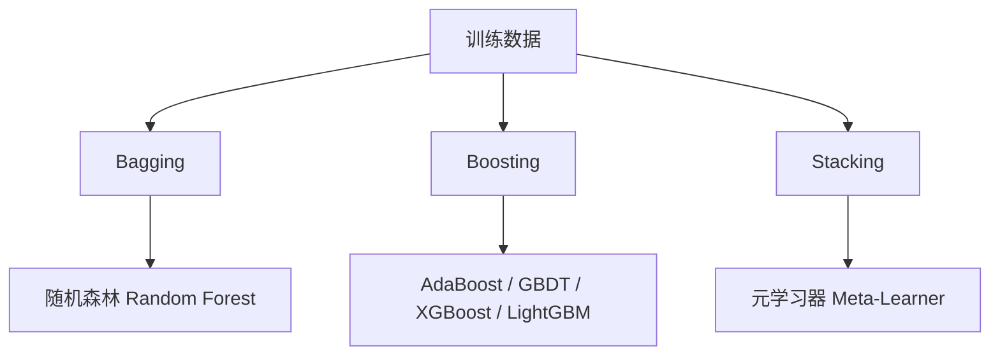

# 机器学习 (Machine Learning)

## 一、概述

机器学习 (Machine Learning, ML) 是人工智能的核心子领域，通过算法从数据中自动学习模式和规律。与显式编程不同，ML 系统通过经验 (数据) 改善性能。

## 二、学习范式 (Learning Paradigms)

| 范式 | 数据 | 目标 | 实例 |
|------|------|------|------|
| 监督学习 (Supervised) | 带标签数据 | 预测标签 | 分类、回归 |
| 无监督学习 (Unsupervised) | 无标签数据 | 发现隐藏结构 | 聚类、降维 |
| 半监督学习 (Semi-supervised) | 少量标签 + 大量无标签 | 利用未标记数据增强 | 自训练、一致性正则化 |
| 自监督学习 (Self-supervised) | 无标签数据 | 构造 pretext 任务学习表示 | 对比学习、掩码建模 |
| 强化学习 (Reinforcement) | 奖励信号 | 最大化累积奖励 | 游戏、机器人控制 |

## 三、回归算法 (Regression)

回归预测连续值输出。

### 3.1 线性回归

假设 $y = w^T x + b$，最小化均方误差：

$$
L = \frac{1}{n} \sum_{i=1}^n (y_i - w^T x_i - b)^2
$$

最优解可通过正规方程 (Normal Equation) 或梯度下降求得。

### 3.2 正则化回归

| 方法 | 惩罚项 | 特点 |
|------|--------|------|
| 岭回归 (Ridge) | $\lambda \sum w_j^2$ | L2 惩罚，保留所有特征 |
| Lasso | $\lambda \sum |w_j|$ | L1 惩罚，自动特征选择 |
| 弹性网络 (Elastic Net) | $\lambda_1 \sum |w_j| + \lambda_2 \sum w_j^2$ | L1+L2 组合，高维数据稳健 |

## 四、分类算法 (Classification)

### 4.1 逻辑回归 (Logistic Regression)

通过 Sigmoid 函数将线性输出映射到概率：

$$
P(y=1|x) = \sigma(w^T x + b) = \frac{1}{1 + e^{-(w^T x + b)}}
$$

最小化交叉熵损失 (Log Loss)：

$$
L = -\frac{1}{n} \sum_i [y_i \log \hat{p}_i + (1-y_i) \log(1-\hat{p}_i)]
$$

### 4.2 支持向量机 (SVM)

寻找最大间隔超平面，对偶形式引入核技巧 (Kernel Trick)：

$$
f(x) = \sum_{i=1}^n \alpha_i y_i K(x_i, x) + b
$$

常用核函数：线性核、多项式核、RBF 核 ($K(x, z) = \exp(-\gamma \|x-z\|^2)$)。

### 4.3 决策树与集成方法

| 算法 | 核心思想 | 优势 |
|------|---------|------|
| 随机森林 | Bagging + 决策树投票 | 抗过拟合，高维鲁棒 |
| GBDT | 梯度提升，逐步拟合残差 | 精度高，表格数据 SOTA |
| XGBoost | 正则化 + 二阶梯度 + 列采样 | 速度快，竞赛首选 |
| LightGBM | 直方图算法 + 叶子节点优先生长 | 海量数据高效 |

### 4.4 K 近邻 (KNN)

非参数方法，基于距离度量投票：

$$
\hat{y} = \text{majority\_vote}\left(\{y_j\}_{j \in \mathcal{N}_k(x)}\right)
$$

$k$ 值选择影响偏差-方差权衡。

## 五、聚类算法 (Clustering)

| 算法 | 类型 | 原理 | 超参数 |
|------|------|------|--------|
| K-Means | 划分聚类 | 最小化簇内平方和 | 簇数 $k$ |
| 层次聚类 (Hierarchical) | 层次聚类 | 自底向上/自顶向下合并分裂 | 距离阈值或 $k$ |
| DBSCAN | 密度聚类 | 基于密度连通性 | $\epsilon$, MinPts |
| 高斯混合模型 (GMM) | 概率聚类 | EM 算法估计高斯成分 | 成分数 $k$ |
| 谱聚类 (Spectral) | 图聚类 | 拉普拉斯矩阵特征分解 | 簇数 $k$ |

## 六、降维 (Dimensionality Reduction)

| 方法 | 线性/非线性 | 原理 | 用途 |
|------|------------|------|------|
| PCA | 线性 | 最大方差方向投影 | 去噪、可视化、预处理 |
| t-SNE | 非线性 | 保持高维邻域分布 | 可视化 (2D/3D) |
| UMAP | 非线性 | 拓扑流形学习 | 大规模可视化 |
| LDA | 线性 | 最大类间/类内方差比 | 监督降维 |

## 七、模型评估 (Evaluation)

### 7.1 分类指标

| 指标 | 公式 | 说明 |
|------|------|------|
| 准确率 (Accuracy) | $(TP+TN)/(TP+TN+FP+FN)$ | 平衡数据集适用 |
| 精确率 (Precision) | $TP/(TP+FP)$ | 假阳性控制 |
| 召回率 (Recall) | $TP/(TP+FN)$ | 假阴性控制 |
| F1 分数 | $2 \cdot P \cdot R / (P + R)$ | 精确率与召回率的调和平均 |
| AUC-ROC | ROC 曲线下面积 | 排序性能，不受阈值影响 |

### 7.2 回归指标

| 指标 | 公式 |
|------|------|
| MSE | $\frac{1}{n}\sum (y_i - \hat{y}_i)^2$ |
| RMSE | $\sqrt{\text{MSE}}$ |
| MAE | $\frac{1}{n}\sum |y_i - \hat{y}_i|$ |
| $R^2$ | $1 - \frac{\sum (y_i - \hat{y}_i)^2}{\sum (y_i - \bar{y})^2}$ |

### 7.3 交叉验证 (Cross-Validation)

| 方法 | 说明 |
|------|------|
| K-Fold CV | 数据分 $k$ 份，轮流用 $k-1$ 份训练 1 份验证 |
| 留一法 (LOOCV) | $k=n$ 的特例，偏差小方差大 |
| Stratified K-Fold | 保持每折类别比例 |
| 时间序列 CV | 按时间顺序扩展窗口 |

## 八、偏差-方差权衡 (Bias-Variance Tradeoff)

总误差可分解为：

$$
\mathbb{E}[(y - \hat{f}(x))^2] = \text{Bias}(\hat{f}(x))^2 + \text{Var}(\hat{f}(x)) + \sigma^2
$$

- **高偏差** → 欠拟合 (Underfitting)：模型过于简单
- **高方差** → 过拟合 (Overfitting)：模型过于复杂，记忆噪声

## 相关条目

- [[05_ComputerScience/ArtificialIntelligence/MachineLearning/INDEX]]
- [[NeuralNetworks]]
- [[深度学习概论|深度学习 (Deep Learning)]]
- [[NaturalLanguageProcessing]]
- [[ComputerVision]]
- [[ReinforcementLearning]]
