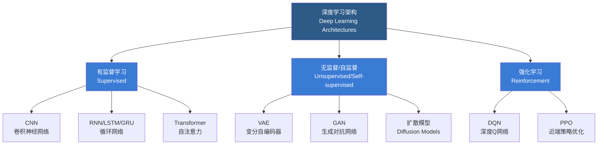
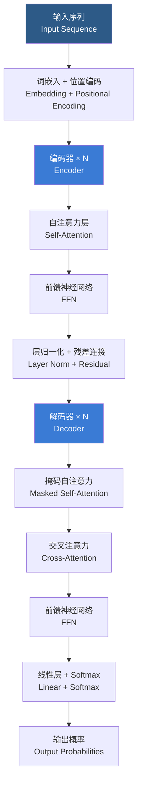

# 深度学习

## 一、概述

深度学习（Deep Learning, DL）是基于多层人工神经网络（Artificial Neural Networks, ANN）的机器学习方法，通过层次化特征提取自动学习数据中的内在规律与表示。与传统机器学习依赖手工特征工程不同，深度学习利用深层架构（通常三层以上）逐层抽象，从底层原始数据中自动学习多层级特征表示。自 2006 年 Hinton 等人提出深度信念网络（Deep Belief Network, DBN）的训练方法以来，深度学习在计算机视觉（Computer Vision, CV）、自然语言处理（Natural Language Processing, NLP）、语音识别、强化学习（Reinforcement Learning, RL）等领域取得突破性进展，成为人工智能的核心驱动力。

## 二、深度学习与经典机器学习的对比

下表对比了深度学习与传统机器学习（Traditional Machine Learning, TML）的关键差异：

| 维度 | 深度学习 | 传统机器学习 |
|------|----------|--------------|
| 特征工程 | 自动学习层次化特征 | 依赖手工特征设计 |
| 数据需求 | 大规模数据（万级以上） | 可处理小样本数据 |
| 计算资源 | GPU/TPU 高性能计算 | CPU 即可运行 |
| 可解释性 | 黑箱模型，解释困难 | 相对可解释（如决策树） |
| 模型复杂度 | 百万至千亿级参数 | 通常万级参数以下 |
| 适用场景 | 非结构化数据（图像、文本、语音） | 结构化表格数据 |

## 三、核心架构概览

### 3.1 架构分类流程图

### 3.2 主要架构对比

| 架构类型 | 核心机制 | 典型模型 | 适用任务 |
|----------|---------|----------|----------|
| CNN (Convolutional Neural Network) | 卷积+池化提取空间局部特征 | ResNet, VGG, YOLO | 图像分类、目标检测、语义分割 |
| RNN (Recurrent Neural Network) | 循环状态处理序列依赖 | Elman RNN, Jordan RNN | 语言模型、时序预测 |
| LSTM (Long Short-Term Memory) | 三门控结构解决长程依赖 | BiLSTM, Stacked LSTM | 机器翻译、文本生成 |
| GRU (Gated Recurrent Unit) | 两门控简化 LSTM 结构 | GRU, BiGRU | 情感分析、命名实体识别 |
| Transformer | 自注意力机制并行处理序列 | BERT, GPT, T5 | NLP、多模态、蛋白质预测 |
| GAN (Generative Adversarial Network) | 生成器与判别器零和博弈 | DCGAN, StyleGAN, BigGAN | 图像生成、风格迁移、超分辨率 |
| VAE (Variational Autoencoder) | 概率编码-解码+重参数化 | β-VAE, VQ-VAE | 生成模型、表征学习、异常检测 |
| Diffusion Model | 正向加噪+反向去噪 | DDPM, Stable Diffusion | 图像生成、音频生成、分子设计 |

## 四、卷积神经网络（CNN）

### 4.1 CNN 核心组件

| 层类型 | 作用 | 关键参数 | 常见设置 |
|--------|------|----------|----------|
| 卷积层 (Convolutional Layer) | 提取局部空间特征 | 卷积核大小、步长、填充 | 3×3, 5×5; stride=1; padding='same' |
| 池化层 (Pooling Layer) | 降采样、减少参数量 | 池化窗口大小、池化方式 | 2×2 max pooling |
| 全连接层 (Fully Connected Layer) | 特征整合与分类 | 神经元数量 | 4096→4096→1000 |
| 批量归一化层 (Batch Normalization) | 加速训练、缓解过拟合 | γ, β 参数 | 每个卷积层后 |
| Dropout 层 | 随机失活防止过拟合 | 失活概率 p | p=0.5 |

### 4.2 卷积运算数学表达

二维卷积操作定义如下：

$$(I * K)(i, j) = \sum_{m}\sum_{n} I(i+m, j+n) \cdot K(m, n)$$

其中 $I$ 为输入特征图，$K$ 为卷积核（Kernel）。输出特征图尺寸计算公式：

$$O = \left\lfloor \frac{W - F + 2P}{S} \right\rfloor + 1$$

这里 $W$ 为输入尺寸，$F$ 为卷积核大小，$P$ 为填充（Padding），$S$ 为步长（Stride）。

### 4.3 经典 CNN 架构演进

- **LeNet-5**（1998）：7 层网络，首个成功应用的 CNN，用于手写数字识别
- **AlexNet**（2012）：8 层网络，ReLU 激活 + Dropout，ImageNet 比赛冠军
- **VGGNet**（2014）：16/19 层，统一使用 3×3 小卷积核，证明深度的重要性
- **GoogLeNet/Inception**（2014）：22 层，引入 Inception 模块的多尺度并行卷积
- **ResNet**（2015）：152 层，残差连接（Residual Connection）解决梯度消失问题
- **DenseNet**（2017）：密集连接，每层与所有后续层直接相连
- **EfficientNet**（2019）：神经架构搜索（NAS）优化深度、宽度、分辨率

## 五、循环神经网络（RNN）与序列建模

### 5.1 RNN 基本单元

RNN 在时间步 $t$ 的隐藏状态更新公式：

$$h_t = \tanh(W_{hh} h_{t-1} + W_{xh} x_t + b_h)$$

输出计算：

$$y_t = W_{hy} h_t + b_y$$

### 5.2 LSTM 门控机制

LSTM 引入遗忘门（Forget Gate）、输入门（Input Gate）、输出门（Output Gate）和细胞状态（Cell State）：

$$f_t = \sigma(W_f \cdot [h_{t-1}, x_t] + b_f)$$
$$i_t = \sigma(W_i \cdot [h_{t-1}, x_t] + b_i)$$
$$\tilde{C}_t = \tanh(W_C \cdot [h_{t-1}, x_t] + b_C)$$
$$C_t = f_t \odot C_{t-1} + i_t \odot \tilde{C}_t$$
$$o_t = \sigma(W_o \cdot [h_{t-1}, x_t] + b_o)$$
$$h_t = o_t \odot \tanh(C_t)$$

其中 $\sigma$ 为 Sigmoid 激活函数，$\odot$ 为逐元素乘法。

### 5.3 梯度问题

传统 RNN 面临梯度消失（Vanishing Gradient）和梯度爆炸（Exploding Gradient）问题，LSTM 和 GRU 通过门控机制有效缓解了梯度消失。梯度裁剪（Gradient Clipping）用于防止梯度爆炸：

$$g = \min\left(1, \frac{\text{threshold}}{\|g\|}\right) \cdot g$$

## 六、Transformer 架构

### 6.1 缩放点积注意力（Scaled Dot-Product Attention）

计算查询（Query）$Q$、键（Key）$K$、值（Value）$V$ 之间的注意力权重：

$$\text{Attention}(Q, K, V) = \text{softmax}\left(\frac{QK^\top}{\sqrt{d_k}}\right)V$$

其中 $d_k$ 为键向量的维度，缩放因子 $\sqrt{d_k}$ 防止点积过大导致 softmax 梯度消失。

### 6.2 多头注意力（Multi-Head Attention）

$$ \text{MultiHead}(Q, K, V) = \text{Concat}(\text{head}_1, \ldots, \text{head}_h)W^O $$
$$ \text{head}_i = \text{Attention}(QW_i^Q, KW_i^K, VW_i^V) $$

多头注意力允许模型在不同子空间中联合关注不同位置的表示信息。

### 6.3 Transformer 整体结构

### 6.4 BERT 与 GPT 对比

| 模型 | 架构类型 | 训练目标 | 注意力方式 | 适用场景 | 代表规模 |
|------|----------|----------|------------|----------|----------|
| BERT | Encoder-only | 掩码语言模型 (MLM) + 下一句预测 (NSP) | 双向注意力 | 文本分类、NER、QA | Base: 110M, Large: 340M |
| GPT | Decoder-only | 自回归语言模型 (AR) | 因果掩码注意力 | 文本生成、对话 | GPT-3: 175B, GPT-4: 未公开 |
| T5 | Encoder-Decoder | 文本到文本统一框架 | 完整双向+自回归 | 翻译、摘要、问答 | Base: 220M, 11B |

## 七、生成模型

### 7.1 变分自编码器（VAE）

VAE 最大化证据下界（Evidence Lower Bound, ELBO）：

$$\mathcal{L}(\theta, \phi; x) = \mathbb{E}_{q_\phi(z|x)}[\log p_\theta(x|z)] - D_{KL}(q_\phi(z|x) \| p(z))$$

第一项为重构损失（Reconstruction Loss），第二项为 KL 散度正则项。

### 7.2 生成对抗网络（GAN）

GAN 的目标函数为极小极大博弈：

$$\min_G \max_D V(D, G) = \mathbb{E}_{x \sim p_{\text{data}}(x)}[\log D(x)] + \mathbb{E}_{z \sim p_z(z)}[\log(1 - D(G(z)))]$$

### 7.3 扩散模型（Diffusion Model）

前向过程逐步添加高斯噪声，反向过程学习去噪。损失函数为噪声预测均方误差：

$$\mathcal{L} = \mathbb{E}_{t, x_0, \epsilon}\left[ \|\epsilon - \epsilon_\theta(x_t, t)\|^2 \right]$$

## 八、训练技巧与正则化

### 8.1 优化器对比

| 优化器 | 自适应学习率 | 动量 | 特点 | 适用场景 |
|--------|-------------|------|------|----------|
| SGD | 否 | 可配置 | 基础优化器，需精细调参 | 小批量、简单任务 |
| Adam | 是 | 是 | 自适应矩估计，收敛快 | 通用优先选择 |
| AdamW | 是 | 是 | Adam + 解耦权重衰减 | Transformer 训练 |
| RMSProp | 是 | 否 | 均方根传播 | RNN 训练 |

### 8.2 学习率调度策略

- **Step Decay**：每隔固定 epoch 乘以衰减因子 $\eta_{t+1} = \eta_t \cdot \gamma$
- **Cosine Annealing**：$\eta_t = \eta_{\min} + \frac{1}{2}(\eta_{\max} - \eta_{\min})(1 + \cos(\frac{t}{T}\pi))$
- **Warmup + Linear Decay**：线性增加到峰值后线性衰减，Transformer 训练标准做法

### 8.3 正则化技术

| 技术 | 方法 | 数学形式 | 效果 |
|------|------|----------|------|
| L1 正则化 | 权重的绝对值惩罚 | $\lambda \sum |w|$ | 产生稀疏权重 |
| L2 正则化 | 权重的平方和惩罚 | $\lambda \sum w^2$ | 权重衰减，防止过拟合 |
| Dropout | 随机失活神经元 | $r \sim \text{Bernoulli}(p)$ | 集成学习效果 |
| Label Smoothing | 软标签代替硬标签 | $y' = (1-\epsilon)y + \epsilon/K$ | 提高泛化性 |
| Early Stopping | 验证集损失不再下降时停止 | — | 防止过拟合 |

## 九、前沿方向

- **大语言模型（Large Language Model, LLM）**：GPT-4、Claude、LLaMA 等，规模达千亿参数
- **多模态学习（Multimodal Learning）**：CLIP、DALL-E、Sora 等统一图像、文本、视频建模
- **神经架构搜索（Neural Architecture Search, NAS）**：自动化模型结构设计
- **自监督学习（Self-Supervised Learning）**：SimCLR、MAE 等无需人工标注的预训练方法
- **小样本与零样本学习（Few/Zero-Shot Learning）**：快速适应新任务
- **可解释人工智能（Explainable AI, XAI）**：Grad-CAM、SHAP 等解释模型决策

## 十、常见问题与调优策略

| 问题 | 表现 | 可能原因 | 解决方案 |
|------|------|----------|----------|
| 过拟合 (Overfitting) | 训练损失低、验证损失高 | 模型容量过大 | 增加正则化、Dropout、数据增强 |
| 欠拟合 (Underfitting) | 训练损失与验证损失均高 | 模型容量不足 | 增加层数/神经元、减少正则化 |
| 梯度消失 | 深层网络无法收敛 | 激活函数不当 | 使用 ReLU、残差连接、BatchNorm |
| 不收敛 | 损失震荡 | 学习率过大 | 降低学习率、使用学习率调度 |
| 模式坍塌 | GAN 生成单一结果 | 判别器过于强大 | 调整训练比例、标签平滑 |

## 相关条目

- [[MachineLearning]]
- [[NeuralNetworks]]
- [[05_ComputerScience/ArtificialIntelligence/MachineLearning/NeuralNetworksAndDeepLearning/INDEX]]
- [[Transformer]]
- [[ReinforcementLearning]]
