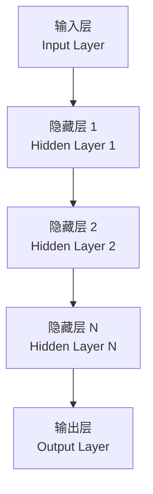

# 神经网络（Neural Networks）

## 概述

神经网络（Neural Networks）是受生物神经系统启发而构建的计算模型，是机器学习（Machine Learning）和深度学习（Deep Learning）的核心基础。神经网络通过大量简单计算单元（神经元，Neuron）的互联和权重学习，能够逼近任意连续函数，实现从数据中学习复杂模式映射的能力。

1943 年，McCulloch 和 Pitts 提出了第一个神经元数学模型。1986 年，Rumelhart 等人提出反向传播算法（Backpropagation），奠定了现代神经网络训练的理论基础。2012 年，AlexNet 在 ImageNet 竞赛中的突破性表现，开启了深度学习的革命性发展。

## 基本单元——神经元

### 感知机模型

感知机（Perceptron）是最简单的神经元模型，由 Rosenblatt 于 1958 年提出：

$$y = f\left(\sum_{i=1}^{n} w_i x_i + b\right) = f(\mathbf{w}^T \mathbf{x} + b)$$

其中：
- $x_i$：输入特征（Input Features）
- $w_i$：连接权重（Weights）
- $b$：偏置项（Bias）
- $f$：激活函数（Activation Function）
- $y$：输出（Output）

### 多层感知机（MLP）

多层感知机（Multi-Layer Perceptron）由输入层、一个或多个隐藏层和输出层组成：

$$\mathbf{z}^{[l]} = \mathbf{W}^{[l]} \mathbf{a}^{[l-1]} + \mathbf{b}^{[l]}$$

$$\mathbf{a}^{[l]} = f(\mathbf{z}^{[l]})$$

其中 $[l]$ 表示第 $l$ 层，$\mathbf{W}$ 为权重矩阵，$\mathbf{a}$ 为激活值。

## 激活函数

激活函数引入非线性（Non-linearity），使神经网络能够学习复杂的非线性映射。

### 常见激活函数

| 函数名称 | 数学表达式 | 输出范围 | 导数 | 特点与应用 |
|----------|-----------|----------|------|-----------|
| Sigmoid | $\sigma(x) = \frac{1}{1 + e^{-x}}$ | $(0, 1)$ | $\sigma(x)(1-\sigma(x))$ | 梯度饱和，适用于二分类输出 |
| Tanh | $\tanh(x) = \frac{e^x - e^{-x}}{e^x + e^{-x}}$ | $(-1, 1)$ | $1 - \tanh^2(x)$ | 零中心化，优于 Sigmoid |
| ReLU | $\text{ReLU}(x) = \max(0, x)$ | $[0, +\infty)$ | $1 \text{ if } x>0 \text{ else } 0$ | 计算高效，缓解梯度消失 |
| Leaky ReLU | $\max(\alpha x, x)$ | $(-\infty, +\infty)$ | $1 \text{ if } x>0 \text{ else } \alpha$ | 解决 ReLU 神经元死亡问题 |
| PReLU | $\max(\alpha x, x)$（$\alpha$ 可学习） | $(-\infty, +\infty)$ | 同上 | 自适应负斜率 |
| ELU | $x \text{ if } x>0 \text{ else } \alpha(e^x-1)$ | $(-\alpha, +\infty)$ | 平滑负区间 |
| Swish | $x \cdot \sigma(x)$ | $(-\infty, +\infty)$ | 自门控机制，谷歌提出 |
| GELU | $x \cdot \Phi(x)$ | $(-\infty, +\infty)$ | 平滑近似 ReLU，Transformer 常用 |
| Softmax | $\frac{e^{x_i}}{\sum_j e^{x_j}}$ | $(0, 1)$，和为 1 | 复杂 | 多分类输出层 |

### 激活函数选择指南

| 场景 | 推荐激活函数 | 理由 |
|------|-------------|------|
| 隐藏层（通用） | ReLU | 计算简单、收敛快 |
| 隐藏层（深层网络） | Leaky ReLU / ELU | 避免神经元死亡 |
| 隐藏层（NLP/Transformer） | GELU | 平滑、表现优异 |
| 二分类输出 | Sigmoid | 概率解释 |
| 多分类输出 | Softmax | 概率分布 |
| 回归输出 | 线性 / Tanh | 无界或有界输出 |

## 网络架构

### 前馈神经网络（Feedforward Neural Network, FNN）

信息从输入层单向传递至输出层，无循环连接：

$$\hat{y} = f_L(\mathbf{W}_L \cdot f_{L-1}(\cdots f_1(\mathbf{W}_1 \mathbf{x} + \mathbf{b}_1)\cdots) + \mathbf{b}_L)$$

### 反向传播算法（Backpropagation）

反向传播基于链式法则（Chain Rule）计算损失函数对各层参数的梯度：

$$\frac{\partial L}{\partial w_{jk}^{[l]}} = \frac{\partial L}{\partial a_k^{[l]}} \cdot \frac{\partial a_k^{[l]}}{\partial z_k^{[l]}} \cdot \frac{\partial z_k^{[l]}}{\partial w_{jk}^{[l]}} = \delta_k^{[l]} \cdot a_j^{[l-1]}$$

其中误差项：

$$\delta_k^{[l]} = \frac{\partial L}{\partial z_k^{[l]}} = \frac{\partial L}{\partial a_k^{[l]}} \cdot f'(z_k^{[l]})$$

## 损失函数与优化

### 常见损失函数

| 损失函数 | 公式 | 适用任务 |
|----------|------|----------|
| 均方误差（MSE） | $L = \frac{1}{n}\sum_{i=1}^n (y_i - \hat{y}_i)^2$ | 回归 |
| 平均绝对误差（MAE） | $L = \frac{1}{n}\sum_{i=1}^n |y_i - \hat{y}_i|$ | 回归（对异常值鲁棒） |
| 交叉熵（Cross-Entropy） | $L = -\sum_i y_i \log(\hat{y}_i)$ | 分类 |
| 二元交叉熵 | $L = -[y\log(\hat{y}) + (1-y)\log(1-\hat{y})]$ | 二分类 |
| Hinge Loss | $L = \max(0, 1 - y\cdot\hat{y})$ | SVM 风格分类 |
| KL 散度 | $L = \sum_i y_i \log\frac{y_i}{\hat{y}_i}$ | 分布匹配 |

### 优化算法

| 优化器 | 更新规则 | 特点 |
|--------|----------|------|
| SGD | $\theta = \theta - \eta \nabla_\theta L$ | 标准梯度下降，需调学习率 |
| Momentum | $v = \gamma v + \eta \nabla_\theta L$；$\theta = \theta - v$ | 加速收敛，冲出局部极小 |
| AdaGrad | 自适应学习率，对稀疏梯度有效 | 学习率衰减过快 |
| RMSprop | $v = \beta v + (1-\beta)(\nabla L)^2$ | 适合非平稳目标，RNN 常用 |
| Adam | Momentum + RMSprop | 自适应学习率，最常用 |
| AdamW | Adam + 权重衰减解耦 | 泛化性能更好 |

## 训练技巧与正则化

### 正则化方法

| 方法 | 原理 | 实现方式 |
|------|------|----------|
| L2 正则化（Weight Decay） | 惩罚大权重 | $\lambda \sum w^2$ 加入损失 |
| L1 正则化 | 稀疏化权重 | $\lambda \sum |w|$ 加入损失 |
| Dropout | 随机丢弃神经元 | 训练时以概率 $p$ 置零 |
| DropConnect | 随机丢弃连接 | 以概率 $p$ 置零权重 |
| 早停（Early Stopping） | 防止过拟合 | 验证集指标不再提升时停止 |
| 数据增强（Data Augmentation） | 扩充训练数据 | 旋转、翻转、裁剪等 |

### 归一化技术

#### 批归一化（Batch Normalization）

$$\hat{x}_i = \frac{x_i - \mu_B}{\sqrt{\sigma_B^2 + \epsilon}}$$

$$y_i = \gamma \hat{x}_i + \beta$$

加速收敛、允许更大学习率、有轻微正则化效果。

#### 其他归一化方法

| 方法 | 归一化维度 | 适用场景 |
|------|-----------|----------|
| Layer Norm | 特征维度 | NLP、RNN |
| Instance Norm | 单样本单通道 | 风格迁移 |
| Group Norm | 通道分组 | 小批量训练 |
| Switchable Norm | 自适应组合 | 通用场景 |

### 学习率调度

| 策略 | 公式 | 特点 |
|------|------|------|
| Step Decay | $\eta = \eta_0 \cdot \gamma^{\lfloor epoch / s \rfloor}$ | 每 $s$ 个 epoch 衰减 |
| Exponential | $\eta = \eta_0 \cdot e^{-kt}$ | 平滑衰减 |
| Cosine Annealing | $\eta_t = \eta_{min} + \frac{1}{2}(\eta_{max}-\eta_{min})(1+\cos(\frac{t}{T}\pi))$ | 余弦曲线 |
| Warmup | 线性增至目标学习率 | 训练初期稳定 |
| ReduceLROnPlateau | 验证集停滞时衰减 | 自适应调整 |

## 经典网络架构演进

| 年份 | 网络名称 | 核心贡献 | 典型应用 |
|------|----------|----------|----------|
| 1989 | LeNet | 卷积神经网络雏形 | 手写数字识别 |
| 2012 | AlexNet | ReLU + Dropout + GPU 训练 | ImageNet 分类 |
| 2014 | VGGNet | 小卷积核（3×3）堆叠 | 特征提取 |
| 2014 | GoogLeNet | Inception 模块 | 计算效率优化 |
| 2015 | ResNet | 残差连接（Residual Connection） | 训练超深层网络 |
| 2016 | DenseNet | 密集连接（Dense Connection） | 特征重用 |
| 2017 | Transformer | 自注意力机制（Self-Attention） | NLP、CV 通用 |
| 2020 | Vision Transformer | 图像 Patch 化 + Transformer | 视觉任务 |

## 神经网络的理论基础

### 万能近似定理

万能近似定理（Universal Approximation Theorem）表明：具有足够多隐藏神经元的前馈神经网络，可以以任意精度逼近任意连续函数：

$$\forall \epsilon > 0, \exists N: \|f(\mathbf{x}) - \sum_{i=1}^N w_i \sigma(\mathbf{v}_i^T \mathbf{x} + b_i)\| < \epsilon$$

### 容量与泛化

VC 维（Vapnik-Chervonenkis Dimension）衡量模型的容量：

$$R(f) \leq R_{\text{emp}}(f) + \sqrt{\frac{h(\ln(2n/h)+1) - \ln(\delta/4)}{n}}$$

其中 $h$ 为 VC 维，$n$ 为样本数，$\delta$ 为置信度。

## 相关条目

- [[MachineLearning|机器学习]]
- [[DeepLearning|深度学习]]
- [[ConvolutionalNeuralNetworks|卷积神经网络]]
- [[RecurrentNeuralNetworks|循环神经网络]]
- [[Transformer|Transformer]]
- [[Optimization|优化算法]]
- [[05_ComputerScience/ArtificialIntelligence/MachineLearning/NeuralNetworksAndDeepLearning/INDEX|神经网络与深度学习索引]]
