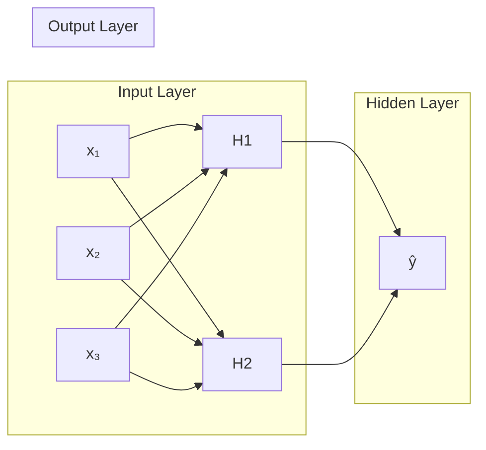
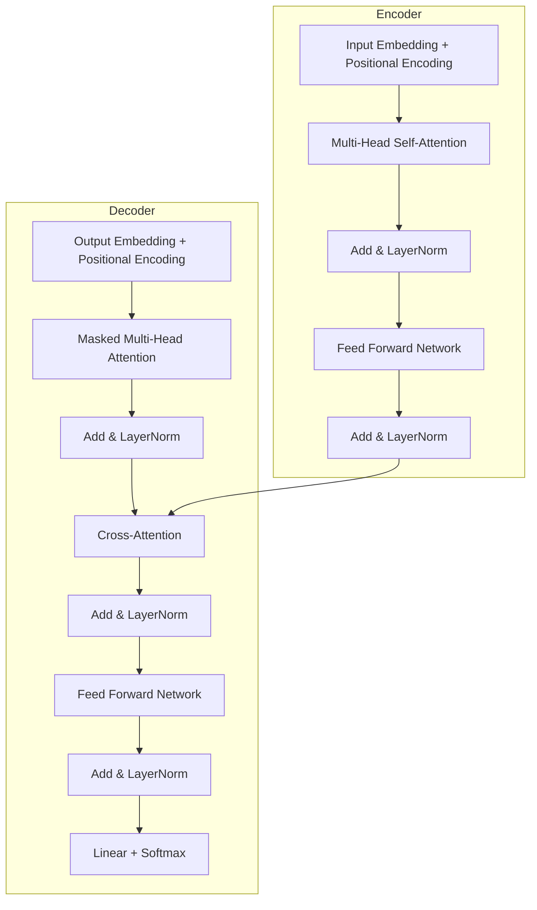

# 深度学习基础 (Deep Learning Fundamentals)

## 一、引言

深度学习 (Deep Learning) 使用多层神经网络自动学习数据的层次化特征表示。与传统的机器学习不同，深度学习无需手工特征工程，通过端到端 (End-to-End) 学习完成从原始输入到输出的映射。

## 二、神经网络基础 (Neural Network Basics)

### 2.1 神经元与感知机

单个神经元计算加权和并通过激活函数：

$$
y = \sigma\left(\sum_{i=1}^{n} w_i x_i + b\right)
$$

感知机 (Perceptron) 使用阶跃函数，而现代神经网络使用可微分的激活函数。

### 2.2 多层感知机 (MLP)

### 2.3 激活函数

| 函数 | 公式 | 输出范围 | 特点 |
|------|------|---------|------|
| Sigmoid | $\sigma(x) = 1/(1+e^{-x})$ | (0,1) | 梯度消失，非零中心 |
| Tanh | $\tanh(x)$ | (-1,1) | 零中心，仍有梯度消失 |
| ReLU | $\max(0, x)$ | [0,∞) | 简单高效，稀疏激活 |
| Leaky ReLU | $\max(\alpha x, x)$ | (-∞,∞) | 解决神经元死亡 |
| GELU | $x \cdot \Phi(x)$ | ≈(-0.17,∞) | 平滑近似，Transformer 常用 |

## 三、反向传播 (Backpropagation)

### 3.1 链式法则

反向传播通过计算图应用链式法则，逐层计算损失对权重的梯度：

$$
\frac{\partial L}{\partial w_{ij}^{(l)}} = \delta_j^{(l)} \cdot a_i^{(l-1)}
$$

其中误差项递归计算：

$$
\delta_j^{(l)} = \sigma'(z_j^{(l)}) \cdot \sum_k w_{jk}^{(l+1)} \delta_k^{(l+1)}
$$

### 3.2 梯度下降优化器

| 优化器 | 更新规则 | 关键特性 |
|--------|---------|---------|
| SGD | $\theta_{t+1} = \theta_t - \eta \nabla L_t$ | 基础，易震荡 |
| Momentum | $v_{t+1} = \gamma v_t + \eta \nabla L_t$ | 加速收敛，冲出局部极小 |
| AdaGrad | 自适应学习率，历史梯度平方和 | 适合稀疏特征 |
| RMSProp | 指数移动平均梯度平方 | 解决 AdaGrad 学习率归零 |
| Adam | 一阶矩 + 二阶矩自适应 | 最常用，收敛快且稳健 |
| AdamW | Adam + 解耦权重衰减 | 泛化更好，LLM 训练标配 |

## 四、卷积神经网络 (CNN)

### 4.1 卷积运算

二维离散卷积：

$$
S(i, j) = (I * K)(i, j) = \sum_m \sum_n I(i+m, j+n) K(m, n)
$$

### 4.2 关键组件

- **局部连接 (Local Connectivity)**：每个神经元只连接局部感受野
- **权值共享 (Weight Sharing)**：同一卷积核在整张图上滑动使用相同参数
- **池化 (Pooling)**：最大池化、平均池化，降低空间维度

### 4.3 经典 CNN 架构演进

| 架构 | 年份 | 深度 | 创新点 | Top-5 错误率 |
|------|------|------|--------|-------------|
| LeNet-5 | 1998 | 7 | 奠定 CNN 基础 | — |
| AlexNet | 2012 | 8 | ReLU + Dropout + GPU | 15.3% |
| VGG-16 | 2014 | 16 | 小卷积核堆叠 | 7.3% |
| GoogLeNet | 2014 | 22 | Inception 模块 | 6.7% |
| ResNet-152 | 2015 | 152 | 残差连接 | 3.57% |
| DenseNet | 2017 | 121 | 密集连接，特征复用 | 3.46% |
| EfficientNet | 2019 | — | NAS 搜索最优缩放 | 2.9% |

### 4.4 残差连接 (Residual Connection)

$$
y = \mathcal{F}(x, \{W_i\}) + x
$$

梯度可通过恒等路径直接回传，缓解梯度消失。

## 五、循环神经网络 (RNN)

### 5.1 标准 RNN

$$
h_t = \tanh(W_{ih} x_t + b_{ih} + W_{hh} h_{t-1} + b_{hh})
$$

存在梯度消失/爆炸问题，难以捕捉长程依赖。

### 5.2 LSTM (Long Short-Term Memory)

LSTM 通过门控机制解决长程依赖：

| 门控 | 公式 | 作用 |
|------|------|------|
| 遗忘门 | $f_t = \sigma(W_f[x_t, h_{t-1}] + b_f)$ | 丢弃旧信息 |
| 输入门 | $i_t = \sigma(W_i[x_t, h_{t-1}] + b_i)$ | 存储新信息 |
| 输出门 | $o_t = \sigma(W_o[x_t, h_{t-1}] + b_o)$ | 控制输出 |
| 细胞状态 | $C_t = f_t \odot C_{t-1} + i_t \odot \tilde{C}_t$ | 长期记忆通路 |

### 5.3 GRU (Gated Recurrent Unit)

GRU 将遗忘门和输入门合并为更新门，参数更少：

$$
\begin{aligned}
z_t &= \sigma(W_z [h_{t-1}, x_t]) \\
r_t &= \sigma(W_r [h_{t-1}, x_t]) \\
\tilde{h}_t &= \tanh(W [r_t \odot h_{t-1}, x_t]) \\
h_t &= (1 - z_t) \odot h_{t-1} + z_t \odot \tilde{h}_t
\end{aligned}
$$

## 六、Transformer

### 6.1 自注意力 (Self-Attention)

Scaled Dot-Product Attention：

$$
\text{Attention}(Q, K, V) = \text{softmax}\left(\frac{QK^T}{\sqrt{d_k}}\right) V
$$

### 6.2 Transformer 架构

## 七、训练技巧

### 7.1 正则化

| 方法 | 原理 | 公式/说明 |
|------|------|----------|
| L2 正则化 (Weight Decay) | 惩罚大权重 | $L_{\text{total}} = L + \frac{\lambda}{2} \|w\|^2$ |
| Dropout | 随机丢弃神经元 | 训练时以概率 $p$ 置零 |
| Label Smoothing | 软标签防过拟合 | $y' = (1-\epsilon)y + \epsilon/K$ |
| Early Stopping | 验证集不改善时停止 | 监控验证损失 |

### 7.2 学习率调度

$$
\eta_t = \eta_0 \cdot d_{\text{model}}^{-0.5} \cdot \min(t^{-0.5}, t \cdot \text{warmup\_steps}^{-1.5})
$$

- **Cosine Decay**：余弦退火至接近零
- **ReduceLROnPlateau**：验证损失平缓时降学习率
- **OneCycle**：先升温再降温，快速收敛

### 7.3 数据增强

- 图像：随机裁剪、翻转、旋转、色彩抖动、MixUp、CutMix
- 文本：回译、EASY DATA AUGMENTATION (EDA)、掩码语言建模
- 音频：SpecAugment、速度扰动、加噪

## 八、框架对比

| 框架 | 语言 | 动态/静态图 | 适用场景 |
|------|------|------------|---------|
| PyTorch | Python | 动态 (Eager) | 研究、原型、大模型训练 |
| TensorFlow | Python | 静态 (Graph) / 动态 | 生产部署、移动端 |
| JAX | Python | 函数式 + JIT | 高性能计算、TPU |
| Keras | Python | 高层 API | 快速原型 |
| PaddlePaddle | Python | 动静统一 | 中文生态、产业应用 |

## 相关条目

- [[NeuralNetworks]]
- [[卷积与循环神经网络]]
- [[计算机视觉概述|Computer Vision]]
- [[NaturalLanguageProcessing]]
- [[AutomaticDifferentiation|自动微分]]
