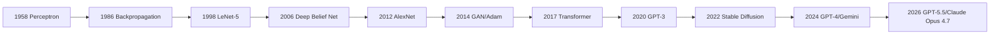
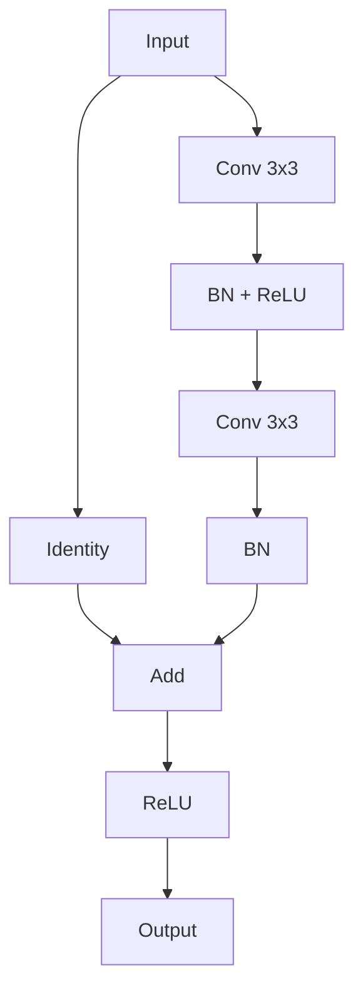
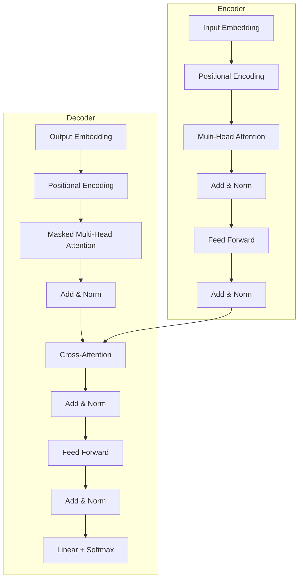

---
aliases: [深度学习概论, DeepLearningOverview]
tags: ['ArtificialIntelligence', 'MachineLearning', 'DeepLearning', 'NeuralNetworks']
---

# 深度学习概论（Deep Learning Overview）

## 一、深度学习的定义

深度学习（Deep Learning）是机器学习的一个子领域，使用**多层神经网络（Deep Neural Networks）** 自动从数据中学习层次化特征表示。与传统机器学习方法不同，深度学习无需手工设计特征，而是通过端到端学习自动提取特征。

### 1.1 核心优势

| 优势 | 说明 |
|------|------|
| 自动特征提取 | 无需人工特征工程 |
| 层次化表示 | 低层学习边缘/纹理，高层学习语义 |
| 大规模数据适配 | 数据量越大，效果越好 |
| 多模态支持 | 统一处理图像、文本、音频等 |

### 1.2 发展历程



## 二、前馈神经网络（Feedforward Neural Network）

### 2.1 神经元模型

一个神经元的计算过程：

$$
y = \sigma\left(\sum_{i=1}^{n} w_i x_i + b\right)
$$

其中 $\sigma$ 为激活函数，$w_i$ 为权重，$b$ 为偏置。

### 2.2 多层感知机（MLP）

多层感知机由输入层、隐藏层和输出层组成：

$$
h^{(1)} = \sigma(W^{(1)}x + b^{(1)})
$$
$$
h^{(2)} = \sigma(W^{(2)}h^{(1)} + b^{(2)})
$$
$$
\hat{y} = \text{softmax}(W^{(3)}h^{(2)} + b^{(3)})
$$

### 2.3 常用激活函数

| 函数 | 公式 | 特点 |
|------|------|------|
| Sigmoid | $\sigma(x) = 1/(1+e^{-x})$ | 输出(0,1)，梯度消失 |
| Tanh | $\tanh(x) = (e^x-e^{-x})/(e^x+e^{-x})$ | 输出(-1,1)，零中心 |
| ReLU | $\text{ReLU}(x) = \max(0, x)$ | 计算快，缓解梯度消失 |
| Leaky ReLU | $\text{LReLU}(x) = \max(\alpha x, x)$ | 解决神经元死亡 |
| GELU | $\text{GELU}(x) = x \cdot \Phi(x)$ | GPT/BERT 中使用 |

## 三、反向传播与优化

### 3.1 反向传播算法（Backpropagation）

反向传播通过链式法则计算损失函数对每个权重的梯度：

$$
\frac{\partial L}{\partial w_{ij}^{(l)}} = \frac{\partial L}{\partial z_j^{(l)}} \cdot \frac{\partial z_j^{(l)}}{\partial w_{ij}^{(l)}} = \delta_j^{(l)} \cdot a_i^{(l-1)}
$$

其中误差项 $\delta_j^{(l)}$ 递归计算：

$$
\delta_j^{(l)} = \sigma'(z_j^{(l)}) \cdot \sum_k w_{jk}^{(l+1)} \delta_k^{(l+1)}
$$

### 3.2 梯度下降变体

| 优化器 | 公式 | 特点 |
|--------|------|------|
| SGD | $\theta_{t+1} = \theta_t - \eta \nabla L$ | 基础，易震荡 |
| Momentum | $v_t = \gamma v_{t-1} + \eta \nabla L$ | 加速收敛 |
| Adam | 自适应学习率 + Momentum | 最常用，鲁棒 |

### 3.3 损失函数

**分类问题**：交叉熵损失（Cross-Entropy Loss）

$$
L = -\sum_{i} y_i \log(\hat{y}_i)
$$

**回归问题**：均方误差（Mean Squared Error）

$$
L = \frac{1}{n} \sum_{i=1}^{n} (y_i - \hat{y}_i)^2
$$

## 四、卷积神经网络（CNN）

### 4.1 卷积操作

二维卷积的定义：

$$
(f * g)[i, j] = \sum_{m} \sum_{n} f[m, n] \cdot g[i-m, j-n]
$$

### 4.2 CNN 经典架构演进

| 模型 | 年份 | 特点 | 错误率 (ImageNet) |
|------|------|------|-------------------|
| LeNet-5 | 1998 | 首个 CNN，手写数字识别 | — |
| AlexNet | 2012 | ReLU、Dropout、GPU 训练 | 15.3% |
| VGGNet | 2014 | 小卷积核堆叠 | 7.3% |
| Inception/GoogLeNet | 2014 | Inception 模块 | 6.7% |
| ResNet | 2015 | 残差连接，152层 | 3.57% |
| DenseNet | 2017 | 密集连接 | 3.46% |
| EfficientNet | 2019 | NAS 搜索最优缩放 | 2.9% |
| ConvNeXt | 2022 | 现代化 CNN 设计 | 超越 Swin |

### 4.3 关键组件

**残差连接（Residual Connection）**：

$$
y = \mathcal{F}(x, \{W_i\}) + x
$$

**批量归一化（Batch Normalization）**：

$$
\hat{x}^{(k)} = \frac{x^{(k)} - \mu^{(k)}}{\sqrt{(\sigma^{(k)})^2 + \epsilon}}
$$



## 五、循环神经网络（RNN）

### 5.1 RNN 基本单元

RNN 在每个时间步 $t$ 维护隐藏状态 $h_t$：

$$
h_t = \sigma(W_{hh} h_{t-1} + W_{xh} x_t + b_h)
$$

### 5.2 LSTM（长短期记忆网络）

LSTM 通过门控机制解决长期依赖问题：

| 门控 | 公式 | 功能 |
|------|------|------|
| 遗忘门 | $f_t = \sigma(W_f \cdot [h_{t-1}, x_t] + b_f)$ | 控制遗忘旧信息 |
| 输入门 | $i_t = \sigma(W_i \cdot [h_{t-1}, x_t] + b_i)$ | 控制添加新信息 |
| 输出门 | $o_t = \sigma(W_o \cdot [h_{t-1}, x_t] + b_o)$ | 控制输出信息 |
| 细胞状态 | $C_t = f_t \odot C_{t-1} + i_t \odot \tilde{C}_t$ | 长期记忆 |

### 5.3 GRU（门控循环单元）

GRU 简化了 LSTM，将遗忘门和输入门合并为更新门：

$$
z_t = \sigma(W_z \cdot [h_{t-1}, x_t])
$$
$$
r_t = \sigma(W_r \cdot [h_{t-1}, x_t])
$$
$$
h_t = (1 - z_t) \odot h_{t-1} + z_t \odot \tanh(W \cdot [r_t \odot h_{t-1}, x_t])
$$

## 六、Transformer

### 6.1 自注意力机制

Scaled Dot-Product Attention：

$$
\text{Attention}(Q, K, V) = \text{softmax}\left(\frac{QK^T}{\sqrt{d_k}}\right)V
$$

### 6.2 多头注意力

Multi-Head Attention 并行计算多个注意力头：

$$
\text{MultiHead}(Q, K, V) = \text{Concat}(\text{head}_1, ..., \text{head}_h) W^O
$$

其中每个头：

$$
\text{head}_i = \text{Attention}(QW_i^Q, KW_i^K, VW_i^V)
$$

### 6.3 Transformer 架构



## 七、训练技巧与正则化

### 7.1 正则化方法

| 方法 | 公式 | 原理 |
|------|------|------|
| L1 正则化 | $L + \lambda \sum |w|$ | 稀疏权重 |
| L2 正则化 | $L + \lambda \sum w^2$ | 权重衰减 |
| Dropout | 训练时随机丢弃神经元 | 防止过拟合 |
| Label Smoothing | 软标签替代硬标签 | 提高泛化 |
| Early Stopping | 验证集不提升时停止 | 防止过拟合 |

### 7.2 学习率调度

$$
\eta_t = \eta_0 \cdot d_{\text{model}}^{-0.5} \cdot \min(t^{-0.5}, t \cdot \text{warmup}^{-1.5})
$$

Transformer 论文中使用的 warmup + decay 策略。

### 7.3 数据增强

- 图像：随机裁剪、旋转、翻转、色彩抖动
- 文本：回译、随机掩码、同义词替换
- 音频：速度扰动、加噪、SpecAugment

## 八、训练流程

### 8.1 标准训练循环

```python
for epoch in range(num_epochs):
    for batch in dataloader:
        # 前向传播
        outputs = model(batch.inputs)
        loss = criterion(outputs, batch.labels)

        # 反向传播
        optimizer.zero_grad()
        loss.backward()

        # 参数更新
        optimizer.step()
```

### 8.2 分布式训练

| 策略 | 说明 | 工具 |
|------|------|------|
| Data Parallel | 数据分片，模型复制 | DDP (PyTorch) |
| Model Parallel | 模型分片到多设备 | Pipeline Parallel |
| Fully Sharded | 参数/梯度/优化器状态分片 | FSDP, DeepSpeed |

## 九、框架对比

| 框架 | 开发商 | 语言 | 图模式 | 特点 |
|------|--------|------|--------|------|
| PyTorch | Meta | Python | 动态图 | 灵活、调试友好、研究首选 |
| TensorFlow | Python | 静态/动态 | 生产部署、TF Serving |
| JAX | Python | 函数式 | 自动微分、vmap、JIT、TPU |
| Keras | 第三方 | Python | 高层 API | 快速原型 |
| PaddlePaddle | 百度 | Python | 动静统一 | 中文生态、产业应用 |

## 相关条目

- [[05_ComputerScience/ArtificialIntelligence/AutomaticDifferentiation|AutomaticDifferentiation]]
- [[05_ComputerScience/ArtificialIntelligence/MachineLearning/INDEX|MachineLearning]]
- [[NeuralNetworks]]
- [[05_ComputerScience/ArtificialIntelligence/NaturalLanguageProcessing/NaturalLanguageProcessing|NaturalLanguageProcessing]]
- [[05_ComputerScience/ArtificialIntelligence/ComputerVision/ComputerVision|ComputerVision]]

## 参考资料

- LeCun, Y., Bengio, Y., & Hinton, G. (2015). "Deep learning." Nature.
- Goodfellow, I., Bengio, Y., & Courville, A. (2016). "Deep Learning." MIT Press.
- Vaswani, A. et al. (2017). "Attention is All You Need."
- He, K. et al. (2016). "Deep Residual Learning for Image Recognition."
- Hochreiter, S. & Schmidhuber, J. (1997). "Long Short-Term Memory."

