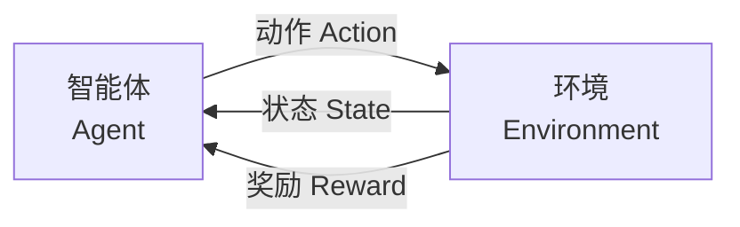
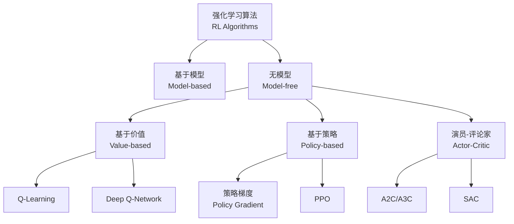
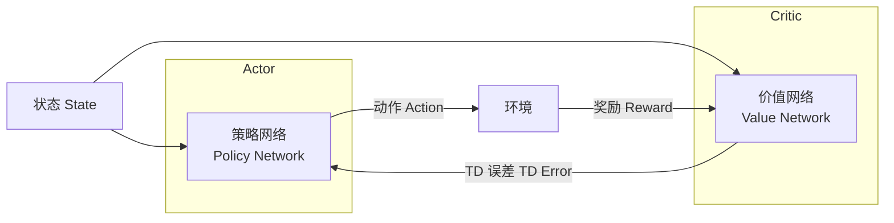

---
aliases: [ReinforcementLearning, 强化学习, RL]
tags: ['05_ComputerScience', 'AI', 'ReinforcementLearning', 'MachineLearning']
created: 2026-05-17
updated: 2026-05-17
---

# 强化学习概述 (Reinforcement Learning Overview)

## 概述 (Overview)

强化学习（Reinforcement Learning, RL）是机器学习的重要分支，研究智能体（Agent）如何通过与环境的交互和奖励信号来学习最优行为策略。与监督学习不同，强化学习不需要标注数据，而是通过试错（Trial and Error）逐步改进决策。

## 核心框架

## 马尔可夫决策过程 (MDP)

强化学习的数学基础是马尔可夫决策过程（Markov Decision Process），由五元组定义：

$$
\langle S, A, P, R, \gamma \rangle
$$

| 元素 | 符号 | 描述 |
|------|------|------|
| 状态空间 | $S$ | 环境所有可能状态的集合 |
| 动作空间 | $A$ | 智能体可执行动作的集合 |
| 状态转移概率 | $P(s_{t+1} \mid s_t, a_t)$ | 给定状态和动作的转移分布 |
| 奖励函数 | $R(s_t, a_t)$ | 即时奖励信号 |
| 折扣因子 | $\gamma \in [0, 1]$ | 未来奖励的折扣系数 |

### 策略与价值函数

策略（Policy）$\pi(a \mid s)$ 定义了状态到动作的映射。

累积折扣回报：

$$
G_t = \sum_{k=0}^{\infty} \gamma^k R_{t+k+1}
$$

状态价值函数（State-Value Function）：

$$
V^{\pi}(s) = \mathbb{E}_{\pi}[G_t \mid S_t = s]
$$

动作价值函数（Action-Value Function）：

$$
Q^{\pi}(s, a) = \mathbb{E}_{\pi}[G_t \mid S_t = s, A_t = a]
$$

### Bellman 方程

$$
V^{\pi}(s) = \sum_a \pi(a \mid s) \sum_{s', r} P(s', r \mid s, a) [r + \gamma V^{\pi}(s')]
$$

$$
Q^{\pi}(s, a) = \sum_{s', r} P(s', r \mid s, a) [r + \gamma \max_{a'} Q^{\pi}(s', a')]
$$

## 算法分类

## Q-Learning

Q-Learning 是一种 off-policy、基于价值的算法：

$$
Q(s, a) \leftarrow Q(s, a) + \alpha \left[ r + \gamma \max_{a'} Q(s', a') - Q(s, a) \right]
$$

其中 $\alpha$ 为学习率（Learning Rate）。

### 表格法 vs 深度学习

| 特性 | 表格 Q-Learning | DQN |
|------|---------------|-----|
| 状态表示 | 离散、有限 | 连续、高维 |
| Q 函数存储 | Q 表 | 神经网络 |
| 适用场景 | 小状态空间 | 大规模/图像输入 |
| 泛化能力 | 无 | 可泛化到未见状态 |

## 策略梯度 (Policy Gradient)

策略梯度方法直接优化策略参数 $\theta$：

$$
\nabla_{\theta} J(\theta) = \mathbb{E}_{\pi_{\theta}} \left[ \nabla_{\theta} \log \pi_{\theta}(a \mid s) \cdot Q^{\pi_{\theta}}(s, a) \right]
$$

### 常见策略梯度算法

| 算法 | 特点 | 稳定性 |
|------|------|--------|
| REINFORCE | Mont eCarlo 回报，高方差 | 低 |
| PPO | 裁剪代理目标 (Clipped Surrogate) | 高 |
| TRPO | 信任区域约束 | 高 |
| Natural PG | 自然梯度 | 中 |

## 演员-评论家 (Actor-Critic)

Actor-Critic 结合了基于价值与基于策略方法的优势：

### 优势函数 (Advantage Function)

$$
A(s, a) = Q(s, a) - V(s)
$$

A2C/A3C 使用优势函数减少方差：

$$
\nabla_{\theta} J(\theta) = \mathbb{E} \left[ \nabla_{\theta} \log \pi_{\theta}(a \mid s) \cdot A(s, a) \right]
$$

## 探索与利用 (Exploration vs Exploitation)

探索与利用的权衡是 RL 的核心挑战：

| 策略 | 描述 | 适用场景 |
|------|------|---------|
| $\epsilon$-Greedy | 以 $\epsilon$ 概率随机探索 | 离散动作 |
| UCB | 选择上置信界最高的动作 | 多臂赌博机 |
| 策略熵正则化 | 在目标中增加熵项 | 连续控制 |
| 噪声注入 | 参数/动作空间加噪 | 深度 RL |

## 应用领域 (Applications)

| 领域 | 典型应用 | 代表系统 |
|------|---------|---------|
| 游戏 (Game) | 围棋、Atari、Dota 2 | AlphaGo, DQN, OpenAI Five |
| 机器人 (Robotics) | 抓取、行走、操控 | DRL + Sim-to-Real |
| 自动驾驶 | 决策规划、控制 | Waymo, Tesla |
| 推荐系统 | 用户交互建模 | YouTube RL |
| 资源调度 | 数据中心冷却 | Google DeepMind |
| NLP (RLHF) | 语言模型对齐 | ChatGPT, Claude |

## 关键公式总结

### 最优策略

$$
\pi^*(s) = \arg\max_a Q^*(s, a)
$$

### TD 误差 (Temporal Difference Error)

$$
\delta_t = r_t + \gamma V(s_{t+1}) - V(s_t)
$$

### Target Network 更新 (DQN 稳定训练)

$$
\theta^- \leftarrow \tau \theta + (1 - \tau) \theta^-
$$

其中 $\tau$ 为软更新系数。

## 相关条目

- [[05_ComputerScience/ArtificialIntelligence/MachineLearning/MLOverview|MLOverview]]
- [[07_InterdisciplinarySciences/CognitiveScience/ArtificialIntelligence|ArtificialIntelligence]]
- [[05_ComputerScience/ArtificialIntelligence/MachineLearning/NeuralNetworksAndDeepLearning/NeuralNetworks|NeuralNetworks]]
- [[05_ComputerScience/HardwareAndEmbeddedSystems/Robotics/Robotics|Robotics]]
- [[05_ComputerScience/EngineeringDevelopment/GameDevelopment/GameDevelopment|GameDevelopment]]

