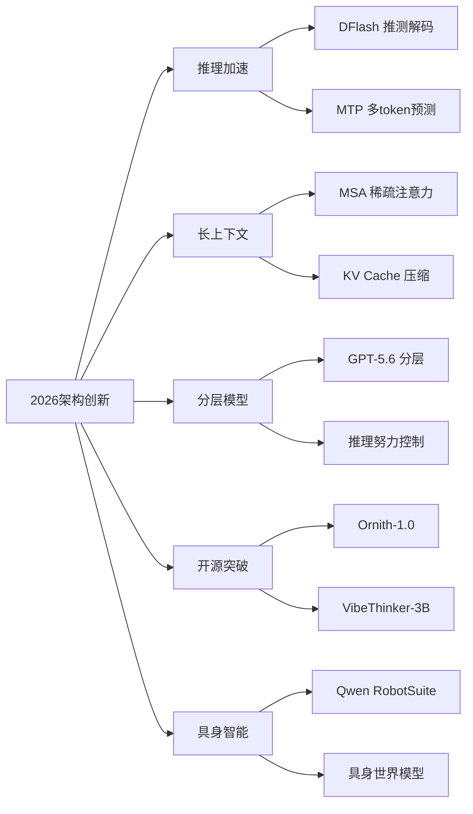

# 2026年模型架构创新

## 一、概述

2026年上半年，AI 模型架构在推理效率、长上下文处理和多模态统一三个方向取得重大突破。本文档追踪最新的架构创新。

## 二、推理加速架构

### 2.1 DFlash 推测解码 (Speculative Decoding)

DFlash 是一种在 NVIDIA Blackwell 架构上实现 15x 吞吐量提升的推测解码技术。

**核心原理**：使用轻量级草稿模型快速生成候选 token 序列，目标模型并行验证：

$$
P(\text{accept } d_i) = \min\left(1, \frac{p_{\text{target}}(d_i | x, d_{<i})}{p_{\text{draft}}(d_i | x, d_{<i})}\right)
$$

**Blackwell 优化**：
- 利用 Blackwell 的 FP4 Tensor Core 加速草稿模型推理
- 硬件级并行验证机制
- 动态草稿长度调整

| 平台 | 传统解码 | DFlash 推测解码 | 提升倍数 |
|------|---------|----------------|---------|
| NVIDIA Blackwell (B200) | 1x | 15x | 15x |
| NVIDIA H100 | 1x | 5-8x | 5-8x |

### 2.2 Multi-Token Prediction (MTP)

从每个位置同时预测多个未来 token：

$$
\mathcal{L}_{\text{MTP}} = \sum_{k=1}^{K} \mathcal{L}_{\text{CE}}(y_{t+k}, \hat{y}_{t+k}^{(k)})
$$

**优势**：
- 学习更长距离的模式
- 推理时作为内置推测解码，无需单独草稿模型
- Nemotron 3 实测 3x 推理速度提升

## 三、长上下文架构

### 3.1 MiniMax 稀疏注意力 (MSA)

MSA 在 1M token 上下文下实现 28.4x 注意力计算缩减。

**核心思想**：不是所有 token 对之间都需要计算注意力。MSA 通过学习稀疏模式，只计算重要的注意力连接。

$$
\text{MSA}(Q, K, V) = \text{softmax}\left(\frac{QK^T \odot M_{\text{sparse}}}{\sqrt{d_k}}\right)V
$$

其中 $M_{\text{sparse}}$ 为学习到的稀疏掩码矩阵。

**稀疏模式**：
| 模式 | 描述 | 计算复杂度 |
|------|------|-----------|
| 全注意力 | 所有 token 对 | $O(n^2)$ |
| 滑动窗口 | 局部窗口 | $O(nw)$ |
| MSA | 学习的稀疏模式 | $O(n \cdot k)$, $k \ll n$ |

### 3.2 KV Cache 压缩技术

| 技术 | 方法 | 压缩比 | 精度影响 |
|------|------|--------|---------|
| **TurboQuant** | 极低比特量化 | 4-8x | <1% 精度损失 |
| **OSCAR** | 正交子空间投影 | 4x | 可忽略 |
| **EpiCache** | 情景记忆式选择性保留 | 2-5x | 任务相关 |

**TurboQuant 量化公式**：

$$
\hat{K} = \text{Round}\left(\frac{K - \min(K)}{\max(K) - \min(K)} \times (2^b - 1)\right) \times \frac{\max(K) - \min(K)}{2^b - 1} + \min(K)
$$

其中 $b$ 为量化比特数（TurboQuant 使用 2-4 bit）。

### 3.3 HIP Attention Kernel (AMD MI300X)

针对 AMD MI300X GPU 优化的注意力计算内核：

| 实现 | MI300X 性能 | 相对 AITER v3 |
|------|------------|--------------|
| AITER v3 | 基线 | 1.0x |
| HIP Attention | 优化版 | 1.2x+ |

**优化策略**：
- 利用 MI300X 的 Matrix Core 指令
- 优化内存访问模式
- 针对 AMD 架构的 warp 调度

## 四、分层推理模型

### 4.1 GPT-5.6 分层架构 (Sol/Terra/Luna)

OpenAI 在 GPT-5.6 中引入分层模型概念：

| 层级 | 名称 | 定位 | 推理深度 |
|------|------|------|---------|
| 基础层 | **Luna** | 快速响应 | 浅层推理 |
| 标准层 | **Terra** | 通用任务 | 中等推理 |
| 深度层 | **Sol** | 复杂推理 | 深度推理 |

**推理努力控制**：

$$
\text{Response} = f_{\text{model}}(x, e_{\text{effort}})
$$

其中 $e_{\text{effort}} \in [0, 1]$ 为推理努力程度，控制计算资源分配。

### 4.2 GLM-5.2 推理努力控制

智谱 AI 的 GLM-5.2 实现了 OpenAI 兼容的 API，并引入推理努力控制参数：

```json
{
  "model": "glm-5.2",
  "messages": [...],
  "reasoning_effort": "high"  // low / medium / high
}
```

## 五、开源模型架构突破

### 5.1 Ornith-1.0 (DeepReinforce)

| 属性 | 值 |
|------|-----|
| 类型 | 开源编码模型 |
| 基础模型 | Gemma 4 + Qwen 3.5 |
| SWE-Bench | 82.4% |
| 许可证 | MIT |
| 特点 | 自学习 RL 脚手架 |

### 5.2 VibeThinker-3B

| 属性 | 值 |
|------|-----|
| 参数量 | 3B |
| 基础模型 | Qwen2.5-Coder-3B |
| 性能 | 匹配 DeepSeek V3.2、Kimi K2.5 |
| 许可证 | MIT |
| 意义 | 证明推理能力可通过架构创新而非规模获得 |

### 5.3 LFM2.5 (Liquid AI)

| 属性 | 值 |
|------|-----|
| 类型 | 多语言搜索模型（Bi-Encoder + ColBERT） |
| 参数量 | 350M |
| 支持语言 | 11 种 |
| 特点 | 高效多语言检索，适合边缘设备 |

## 六、具身智能模型

### 6.1 Qwen RobotSuite

阿里云推出的具身 AI 模型套件：

| 模型 | 功能 | 技术路线 |
|------|------|---------|
| **RobotManip** | 机器人操控 | 基于 Qwen3.5-4B 的 VLA 模型 |
| **RobotWorld** | 世界模型 | 60 层 MMDiT，语言条件化视频生成 |
| **RobotNav** | 导航 | 基于 Qwen3-VL，2B/4B/8B 三种规模 |

**具身 AI 的核心挑战**：
$$
\text{Perception} \rightarrow \text{Understanding} \rightarrow \text{Planning} \rightarrow \text{Action} \rightarrow \text{Feedback}
$$

## 七、架构趋势总结



## 相关条目

- [[AIGC模型架构与应用]]
- [[AIAgents]]
- [[MachineLearning]]
- [[NeuralNetworksAndDeepLearning]]

## 参考资源

1. Leviathan, Y. et al. "Fast Inference from Transformers via Speculative Decoding." ICML, 2023.
2. DeepReinforce. "Ornith-1.0 Technical Report." 2026.
3. MiniMax. "Sparse Attention for Ultra-Long Context." 2026.
4. OpenAI. "GPT-5.6 Technical Report." 2026.
5. Liquid AI. "LFM2.5: Multilingual Search Models." 2026.
6. 智谱 AI. "GLM-5.2: OpenAI-Compatible API with Reasoning Control." 2026.
7. 阿里云. "Qwen RobotSuite: Embodied AI Models." 2026.
