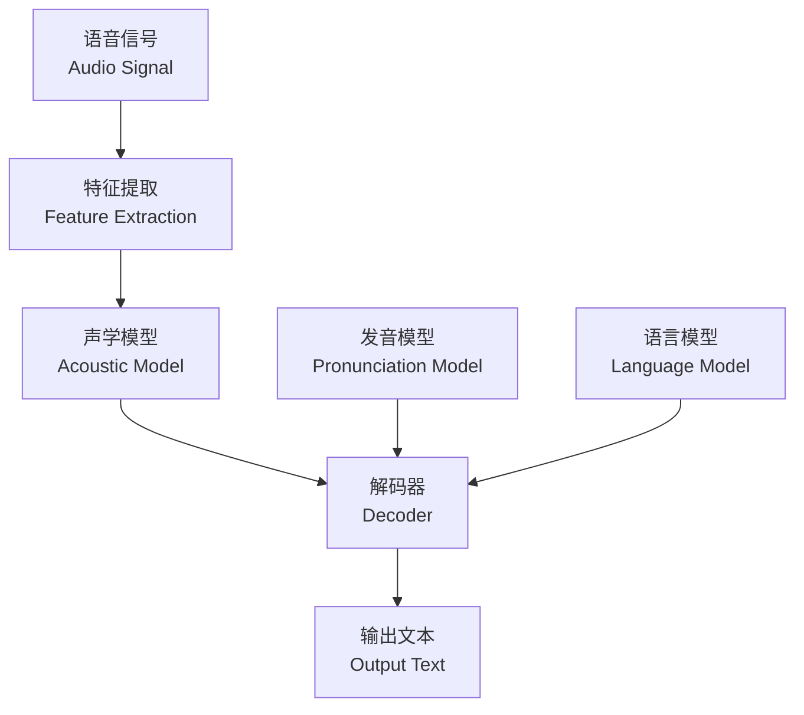
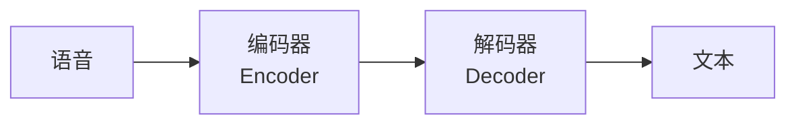

# 语音识别 (Speech Recognition)

## 概述 (Overview)

语音识别（Speech Recognition），也称为自动语音识别（Automatic Speech Recognition, ASR），是将语音信号自动转录为文本的技术。语音识别使计算机能够理解和处理人类语音，是智能助手（如 Siri、Alexa）、语音搜索、自动字幕和语音控制等应用的核心技术。

## 语音识别系统架构

## 传统 ASR 系统组件

### 声学模型 (Acoustic Model)

声学模型学习语音信号与音素（Phoneme）之间的映射关系。

传统声学模型使用高斯混合模型-隐马尔可夫模型（GMM-HMM）：

$$
P(X \mid W) = \sum_{Q} P(X \mid Q) \cdot P(Q \mid W)
$$

其中 $X$ 为声学特征序列，$W$ 为词序列，$Q$ 为状态序列。

### 特征提取 (Feature Extraction)

| 特征 | 描述 | 维度 |
|------|------|------|
| MFCC | 梅尔频率倒谱系数 | 13-40 维 |
| Filter Banks (FBank) | 梅尔滤波器组能量 | 40-80 维 |
| Spectrogram | 频谱图 | 可变 |
| Wav2Vec 特征 | 自监督学习特征 | 高维 |

MFCC 提取过程：

$$
\text{MFCC} = \text{DCT}(\log(\text{Mel}(\text{FFT}(x))))
$$

### 语言模型 (Language Model)

语言模型计算词序列的概率：

$$
P(W) = P(w_1, w_2, \ldots, w_n) = \prod_{i=1}^n P(w_i \mid w_1, \ldots, w_{i-1})
$$

| 类型 | 模型 | 特点 |
|------|------|------|
| 统计 | N-gram | 简单、快速、受限上下文 |
| 神经 | RNNLM | 长距离依赖 |
| 神经 | Transformer LM | 双向上下文 |
| 大模型 | GPT/LLaMA | 语义理解强 |

## 端到端 ASR (End-to-End ASR)

端到端模型简化了传统 ASR 流程，直接从语音到文本：

### CTC (Connectionist Temporal Classification)

CTC 解决了输入输出序列长度不等的问题：

$$
P(Y \mid X) = \sum_{A \in \mathcal{B}^{-1}(Y)} \prod_{t=1}^T P(a_t \mid X)
$$

其中 $\mathcal{B}$ 为压缩映射（去重+去 blank），$a_t$ 为时间步 $t$ 的 token。

CTC 损失函数：

$$
\mathcal{L}_{\text{CTC}} = -\ln P(Y \mid X)
$$

### Listen-Attend-Spell (LAS)

LAS 是基于注意力机制的 Encoder-Decoder 模型：

| 组件 | 功能 | 结构 |
|------|------|------|
| Listener (编码器) | 语音特征编码 | 金字塔双向 LSTM |
| Attender (注意力) | 对齐声学帧 | 内容/位置注意力 |
| Speller (解码器) | 文本生成 | LSTM + Softmax |

### RNN-T (Recurrent Neural Network Transducer)

RNN-T 是流式 ASR 的标准架构：

$$
P(Y \mid X) = \sum_{\substack{\text{alignment}\\ \alpha}} \prod_{t=1}^{T+U} P(\alpha_t \mid X)
$$

## 端到端 ASR 模型对比

| 模型 | 流式 | 优势 | 劣势 |
|------|------|------|------|
| CTC | 是 | 简单、并行 | 条件独立假设强 |
| LAS | 否 | 质量高 | 不能流式 |
| RNN-T | 是 | 流式+高质量 | 训练复杂 |
| Transformer | 否 | 全局上下文 | 延迟高 |
| Whisper | 否 | 多任务、零样本 | 需大量资源 |

## 评估指标 (Evaluation Metrics)

### 词错误率 (Word Error Rate, WER)

$$
\text{WER} = \frac{S + D + I}{N}
$$

其中 $S$ 为替换数（Substitutions），$D$ 为删除数（Deletions），$I$ 为插入数（Insertions），$N$ 为参考词总数。

### 实时因子 (Real-Time Factor, RTF)

$$
\text{RTF} = \frac{T_{\text{processing}}}{T_{\text{audio}}}
$$

| RTF | 含义 |
|-----|------|
| < 1.0 | 快于实时（可流式） |
| = 1.0 | 实时处理 |
| > 1.0 | 慢于实时 |

## 自监督学习 (Self-Supervised Learning)

近年来，自监督学习在 ASR 中取得了显著成就：

| 模型 | 预训练方法 | 参数量 | 特点 |
|------|-----------|--------|------|
| wav2vec 2.0 | 对比学习 + 量化 | 95M-317M | 少量标注即可 fine-tune |
| HuBERT | 聚类 + 掩码预测 | 95M-317M | 无需量化 |
| WavLM | 掩码 + 去噪 | 94M-316M | 多说话人场景 |
| Whisper | 弱监督多任务 | 39M-1.5B | 30万小时多语言 |

## 挑战 (Challenges)

| 挑战 | 描述 | 应对策略 |
|------|------|---------|
| 噪声环境 (Noise) | 背景声干扰 | 数据增强、降噪前端 |
| 口音变化 (Accent) | 方言/非母语 | 多口音训练、自适应 |
| 语速变化 (Speaking Rate) | 快/慢速语音 | 时域增强、RTF 自适应 |
| 重叠语音 (Overlap) | 多人同时说话 | 说话人分离 (SED) |
| 远场语音 (Far-field) | 距离衰减、混响 | 波束成形、调向 |

## 应用场景 (Applications)

| 领域 | 应用 | 示例 |
|------|------|------|
| 智能助手 | 语音指令 | Siri, Alexa, Google Assistant |
| 医疗 | 临床文档转录 | Dragon Medical |
| 呼叫中心 | 实时录音分析 | Cisco, Genesys |
| 媒体 | 自动字幕 | YouTube, Otter.ai |
| 教育 | 语音评测 | Duolingo |
| 车载 | 语音控制 | 车载系统 |

## 相关条目

- [[NLPOverview]]
- [[MLOverview]]
- [[ArtificialIntelligence]]
- [[DigitalSignalProcessing]]
- [[HumanComputerInteraction]]
- [[DeepLearning]]
