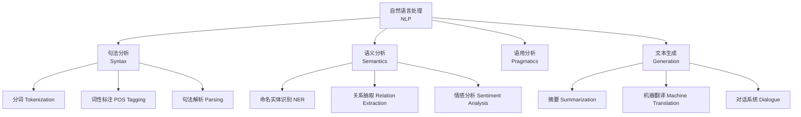
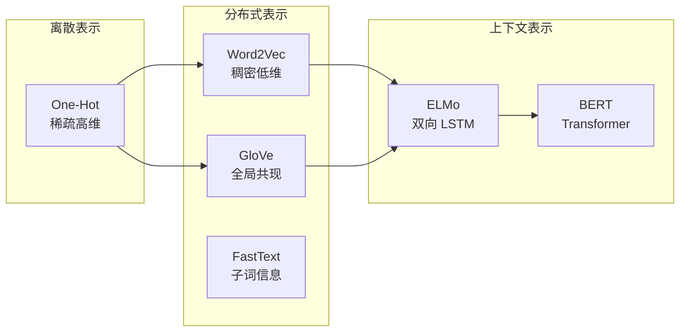
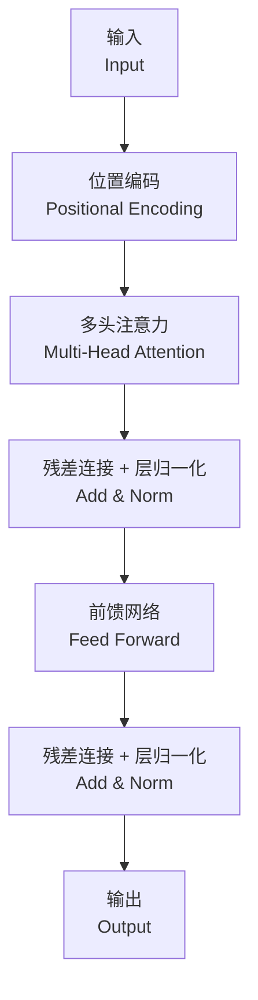

---
aliases: [NaturalLanguageProcessing, 自然语言处理, NLP]
tags: ['05_ComputerScience', 'AI', 'NLP', 'MachineLearning']
created: 2026-05-17
updated: 2026-05-17
---

# 自然语言处理概述 (NLP Overview)

## 概述 (Overview)

自然语言处理（Natural Language Processing, NLP）是人工智能和计算语言学（Computational Linguistics）的交叉领域，专注于使计算机能够理解、解释和生成人类语言。NLP 使机器能够阅读文本、理解语音、分析情感并生成自然语言响应。

## NLP 任务层次

## 文本预处理 (Text Preprocessing)

| 步骤 | 方法 | 说明 |
|------|------|------|
| 分词 (Tokenization) | 空格/字典/BPE | 将文本切分为 tokens |
| 归一化 (Normalization) | 小写化、Unicode 规范化 | 减少稀疏性 |
| 去停用词 (Stopword Removal) | 高频无意义词过滤 | 减少噪声 |
| 词干提取 (Stemming) | Porter、Lancaster | 粗暴去除词缀 |
| 词形还原 (Lemmatization) | WordNet、spaCy | 返回词典词形 |

## 词嵌入 (Word Embeddings)

词嵌入将离散词汇映射到低维连续向量空间：

### 经典词嵌入对比

| 模型 | 上下文 | 特点 | 训练数据 |
|------|--------|------|---------|
| Word2Vec (SG) | 窗口上下文 | 简单高效 | 数十亿词 |
| GloVe | 全局共现矩阵 | 统计+神经网络 | Wikipedia |
| FastText | 子词 n-gram | 处理 OOV 词 | 大规模语料 |
| ELMo | 双向 LSTM | 上下文相关 | 大型语料 |
| BERT | 双向 Transformer | 深度上下文 | 33 亿词 |
| GPT | 单向 Transformer | 自回归生成 | 海量文本 |

## Transformer 架构

Transformer 的核心是自注意力机制（Self-Attention）：

$$
\text{Attention}(Q, K, V) = \text{softmax}\left(\frac{QK^T}{\sqrt{d_k}}\right)V
$$

其中 $Q$, $K$, $V$ 分别为 Query、Key、Value 矩阵，$d_k$ 为缩放因子。

### 多头注意力 (Multi-Head Attention)

$$
\text{MultiHead}(Q, K, V) = \text{Concat}(\text{head}_1, \ldots, \text{head}_h) W^O
$$

$$
\text{head}_i = \text{Attention}(QW_i^Q, KW_i^K, VW_i^V)
$$

## 预训练语言模型 (Pre-trained Language Models)

| 模型 | 架构 | 参数量 | 预训练任务 |
|------|------|--------|-----------|
| BERT | Encoder-only | 110M-340M | MLM + NSP |
| RoBERTa | Encoder-only | 125M-355M | MLM（改进） |
| GPT-3 | Decoder-only | 175B | Autoregressive LM |
| T5 | Encoder-Decoder | 60M-11B | Text-to-Text |
| LLaMA | Decoder-only | 7B-65B | Autoregressive LM |
| Mistral | Decoder-only | 7B | Sliding Window Attention |

## 文本分类 (Text Classification)

文本分类是 NLP 中最基础的任务之一：

$$
\hat{y} = \text{softmax}(f_{\theta}(x))
$$

### 分类架构演进

| 时代 | 模型 | 准确率 |
|------|------|--------|
| 传统 | BoW + SVM | 基线 |
| 词嵌入 | CNN/LSTM + Embedding | 中 |
| 预训练 | BERT Fine-tuning | 高 |
| 大模型 | GPT In-context Learning | 最高 |

## 评估指标 (Evaluation Metrics)

### 分类任务

| 指标 | 计算方式 |
|------|---------|
| 准确率 (Accuracy) | $\frac{TP + TN}{Total}$ |
| 精确率 (Precision) | $\frac{TP}{TP + FP}$ |
| 召回率 (Recall) | $\frac{TP}{TP + FN}$ |
| F1 分数 | $\frac{2 \cdot P \cdot R}{P + R}$ |

### 生成任务

| 指标 | 用途 | 说明 |
|------|------|------|
| BLEU | 机器翻译 | 基于 n-gram 精确率 |
| ROUGE | 自动摘要 | 基于召回率 |
| METEOR | 翻译 | 同义词+词形匹配 |
| Perplexity | 语言模型 | 困惑度越低越好 |

## 相关条目

- [[05_ComputerScience/ArtificialIntelligence/MachineLearning/MLOverview|MLOverview]]
- [[SpeechRecognition]]
- [[05_ComputerScience/ArtificialIntelligence/MachineLearning/ReinforcementLearning/RLOverview|RLOverview]]
- [[07_InterdisciplinarySciences/CognitiveScience/ArtificialIntelligence|ArtificialIntelligence]]
- [[05_ComputerScience/HumanComputerInteraction/HumanComputerInteraction|HumanComputerInteraction]]

