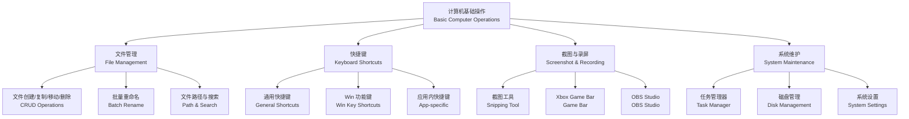

# 计算机基础操作指南 (Basic Computer Operations)

## 概述 (Overview)

计算机基础操作指南是一份面向初级用户的综合性参考文档。

涵盖文件管理（File Management）、快捷键（Keyboard Shortcuts）、
截图录屏（Screenshot & Screen Recording）、
任务管理器（Task Manager）和系统设置（System Settings）等日常高频操作。

本文以 Windows 操作系统为主，
同时提供 Linux/macOS 的对应方案。

掌握这些基础操作可以显著提升日常工作效率。

是数字素养（Digital Literacy）的核心组成部分。



---

## 文件管理 (File Management)

### 基本操作命令对照表

| 操作 | Windows (图形界面) | Windows (命令行 CMD) | Windows (PowerShell) | Linux/macOS (Terminal) |
|------|-------------------|----------------------|----------------------|------------------------|
| 创建空文件 | 右键 → 新建 → 文本文档 | `type nul > file.txt` | `New-Item file.txt` | `touch file.txt` |
| 创建文件夹 | 右键 → 新建 → 文件夹 | `mkdir folder` | `New-Item -ItemType Directory` | `mkdir folder` |
| 复制文件 | Ctrl+C → Ctrl+V | `copy src dest` | `Copy-Item src dest` | `cp src dest` |
| 移动/重命名 | Ctrl+X → Ctrl+V | `move src dest` | `Move-Item src dest` | `mv src dest` |
| 删除文件 | Delete 或 Shift+Delete | `del file` | `Remove-Item file` | `rm file` |
| 删除文件夹 | 右键 → 删除 | `rmdir /s folder` | `Remove-Item -Recurse folder` | `rm -rf folder` |
| 重命名 | F2 选中后修改文件名 | `ren old new` | `Rename-Item old new` | `mv old new` |
| 查看列表 | 打开资源管理器 | `dir` | `Get-ChildItem` | `ls` |
| 查看隐藏文件 | 查看 → 显示 → 隐藏项目 | `dir /a` | `Get-ChildItem -Force` | `ls -a` |

### 文件路径规则 (File Path Rules)

- **Windows**：反斜杠 `\` 作为路径分隔符，驱动器号如 `C:`，
  最长路径 260 个字符

- **Linux/macOS**：正斜杠 `/` 作为路径分隔符，
  无驱动器号概念，根目录为 `/`

- **相对路径（Relative Path）**：`.` 表示当前目录，
  `..` 表示父目录

- **绝对路径（Absolute Path）**：从根目录开始的完整路径表示

### 批量重命名示例 (Batch Rename Examples)

```powershell
# PowerShell：批量添加前缀
Get-ChildItem *.jpg | Rename-Item -NewName { "photo_" + $_.Name }

# PowerShell：替换文件名中的空格为下划线
Get-ChildItem -File | Rename-Item -NewName { $_.Name -replace " ", "_" }

# PowerShell：按创建时间批量编号
$i = 1; Get-ChildItem *.png | Sort-Object CreationTime | ForEach-Object {
    Rename-Item $_ -NewName ("screenshot_{0:D3}.png" -f $i++)
}
```

```bash
# Linux/macOS：批量添加后缀
for f in *.jpg; do mv "$f" "photo_$f"; done

# Linux/macOS：批量替换空格
rename 's/ /_/g' *.txt
```

---

## 快捷键大全 (Keyboard Shortcuts)

### Windows 通用快捷键

| 快捷键 | 功能 | 等效操作 |
|--------|------|----------|
| Ctrl+C | 复制（Copy） | 右键 → 复制 |
| Ctrl+X | 剪切（Cut） | 右键 → 剪切 |
| Ctrl+V | 粘贴（Paste） | 右键 → 粘贴 |
| Ctrl+Z | 撤销（Undo） | 上一步操作回退 |
| Ctrl+Y | 重做（Redo） | 撤销回退 |
| Ctrl+A | 全选（Select All） | 选择当前范围所有内容 |
| Ctrl+S | 保存（Save） | 保存当前文件 |
| Ctrl+F | 查找（Find） | 在当前页面搜索 |
| Ctrl+H | 替换（Replace） | 查找并替换文本 |
| Ctrl+P | 打印（Print） | 打开打印对话框 |
| Ctrl+Shift+Esc | 打开任务管理器 | 直接打开，无需经过安全界面 |

### Win 系列快捷键 (Windows Key Shortcuts)

| 快捷键 | 功能 | 适用场景 |
|--------|------|----------|
| Win+D | 显示桌面/切回 | 快速查看桌面或恢复到之前窗口 |
| Win+E | 打开文件资源管理器 | 快速访问文件夹 |
| Win+I | 打开系统设置 | 调整系统配置 |
| Win+L | 锁定电脑 | 离开座位时的安全操作 |
| Win+R | 运行对话框 | 输入命令启动程序 |
| Win+S | 搜索（Cortana） | 搜索文件、应用和设置 |
| Win+Tab | 任务视图 | 虚拟桌面管理和窗口切换 |
| Win+V | 剪贴板历史 | 查看多条复制历史记录 |
| Win+句点 | 表情符号面板 / Emoji Picker | 快速插入 Emoji 和符号 |
| Win+Shift+S | 截图（Snip & Sketch） | 区域截图并自动保存到剪贴板 |
| Win+数字键 | 打开任务栏第 N 个程序 | 快速启动固定程序 |

---

## 截图与录屏 (Screenshot and Screen Recording)

### 截图工具对比

| 方法 | 快捷键 | 说明 |
|------|--------|------|
| 全屏截图 | PrintScreen / Win+PrtSc | 前者保存到剪贴板，后者自动保存到图片文件夹 |
| 活动窗口截图 | Alt+PrtSc | 仅截取当前活动窗口 |
| 区域截图 | Win+Shift+S | 支持矩形、任意形状、窗口和全屏四种模式 |
| Snipping Tool（截图工具） | Win+S → 搜索"截图工具" | 支持延迟截图（3–10 秒）和简单标注 |
| Snipaste | 自定义快捷键（推荐 F1） | 第三方工具，支持贴图和标注 |
| ShareX | 自定义快捷键 | 免费开源，支持自动上传到图床和 OCR |

### 录屏工具对比

| 工具 | 系统内置/第三方 | 特点 | 适用场景 |
|------|---------------|------|----------|
| Xbox Game Bar（Win+G） | Windows 内置 | 无需安装，支持麦克风和系统音频 | 快速录屏、游戏录制 |
| OBS Studio | 免费开源 | 专业级录制/推流，支持多场景切换和滤镜 | 专业录制、直播 |
| ScreenRec | 免费（轻量） | 即录即分享，支持自动生成分享链接 | 快速分享录屏 |
| Camtasia | 付费 | 内置视频编辑器，支持字幕和标注 | 教学视频制作 |

### 录制参数建议 (Recording Settings)

- **分辨率**：建议 1080p（1920×1080），兼顾清晰度和文件大小

- **帧率**：普通内容 30fps，游戏或动态内容 60fps

- **码率**：H.264 编码，建议 10–20 Mbps

- **音频**：48 kHz 采样率，16 bit 位深

---

## 任务管理器 (Task Manager)

打开方式：`Ctrl+Shift+Esc` 直接打开，
或 `Ctrl+Alt+Del` → 选择任务管理器。

| 选项卡 | 用途 | 常见操作 |
|--------|------|----------|
| 进程（Processes） | 查看 CPU、内存、磁盘、网络的实时占用 | 右键结束卡顿或无响应的进程 |
| 性能（Performance） | 监控 CPU 使用率、内存占用、磁盘活动、网络吞吐 | 观察系统资源瓶颈 |
| 启动（Startup） | 管理开机自启程序 | 禁用不必要的程序以提升开机速度 |
| 用户（Users） | 查看当前登录用户及其资源占用 | 多用户环境下管理会话 |
| 详细信息（Details） | 查看所有进程的 PID、优先级、CPU 亲和性等 | 高级用户排查深层问题 |
| 服务（Services） | 管理系统服务 | 启动、停止、重启 Windows 服务 |

**实用技巧 (Tips)**：

- 程序卡死时，在"进程"页右键应用程序
  → **结束任务（End Task）**

- 在"启动"页禁用不需要的开机自启程序
  可显著提升开机速度

- 在"性能"页查看内存插槽数和频率，
  判断是否需要升级内存

- 如果 CPU 长期占用超过 90%，
  检查是否有挖矿病毒或系统后台更新

---

## 系统设置常用入口 (System Settings Quick Access)

| 操作 | 路径 / 快捷键 | 说明 |
|------|--------------|------|
| 系统设置 | Win+I | Windows 设置主界面（替代控制面板） |
| 控制面板 | Win+R → `control` | 传统控制面板 |
| 设备管理器 | Win+R → `devmgmt.msc` | 查看和管理硬件设备驱动状态 |
| 磁盘管理 | Win+R → `diskmgmt.msc` | 分区管理、磁盘初始化、更改驱动器号 |
| 网络连接 | Win+R → `ncpa.cpl` | 查看网络适配器、配置 IP 和 DNS |
| 程序和功能 | Win+R → `appwiz.cpl` | 卸载或更改已安装程序 |
| 系统信息 | Win+R → `msinfo32` | 查看完整的硬件和软件配置信息 |
| 注册表编辑器 | Win+R → `regedit` | 直接编辑 Windows 注册表（谨慎操作） |
| 组策略编辑器 | Win+R → `gpedit.msc` | 专业版/企业版系统策略配置 |
| 服务管理 | Win+R → `services.msc` | 启动、停止、禁用 Windows 服务 |
| 命令提示符 | Win+R → `cmd` | 传统命令行界面 |
| PowerShell | Win+R → `powershell` | 现代命令行和脚本环境 |

---

## 相关条目 (Related Notes)

- [[05_ComputerScience/ProgrammingLanguages/INDEX|ProgrammingLanguages]] — 编程语言索引

- [[05_ComputerScience/DataStructuresAndAlgorithms/DataStructures/INDEX|DataStructures]] — 数据结构

- [[CommandLineBasics]] — 命令行基础操作

- [[GitBasics]] — Git 版本控制基础

- [[FileSystemOrganization]] — 文件系统组织方式

- [[SystemMaintenance]] — 系统维护与优化

- [[ProductivityTools]] — 效率工具推荐
