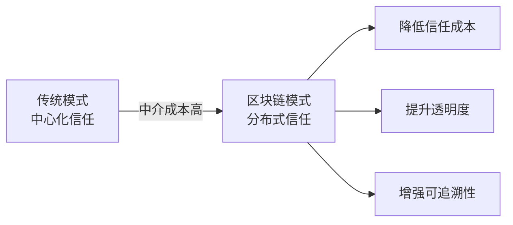
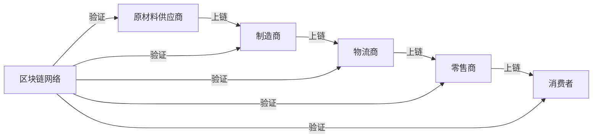
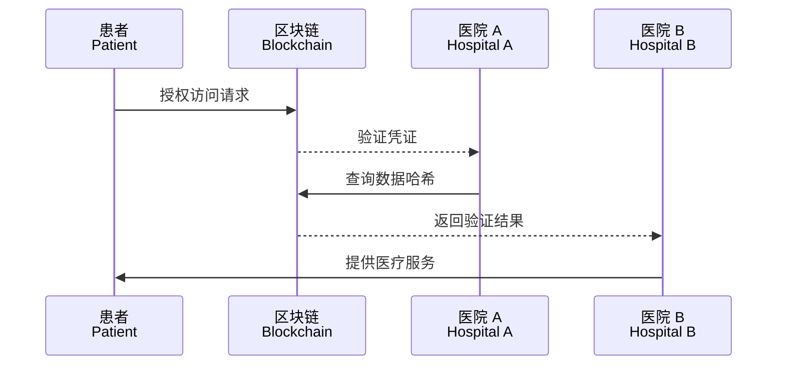
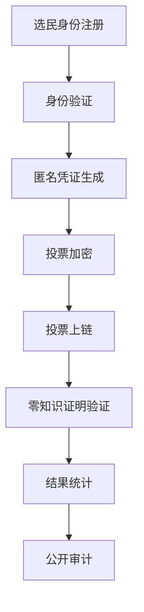
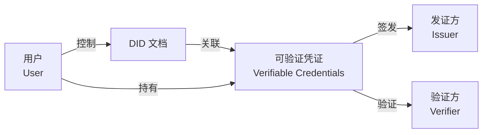
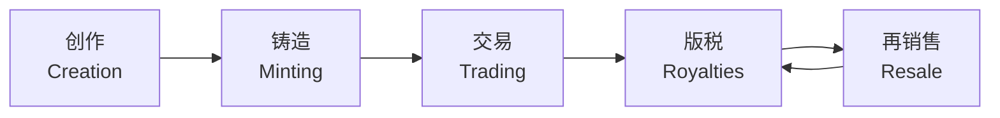
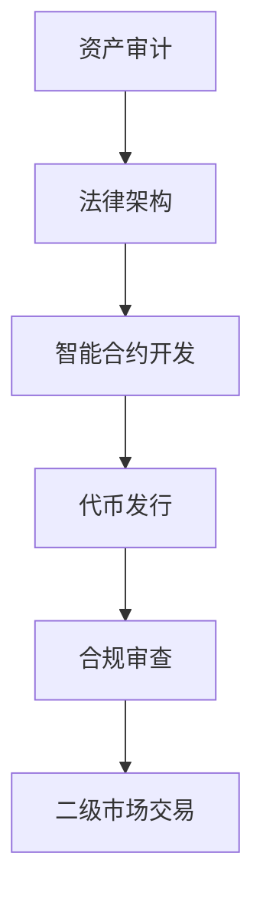
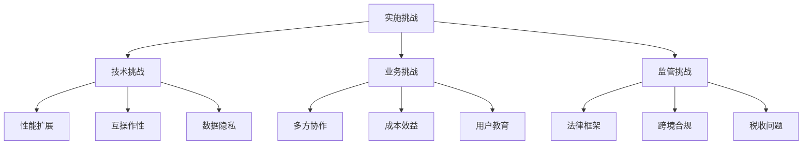

---
aliases:
  - 区块链应用
  - Blockchain Use Cases
tags:
created: 2026-05-17
updated: 2026-05-17
  - blockchain
  - application
  - supply-chain
  - healthcare
  - NFT
---

# 区块链应用 (Blockchain Applications)

区块链技术凭借其去中心化（Decentralization）、不可篡改（Immutability）、透明可追溯（Transparency）等特性，正在重塑多个行业的业务模式与信任机制。

## 概述 (Overview)

区块链应用的核心价值在于解决多方协作中的信任问题，通过分布式账本（Distributed Ledger）和共识机制（Consensus Mechanism）实现无需中介的可信数据交换。

## 供应链管理 (Supply Chain)

区块链在供应链领域实现了端到端的透明追溯，从原材料采购到终端消费的完整链路均可验证。

### 应用架构

### 核心优势

| 优势 | 描述 | 示例 |
|------|------|------|
| 溯源追踪 | 记录商品全生命周期 | 食品安全追溯 |
| 防伪验证 | 确保商品真实性 | 奢侈品防伪 |
| 效率提升 | 减少纸质单据 | 跨境贸易单证 |
| 责任明确 | 快速定位问题环节 | 药品召回 |

### 典型项目

| 项目 | 行业 | 特点 |
|------|------|------|
| IBM Food Trust | 食品 | 沃尔玛、家乐福采用 |
| TradeLens | 航运 | 马士基、IBM 合作 |
| VeChain | 综合 | 商品数字化身份 |

## 医疗健康 (Healthcare)

区块链在医疗领域主要解决数据孤岛、隐私保护和药品追溯问题。

### 电子健康档案 (EHR, Electronic Health Records)

患者数据分布式存储，通过智能合约授权访问：

$$Access = f(PatientConsent, ProviderCredential, TimeWindow)$$

### 药品溯源

| 环节 | 上链数据 | 价值 |
|------|----------|------|
| 生产 | 批次、成分、GMP 认证 | 确保生产合规 |
| 流通 | 温湿度、位置、转手记录 | 防止假药流入 |
| 处方 | 医生资质、开具记录 | 规范用药行为 |

## 投票系统 (Voting Systems)

区块链投票旨在解决传统投票中的透明度不足、计票争议和身份验证问题。

### 技术架构

### 关键要求

| 要求 | 实现方式 | 挑战 |
|------|----------|------|
| 匿名性 | 环签名、盲签名 | 防止胁迫投票 |
| 可验证 | 同态加密 | 计算开销大 |
| 不可篡改 | 链上存储 | 数据膨胀 |
| 身份唯一 | DID 数字身份 | 身份认证困难 |

## 数字身份 (Digital Identity)

去中心化身份（DID, Decentralized Identifier）赋予用户对自身身份数据的完全控制权。

### DID 架构

$$DID Document = \{PublicKey, Authentication, ServiceEndpoint, ...\}$$

### 应用场景

| 场景 | 描述 |
|------|------|
| 自主身份 | 用户管理个人数据授权 |
| KYC 共享 | 一次认证，多机构复用 |
| 学历认证 | 防伪造学位证书 |
| 职业资格 | 技能凭证链上存证 |

## 非同质化代币 (NFTs, Non-Fungible Tokens)

NFT 是区块链上独一无二的数字资产标识，代表对特定资产（数字或实物）的所有权。

### 技术标准

| 标准 | 特点 | 适用场景 |
|------|------|----------|
| ERC-721 | 每个代币唯一 | 数字艺术、收藏品 |
| ERC-1155 | 批量管理多种代币 | 游戏道具、门票 |
| ERC-6551 | 代币绑定账户 | NFT 拥有子资产 |

### NFT 价值链

版税自动分配机制：

$$Royalty = SalePrice \times RoyaltyRate$$

## 资产代币化 (Tokenization)

资产代币化（Tokenization）将现实资产映射为区块链上的数字代币，实现 fractional ownership 和 24/7 流动性。

### 可代币化资产类型

| 资产类别 | 示例 | 优势 |
|----------|------|------|
| 房地产 | 商业地产份额 | 降低投资门槛 |
| 证券 | 股票、债券 | T+0 结算 |
| 大宗商品 | 黄金、石油 | 简化交割 |
| 知识产权 | 专利、版权 | 自动版税分配 |
| 艺术品 | 名画、古董 | 流动性提升 |

### 代币化流程

## 应用对比分析 (Comparison)

| 应用领域 | 核心价值 | 成熟度 | 主要挑战 |
|----------|----------|--------|----------|
| 供应链 | 溯源透明 | 中高 | 数据上链真实性 |
| 医疗 | 数据共享 | 中 | 隐私合规 |
| 投票 | 公开可审计 | 低 | 规模化、用户体验 |
| 数字身份 | 自主控制 | 中 | 生态 adoption |
| NFT | 数字所有权 | 高 | 泡沫与投机 |
| 资产代币化 | 流动性 | 中 | 监管合规 |

## 实施挑战 (Implementation Challenges)

## 未来趋势 (Future Trends)

- 跨链互操作性提升，打破应用孤岛
- 隐私计算（零知识证明、同态加密）与区块链结合
- 监管科技（RegTech）与合规框架完善
- 企业级联盟链与公链协同发展
- 人工智能与区块链的深度融合

## 参考资源 (References)

- [Hyperledger Use Cases](https://www.hyperledger.org/use)
- [MIT Digital Currency Initiative](https://dci.mit.edu/)
- [W3C DID Specification](https://www.w3.org/TR/did-core/)

