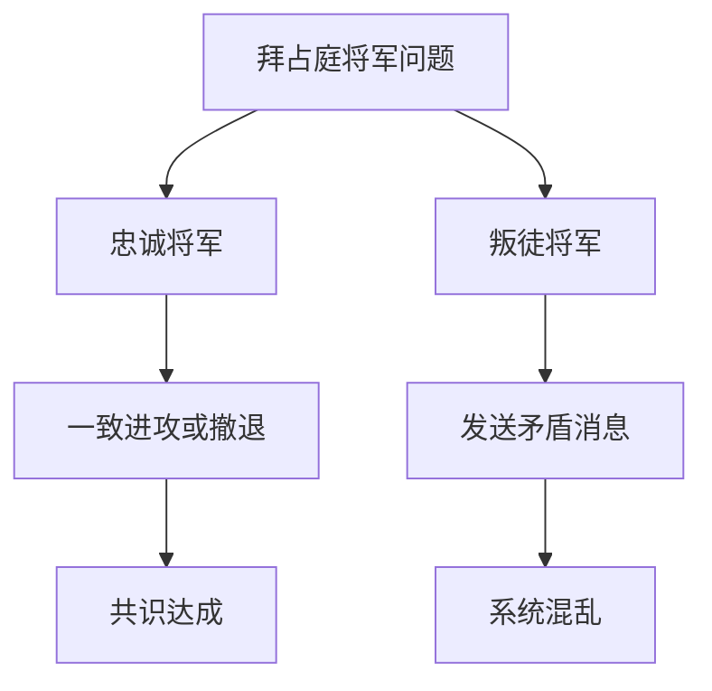
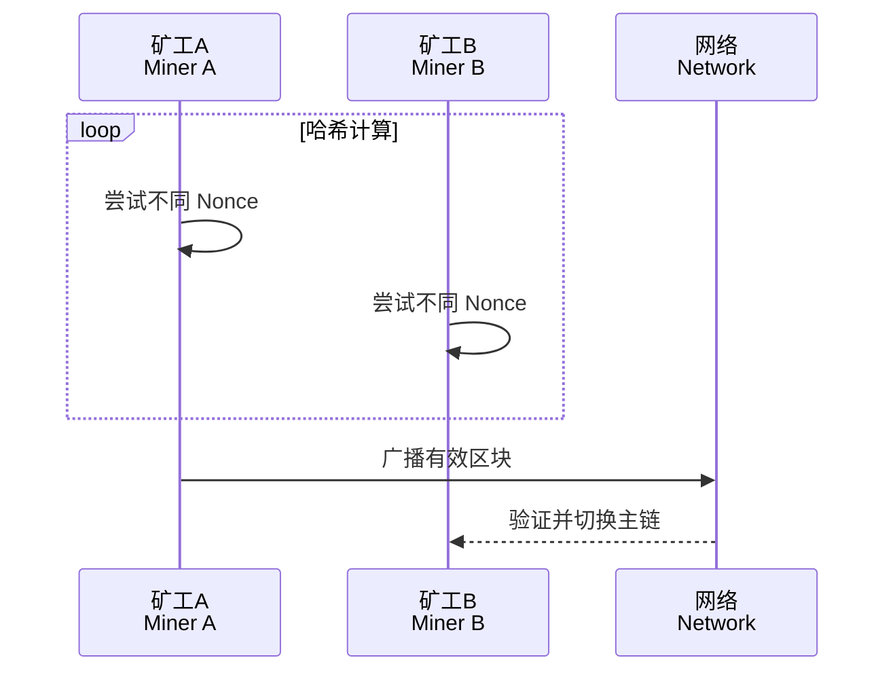
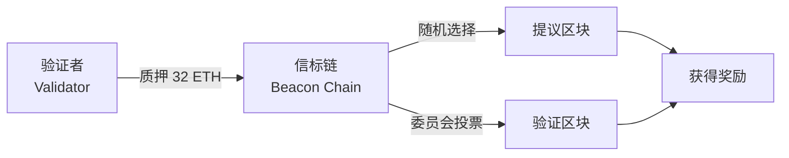
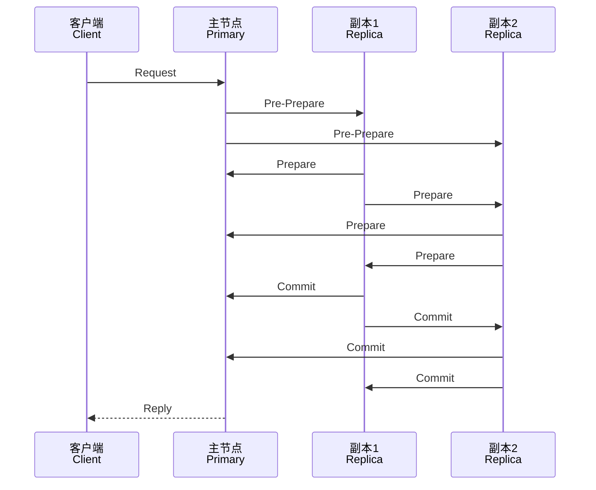
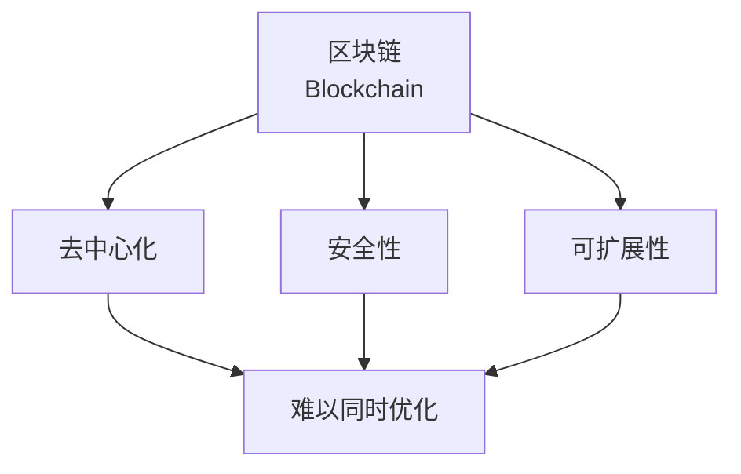
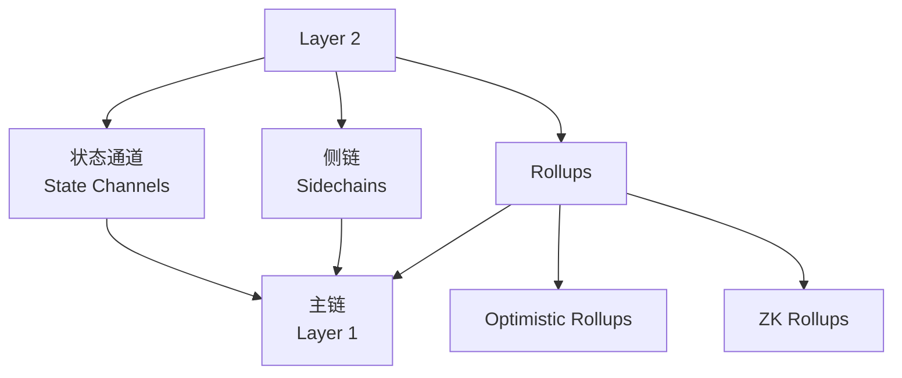
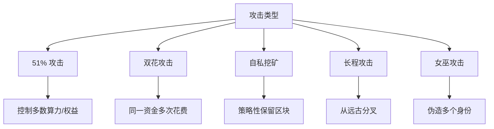

---
aliases:
  - 共识机制
  - Consensus Mechanism
tags:
  - blockchain
  - consensus
  - distributed-systems
  - byzantine
  - scalability
---

# 区块链共识 (Blockchain Consensus)

共识机制（Consensus Mechanism）是区块链网络中各节点就交易顺序和状态达成一致的核心算法，解决了分布式系统中多方协作的信任问题。

## 概述 (Overview)

在分布式系统中，共识问题指多个参与者如何在可能存在故障或恶意节点的情况下达成一致。区块链共识必须同时满足：

| 属性 | 描述 |
|------|------|
| 一致性（Agreement） | 所有诚实节点达成相同决策 |
| 有效性（Validity） | 决策值必须来自诚实节点的提议 |
| 终止性（Termination） | 所有诚实节点最终达成一致 |

## 分布式共识基础 (Distributed Consensus Fundamentals)

### FLP 不可能定理

Fischer, Lynch 和 Paterson 证明：在异步网络中，即使只有一个故障节点，也不存在确定性的共识算法。

$$\text{Asynchronous} + \text{Even 1 Faulty Node} \Rightarrow \text{No Deterministic Consensus}$$

区块链通过引入概率性终止（如最长链规则）或同步假设来绕过此限制。

### 拜占庭将军问题 (Byzantine Generals Problem)

拜占庭容错（BFT, Byzantine Fault Tolerance）要求系统在 $f$ 个拜占庭节点存在时仍能正确运行。对于 $n$ 个节点，BFT 要求：

$$n \geq 3f + 1$$

## 主要共识算法 (Major Consensus Algorithms)

### 工作量证明 (PoW, Proof of Work)

PoW 通过计算难题竞争记账权，Bitcoin 采用此机制。

#### 挖矿过程

$$Hash(BlockHeader + Nonce) < Target$$

#### PoW 参数

| 参数 | Bitcoin | Ethereum（前） |
|------|---------|----------------|
| 出块时间 | ~10 分钟 | ~13 秒 |
| 共识最终性 | 概率性 | 概率性 |
| 能耗 | 极高 | 高 |
| 安全性 | 高 | 中高 |

### 权益证明 (PoS, Proof of Stake)

PoS 根据持有代币的数量和时间选择验证者，以太坊 2.0 采用此机制。

#### 核心公式

$$P(Selection) \propto StakeAmount \times RandomFactor$$

#### PoS 变体

| 变体 | 机制 | 代表 |
|------|------|------|
| 链式 PoS | 按质押比例选块 | Peercoin |
| DPoS | 委托投票选代表 | EOS, Tron |
| LPoS | 委托他人质押 | Tezos |
| NPoS | 提名验证人 | Polkadot |

### 实用拜占庭容错 (PBFT, Practical Byzantine Fault Tolerance)

PBFT 在同步网络中实现确定性共识，适用于联盟链。

#### 三阶段协议

#### 通信复杂度

$$O(n^2)$$

PBFT 的瓶颈在于消息数量随节点数平方增长。

### 其他共识算法

| 算法 | 机制 | 特点 | 代表项目 |
|------|------|------|----------|
| Raft | 领导者选举 | 简单高效，无 BFT | 联盟链 |
| HotStuff | 流水线 BFT | 线性通信复杂度 | Libra/Diem |
| Avalanche | 亚稳态共识 | 高吞吐、低延迟 | Avalanche |
| Tendermint | BFT + PoS | 即时最终性 | Cosmos |
| DAG | 有向无环图 | 并行处理 | IOTA, Nano |

## 可扩展性三难困境 (Scalability Trilemma)

区块链系统面临去中心化（Decentralization）、安全性（Security）、可扩展性（Scalability）三者的权衡：

### 数学表述

$$Optimization: \max\{Decentralization, Security, Scalability\}$$

$$s.t.\ Tradeoffs\ exist\ between\ any\ two$$

### 各链的权衡选择

| 区块链 | 优化方向 | 妥协 |
|--------|----------|------|
| Bitcoin | 去中心化 + 安全 | 可扩展性 |
| Solana | 安全 + 可扩展性 | 去中心化 |
| 联盟链 | 安全 + 可扩展性 | 去中心化 |

## 扩容方案 (Scaling Solutions)

### Layer 1 扩容

直接在基础链上提升性能：

| 方案 | 描述 | 示例 |
|------|------|------|
| 分片（Sharding） | 将网络分成多个子集并行处理 | Ethereum 2.0 |
| 大区块 | 增加单个区块容量 | Bitcoin Cash |
| DAG 结构 | 非线性区块组织 | Conflux |

### Layer 2 扩容

将计算移至链下，仅将结果提交到主链：

#### Rollups 对比

| 特性 | Optimistic Rollups | ZK Rollups |
|------|---------------------|------------|
| 验证方式 | 欺诈证明 | 有效性证明 |
| 提款时间 | 7-14 天挑战期 | 即时 |
| 计算开销 | 低 | 高（零知识证明） |
| EVM 兼容 | 完全兼容 | 部分兼容 |
| 代表项目 | Arbitrum, Optimism | zkSync, StarkNet |

## 共识安全性分析 (Security Analysis)

### 攻击向量

### 安全边界

PoW 的安全阈值：

$$\text{Honest Majority: } \alpha > 0.5$$

PoS 的安全阈值（部分协议）：

$$\text{Honest Majority: } \beta > \frac{2}{3}$$

## 共识算法选择指南 (Selection Guide)

| 场景 | 推荐算法 | 理由 |
|------|----------|------|
| 公链、高安全 | PoW | 最高去中心化 |
| 公链、高性能 | PoS + Sharding | 平衡效率与去中心化 |
| 联盟链、确定性 | PBFT/HotStuff | 即时最终性 |
| 私有链、简单 | Raft | 实现简单 |
| 物联网、低功耗 | DAG/PoA | 无挖矿能耗 |

## 未来发展方向 (Future Directions)

- **模块化共识**：执行、共识、数据可用性分层优化
- **并行执行**：提升单链吞吐量
- **跨链共识**：多链间的统一安全模型
- **量子安全**：抗量子计算的共识算法研究
- **MEV 缓解**：最小化矿工/验证者可提取价值

## 参考资源 (References)

- [Bitcoin Whitepaper](https://bitcoin.org/bitcoin.pdf)
- [Ethereum Consensus Docs](https://ethereum.org/en/developers/docs/consensus-mechanisms/)
- [PBFT Original Paper](https://pmg.csail.mit.edu/papers/osdi99.pdf)
