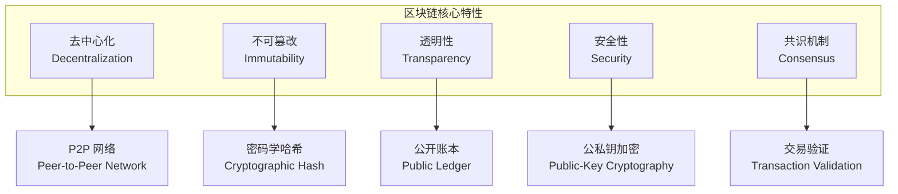
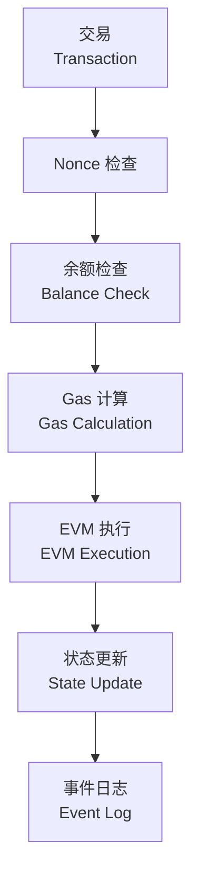
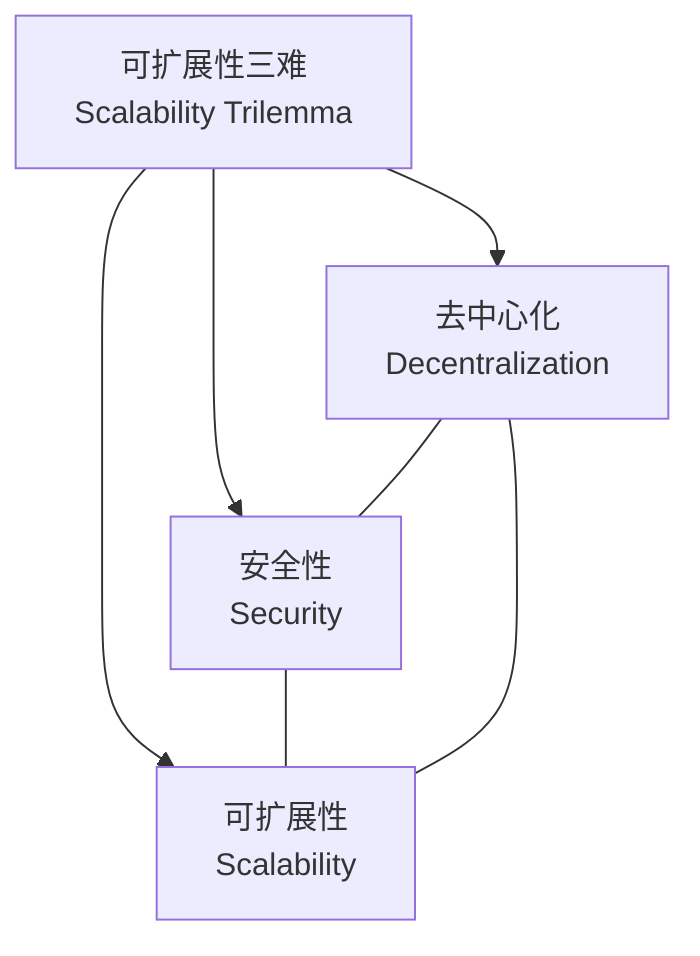

---
aliases:
  - 区块链
  - Blockchain
  - 分布式账本
  - 智能合约
  - 加密货币
tags:
created: 2026-05-17
updated: 2026-05-17
  - blockchain
  - distributed-ledger
  - smart-contracts
  - cryptocurrency
  - web3
---

# 区块链概述 (Blockchain Overview)

## 什么是区块链 (What Is Blockchain)

区块链是一种**去中心化**、**不可篡改**的分布式账本技术。数据以"区块"形式链接成链，每个区块包含前一个区块的加密哈希值，形成防篡改的数据结构。

## 核心特性 (Core Characteristics)



| 特性 (Feature) | 描述 (Description) | 技术基础 |
|---|---|---|
| 去中心化 | 无单点故障 | P2P 网络拓扑 |
| 不可篡改 | 数据无法被修改 | 哈希链 + 共识 |
| 透明性 | 所有交易公开可查 | 全网广播与验证 |
| 安全性 | 防篡改、防双花 | 密码学算法 |
| 匿名性 | 伪匿名账户 | 地址而非身份 |

## 技术架构 (Technical Architecture)

### 分层结构 (Layer Structure)

```
应用层 (Application Layer)     — DApps, DeFi, NFT
合约层 (Contract Layer)        — 智能合约 (Solidity, Rust)
共识层 (Consensus Layer)       — PoW, PoS, DPoS, PBFT
网络层 (Network Layer)         — P2P 网络, Gossip 协议
数据层 (Data Layer)            — 区块、链式结构、Merkle 树
```

### 区块结构 (Block Structure)

$$
\text{Block} = \{\text{BlockHeader}, \text{TransactionList}\}
$$

**区块头 (Block Header):**

| 字段 (Field) | 大小 (Size) | 描述 (Description) |
|---|---|---|
| Previous Hash | 32 bytes | 前一个区块的哈希值 |
| Merkle Root | 32 bytes | 交易 Merkle 树根哈希 |
| Timestamp | 4 bytes | 区块生成时间 |
| Nonce | 4 bytes | 工作量证明随机数 |
| Difficulty Target | 4 bytes | 难度目标值 |

### Merkle 树 (Merkle Tree)

Merkle 树是一种哈希二叉树，用于高效验证交易完整性：

$$
\text{MerkleRoot} = H(H(Tx_1) + H(Tx_2)) \parallel H(H(Tx_3) + H(Tx_4))
$$

## 共识机制 (Consensus Mechanisms)

| 机制 (Mechanism) | 描述 (Description) | 能耗 | 吞吐量 | 代表项目 |
|---|---|---|---|---|
| PoW (工作量证明) | 计算哈希找到目标 Nonce | 高 | 低 (7 TPS) | Bitcoin |
| PoS (权益证明) | 按持币量选择验证者 | 低 | 中 | Ethereum 2.0 |
| DPoS (委托权益证明) | 投票选出区块生产者 | 低 | 高 | EOS, TRON |
| PBFT (实用拜占庭容错) | 节点间投票达成共识 | 低 | 高 | Hyperledger |
| PoA (权威证明) | 授权节点验证交易 | 低 | 高 | VeChain |
| PoH (历史证明) | 时间戳序列证明 | 低 | 高 (50K TPS) | Solana |

### PoW 难度调整

$$
\text{Difficulty} = \frac{\text{Target}_{\text{max}}}{\text{Target}_{\text{current}}}
$$

## 智能合约 (Smart Contracts)

### 定义 (Definition)

智能合约是部署在区块链上的自执行代码，满足预设条件时自动执行。

### Solidity 示例 (Solidity Example)

```
// SPDX-License-Identifier: MIT
pragma solidity ^0.8.0;

contract SimpleStorage {
    uint256 private data;

    function set(uint256 x) public {
        data = x;
    }

    function get() public view returns (uint256) {
        return data;
    }
}
```

### EVM 执行模型 (EVM Execution Model)



## 区块链类型 (Blockchain Types)

| 类型 (Type) | 权限 (Permission) | 特点 (Characteristics) | 典型用例 |
|---|---|---|---|
| 公有链 | 无许可 | 完全去中心化 | 加密货币、DeFi |
| 联盟链 | 许可制 | 部分去中心化 | 供应链、银行间 |
| 私有链 | 单一组织 | 完全中心化 | 内部审计、数据存证 |

## 主要应用 (Major Applications)

### DeFi (去中心化金融)

- **借贷 (Lending)** — Compound, Aave
- **去中心化交易所 (DEX)** — Uniswap, Curve
- **稳定币 (Stablecoin)** — USDC, DAI
- **收益聚合 (Yield Aggregator)** — Yearn Finance

### NFT (非同质化代币)

NFT 标准: ERC-721, ERC-1155

$$
\text{NFT} = \{\text{TokenID}, \text{ContractAddress}, \text{MetadataURI}\}
$$

### 供应链 (Supply Chain)

- 产品溯源 (Provenance Tracking)
- 防伪验证 (Anti-Counterfeiting)
- 物流追踪 (Logistics Tracking)

### DAO (去中心化自治组织)

- 链上治理 (On-chain Governance)
- 提案投票 (Proposal Voting)
- 国库管理 (Treasury Management)

## 技术挑战 (Technical Challenges)

### 可扩展性三难 (Scalability Trilemma)



- Layer 1 方案: 分片 (Sharding), DAG
- Layer 2 方案: Rollup (Optimistic, ZK), 状态通道

### Layer 2 解决方案对比

| 方案 (Solution) | 安全性来源 | 确认时间 | 费用 | 示例 |
|---|---|---|---|---|
| Optimistic Rollup | 欺诈证明 | ~7 天 | 低 | Arbitrum, Optimism |
| ZK Rollup | 零知识证明 | 几分钟 | 很低 | zkSync, StarkNet |
| State Channels | 链下结算 | 即时 | 极低 | Lightning Network |
| Plasma | 子链 | 时间依赖 | 低 | Polygon (旧版) |

## 密码学基础 (Cryptography Foundations)

### 哈希函数 (Hash Functions)

$$
H(x) = y
$$

- **SHA-256** — Bitcoin 使用
- **Keccak-256** — Ethereum 使用
- **特性**: 单向性、抗碰撞、雪崩效应

### 椭圆曲线数字签名 (ECDSA)

$$
\text{Sign}(sk, m) = (r, s)
$$

$$
\text{Verify}(pk, m, r, s) = \text{True/False}
$$

## 参考资源 (References)

- Bitcoin Whitepaper — Satoshi Nakamoto
- Ethereum Whitepaper — Vitalik Buterin
- "Mastering Blockchain" — Imran Bashir
- "Mastering Ethereum" — Andreas Antonopoulos
- Ethereum 官方文档 (ethereum.org)

---

> 区块链的最终价值不在于技术本身，而在于它对社会协作方式的根本性重塑。

