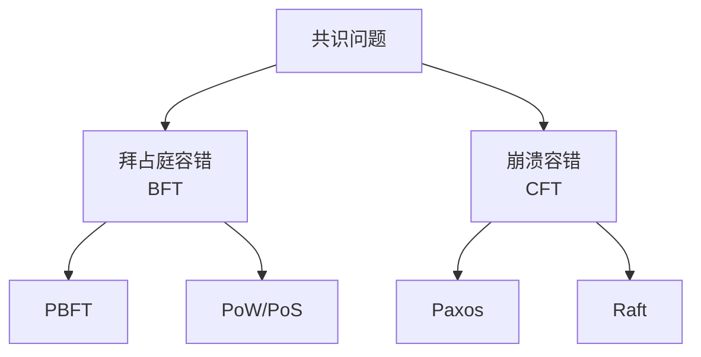
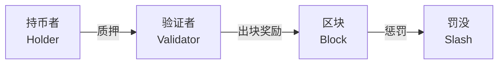
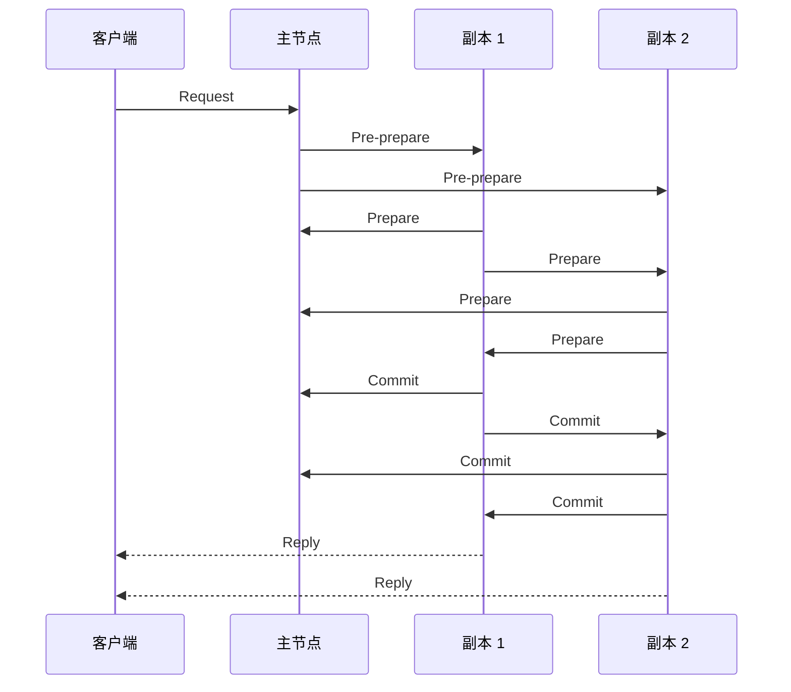
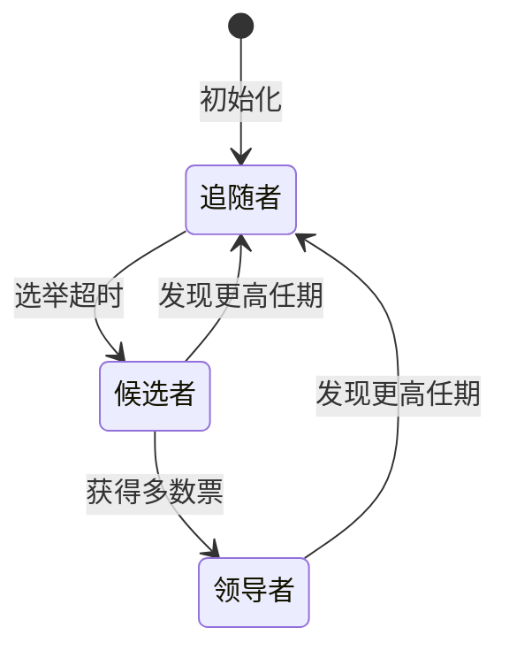

# 共识机制 (Consensus Mechanisms)

共识机制（Consensus Mechanisms）是分布式系统达成状态一致性的核心协议。在区块链（Blockchain）与分布式账本技术（DLT）中，共识机制解决了去中心化环境下「谁有权写入数据」与「如何验证数据有效性」的根本问题。

## 共识问题的本质

分布式系统中的共识问题最早由莱斯利·兰波特（Leslie Lamport）等人在拜占庭将军问题（Byzantine Generals Problem）中形式化描述。该问题揭示了在存在恶意节点的情况下，忠诚节点如何就统一决策达成一致的难题。

### FLP 不可能性结果

Fischer、Lynch 与 Paterson 于 1985 年证明了 FLP 不可能性：

> 在异步网络中，即使只有一个故障节点，也不存在确定性的共识算法。

这一理论结果意味着实际共识算法必须在同步假设、概率保证或故障模型上做出妥协。

### 共识的安全性与活性

共识协议需满足两个核心属性：

| 属性 | 英文 | 含义 |
|------|------|------|
| 安全性 | Safety | 已确认的交易不会回滚，所有诚实节点达成一致 |
| 活性 | Liveness | 系统持续产生新交易，不会无限期阻塞 |

## 工作量证明 (Proof of Work, PoW)

PoW 是比特币（Bitcoin）采用的共识机制，要求节点通过计算难题证明其付出了工作量。

### 哈希难题

矿工需找到一个随机数（Nonce），使得区块头的哈希值满足难度目标：

$$
\\text{Hash}(\\text{Block Header} + \\text{Nonce}) < \\text{Target}
$$

难度目标根据全网算力动态调整，确保平均出块时间稳定。比特币的目标出块间隔为 10 分钟。

### 安全性分析
n
PoW 的安全性建立在「51% 攻击」的经济不可行性之上。攻击者需控制超过全网 50% 的算力才能篡改历史交易。攻击成功的概率可用泊松分布建模：

$$
P(z, q) = \\begin{cases}
1 & q \\leq 0.5 \\
\\left(\\frac{q}{p}\\right)^z & q > 0.5
\\end{cases}
$$

其中 $q$ 为攻击者算力占比，$p = 1 - q$，$z$ 为确认区块数。

| 特性 | PoW |
|------|-----|
| 能源消耗 | 极高 |
| 去中心化程度 | 高 |
| 最终性 | 概率最终性 |
| 代表项目 | Bitcoin, Litecoin, Dogecoin |

## 权益证明 (Proof of Stake, PoS)

PoS 以持有的代币数量（权益）替代算力作为竞争记账权的依据，显著降低了能源消耗。

### 基本机制

验证者（Validator）将代币质押（Stake）至智能合约，系统根据质押比例随机选择出块者。恶意行为将被罚没质押金（Slashing）。

### 变体算法

| 变体 | 机制 | 代表项目 |
|------|------|----------|
| 委托权益证明（DPoS） | 代币持有者选举代表出块 | EOS, Tron |
| 提名权益证明（NPoS） | 提名人选择验证人 | Polkadot |
| 纯权益证明（Pure PoS） | 完全随机选择 | Algorand |
| 流动性权益证明（LPoS） | 支持流动性质押衍生品 | Lido 生态 |

### 以太坊 2.0 的 Casper FFG

以太坊从 PoW 转向 PoS 的过程中采用了 Casper FFG（Friendly Finality Gadget），结合 LMD GHOST 分叉选择规则与检查点（Checkpoint）机制实现最终性。

## 实用拜占庭容错 (PBFT)

PBFT（Practical Byzantine Fault Tolerance）是 Miguel Castro 与 Barbara Liskov 于 1999 年提出的经典共识算法，适用于许可链（Permissioned Blockchain）场景。

### 三阶段协议

PBFT 共识包含请求（Request）、预准备（Pre-prepare）、准备（Prepare）与提交（Commit）四个阶段：

### 容错能力

PBFT 在 $n$ 个节点中最多容忍 $f$ 个拜占庭节点：

$$
n \\geq 3f + 1
$$

即系统需至少 $3f + 1$ 个节点才能保证安全性。

| 特性 | PBFT |
|------|------|
| 通信复杂度 | $O(n^2)$ |
| 最终性 | 即时最终性 |
| 节点规模 | 适用于小规模网络 |
| 代表项目 | Hyperledger Fabric, Tendermint |

## Raft 共识算法

Raft 是一种为管理复制日志而设计的共识算法，强调可理解性与工程实现性，属于崩溃容错（CFT）范畴。

### 角色状态机

Raft 将节点划分为三种角色：

### 核心机制

| 机制 | 说明 |
|------|------|
| 领导者选举 | 候选者发起投票，获得过半票数成为领导者 |
| 日志复制 | 领导者将日志条目复制至多数追随者后提交 |
| 安全性 | 已提交的日志条目不会被覆盖 |

Raft 的安全性保证：若领导者 $L_1$ 在任期 $T$ 提交了日志条目，则后续任期的领导者 $L_2$ 必然包含该条目。

## 其他共识机制

### 委托权益证明 (DPoS)

DPoS 由 Daniel Larimer 提出，代币持有者投票选举有限数量的见证人（Witness）或区块生产者（Block Producer）轮流出块。交易确认速度极快，但去中心化程度相对较低。

### 权威证明 (Proof of Authority, PoA)

PoA 依赖预选的权威节点（Authority Node）验证交易，适用于联盟链与企业级应用。权威节点的身份公开且需承担声誉责任。

### 时空证明 (Proof of Spacetime, PoSt)

Filecoin 采用的共识机制，要求矿工证明其在特定时间段内持续存储了特定数据。结合零知识证明（ZKP）实现高效验证。

## 共识机制对比

| 机制 | 容错模型 | 性能 (TPS) | 能耗 | 去中心化 | 适用场景 |
|------|----------|------------|------|----------|----------|
| PoW | 拜占庭 | 3–7 | 极高 | 高 | 公链价值存储 |
| PoS | 拜占庭 | 10–1000+ | 低 | 中高 | 公链智能合约 |
| DPoS | 拜占庭 | 1000–10,000 | 低 | 中 | 高性能公链 |
| PBFT | 拜占庭 | 1000–10,000 | 低 | 低 | 联盟链 |
| Raft | 崩溃 | 10,000+ | 低 | 低 | 私有链/数据库 |

共识机制的设计本质上是在安全性、去中心化与可扩展性（即「不可能三角」）之间寻找最优权衡。随着零知识证明、分片技术（Sharding）与跨链互操作协议的发展，新一代共识算法正朝着更高吞吐量、更强隐私保护与更好互操作性的方向演进。理解各类共识机制的假设、优势与局限，是设计可靠分布式系统的必要前提。
