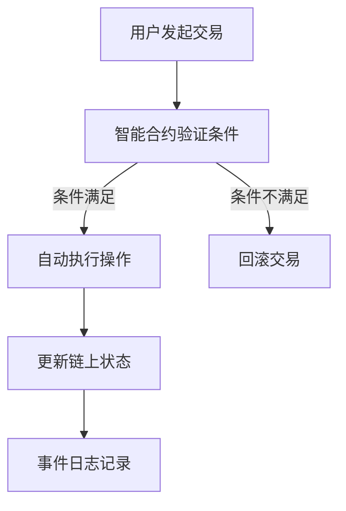
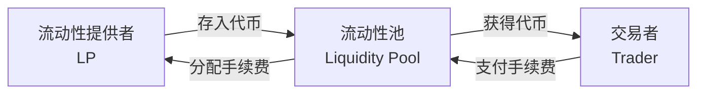
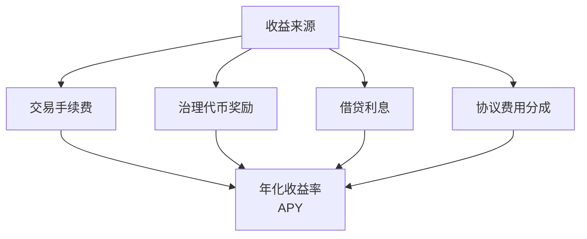
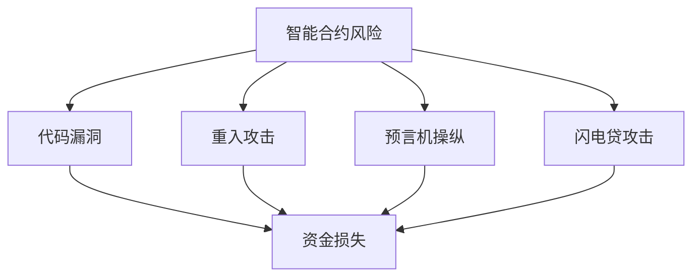
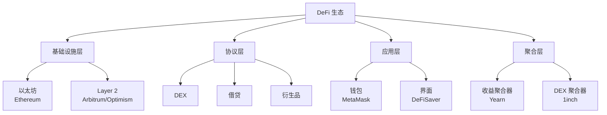

---
aliases:
  - DeFi
  - 去中心化金融
tags:
created: 2026-05-17
updated: 2026-05-17
  - blockchain
  - finance
  - smart-contract
  - ethereum
  - crypto
---

# 去中心化金融 (Decentralized Finance, DeFi)

去中心化金融（DeFi）是指建立在区块链（Blockchain）之上的开放式金融系统，通过智能合约（Smart Contracts）自动执行金融操作，无需传统金融中介（如银行、券商、交易所）。

## 概述 (Overview)

DeFi 的核心愿景是构建一个开放、透明、无许可（Permissionless）的全球金融基础设施。用户可以直接通过加密钱包与智能合约交互，实现借贷、交易、投资等金融活动。

DeFi 生态系统总价值锁仓（TVL, Total Value Locked）是衡量其规模的重要指标：

$$TVL = \sum_{i=1}^{n} Value(Asset_i) \times Quantity_i$$

## 核心组件 (Core Components)

### 智能合约 (Smart Contracts)

智能合约是 DeFi 的技术基石，是在区块链上自动执行的程序代码。其执行逻辑公开透明且不可篡改：

智能合约关键特性：

| 特性 | 说明 |
|------|------|
| 不可篡改（Immutable） | 部署后代码无法修改 |
| 透明可审计 | 所有代码和状态公开可见 |
| 自动执行 | 满足条件后无需人工干预 |
| 可组合性 | 不同合约可相互调用组合 |

### 去中心化交易所 (DEX, Decentralized Exchange)

DEX 允许用户直接在链上交易加密资产，无需将资产托管给中心化机构。

#### 自动做市商 (AMM, Automated Market Maker)

AMM 使用数学公式定价，替代传统订单簿模式：

$$x \times y = k$$

其中 $x$ 和 $y$ 分别代表两种代币的储备量，$k$ 为常数。

常见 DEX 协议：

| 协议 | 区块链 | 特点 |
|------|--------|------|
| Uniswap | Ethereum | AMM 先驱，V3 集中流动性 |
| SushiSwap | 多链 | 社区驱动，扩展功能丰富 |
| PancakeSwap | BNB Chain | 低手续费，高频交易 |
| Curve | Ethereum | 稳定币兑换优化 |
| dYdX | Ethereum | 去中心化衍生品交易 |

### 借贷协议 (Lending Protocols)

DeFi 借贷允许用户超额抵押（Over-collateralization）借入资产或提供流动性赚取利息。

#### 超额抵押模型

$$Collateral\ Ratio = \frac{Collateral\ Value}{Borrowed\ Value} > Liquidation\ Threshold$$

常见借贷协议：

| 协议 | 特点 |
|------|------|
| Aave | 闪电贷（Flash Loans）、利率切换 |
| Compound | 算法利率、治理代币 COMP |
| MakerDAO | 超额抵押稳定币 DAI |

## 收益农业 (Yield Farming)

收益农业（Yield Farming 或 Liquidity Mining）是通过向 DeFi 协议提供流动性获取代币奖励的策略。

### 收益来源

### APY 计算

年化收益率（APY, Annual Percentage Yield）考虑复利效应：

$$APY = \left(1 + \frac{r}{n}\right)^n - 1$$

其中 $r$ 为期间利率，$n$ 为复利次数。

## 治理代币 (Governance Tokens)

治理代币赋予持有者对协议参数修改、资金分配等事项的投票权。

| 代币 | 协议 | 功能 |
|------|------|------|
| UNI | Uniswap | 协议治理、费用开关 |
| COMP | Compound | 利率模型调整、资产上线 |
| AAVE | Aave | 风险管理参数、升级提案 |
| MKR | MakerDAO | 稳定费率调整、紧急关舱 |

## 稳定币 (Stablecoins)

稳定币是锚定法币（通常美元）价值的加密代币，是 DeFi 的核心流动性基础。

| 类型 | 代表 | 机制 | 风险 |
|------|------|------|------|
| 法币抵押型 | USDT, USDC | 1:1 美元储备 | 中心化信任风险 |
| 加密资产抵押型 | DAI | 超额链上抵押 | 清算风险、智能合约风险 |
| 算法型 | UST（已失败） | 算法调节供需 | 脱锚风险极高 |

## 风险与挑战 (Risks and Challenges)

### 智能合约风险

### 其他主要风险

| 风险类型 | 描述 | 缓解措施 |
|----------|------|----------|
| 无常损失 | AMM 中价格波动导致 LP 损失 | 选择相关资产对 |
| 清算风险 | 抵押品不足被强制清算 | 维持高抵押率 |
| 治理攻击 | 恶意提案通过投票 | 时间锁、否决权 |
| 监管不确定性 | 政策变化影响运营 | 合规准备 |

## DeFi 生态系统 (DeFi Ecosystem)

## 未来展望 (Future Outlook)

DeFi 正在向以下方向发展：

- **跨链互操作（Cross-chain Interoperability）**：多链资产无缝流转
- **现实世界资产（RWA, Real World Assets）**：链上化传统金融资产
- **机构级 DeFi（Institutional DeFi）**：合规化、KYC/AML 集成
- **账户抽象（Account Abstraction）**：改善用户体验
- **模块化架构**：执行层、结算层、数据可用性层分离

## 参考资源 (References)

- [DeFi Pulse](https://defipulse.com/)
- [DeFi Llama](https://defillama.com/)
- [Uniswap Documentation](https://docs.uniswap.org/)
- [Aave Documentation](https://docs.aave.com/)

