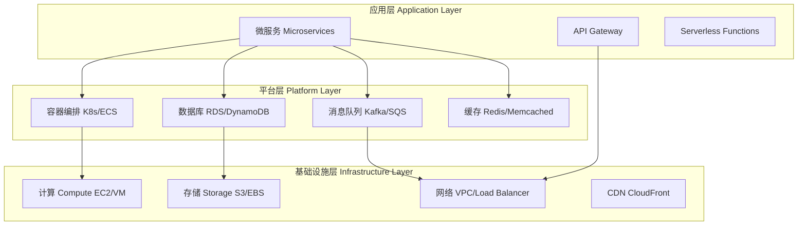
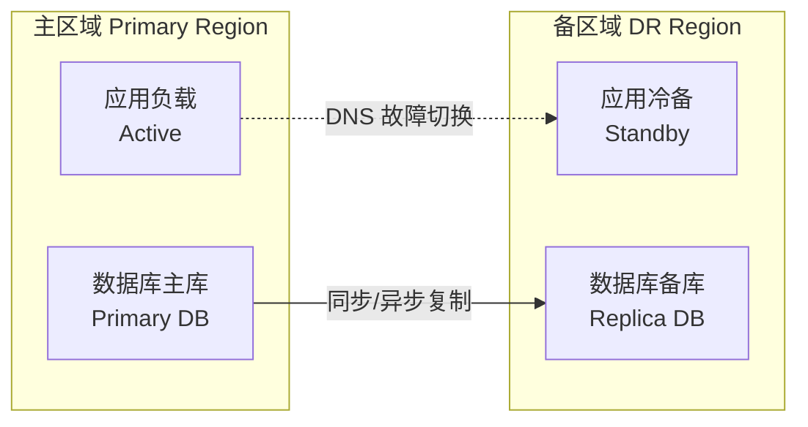

# 云架构 Cloud Architecture

## 架构层次

云架构自底向上分为基础设施层、平台层和应用层三个主要层次。

## 架构模式

### 微服务架构 Microservices

微服务架构将单体应用拆分为一组独立部署、松耦合的服务。每个服务围绕特定业务能力构建，拥有独立的数据库和部署管道。

#### 微服务核心原则

| 原则 | 说明 | 实现方式 |
|------|------|---------|
| 单一职责 | 每个服务只负责一个业务领域 | 领域驱动设计 Bounded Context |
| 自治性 | 服务独立开发、部署和扩展 | CI/CD, 独立代码仓库 |
| 去中心化 | 去中心化数据管理和治理 | 数据库 per Service |
| 弹性设计 | 服务故障不影响全局 | 熔断器、重试、超时 |
| 可观测性 | 服务的运行时状态可监控 | 日志、指标、分布式追踪 |

#### 服务间通信

| 通信模式 | 协议 | 适用场景 | 示例 |
|---------|------|---------|------|
| 同步 REST | HTTP/HTTPS | 查询、命令 | API Gateway 调用 |
| 同步 gRPC | HTTP/2 + Protobuf | 高性能内部调用 | 服务间 RPC |
| 异步消息 | AMQP/Kafka | 事件驱动、解耦 | 订单事件通知 |
| 事件流 | Kafka/Kinesis | 事件溯源、CQRS | 审计日志 |
| GraphQL | HTTP | 数据聚合、前端适配 | BFF 模式 |

### 三层架构 Three-Tier Architecture

- **表示层 (Presentation Tier)**：处理用户界面和交互，通常通过 CDN 加速静态资源
- **业务逻辑层 (Business Logic Tier)**：核心业务逻辑处理，部署于应用服务器或容器
- **数据层 (Data Tier)**：数据持久化，包括关系数据库、缓存和对象存储

### 事件驱动架构 Event-Driven Architecture

事件驱动架构通过事件（Event）在服务间传递状态变更，实现松耦合和高扩展性。

$$ \text{Event} = \{ \text{Event Type}, \text{Timestamp}, \text{Source}, \text{Payload}, \text{Metadata} \} $$

事件驱动架构的关键组件包括事件生产者（Producer）、事件总线（Event Bus/Message Broker）和事件消费者（Consumer）。

### CQRS 与事件溯源

CQRS（Command Query Responsibility Segregation）将写操作（Command）和读操作（Query）拆分为不同的模型。事件溯源（Event Sourcing）将状态变更记录为事件序列，通过重放事件重建当前状态。

## 可扩展性 Scalability

### 水平扩展 vs 垂直扩展

| 维度 | 水平扩展 (Scale Out) | 垂直扩展 (Scale Up) |
|------|-------------------|-------------------|
| 方法 | 增加更多节点 | 增加单节点资源 |
| 上限 | 理论上无限 | 受物理机限制 |
| 成本 | 线性增长 | 指数级增长 |
| 复杂度 | 需处理分布式问题 | 相对简单 |
| 容错性 | 高（单节点故障不影响） | 低（单点故障） |
| 典型场景 | Web 服务、微服务 | 单体应用、数据库 |

### 自动扩缩容 Auto Scaling

自动扩缩容基于预定义策略和指标动态调整资源数量。

常用扩缩容指标：CPU 利用率、内存利用率、请求数/秒、队列深度、自定义业务指标（如订单处理延迟）。

### 数据库扩展策略

$$ \text{Read Replicas} \Rightarrow \text{水平读扩展} $$
$$ \text{Database Sharding} \Rightarrow \text{水平写扩展} $$
$$ \text{Cache Layer} \Rightarrow \text{减轻数据库负载} $$

## 高可用性 High Availability

### 可用性公式

$$ \text{Availability} = \frac{\text{Total Time} - \text{Downtime}}{\text{Total Time}} \times 100\% $$

| SLA (9 的个数) | 可用性 | 年停机时间 |
|---------------|-------|-----------|
| 99% (Two 9s) | 99% | 3.65 天 |
| 99.9% (Three 9s) | 99.9% | 8.76 小时 |
| 99.99% (Four 9s) | 99.99% | 52.6 分钟 |
| 99.999% (Five 9s) | 99.999% | 5.26 分钟 |
| 99.9999% (Six 9s) | 99.9999% | 31.6 秒 |

### 多可用区部署

云提供商在每个区域（Region）设有多个可用区（Availability Zone）。跨可用区部署可抵御单数据中心故障。

### 负载均衡

- **全局负载均衡 (Global Load Balancer)**：基于 DNS 的地理路由，AWS Route 53、Azure Traffic Manager
- **应用层负载均衡 (ALB/HTTP)**：第 7 层负载均衡，支持路径路由和 SSL 终止
- **网络层负载均衡 (NLB/TCP)**：第 4 层负载均衡，支持超低延迟和高吞吐

## 容错与弹性设计 Fault Tolerance

### 弹性模式

| 模式 | 描述 | 实现 |
|------|------|------|
| 熔断器 Circuit Breaker | 故障快速失败，防止级联 | Hystrix, Resilience4j |
| 隔仓 Bulkhead | 资源隔离，防止扩展 | 线程池隔离、信号量 |
| 重试 Retry | 临时故障自动重试 | Exponential Backoff + Jitter |
| 超时 Timeout | 限制等待时间 | 连接超时、读取超时 |
| 舱壁隔离 Bulkhead | 限制资源消耗 | 连接池、任务队列 |

### 优雅降级 Graceful Degradation

当部分服务不可用时，系统通过降级功能（如返回缓存数据、简化 UI）保持核心功能可用。这是构建健壮分布式系统的关键实践。

## 灾备与恢复 Disaster Recovery

### 灾备策略

| 策略 | RPO | RTO | 成本 |
|------|-----|-----|------|
| 备份与恢复 Backup & Restore | 小时级 | 小时级 | 最低 |
| 暖备 Pilot Light | 分钟级 | 分钟级 | 中 |
| 热备 Warm Standby | 秒级 | 分钟级 | 高 |
| 双活 Multi-Site Active/Active | 近零 | 秒级 | 最高 |

$$ \text{RPO} = \text{Recovery Point Objective (数据丢失容忍量)} $$
$$ \text{RTO} = \text{Recovery Time Objective (停机容忍时间)} $$

### 灾备架构模式

## 安全架构

参见 [[CloudSecurity]] 获得详细信息。

## 基础设施即代码 IaC

基础设施即代码（Infrastructure as Code）通过声明式配置文件管理云资源。主流工具包括：

- **Terraform**：多云基础设施编排
- **AWS CloudFormation / CDK**：AWS 资源模板化
- **Pulumi**：通用编程语言定义基础设施
- **Ansible**：配置管理和自动化

IaC 的核心价值在于可重复性、版本控制、自动化部署和合规性审计。

## 缓存策略 Caching

缓存是提升系统性能和降低后端负载的关键技术。云架构中常用的缓存策略：

| 策略 | 说明 | 适用场景 |
|------|------|---------|
| Cache-Aside | 应用同时维护缓存和数据库 | 读多写少 |
| Read-Through | 缓存层读取数据库 | 读操作频繁 |
| Write-Through | 写操作同时更新缓存和数据库 | 数据一致性要求高 |
| Write-Behind | 异步写入数据库 | 写吞吐量高 |
| Refresh-Ahead | 缓存过期前异步刷新 | 热点数据可预测 |

### 缓存层级

- **客户端缓存 (Browser Cache)**：HTTP 缓存头控制
- **CDN 缓存**：静态资源边缘缓存
- **应用层缓存**：Redis/Memcached 分布式缓存
- **数据库缓存**：Buffer Pool、查询缓存

## API 设计模式

### RESTful API

REST（Representational State Transfer）基于 HTTP 协议，使用标准方法操作资源：

| HTTP 方法 | 操作 | 幂等 | 安全 |
|-----------|------|------|------|
| GET | 查询资源 | 是 | 是 |
| POST | 创建资源 | 否 | 否 |
| PUT | 全量更新资源 | 是 | 否 |
| PATCH | 部分更新资源 | 否 | 否 |
| DELETE | 删除资源 | 是 | 否 |

### API 网关模式

API 网关作为系统的统一入口，承担路由、认证、限流、日志和协议转换等职责。常见网关产品包括 Kong、AWS API Gateway、Azure API Management 和 Nginx。

## 无服务器架构 Serverless

无服务器架构（Serverless Architecture）将服务器的管理完全抽象化，开发者只需关注业务逻辑。

### 事件驱动设计

无服务器函数由事件（Event）触发执行，常见事件源包括 HTTP 请求、消息队列消息、对象存储事件和定时任务。

### Serverless 注意事项

- **冷启动延迟**：函数首次调用或缩容到零后重新启动的延迟
- **执行时长限制**：大多数 FaaS 平台有超时限制（如 15 分钟）
- **状态管理**：函数无状态，需要外部存储维护状态
- **调试复杂度**：缺乏对运行时环境的直接访问

## 混沌工程 Chaos Engineering

混沌工程是在分布式系统上进行实验的学科，旨在建立对系统承受生产环境动荡能力的信心。

混沌工程的核心原则：
1. 定义稳态（Steady State）
2. 假设稳态将持续
3. 引入真实世界的变量（如网络延迟、节点故障）
4. 验证假设并改进系统

## 相关条目

- [[CloudComputing]]
- [[CloudServices]]
- [[CloudSecurity]]
- [[Microservices]]
- [[HighAvailability]]
