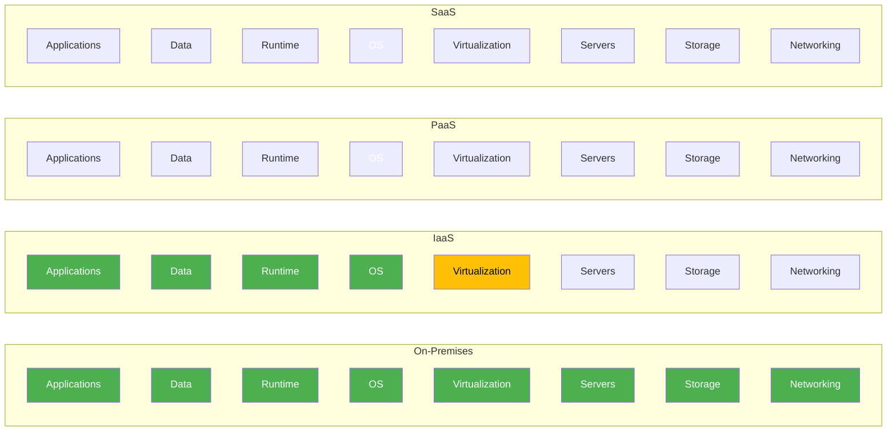

# 云计算 Cloud Computing

## 云计算定义

云计算（Cloud Computing）是通过互联网按需提供计算资源（网络、服务器、存储、应用和服务）的一种模式。用户只需为实际使用的资源付费，无需管理和维护物理基础设施。

美国国家标准与技术研究院（NIST）定义了云计算的五个基本特征、三种服务模式和四种部署模型。

$$ \text{Cloud Computing} = \text{On-demand Self-service} + \text{Broad Network Access} + \text{Resource Pooling} + \text{Rapid Elasticity} + \text{Measured Service} $$

## 五大基本特征

| 特征 | 英文 | 说明 |
|------|------|------|
| 按需自助服务 | On-demand Self-service | 用户自行配置资源无需人工交互 |
| 广泛网络接入 | Broad Network Access | 标准网络协议访问，支持各类终端 |
| 资源池化 | Resource Pooling | 多租户共享物理和虚拟资源 |
| 快速弹性 | Rapid Elasticity | 资源自动伸缩，对用户透明 |
| 可计量服务 | Measured Service | 用量计量与按需付费 |

## 服务模式

### 基础设施即服务 (IaaS)

提供虚拟化的计算、存储和网络资源。用户管理操作系统、中间件和应用程序，云提供商管理虚拟化层和物理基础设施。

$$ \text{IaaS: You manage} = \{\text{Apps, Data, Runtime, OS}\}, \text{Provider manages} = \{\text{Virtualization, Servers, Storage, Networking}\} $$

### 平台即服务 (PaaS)

提供完整的开发和部署平台，包括运行时环境、数据库和中间件。开发者只需关注代码实现，底层基础设施完全由平台管理。

### 软件即服务 (SaaS)

提供完整的应用程序，用户通过浏览器或客户端访问。提供商负责所有底层运维，用户只需配置和使用应用功能。

## 部署模型

| 部署模型 | 定义 | 优势 | 适用场景 |
|---------|------|------|---------|
| 公有云 (Public Cloud) | 第三方提供商通过互联网提供服务 | 低初始成本、弹性强 | 初创企业、波动负载 |
| 私有云 (Private Cloud) | 专为单一组织构建 | 高可控性、合规 | 金融、政府、医疗 |
| 混合云 (Hybrid Cloud) | 公有云与私有云的组合 | 兼顾安全与弹性 | 数据敏感+弹性需求 |
| 多云 (Multi-Cloud) | 使用多个云提供商 | 避免锁定、优化成本 | 全球化部署 |
| 社区云 (Community Cloud) | 多个组织共享基础设施 | 共享合规成本 | 行业联盟 |

## 主要云提供商

### Amazon Web Services (AWS)

全球市场份额第一，提供超过 200 项云服务。核心产品包括 EC2（计算）、S3（存储）、RDS（数据库）、Lambda（Serverless）和 SageMaker（机器学习）。

### Microsoft Azure

与企业生态系统深度集成，支持 Windows Server、Active Directory、Office 365 等产品的无缝迁移。核心产品包括 Azure VM、Azure SQL Database、Azure Functions 和 Azure AI。

### Google Cloud Platform (GCP)

在数据分析、机器学习和容器化领域具有显著优势。核心产品包括 Compute Engine、Cloud Storage、BigQuery、Kubernetes Engine 和 Vertex AI。

### 阿里云 Alibaba Cloud

中国市场份额第一，亚太地区领先。核心产品包括 ECS（计算）、OSS（存储）、RDS（数据库）、函数计算和 MaxCompute（大数据）。

## 核心价值

| 价值维度 | 说明 |
|---------|------|
| 成本效益 | 变资本支出 (CapEx) 为运营支出 (OpEx) |
| 全球部署 | 几分钟内完成全球多区域部署 |
| 弹性伸缩 | 根据负载自动扩缩容，不浪费资源 |
| 高可用性 | 多可用区部署，SLA 达 99.9%~99.999% |
| 安全合规 | 提供商满足主流合规认证标准 |
| 创新加速 | 按需获取最新技术能力 |

## 关键挑战

- **供应商锁定 (Vendor Lock-in)**：避免过度依赖单一提供商
- **数据主权 (Data Sovereignty)**：数据存储位置需符合当地法律
- **成本管理 (Cost Management)**：需持续优化资源使用避免浪费
- **安全威胁 (Security Threats)**：共享责任模型下的安全边界
- **迁移复杂性 (Migration Complexity)**：遗留系统迁移的适配成本

## 虚拟化技术 Virtualization

虚拟化（Virtualization）是云计算的基础技术，将物理资源抽象为逻辑资源，实现资源的隔离和共享。

### 虚拟化类型

| 类型 | 技术 | 代表产品 | 特点 |
|------|------|---------|------|
| 服务器虚拟化 | Hypervisor Type 1/2 | VMware ESXi, Hyper-V, KVM | 硬件资源共享 |
| 存储虚拟化 | SAN/NAS 虚拟化 | VMware vSAN, Ceph | 存储池化 |
| 网络虚拟化 | SDN, Overlay 网络 | VMWare NSX, Open vSwitch | 网络抽象 |
| 容器虚拟化 | OS 级虚拟化 | Docker, Podman | 轻量隔离 |

### 虚拟机与容器对比

| 维度 | 虚拟机 VM | 容器 Container |
|------|-----------|---------------|
| 隔离级别 | 硬件级隔离 | 进程级隔离 |
| 启动时间 | 分钟级 | 秒级 |
| 镜像大小 | GB 级 | MB 级 |
| 内核 | 独占内核 | 共享宿主机内核 |
| 资源开销 | 高（需完整 OS） | 低（仅应用层） |

## 云原生应用 Cloud Native

云原生应用专为云环境设计，充分利用云的弹性和分布式特性。云原生计算基金会（CNCF）定义了云原生技术体系。

### 云原生 12 要素

| 要素 | 原则 | 实践 |
|------|------|------|
| 基准代码 | 一份基准代码多份部署 | Git 版本管理、CI/CD |
| 依赖 | 显式声明依赖 | 包管理器、容器化 |
| 配置 | 环境中存储配置 | 环境变量、配置中心 |
| 后端服务 | 把后端服务当作附加资源 | 松耦合、服务发现 |
| 构建、发布、运行 | 严格分离构建和运行 | 不可变制品 |
| 进程 | 无状态进程 | 外部化 Session |
| 端口绑定 | 通过端口绑定提供服务 | 自包含 HTTP 服务 |
| 并发 | 通过进程模型进行扩展 | 水平扩展 |
| 易处置 | 快速启动和优雅终止 | 健康检查、优雅关闭 |
| 开发与生产等价 | 保持开发、预发布、生产环境一致 | 容器化、Kubernetes |
| 日志 | 把日志当作事件流 | 标准输出、集中日志 |
| 管理进程 | 一次性管理进程 | 数据库迁移、脚本 |

### DevOps 实践

DevOps 强调开发（Development）和运维（Operations）的协作与整合，核心实践包括：

- **CI/CD 流水线**：持续集成与持续部署自动化
- **GitOps**：以 Git 仓库为唯一的声明式基础设施来源
- **不可变基础设施**：每次部署创建全新环境，避免配置漂移
- **可观测性**：通过指标（Metrics）、日志（Logging）和追踪（Tracing）构建可观测体系

## 开源云计算框架

### OpenStack

OpenStack 是开源基础设施即服务（IaaS）平台，管理大规模计算、存储和网络资源池。核心组件包括 Nova（计算）、Swift（对象存储）、Cinder（块存储）、Neutron（网络）和 Keystone（身份认证）。

### Kubernetes

Kubernetes（K8s）是容器编排平台，已成为云原生基础设施的标准。Kubernetes 提供应用部署、扩缩容、服务发现和自动恢复等能力，支持多云和混合云部署。

## 云计算成本模型

### 资本支出 vs 运营支出

传统 IT 基础设施需要资本支出（CapEx），即一次性购买硬件和软件许可。云计算将成本转换为运营支出（OpEx），按使用量计费。

### FinOps 实践

FinOps 是云财务管理实践和方法论，结合财务、技术和业务团队优化云成本：

1. **可视化**：成本归属到团队、项目和服务的分摊
2. **优化**：资源合理利用、预留实例和 Spot 实例优化
3. **运营**：持续监控、预算告警和成本治理

## 相关条目

- [[CloudServices]]
- [[CloudArchitecture]]
- [[CloudSecurity]]
- [[Virtualization]]
- [[BigDataOverview]]
