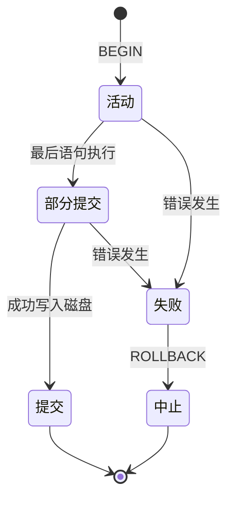
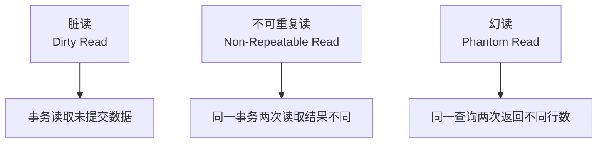
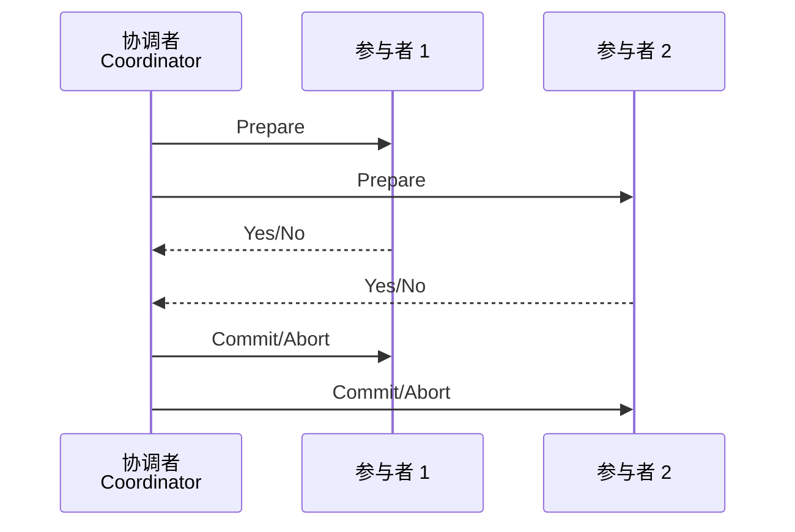

# ACID 原则 (ACID Principles)

ACID 是数据库事务（Database Transaction）的四大核心特性，确保数据在并发访问与系统故障场景下的可靠性。由吉姆·格雷（Jim Gray）于 20 世纪 70 年代提出，ACID 原则成为关系型数据库管理系统（RDBMS）的理论基石。

## 事务的基本概念

事务是一组逻辑操作单元，要么全部执行成功，要么全部不执行。事务的开始与结束由显式边界标记：

```sql
BEGIN TRANSACTION;
UPDATE accounts SET balance = balance - 100 WHERE id = 1;
UPDATE accounts SET balance = balance + 100 WHERE id = 2;
COMMIT;
```

事务的状态转换可用以下状态机描述：



## 原子性 (Atomicity)

原子性要求事务中的所有操作不可分割，构成一个不可分割的工作单元。若事务中任何操作失败，整个事务必须回滚（Rollback）到初始状态。

### 实现机制

| 机制 | 原理 | 代表系统 |
|------|------|----------|
| 回滚日志（Undo Log） | 记录修改前的数据状态，失败时恢复 | MySQL InnoDB |
| 预写日志（Write-Ahead Log） | 先写日志再写数据，确保持久性 | PostgreSQL |
| 影子分页（Shadow Paging） | 修改副本而非原页，提交时切换指针 | SQLite |


原子性的数学描述：设事务 $T$ 包含操作序列 $\\{o_1, o_2, \\ldots, o_n\\}$，则原子性要求：

$$
\\text{Result}(T) = \\begin{cases}
\\{o_1, o_2, \\ldots, o_n\\} \text{ 全部生效} \\
\\varnothing \text{（无任何效果）}
\\end{cases}
$$

## 一致性 (Consistency)

一致性确保事务将数据库从一个有效状态转换到另一个有效状态，不破坏任何完整性约束（Integrity Constraints）。注意此处的「一致性」与分布式系统中的「一致性模型」（Consistency Model）含义不同。

### 约束类型

- **实体完整性（Entity Integrity）**：主键非空且唯一
- **参照完整性（Referential Integrity）**：外键必须指向有效记录
- **域完整性（Domain Integrity）**：属性值符合定义的数据类型与范围
- **用户定义完整性（User-Defined Integrity）**：业务规则约束

银行转账示例中的一致性约束：

$$
\\sum_{i} balance_i = \\text{constant}
$$

即所有账户余额之和应保持不变。

## 隔离性 (Isolation)

隔离性确保并发执行的事务互不干扰，每个事务都感觉像是在独占运行。SQL 标准定义了四种隔离级别：

| 隔离级别 | 脏读 | 不可重复读 | 幻读 |
|----------|------|------------|------|
| 读未提交（Read Uncommitted） | 可能 | 可能 | 可能 |
| 读已提交（Read Committed） | 避免 | 可能 | 可能 |
| 可重复读（Repeatable Read） | 避免 | 避免 | 可能 |
| 串行化（Serializable） | 避免 | 避免 | 避免 |


### 并发异常现象



### 锁机制与 MVCC

隔离性的实现主要依赖两种技术：

**两阶段锁（2PL, Two-Phase Locking）**

事务分为加锁阶段（Growing Phase）与解锁阶段（Shrinking Phase），严格两阶段锁（Strict 2PL）在事务结束前不释放写锁。

**多版本并发控制（MVCC）**

MVCC 为每行数据维护多个版本，读写操作互不阻塞。时间戳或事务 ID 决定可见版本：

$$
\\text{Visible Version} = \\max\\{v \mid v.\\text{created} \\leq T.\\text{start} \\land (v.\\text{deleted} > T.\\text{start} \\lor v.\\text{deleted} = \\text{NULL})\\}
$$

## 持久性 (Durability)

持久性保证一旦事务提交，其结果将永久保存，即使系统发生崩溃也不会丢失。

### 实现策略

| 策略 | 机制 | 权衡 |
|------|------|------|
| 强制日志刷新（Force Log） | 提交时同步写入日志 | 延迟增加 |
| 延迟写入（No-Force） | 脏页异步刷盘 | 恢复时间增加 |
| 窃取（Steal） | 允许未提交事务的脏页刷盘 | 需要 Undo Log |
| 非窃取（No-Steal） | 仅刷已提交事务的脏页 | 内存压力增加 |


现代数据库通常采用 **Force + Steal** 的组合策略，通过 Write-Ahead Logging 与检查点（Checkpoint）机制平衡性能与可靠性。

## BASE 理论

在分布式系统与 NoSQL 数据库中，ACID 的严格保证往往以牺牲可用性与分区容错性为代价。BASE 理论提供了另一种设计哲学：

| 特性 | 含义 | 与 ACID 的关系 |
|------|------|----------------|
| 基本可用（Basically Available） | 系统在故障时提供部分功能 | 弱化可用性要求 |
| 软状态（Soft State） | 允许数据存在中间状态 | 弱化一致性要求 |
| 最终一致（Eventually Consistent） | 数据最终会收敛到一致 | 弱化实时一致性 |


### CAP 定理

CAP 定理指出分布式系统不可能同时满足一致性（Consistency）、可用性（Availability）与分区容错性（Partition Tolerance）三者。网络分区不可避免，因此实际选择仅在 CP 与 AP 之间：

- **CP 系统**：牺牲可用性，保证一致性（如 HBase, ZooKeeper）
- **AP 系统**：牺牲一致性，保证可用性（如 Cassandra, DynamoDB）

## 分布式事务

当数据分布至多个节点时，传统 ACID 的实现面临挑战。两阶段提交（2PC, Two-Phase Commit）是最经典的分布式事务协议：

### 两阶段提交



2PC 的缺陷在于协调者单点故障与同步阻塞问题。三阶段提交（3PC）与 Paxos/Raft 共识算法在一定程度上缓解了这些问题。

Saga 模式是另一种分布式事务方案，将长事务拆分为本地事务序列，通过补偿事务（Compensating Transaction）实现回滚，适用于微服务架构。

ACID 原则与 BASE 理论代表了数据一致性保障的两条路径。理解它们的适用场景与实现机制，是设计可靠数据系统的关键能力。
