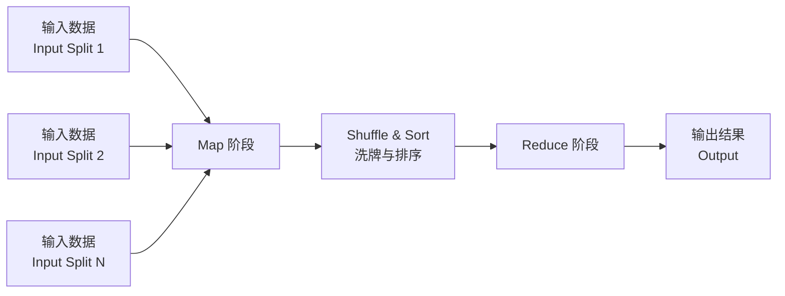
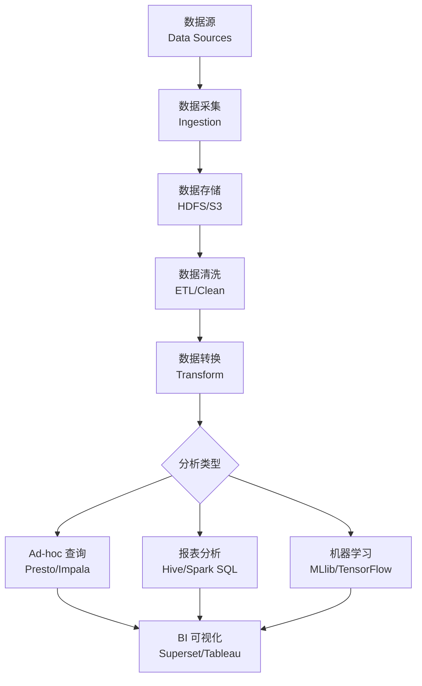
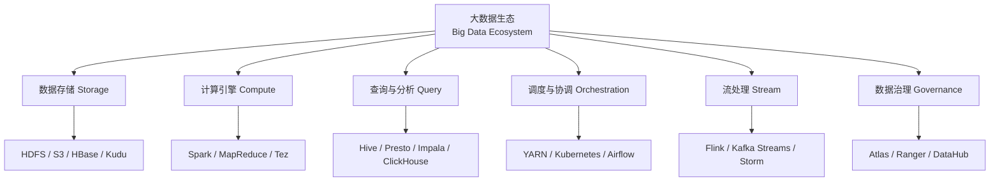

# 大数据 Big Data

## MapReduce 计算模型

MapReduce 是 Google 提出的分布式计算编程模型，由 Map（映射）和 Reduce（归约）两个阶段组成。

### MapReduce 工作流程

1. **分片 (Split)**：将输入数据划分为固定大小的分片（默认 128MB 对应 HDFS 块大小）
2. **Map 阶段**：每个分片由一个 Map 任务处理，输出键值对（Key-Value Pairs）
3. **Shuffle 阶段**：对 Map 输出按 Key 进行分区、排序和合并，传输到 Reduce 节点
4. **Reduce 阶段**：对每个分区进行聚合处理，输出最终结果

### Combiner 与 Partitioner

Combiner 是本地化 Reduce 操作，在 Map 端聚合以减少网络传输量。Partitioner 决定 Map 输出的每个键值对被发送到哪个 Reduce 节点，默认使用哈希分区（Hash Partitioning）。

## 分布式存储系统

### HDFS 架构

HDFS（Hadoop Distributed File System）采用主从架构（Master-Slave）：

| 组件 | 角色 | 功能 |
|------|------|------|
| NameNode | 主节点 | 管理文件系统元数据、命名空间 |
| DataNode | 从节点 | 存储数据块，默认 3 副本 |
| Secondary NameNode | 辅助节点 | 合并编辑日志，辅助故障恢复 |

### HDFS 读写流程

读操作流程：
1. 客户端调用 DistributedFileSystem.open() 获取文件块位置
2. 客户端从最近的 DataNode 并行读取数据块
3. 数据校验完成后返回给上层应用

写操作流程：
1. 客户端向 NameNode 请求创建文件
2. NameNode 分配数据块和副本位置
3. 客户端以管道方式写入数据块到 DataNode 链

### 数据副本策略

HDFS 默认采用机架感知（Rack Awareness）的 3 副本策略：
- 第一副本：写入客户端所在节点
- 第二副本：写入不同机架节点
- 第三副本：写入同一机架的其他节点

## NoSQL 数据库

### 分布式 NoSQL 分类

| 类型 | 数据模型 | 一致性 | 分区策略 | 代表系统 |
|------|---------|--------|---------|---------|
| 键值存储 | Key-Value | 最终一致性 | 一致性哈希 | Cassandra, DynamoDB |
| 列族存储 | Column Family | 强一致性 | 范围分区 | HBase, Bigtable |
| 文档存储 | JSON/BSON | 强/最终 | 分片键 | MongoDB, Couchbase |

### HBase 数据模型

HBase 是运行在 HDFS 之上的列族数据库，数据模型基于 Bigtable 论文。每行由行键（Row Key）、列族（Column Family）、列限定符（Column Qualifier）和时间戳（Timestamp）唯一标识。

$$ \text{Cell} = (\text{RowKey}, \text{ColumnFamily}:\text{Qualifier}, \text{Timestamp}) \rightarrow \text{Value} $$

### Cassandra 数据模型

Cassandra 采用去中心化架构（Peer-to-Peer），无单点故障。数据通过一致性哈希（Consistent Hashing）分布到集群节点，支持可调一致性（Tunable Consistency）：

$$\text{Consistency Level} \in \{ \text{ONE, QUORUM, ALL, LOCAL\_QUORUM, EACH\_QUORUM} \}$$

## 批处理 Batch Processing

### Apache Spark 核心概念

Spark 基于弹性分布式数据集（RDD，Resilient Distributed Dataset），提供内存计算能力：

| 特性 | 说明 |
|------|------|
| RDD | 不可变分布式数据集，支持容错 |
| DAG 调度 | 有向无环图执行计划 |
| 内存计算 | 数据缓存在内存中，减少磁盘 I/O |
| 懒执行 | 转换操作惰性执行，触发 Action 时计算 |
| 血统 Lineage | 通过数据转换历史实现容错恢复 |

### Spark SQL 与 DataFrame

Spark SQL 提供结构化数据处理接口，DataFrame 是分布式的行集合，支持 SQL 查询。Catalyst 优化器对查询计划进行全阶段优化：

$$ \text{SQL} \rightarrow \text{Unresolved Plan} \rightarrow \text{Analyzed Plan} \rightarrow \text{Optimized Plan} \rightarrow \text{Physical Plan} \rightarrow \text{Execution} $$

### Hive 数据仓库

Hive 将 SQL 转换为 MapReduce 或 Spark 作业执行。Hive Metastore 存储表结构元数据。分区表（Partitioned Table）和分桶表（Bucketed Table）提升查询性能。

## 流处理 Stream Processing

### 架构对比

| 维度 | 批处理 Batch | 微批处理 Micro-Batch | 纯流处理 True Stream |
|------|-------------|--------------------|-------------------|
| 延迟 | 分钟~小时 | 秒级 | 毫秒级 |
| 数据视图 | 有界数据 | 有界窗口 | 无界流 |
| 一致性 | Exactly-Once | Exactly-Once | Exactly-Once |
| 代表框架 | MapReduce | Spark Streaming | Flink, Kafka Streams |

### Apache Flink

Flink 是纯流处理引擎，支持事件时间（Event Time）、处理时间（Processing Time）和摄取时间（Ingestion Time）。其核心概念包括：

- **DataStream API**：无界流数据处理
- **DataSet API**：有界批处理（已整合入 DataStream）
- **Checkpointing**：基于 Chandy-Lamport 分布式快照的容错机制
- **Savepoint**：手动触发的状态快照，用于版本升级

### Kafka Streams

轻量级流处理库，直接嵌入应用。通过 KTable 和 KStream 实现状态化流处理，支持 Exactly-Once 语义。

## 大数据分析

### 批处理分析流程

### 实时推荐系统

实时推荐系统结合批处理和流处理，通过 Lambda 架构或 Kappa 架构实现。Lambda 架构存在批处理层和流处理层两条路径，Kappa 架构统一使用流处理。

$$ \text{Result} = \text{Batch View} \cup \text{Real-time View} $$

## 大数据治理

- **数据血缘 (Data Lineage)**：追踪数据来源和转换路径
- **元数据管理 (Metadata Management)**：Apache Atlas, Amundsen
- **数据质量 (Data Quality)**：完整性、准确性、一致性和时效性
- **数据安全**：访问控制、加密、审计、数据脱敏

## 大数据性能优化

### 数据倾斜处理

数据倾斜（Data Skew）是分布式计算中的常见性能瓶颈，某些分区处理的数远多于其他分区。常见解决方案包括：

| 倾斜类型 | 原因 | 解决方案 |
|---------|------|---------|
| Key 分布不均 | 热点 Key 数据量过大 | 加盐（Salting）、二次聚合 |
| Join 倾斜 | Join Key 分布不均 | Map-side Join、广播 Join |
| 分区倾斜 | 分区策略不合理 | 自定义 Partitioner、调整分区数 |

### 内存管理与 GC 优化

Spark 和 Flink 的内存管理直接影响大数据作业性能。Spark 使用统一内存管理（Unified Memory Management），将内存分为执行内存（Execution）和存储内存（Storage）。

$$ \text{Spark Memory} = \text{Reserved Memory} + \text{Spark Memory} \times (\text{Execution Ratio} + \text{Storage Ratio}) $$

### 数据序列化

序列化（Serialization）是将对象转换为二进制流的过程，影响网络传输和数据存储效率。Kryo 序列化器比 Java 原生序列化性能提升 10 倍以上。

## 大数据安全

大数据系统的安全防护涉及：

- **认证与授权**：Kerberos 认证、Apache Ranger 权限管理
- **数据加密**：HDFS 透明加密、KMS 密钥管理服务
- **网络隔离**：专有网络、防火墙规则、安全组配置
- **审计日志**：所有数据访问记录追踪
- **数据脱敏**：敏感数据动态/静态脱敏处理

## 大数据未来趋势

### 湖仓一体 Lakehouse

Lakehouse 架构融合数据湖的灵活性和数据仓库的性能优势。Delta Lake、Apache Iceberg 和 Apache Hudi 是三大主流表格式（Table Format），支持 ACID 事务、Schema 演化和时间旅行。

### AI 与大数据融合

- **MLOps 平台**：模型训练、部署和监控的标准化平台
- **特征工程**：大规模特征存储和在线推理
- **AutoML**：自动化模型选择和超参调优
- **大模型训练**：分布式训练框架和数据流水线

### 实时化趋势

大数据处理正从离线批处理和微型批处理向真正的实时流处理演进。Flink 和 Kafka 的广泛采用推动了实时数据管道的发展，Delta Live Tables 等新技术简化了实时 ETL 的开发。

## 数据采集与集成 Data Ingestion & Integration

### 数据采集工具

| 工具 | 类型 | 适用场景 |
|------|------|---------|
| Flume | 日志采集 | 流式日志 |
| Logstash | 日志处理 | ELK 栈 |
| Sqoop | 批量导入导出 | RDBMS ↔ Hadoop |
| NiFi | 可视化数据流 | 复杂 ETL |
| Kafka Connect | 流式连接器 | Kafka 生态 |
| DataX | 异构数据源同步 | 阿里巴巴开源 |

### ETL vs ELT

| 对比维度 | ETL (Extract-Transform-Load) | ELT (Extract-Load-Transform) |
|---------|----------------------------|----------------------------|
| 转换时机 | 加载前 | 加载后 |
| 存储 | 暂存区 | 目标数据仓库/湖 |
| 适用 | 结构化数据、严苛 Schema | 半/非结构化、灵活 |
| 工具 | Informatica, SSIS | Spark, dbt, Dremio |
| 延迟 | 批处理、有延迟 | 可近实时 |

## 数据仓库 Data Warehousing

### 维度建模 Dimensional Modeling

$$ \text{Star Schema} = \text{Fact Table} + \text{Dimension Tables} $$

| 概念 | 说明 |
|------|------|
| 事实表 Fact Table | 可度量的事件记录（销售额、点击量） |
| 维度表 Dimension Table | 描述性属性（时间、地点、产品） |
| 缓慢变化维度 SCD | 维度属性随时间变化（SCD Type 1/2/3） |
| 星座模式 Constellation | 多个事实表共享维度表 |

### Kimball vs Inmon

| 方法论 | 核心思想 | 建模方向 |
|-------|---------|---------|
| Kimball 自底向上 | 从业务需求出发 | 维度建模先构建数据集市 |
| Inmon 自顶向下 | 从企业数据出发 | 3NF 先构建企业数据仓库 |

## 资源管理与调度 Resource Management

### YARN 架构

| 组件 | 功能 |
|------|------|
| ResourceManager (RM) | 全局资源分配、调度 |
| NodeManager (NM) | 节点级容器管理 |
| ApplicationMaster (AM) | 应用级任务协调 |
| Container | 资源抽象（CPU + 内存） |

### 调度器比较

| 调度器 | 策略 | 特点 |
|-------|------|------|
| FIFO | 先来先服务 | 简单但队列阻塞 |
| Capacity | 多队列容量保证 | 多租户隔离 |
| Fair | 资源公平分配 | 自动负载均衡 |

## 数据湖 Data Lake

| 特性 | 数据仓库 | 数据湖 |
|------|---------|--------|
| 数据类型 | 结构化 | 结构化 + 半结构化 + 非结构化 |
| Schema | Schema-on-Write | Schema-on-Read |
| 数据质量 | 高 | 原始数据保留 |
| 用途 | BI 报表 | 分析、ML、探索 |
| 存储成本 | 高 | 低（对象存储） |

## 大数据生态全景 Big Data Ecosystem

## 相关条目

- [[BigDataOverview]]
- [[MapReduce]]
- [[Hadoop]]
- [[ApacheSpark]]
- [[StreamProcessing]]
- [[DataWarehouse]]
- [[DataLake]]
