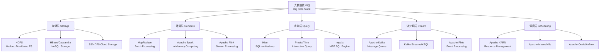

# 大数据概述 Big Data Overview

## 大数据的定义

大数据（Big Data）指传统数据处理应用无法有效处理的超大规模数据集。大数据不仅指数据量的庞大，更包含数据采集、存储、管理和分析的全链路技术挑战。

## 4V 特征

大数据的核心特征可概括为 4V：

$$ \text{Big Data} = \{ \text{Volume, Velocity, Variety, Value} \} $$

| 特征 | 英文 | 描述 | 典型量级 |
|------|------|------|---------|
| 体量巨大 | Volume | 数据规模庞大 | TB ~ PB ~ EB |
| 处理高速 | Velocity | 数据产生和处理速度快 | 毫秒 ~ 秒级 |
| 类型多样 | Variety | 数据结构多样 | 结构化、半结构化、非结构化 |
| 价值密度 | Value | 低价值密度但价值总量高 | 需挖掘提炼 |

### Volume — 体量巨大

全球数据量呈指数级增长。社交媒体日志、物联网传感器数据、视频监控数据等持续产生海量信息。传统单机数据库无法存储和处理 PB 级数据，分布式存储成为必然选择。

### Velocity — 处理高速

数据的产生和流动速度前所未有。实时股票交易数据每秒产生数万条记录，电商平台双十一需要处理数十亿次请求。流处理技术如 Apache Flink 和 Kafka Streams 实现毫秒级延迟处理。

### Variety — 类型多样

数据的多样性体现在结构化数据（关系数据库表）、半结构化数据（JSON、XML 日志）和非结构化数据（图片、视频、音频）等多个维度。数据清洗和集成成为大数据分析的关键环节。

### Value — 价值密度

海量数据中蕴含的真实价值通常只占极小比例。数据挖掘和机器学习技术从原始数据中提取有价值的模式和洞察。

## 大数据技术栈

### 核心框架

### 数据采集与传输

- **Apache Kafka**：高吞吐分布式消息队列，支持发布-订阅模式
- **Apache Flume**：日志采集聚合工具
- **Apache Sqoop**：关系数据库与 Hadoop 间的数据传输
- **Logstash / Filebeat**：ELK 生态日志采集组件

### 数据存储

- **HDFS (Hadoop Distributed File System)**：分布式文件存储，默认块大小 128MB/256MB
- **Amazon S3 / MinIO**：对象存储，兼容 S3 协议
- **HBase**：列族数据库，基于 HDFS
- **Cassandra**：去中心化 NoSQL 数据库，无单点故障

### 数据处理与计算

| 计算模式 | 代表技术 | 延迟 | 适用场景 |
|---------|---------|------|---------|
| 批处理 Batch | MapReduce, Spark Batch | 分钟~小时 | 离线报表、ETL |
| 流处理 Stream | Flink, Spark Streaming | 毫秒~秒 | 实时监控、风控 |
| 交互查询 Interactive | Presto, ClickHouse | 秒级 | Ad-hoc 查询、BI |
| 图计算 Graph | GraphX, Giraph | 分钟级 | 社交网络分析 |
| 机器学习 ML | Spark MLlib, TensorFlow | 可变 | 推荐、预测建模 |

## 大数据与云计算

云计算为大数据分析提供了弹性的基础设施支持。云原生大数据服务如 Amazon EMR、Google Dataproc、Azure HDInsight 使用户无需管理底层集群即可运行大数据工作负载。

### 云原生大数据优势

- **弹性伸缩**：按需分配计算和存储资源
- **按需付费**：降低初始投入成本
- **托管服务**：减少运维负担
- **全球化部署**：数据就近处理

## 数据湖 Data Lake

数据湖（Data Lake）是以原始格式存储大量数据的集中式存储库。与数据仓库不同，数据湖存储未经处理的原始数据，支持 SQL、机器学习、流处理等多种分析负载。

$$ \text{Data Lake} \neq \text{Data Warehouse} $$

| 维度 | 数据湖 | 数据仓库 |
|------|-------|---------|
| 数据格式 | 原始格式 | 处理后的结构化格式 |
| 处理模式 | 读时模式 (Schema-on-Read) | 写时模式 (Schema-on-Write) |
| 用户群体 | 数据科学家、数据工程师 | 业务分析师、报表用户 |
| 主要用途 | 探索式分析、ML | BI 报表、KPIs |

## 应用场景

- **电商推荐系统**：基于用户行为数据和个人偏好生成个性化推荐
- **金融风控**：实时交易欺诈检测和信用评估
- **物联网分析**：传感器数据实时监控和预测维护
- **智能交通**：路况分析、路径规划和拥堵预测
- **医疗健康**：电子病历分析、药物发现和基因测序

## 挑战与趋势

- **数据治理**：数据质量、数据血缘、元数据管理
- **隐私保护**：数据脱敏、差分隐私、联邦学习
- **实时化**：从 T+1 分析向实时分析演进
- **AI 融合**：AutoML、MLOps 与大数据平台深度集成
- **湖仓一体**：Lakehouse 架构统一数据湖和数据仓库

## 批处理与流处理对比

| 维度 | 批处理 Batch | 流处理 Stream |
|------|-------------|--------------|
| 数据范围 | 有界数据集 | 无界数据流 |
| 处理延迟 | 分钟到小时 | 毫秒到秒 |
| 触发方式 | 按时间/数据量调度 | 事件到达即触发 |
| 状态管理 | 无状态或有限状态 | 持续维护状态 |
| 容错机制 | 重新计算失败分片 | 基于 Checkpoint 恢复 |
| 典型框架 | MapReduce, Spark Batch | Flink, Kafka Streams |
| 适用场景 | 离线报表、模型训练 | 实时风控、监控告警 |

## 数据仓库与数据集市

数据仓库（Data Warehouse）是面向分析的数据存储系统，用于支持商业智能（BI）和决策支持。数据集市（Data Mart）是数据仓库的子集，服务于特定部门。

### OLTP 与 OLAP 对比

| 维度 | OLTP 事务处理 | OLAP 分析处理 |
|------|-------------|--------------|
| 用户 | 终端操作人员 | 分析师、管理者 |
| 操作 | 短事务、高并发 | 复杂查询、批量计算 |
| 数据 | 当前最新数据 | 历史汇总数据 |
| 存储 | 行式存储 | 列式存储 |
| 设计 | ER 模型归一化 | 星型/雪花型维度建模 |
| 性能指标 | 每秒事务数 TPS | 查询响应时间 |

## 大数据生态工具速查

| 类别 | 工具 | 功能定位 |
|------|------|---------|
| 消息队列 | Apache Kafka | 高吞吐分布式消息系统 |
| 数据集成 | Apache NiFi | 自动化数据流管理 |
| 工作流调度 | Apache Airflow | DAG 任务编排与调度 |
| 元数据管理 | Apache Atlas | 数据分类与血缘追踪 |
| 数据质量 | Great Expectations | 数据测试和验证 |
| 可视化 | Apache Superset | 开源 BI 和可视化 |
| 搜索引擎 | Elasticsearch | 全文搜索和日志分析 |

## 大数据在行业中的应用

- **金融行业**：反欺诈、信用评分、高频交易策略优化
- **零售电商**：用户画像构建、实时推荐、库存智能管理
- **电信行业**：网络质量监控、用户流失预测、话单分析
- **制造业**：工业物联网监控、预测性维护、质量追溯
- **医疗健康**：电子病历分析、药物研发、流行病预测
- **交通物流**：实时路况分析、路径优化、智能调度

## 大数据平台对比

| 维度 | Apache Hadoop | Apache Spark | Apache Flink |
|------|-------------|--------------|-------------|
| 架构 | MapReduce + HDFS | DAG 计算引擎 | 流批一体 |
| 计算模式 | 磁盘批处理 | 内存批处理 + 微批 | 纯流处理 + 批处理 |
| 性能 | 较慢（磁盘 I/O） | 快（内存 100x） | 极快（流式） |
| 容错 | 任务重试 | RDD 血统 | Checkpoint + Savepoint |
| SQL 支持 | HiveQL | Spark SQL | Flink SQL |
| 部署复杂度 | 中 | 中 | 中 |
| 使用成本 | 低（磁盘） | 高（内存） | 中 |

## 机器学习与大数据

大数据平台为机器学习（Machine Learning）提供数据存储、预处理和模型训练的基础能力。特征工程（Feature Engineering）从海量数据中提取有效特征，模型训练需要大规模分布式计算资源。

ML 管道与大数据平台的融合趋势包括：

- **Feature Store**：统一特征管理和在线/离线打通
- **AutoML**：自动化模型搜索和超参调优
- **MLflow / Kubeflow**：ML 实验管理全生命周期
- **大模型训练**：数据并行和模型并行训练框架

## 数据可视化

数据可视化（Data Visualization）将分析结果以图表形式呈现，辅助决策和理解。常用 BI 工具包括 Tableau、Power BI、Superset 和 Grafana。

可视化类型：

| 可视化类型 | 适用场景 | 示例 |
|-----------|---------|------|
| 折线图 | 时间序列趋势 | 日活跃用户曲线 |
| 柱状图 | 分类对比 | 各品类销量 |
| 散点图 | 相关性分析 | 投放花费 vs 转化率 |
| 热力图 | 密度分布 | 用户点击热区 |
| 饼图 | 占比构成 | 市场份额分布 |
| 仪表盘 | 多指标总览 | 运营决策看板 |

## 数据治理体系

数据治理（Data Governance）确保数据的可用性、完整性和安全性，主要涵盖：

- **数据标准**：统一数据定义、格式和编码规则
- **数据质量**：完整性、准确性、一致性、最小性、时效性
- **数据安全**：访问控制、加密、审计、脱敏
- **数据生命周期**：数据从产生到销毁的全流程管理
- **数据隐私**：个人信息保护、隐私合规
- **数据资产目录**：企业级数据资产的可搜索清单

## 相关条目

- [[BigData]]
- [[DataMining]]
- [[CloudComputing]]
- [[DatabaseSystemsOverview]]
