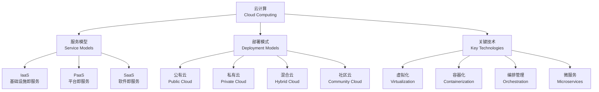
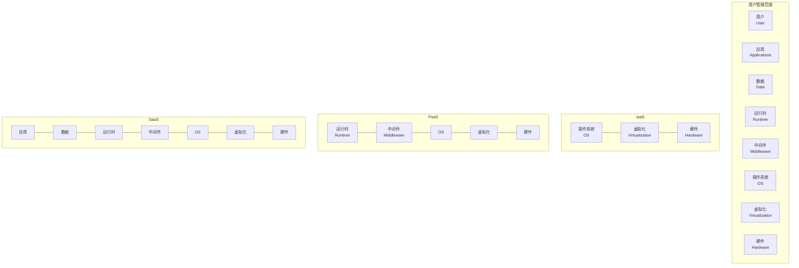
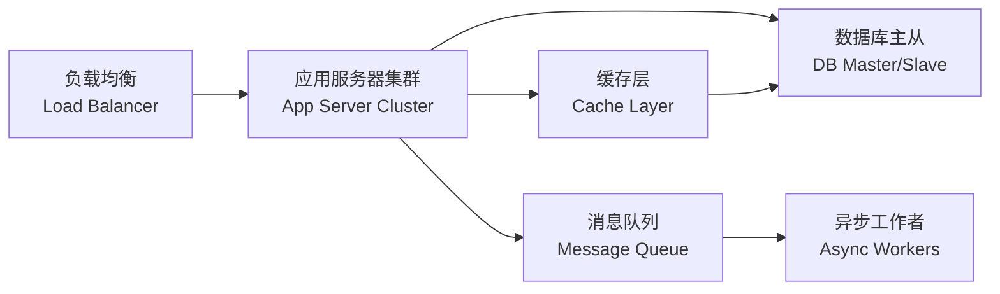

---
aliases:
  - Cloud Computing
  - 云计算
tags:
  - cloud-computing
  - distributed-systems
  - virtualization
  - computer-science
---

# 云计算 (Cloud Computing)

## 一、概述 (Overview)

云计算（Cloud Computing）是一种基于互联网（Internet）的计算范式。
通过网络按需（On-demand）提供可配置的计算资源池——
包括网络（Network）、服务器（Server）、存储（Storage）、
应用（Application）和服务（Service）。

其核心定义由美国国家标准与技术研究院
（NIST, National Institute of Standards and Technology）
在 SP 800-145 中给出。

包含五大基本特征：按需自助服务（On-demand Self-service）、
广泛网络接入（Broad Network Access）、
资源池化（Resource Pooling）、
快速弹性（Rapid Elasticity）和可计量服务（Measured Service）。

云计算从根本上改变了企业 IT 基础设施的采购、部署和管理方式，
已成为数字经济的关键支撑技术。

---

## 二、服务模型 (Service Models)

云计算按服务层次分为三种模型。
用户与云服务提供商（Cloud Service Provider）之间的责任边界因模型而异：

| 模型 | 全称 | 用户管理范畴 | 提供商管理范畴 |
|------|------|-------------|---------------|
| IaaS | Infrastructure as a Service | 应用、数据、OS、运行时 | 虚拟化层、硬件、网络、存储 |
| PaaS | Platform as a Service | 应用、数据 | 运行时环境、中间件、OS、硬件 |
| SaaS | Software as a Service | 应用配置与用户数据 | 全部底层基础设施 |

---

## 三、部署模式 (Deployment Models)

四种部署模式在不同场景下有各自的适用性和权衡。

| 模式 | 说明 | 适用场景 |
|------|------|----------|
| 公有云（Public Cloud） | 第三方提供商通过互联网向公众提供服务 | 初创公司、弹性工作负载、测试环境 |
| 私有云（Private Cloud） | 为单一组织或企业专有部署 | 金融、医疗、政府等合规要求严格的行业 |
| 混合云（Hybrid Cloud） | 公有云与私有云协同工作，数据和应用可在两者间迁移 | 爆发性负载、灾备恢复、数据主权合规 |
| 社区云（Community Cloud） | 多个具有共同关切的组织共享云基础设施 | 联合科研项目、行业联盟、政府间合作 |

---

## 四、虚拟化技术 (Virtualization)

虚拟化（Virtualization）是云计算的核心使能技术。
通过抽象层将物理资源划分为多个虚拟资源。

### 4.1 虚拟化类型 (Types of Virtualization)

- **服务器虚拟化（Server Virtualization）** — 在一台物理服务器上运行多个虚拟机（VM, Virtual Machine）
- **存储虚拟化（Storage Virtualization）** — 将多个物理存储设备抽象为统一存储池
- **网络虚拟化（Network Virtualization）** — 在物理网络之上创建虚拟网络，如 VLAN、VXLAN
- **桌面虚拟化（Desktop Virtualization）** — 通过 VDI（Virtual Desktop Infrastructure）集中管理桌面环境

### 4.2 Hypervisor 分类

Hypervisor（虚拟机监视器）是虚拟化的核心组件，负责在物理硬件和虚拟机之间提供抽象层。

| 类型 | 代表产品 | 架构特点 |
|------|----------|----------|
| Type 1（裸机型, Bare-metal） | VMware ESXi, Microsoft Hyper-V, KVM | 直接运行于物理硬件之上，性能损失最小 |
| Type 2（宿主型, Hosted） | VirtualBox, VMware Workstation | 运行于宿主操作系统之上，适合开发和测试 |

### 4.3 容器化 (Containerization)

容器（Container）相比于虚拟机更为轻量，共享宿主操作系统内核，启动时间可达毫秒级。
Docker 是最流行的容器引擎。Kubernetes（K8s）是容器编排（Container Orchestration）的事实标准。

---

## 五、云架构设计 (Cloud Architecture)

### 核心组件 (Core Components)

### 设计原则 (Design Principles)

- **无状态设计（Stateless Design）** — 应用服务器不保存会话状态，状态存储在共享缓存或数据库中

- **最终一致性（Eventual Consistency）** — 在分布式系统中放松强一致性约束以换取可用性和分区容忍性，遵循 CAP 定理（CAP Theorem）

- **熔断机制（Circuit Breaker）** — 当下游服务故障时快速失败（Fail Fast），防止级联故障（Cascading Failure）

- **自动扩缩容（Auto Scaling）** — 根据实时负载指标自动增加或减少计算资源

- **不可变基础设施（Immutable Infrastructure）** — 服务器部署后不做修改，更新时直接替换为新镜像

---

## 六、主流云平台 (Major Cloud Platforms)

| 平台 | 核心优势 | 主要计算服务 | 主要存储服务 |
|------|----------|-------------|-------------|
| AWS（Amazon Web Services） | 最成熟、服务种类最多 | EC2, Lambda, ECS | S3, EBS, RDS |
| Microsoft Azure | 企业集成、混合云方案 | VM, Azure Functions, AKS | Blob Storage, SQL Database |
| Google Cloud Platform (GCP) | 数据分析、AI/ML 能力 | Compute Engine, Cloud Functions, GKE | Cloud Storage, BigQuery |
| 阿里云 (Alibaba Cloud) | 中国市场份额第一 | ECS, Function Compute, ACK | OSS, Table Store, MaxCompute |

---

## 七、挑战与趋势 (Challenges and Trends)

### 挑战 (Challenges)

- **安全与合规（Security and Compliance）** — 数据加密、访问控制、合规审计（如 GDPR、等保 2.0）

- **供应商锁定（Vendor Lock-in）** — 使用特定云平台专有服务导致迁移成本极高

- **延迟敏感应用（Latency-sensitive Applications）** — 云数据中心距离远无法满足毫秒级延迟要求

- **成本管理（Cost Management）** — 资源滥用和闲置导致云支出失控，需实施 FinOps（云财务管理）实践

### 趋势 (Trends)

- **边缘计算（Edge Computing）** — 将计算和数据存储靠近数据源，解决延迟和带宽问题

- **Serverless 架构（Serverless Architecture）** — 开发者只需编写函数代码，无需管理服务器，按实际执行次数计费

- **云原生（Cloud Native）** — 以容器、服务网格（Service Mesh）、微服务（Microservices）、声明式 API 为特征的应用架构模式

- **多云战略（Multi-cloud Strategy）** — 同时使用多个云提供商，避免单点依赖并优化成本

- **AI 驱动云运维（AIOps）** — 利用人工智能自动化运维决策，提升系统可靠性

---

## 相关条目 (Related Notes)

- [[DistributedSystems]] — 分布式系统基础理论

- [[Virtualization]] — 虚拟化技术详解

- [[Containerization]] — 容器化与 Docker

- [[Kubernetes]] — 容器编排平台

- [[EdgeComputing]] — 边缘计算

- [[ServerlessComputing]] — 无服务器计算

- [[CloudSecurity]] — 云安全
