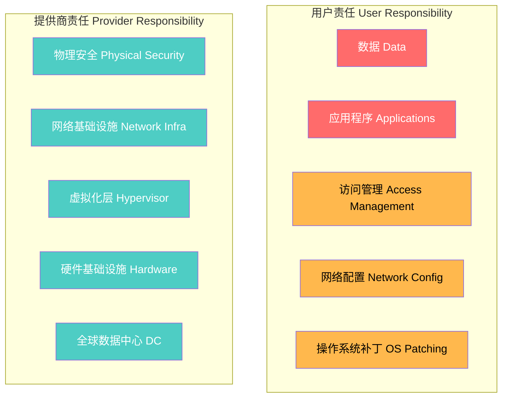
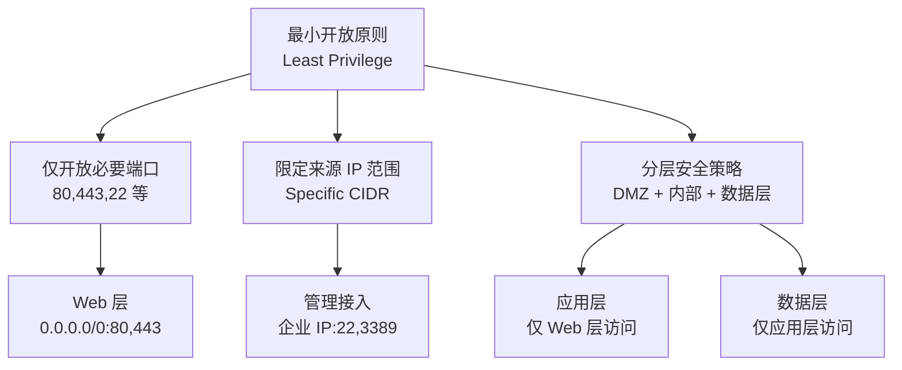
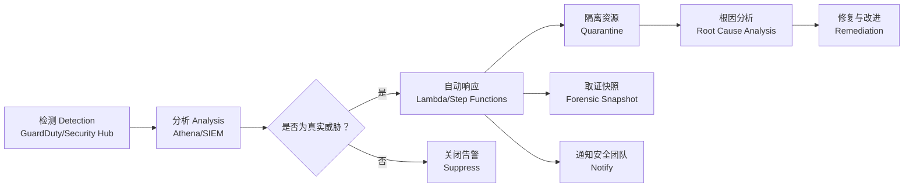

# 云安全 Cloud Security

## 共享责任模型

云安全遵循共享责任模型（Shared Responsibility Model），云提供商和用户各自承担不同层面的安全责任。



### 不同服务模型的责任边界

| 安全领域 | 本地部署 | IaaS | PaaS | SaaS |
|---------|---------|------|------|------|
| 数据安全 | 用户 | 用户 | 用户 | 用户 |
| 应用安全 | 用户 | 用户 | 用户 | 提供商 |
| 平台安全 | 用户 | 用户 | 提供商 | 提供商 |
| 操作系统 | 用户 | 用户 | 提供商 | 提供商 |
| 虚拟化 | 用户 | 提供商 | 提供商 | 提供商 |
| 物理安全 | 用户 | 提供商 | 提供商 | 提供商 |
| 网络安全 | 用户 | 用户 | 提供商 | 提供商 |

## 身份与访问管理 IAM

### 核心概念

| 概念 | 英文 | 说明 |
|------|------|------|
| 主体 | Principal | 发起请求的实体（用户、角色、服务） |
| 身份 | Identity | 主体的标识（IAM User, Role, Group） |
| 策略 | Policy | 定义权限的文档（JSON 格式） |
| 资源 | Resource | 被访问的云服务对象 |
| 凭证 | Credential | 身份验证凭据（密码、密钥、证书） |

### 最小权限原则

最小权限原则（Principle of Least Privilege）的核心思想是为每个实体授予完成其任务所需的最少权限。

#### 权限策略示例

```
{
  "Effect": "Allow",
  "Action": ["s3:GetObject", "s3:ListBucket"],
  "Resource": ["arn:aws:s3:::my-bucket", "arn:aws:s3:::my-bucket/*"]
}
```

### 多因素认证 MFA

MFA 通过结合密码（知识因素）和一次性验证码（拥有因素）或生物特征（固有因素）提供额外的安全保障。

$$ \text{Authentication} = \text{Something You Know} + \text{Something You Have} / \text{Something You Are} $$

### 联合身份 Federation

通过 SAML 2.0、OpenID Connect (OIDC) 或 AWS IAM Identity Center 将企业身份系统与云 IAM 集成，实现单点登录（SSO）。用户使用企业目录（如 Active Directory）凭证登录云平台。

## 数据保护

### 静态数据加密 Encryption at Rest

| 加密层级 | 说明 | AWS 实现 | Azure 实现 | GCP 实现 |
|---------|------|---------|-----------|---------|
| 存储层加密 | 写入存储时自动加密 | S3 SSE-S3/SSE-KMS | Azure Storage Encryption | Cloud Storage Encryption |
| 数据库加密 | 表空间/列级加密 | RDS TDE, DynamoDB | TDE, Always Encrypted | CMEK, CSEK |
| 文件级加密 | 单个文件加密 | EBS Encryption | Disk Encryption | Persistent Disk Encryption |
| 应用层加密 | 代码中显式加密 | AWS Encryption SDK | Azure Key Vault | Cloud KMS |

### 传输中数据加密 Encryption in Transit

所有数据传输应使用 TLS 1.2+ 协议加密。HTTPS、TLS VPN、mTLS（双向 TLS）是常见实现方式。

### 密钥管理

密钥管理服务（KMS, Key Management Service）集中管理加密密钥：

| 功能 | 说明 |
|------|------|
| 密钥生命周期管理 | 创建、轮换、禁用、删除 |
| 硬件安全模块 HSM | FIPS 140-2 Level 3 认证硬件保护 |
| 自动密钥轮换 | 定期自动更新密钥 |
| 访问审计 | 记录每次密钥使用 |

$$ \text{Data Key} = \text{KMS Decrypt}(\text{Encrypted Data Key}, \text{CMK}) $$

## 网络安全

### 虚拟私有云 VPC

VPC 在云中创建逻辑隔离的网络环境：

- **子网 (Subnet)**：划分公网和私网区域
- **路由表 (Route Table)**：控制子网间流量
- **安全组 (Security Group)**：实例级状态化防火墙
- **网络 ACL (NACL)**：子网级无状态防火墙
- **互联网网关 (IGW)**：公网访问入口
- **NAT 网关**：私网资源出站访问

### 安全组设计原则



### Web 应用防护

- **WAF (Web Application Firewall)**：SQL 注入、XSS、CSRF 等常见 Web 攻击防护
- **DDoS 防护**：AWS Shield、Azure DDoS Protection、GCP Cloud Armor
- **API 网关安全**：速率限制、认证授权、请求验证

## 合规性与审计

### 主流合规标准

| 标准 | 全称 | 适用范围 |
|------|------|---------|
| SOC 2 | Service Organization Control 2 | 云服务提供商 |
| ISO 27001 | 信息安全管理体系 | 各类组织 |
| PCI DSS | 支付卡行业数据安全标准 | 处理信用卡数据的组织 |
| HIPAA | 健康保险可移植性和责任法案 | 医疗行业 |
| GDPR | 通用数据保护条例 | 处理欧盟公民数据的组织 |
| 等保 2.0 | 网络安全等级保护 | 中国境内信息系统 |

### 云审计

云审计（Cloud Audit）通过记录和分析 API 调用活动实现安全监控：

| 功能 | AWS CloudTrail | Azure Monitor | GCP Cloud Audit Logs |
|------|---------------|--------------|-------------------|
| 管理事件 | 默认启用 | 默认启用 | 默认启用 |
| 数据事件 | 需配置 | 需配置 | 需配置 |
| 日志保留 | 默认 90 天 | 可配置 | 可配置 |
| 告警集成 | CloudWatch | Azure Alerts | Cloud Monitoring |

## 威胁检测与响应

### 威胁检测服务

- **Amazon GuardDuty**：基于机器学习的威胁检测，分析 DNS、VPC Flow Logs、CloudTrail
- **Azure Security Center / Defender for Cloud**：统一安全管理和高级威胁防护
- **GCP Security Command Center**：安全态势管理和漏洞发现

### 安全事件响应流程



### SOAR 安全编排

SOAR（Security Orchestration, Automation and Response）平台通过自动化剧本（Playbook）加速安全事件响应，减少人工处理时间。

## 安全最佳实践

### 架构层面

- 纵深防御 (Defense in Depth)：多层安全控制
- 零信任架构 (Zero Trust)：不信任任何网络，始终验证
- 基础设施即代码 (IaC)：将安全策略作为代码管理

### 运维层面

- 持续监控与告警：设置安全告警阈值
- 定期安全评估：渗透测试、漏洞扫描
- 补丁管理：自动更新操作系统和中间件
- 配置审计：使用 AWS Config、Azure Policy 确保合规

### 开发层面

- 安全开发生命周期 (SDL)：安全要求融入开发流程
- 代码安全扫描：SAST（静态分析）、DAST（动态分析）
- 依赖管理：漏洞库扫描第三方依赖
- Secrets 管理：使用 Secrets Manager 避免硬编码凭证

## 相关条目

- [[CloudComputing]]
- [[CloudArchitecture]]
- [[CloudServices]]
- [[IdentityManagement]]
- [[Encryption]]
